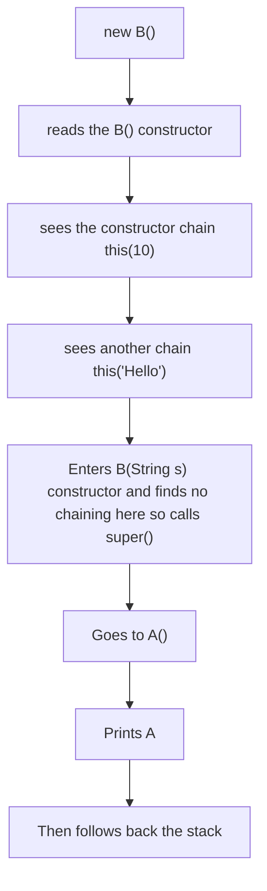

## Why constructor chaining exist

```java
class Employee {

    int id;
    String name;

    Employee() {
        id = 0;
        name = "Unknown";
    }

    Employee(int id) {
        this.id = id;
        name = "Unknown";
    }

    Employee(int id, String name) {
        this.id = id;
        this.name = name;
    }
}
```

- Here the name "Unknown" is repeated, so maintaining this would become hell
- To solve this constructor chaining was introduced

---

## First rule

- A Constructor of the same class can call another constructor using `this(...)` 

Example:
```java
class A {

    A() {
        System.out.print("A ");
    }
}

class B extends A {

    B() {
        this(10);
        System.out.print("B ");
    }

    B(int x) {
        this("Hello");
        System.out.print("X ");
    }

    B(String s) {
        System.out.print("S ");
    }
}

new B();
```

In the above case we have both inheritance and constructor chaninng

JVM follows the following model:



- OUTPUT: A S X B
- Rule of JVM:
```markdown
1. Follow all this() calls down

2. Find constructor that has no this()

3. Compiler inserts super()

4. Execute parent constructors

5. Return upward executing remaining code
```
---
> [!warning] Extremely Important Interview Rule
> When you see:
> `Class Child extends Parent`
> This is how the code is executed:
> ```mermaid
> graph TD
> A["Memory Allocation"] --> B["Default Values"] --> C["Parent Field Initializers"] --> D["Parent Constructor"] --> E["Child Field Initializers"] --> F["Child Constructor"]
> ```

