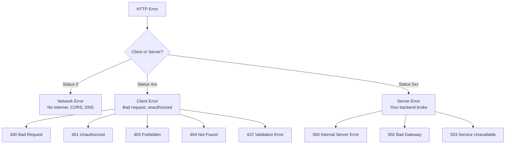

---
tags:
  - angular
  - frontend
  - http
  - api-calls
  - observables
  - interceptors
  - spring-boot-parallel
created: 2026-05-08
status: in-progress
related:
  - "[[Angular Fundamentals]]"
  - "[[Services and Dependency Injection]]"
  - "[[RxJS and Reactive Programming]]"
  - "[[Angular Testing]]"
  - "[[TypeScript Fundamentals]]"
---

# Angular HTTP Client

> *"Every frontend eventually needs to talk to a backend. HttpClient is Angular's way of doing it — and it's built on the Observables you already know."*

Coming from Spring Boot, you've used `RestTemplate` and `WebClient` to call APIs. Angular's `HttpClient` is the equivalent — but instead of returning `ResponseEntity<T>` or `Mono<T>`, it returns `Observable<T>`. If you've read [[RxJS and Reactive Programming]], this will feel natural.

This note picks up where [[Services and Dependency Injection]] left off — your services are ready, now let's wire them to real APIs.

---

## Navigation

| Phase | Topic | Spring Parallel |
|-------|-------|-----------------|
| [[#Phase 1 — Setting Up HttpClient]] | Import and inject HttpClient | Adding `spring-boot-starter-web` |
| [[#Phase 2 — Making HTTP Requests]] | GET, POST, PUT, PATCH, DELETE | `RestTemplate` / `WebClient` methods |
| [[#Phase 3 — Observables and HTTP]] | Why Observables, RxJS operators | `Mono<T>` / `Flux<T>` in WebFlux |
| [[#Phase 4 — Interceptors]] | Request/response middleware | `HandlerInterceptor` / `OncePerRequestFilter` |
| [[#Phase 5 — Error Handling]] | Catching and managing HTTP errors | `@ExceptionHandler` / `@ControllerAdvice` |
| [[#Phase 6 — Request Response Transformation]] | Data mapping and serialization | Jackson `ObjectMapper` |
| [[#Phase 7 — Typed Responses]] | Type-safe API calls | Generics in Java |
| [[#Phase 8 — Caching Strategies]] | In-memory and HTTP caching | Spring Cache / `@Cacheable` |
| [[#Phase 9 — Testing HTTP Calls]] | Mock API calls in tests | `MockMvc` / `WebTestClient` |
| [[#Phase 10 — Real-World Patterns]] | Production-ready API layers | Service layer patterns |
| [[#Phase 11 — Common Mistakes]] | Pitfalls to avoid | — |
| [[#Phase 12 — Interview Questions]] | Prep for frontend interviews | — |
| [[#Phase 13 — Practice Exercises]] | Hands-on challenges | — |

---

## Phase 1 — Setting Up HttpClient

> [!info] Spring Parallel
> In Spring Boot, adding `spring-boot-starter-web` gives you `RestTemplate`. Adding `spring-boot-starter-webflux` gives you `WebClient`. In Angular, importing `HttpClientModule` (or using `provideHttpClient()`) gives you `HttpClient`.

### 1.1 — The Module-Based Approach (Angular < 17)

In module-based Angular apps, you import `HttpClientModule` in your root module:

```typescript
// app.module.ts
import { NgModule } from '@angular/core';
import { BrowserModule } from '@angular/platform-browser';
import { HttpClientModule } from '@angular/common/http';
import { AppComponent } from './app.component';

@NgModule({
  declarations: [AppComponent],
  imports: [
    BrowserModule,
    HttpClientModule  // ← Enables HttpClient across the entire app
  ],
  bootstrap: [AppComponent]
})
export class AppModule {}
```

> [!warning] Import Once, Use Everywhere
> `HttpClientModule` should only be imported in `AppModule` (the root module). Importing it in lazy-loaded feature modules creates a **new instance** of HttpClient services and can break interceptors. This is similar to how you'd define a `RestTemplate` `@Bean` once in a `@Configuration` class, not in every service.

### 1.2 — The Standalone Approach (Angular 17+)

Angular 17+ encourages standalone components. Instead of `HttpClientModule`, you use `provideHttpClient()` in your app config:

```typescript
// app.config.ts
import { ApplicationConfig } from '@angular/core';
import { provideRouter } from '@angular/router';
import { provideHttpClient, withInterceptors } from '@angular/common/http';
import { routes } from './app.routes';
import { authInterceptor } from './interceptors/auth.interceptor';

export const appConfig: ApplicationConfig = {
  providers: [
    provideRouter(routes),
    provideHttpClient(
      withInterceptors([authInterceptor])  // ← Functional interceptors
    )
  ]
};
```

```typescript
// main.ts
import { bootstrapApplication } from '@angular/platform-browser';
import { AppComponent } from './app.component';
import { appConfig } from './app.config';

bootstrapApplication(AppComponent, appConfig);
```

> [!tip] Which Approach to Use?
> If you're starting a **new** Angular 17+ project, use `provideHttpClient()`. It's the future direction. If you're working on an existing project with `NgModule`, use `HttpClientModule`. Both work the same under the hood.

### 1.3 — Injecting HttpClient into Services

Just like you'd inject `RestTemplate` into a Spring `@Service`, you inject `HttpClient` into an Angular service:

```typescript
// shipment.service.ts
import { Injectable } from '@angular/core';
import { HttpClient } from '@angular/common/http';
import { Observable } from 'rxjs';
import { Shipment } from '../models/shipment.model';

@Injectable({ providedIn: 'root' })
export class ShipmentService {
  private apiUrl = '/api/shipments';

  // Constructor injection — exactly like Spring's @Autowired
  constructor(private http: HttpClient) {}

  getAll(): Observable<Shipment[]> {
    return this.http.get<Shipment[]>(this.apiUrl);
  }
}
```

**Spring Equivalent:**

```java
@Service
public class ShipmentService {
    private final RestTemplate restTemplate;

    // Constructor injection — same pattern
    public ShipmentService(RestTemplate restTemplate) {
        this.restTemplate = restTemplate;
    }

    public List<Shipment> getAll() {
        return restTemplate.exchange("/api/shipments", HttpMethod.GET,
            null, new ParameterizedTypeReference<List<Shipment>>() {})
            .getBody();
    }
}
```

---

## Phase 2 — Making HTTP Requests

> [!quote] "In Spring, you call `.exchange()` or `.retrieve()`. In Angular, you call `.get()`, `.post()`, etc. Same verbs, same REST semantics."

### 2.1 — GET Requests

#### Typed GET (Recommended)

```typescript
// The generic type tells Angular what shape the response body has
getShipment(id: number): Observable<Shipment> {
  return this.http.get<Shipment>(`${this.apiUrl}/${id}`);
}

// Array response
getAllShipments(): Observable<Shipment[]> {
  return this.http.get<Shipment[]>(this.apiUrl);
}
```

#### GET with Query Parameters

```typescript
searchShipments(status: string, page: number): Observable<Shipment[]> {
  const params = new HttpParams()
    .set('status', status)
    .set('page', page.toString());

  return this.http.get<Shipment[]>(this.apiUrl, { params });
  // Produces: GET /api/shipments?status=IN_TRANSIT&page=1
}
```

#### GET with Custom Headers

```typescript
getWithHeaders(): Observable<Shipment[]> {
  const headers = new HttpHeaders()
    .set('X-Tenant-Id', 'warehouse-01')
    .set('Accept-Language', 'en-US');

  return this.http.get<Shipment[]>(this.apiUrl, { headers });
}
```

### 2.2 — POST Requests

```typescript
createShipment(shipment: CreateShipmentRequest): Observable<Shipment> {
  return this.http.post<Shipment>(this.apiUrl, shipment);
  // Angular automatically serializes the object to JSON
  // Sets Content-Type: application/json by default
}
```

**Spring Equivalent:**

```java
// Spring WebClient equivalent
public Mono<Shipment> createShipment(CreateShipmentRequest request) {
    return webClient.post()
        .uri("/api/shipments")
        .bodyValue(request)  // Jackson serializes to JSON
        .retrieve()
        .bodyToMono(Shipment.class);
}
```

### 2.3 — PUT and PATCH

```typescript
// Full update — replaces the entire resource
updateShipment(id: number, shipment: Shipment): Observable<Shipment> {
  return this.http.put<Shipment>(`${this.apiUrl}/${id}`, shipment);
}

// Partial update — updates only specified fields
patchShipmentStatus(id: number, status: string): Observable<Shipment> {
  return this.http.patch<Shipment>(`${this.apiUrl}/${id}`, { status });
}
```

### 2.4 — DELETE

```typescript
deleteShipment(id: number): Observable<void> {
  return this.http.delete<void>(`${this.apiUrl}/${id}`);
}
```

### 2.5 — Observing the Full Response

By default, HttpClient returns only the **response body**. Sometimes you need headers, status codes, or the full response:

```typescript
createShipmentFull(shipment: CreateShipmentRequest): Observable<HttpResponse<Shipment>> {
  return this.http.post<Shipment>(this.apiUrl, shipment, {
    observe: 'response'  // ← Returns full HttpResponse, not just body
  });
}

// Usage
this.shipmentService.createShipmentFull(newShipment).subscribe(response => {
  console.log('Status:', response.status);         // 201
  console.log('Location:', response.headers.get('Location'));  // /api/shipments/42
  console.log('Body:', response.body);              // Shipment object
});
```

### 2.6 — Comparison Table: Angular HttpClient vs Spring

| Feature | Angular `HttpClient` | Spring `RestTemplate` | Spring `WebClient` |
|---------|---------------------|-----------------------|---------------------|
| **Returns** | `Observable<T>` | `ResponseEntity<T>` | `Mono<T>` / `Flux<T>` |
| **Async?** | Yes (Observable) | No (blocking) | Yes (reactive) |
| **Auto JSON** | Yes (built-in) | Yes (Jackson) | Yes (Jackson) |
| **Interceptors** | Yes (HttpInterceptor) | Yes (ClientHttpRequestInterceptor) | Yes (ExchangeFilterFunction) |
| **Type Safety** | Compile-time only | Runtime + compile-time | Runtime + compile-time |
| **Error Handling** | `catchError` operator | try/catch or `ResponseErrorHandler` | `onErrorResume` / `onErrorMap` |
| **Cancellation** | `unsubscribe()` | Not built-in | `cancel()` on Disposable |
| **Testing** | `HttpTestingController` | `MockRestServiceServer` | `MockWebServer` |

---

## Phase 3 — Observables and HTTP

> [!info] Prerequisite
> If Observables are new to you, read [[RxJS and Reactive Programming]] first. This section assumes you understand the basics.

### 3.1 — Why Observables, Not Promises?

JavaScript has `Promise<T>` for async operations. Why does Angular use `Observable<T>` instead?

| Feature | `Promise<T>` | `Observable<T>` |
|---------|-------------|-----------------|
| **Values** | Resolves to ONE value | Can emit MULTIPLE values |
| **Eager/Lazy** | **Eager** — starts immediately when created | **Lazy** — nothing happens until `subscribe()` |
| **Cancellable** | No (once started, can't cancel) | Yes — `unsubscribe()` cancels |
| **Operators** | `.then()`, `.catch()` only | 100+ RxJS operators (map, filter, retry, etc.) |
| **Retry** | Manual | Built-in `retry(3)` operator |
| **Composability** | Limited (`.then` chains) | Rich (merge, combine, switch, race) |

> [!tip] Spring Parallel
> This is exactly why Spring introduced `WebClient` (reactive) to replace `RestTemplate` (blocking). `Mono<T>` gives you cancellation, retry, timeout, and composition — just like `Observable<T>`.

### 3.2 — Cold Observables in HTTP

HttpClient creates **cold** Observables. Nothing happens until you subscribe:

```typescript
// This line does NOT make an HTTP request
const shipments$ = this.http.get<Shipment[]>('/api/shipments');

// The request fires only when you subscribe
shipments$.subscribe(data => console.log(data));
```

> [!warning] Multiple Subscriptions = Multiple Requests
> Each `subscribe()` call creates a **new** HTTP request:
> ```typescript
> const shipments$ = this.http.get<Shipment[]>('/api/shipments');
> shipments$.subscribe();  // Request 1
> shipments$.subscribe();  // Request 2 (another network call!)
> ```
> This is a common bug. Use `shareReplay(1)` to share a single result — see [[#Phase 8 — Caching Strategies]].

### 3.3 — Subscribing and Unsubscribing

```typescript
// Basic subscribe
this.shipmentService.getAll().subscribe({
  next: (shipments) => this.shipments = shipments,
  error: (err) => console.error('Failed:', err),
  complete: () => console.log('Request completed')
});
```

> [!warning] Memory Leaks — Always Unsubscribe
> HttpClient Observables complete automatically after the response (unlike WebSocket streams), so they're generally safe. But if the component is destroyed *before* the response arrives, you get a memory leak. Always unsubscribe:

```typescript
export class ShipmentListComponent implements OnInit, OnDestroy {
  private destroy$ = new Subject<void>();

  ngOnInit(): void {
    this.shipmentService.getAll()
      .pipe(takeUntil(this.destroy$))  // ← Auto-unsubscribe on destroy
      .subscribe(data => this.shipments = data);
  }

  ngOnDestroy(): void {
    this.destroy$.next();
    this.destroy$.complete();
  }
}
```

### 3.4 — The Async Pipe (Preferred Approach)

The `async` pipe subscribes in the template and **automatically unsubscribes** when the component is destroyed:

```typescript
@Component({
  selector: 'app-shipment-list',
  template: `
    <div *ngIf="shipments$ | async as shipments; else loading">
      <div *ngFor="let s of shipments">
        {{ s.trackingNumber }} — {{ s.status }}
      </div>
    </div>
    <ng-template #loading>Loading shipments...</ng-template>
  `
})
export class ShipmentListComponent {
  shipments$ = this.shipmentService.getAll();

  constructor(private shipmentService: ShipmentService) {}
  // No subscribe()! No unsubscribe()! The async pipe handles both.
}
```

> [!tip] Best Practice
> **Prefer the `async` pipe** over manual `subscribe()` whenever possible. It eliminates memory leak bugs and is the idiomatic Angular pattern.

### 3.5 — Key RxJS Operators for HTTP

```typescript
import { map, catchError, retry, switchMap, debounceTime, distinctUntilChanged } from 'rxjs/operators';
import { of, throwError } from 'rxjs';
```

#### `map` — Transform Response Data

```typescript
getShipmentNames(): Observable<string[]> {
  return this.http.get<Shipment[]>(this.apiUrl).pipe(
    map(shipments => shipments.map(s => s.trackingNumber))
  );
}
```

#### `catchError` — Handle Errors

```typescript
getAll(): Observable<Shipment[]> {
  return this.http.get<Shipment[]>(this.apiUrl).pipe(
    catchError(error => {
      console.error('API error:', error);
      return of([]);  // Return empty array as fallback
    })
  );
}
```

#### `retry` — Automatic Retry

```typescript
getAll(): Observable<Shipment[]> {
  return this.http.get<Shipment[]>(this.apiUrl).pipe(
    retry(3),  // Retry up to 3 times on failure
    catchError(error => {
      this.notificationService.show('Failed after 3 retries');
      return of([]);
    })
  );
}
```

#### `switchMap` — Chain Dependent Requests

```typescript
// Get a shipment, then fetch its carrier details
getShipmentWithCarrier(id: number): Observable<ShipmentWithCarrier> {
  return this.http.get<Shipment>(`/api/shipments/${id}`).pipe(
    switchMap(shipment =>
      this.http.get<Carrier>(`/api/carriers/${shipment.carrierId}`).pipe(
        map(carrier => ({ ...shipment, carrier }))
      )
    )
  );
}
```

#### `debounceTime` + `distinctUntilChanged` — Search-as-you-type

```typescript
// In the component
searchControl = new FormControl('');

ngOnInit(): void {
  this.results$ = this.searchControl.valueChanges.pipe(
    debounceTime(300),             // Wait 300ms after user stops typing
    distinctUntilChanged(),         // Only if value actually changed
    switchMap(term =>               // Cancel previous request, start new one
      this.shipmentService.search(term)
    )
  );
}
```

> [!example] Real-World Pattern: Search Box
> This is the typeahead/autocomplete pattern. `debounceTime` prevents flooding your API, `distinctUntilChanged` avoids duplicate requests, and `switchMap` cancels stale in-flight requests. In Spring, you'd handle this server-side with rate limiting. In Angular, you handle it client-side with RxJS.

---

## Phase 4 — Interceptors

> [!quote] "Interceptors in Angular are like servlet filters in Java — they sit between the client and the server, intercepting every request and response."

### 4.1 — What Are Interceptors?

Interceptors are middleware that can inspect and transform HTTP requests before they leave the app and responses before they reach your code.

```
Your Service Code
       │
       ▼
  ┌─────────────────┐
  │  Interceptor 1   │  ← Auth Token (like OncePerRequestFilter)
  │  (add JWT token) │
  └────────┬────────┘
           ▼
  ┌─────────────────┐
  │  Interceptor 2   │  ← Logging (like HandlerInterceptor)
  │  (log request)   │
  └────────┬────────┘
           ▼
  ┌─────────────────┐
  │  Interceptor 3   │  ← Error Handling (like @ControllerAdvice)
  │  (handle errors) │
  └────────┬────────┘
           ▼
     HTTP Request → Server
           │
           ▼
     HTTP Response ← Server
           │
           ▼
  (flows back through interceptors 3 → 2 → 1)
           │
           ▼
   Your Service Code
```

> [!tip] Spring Parallel
> | Angular | Spring Boot |
> |---------|-------------|
> | `HttpInterceptor` | `HandlerInterceptor` / `OncePerRequestFilter` |
> | `HttpRequest` | `HttpServletRequest` |
> | `HttpHandler.handle()` | `FilterChain.doFilter()` |
> | Interceptor ordering in providers array | `@Order` annotation or `FilterRegistrationBean` |

### 4.2 — Class-Based Interceptor (Classic Approach)

#### Auth Token Interceptor

```typescript
// auth.interceptor.ts
import { Injectable } from '@angular/core';
import {
  HttpInterceptor, HttpRequest, HttpHandler, HttpEvent
} from '@angular/common/http';
import { Observable } from 'rxjs';
import { AuthService } from '../services/auth.service';

@Injectable()
export class AuthInterceptor implements HttpInterceptor {

  constructor(private authService: AuthService) {}

  intercept(req: HttpRequest<unknown>, next: HttpHandler): Observable<HttpEvent<unknown>> {
    const token = this.authService.getToken();

    if (token) {
      // Clone the request and add the authorization header
      // Requests are immutable — you MUST clone to modify
      const authReq = req.clone({
        setHeaders: {
          Authorization: `Bearer ${token}`
        }
      });
      return next.handle(authReq);
    }

    return next.handle(req);
  }
}
```

**Register it in the module:**

```typescript
// app.module.ts
import { HTTP_INTERCEPTORS } from '@angular/common/http';

@NgModule({
  providers: [
    {
      provide: HTTP_INTERCEPTORS,
      useClass: AuthInterceptor,
      multi: true  // ← CRITICAL: allows multiple interceptors
    }
  ]
})
export class AppModule {}
```

> [!warning] Don't Forget `multi: true`
> Without `multi: true`, each new interceptor **replaces** the previous one instead of chaining. This is the #1 interceptor bug in Angular.

#### Logging Interceptor

```typescript
@Injectable()
export class LoggingInterceptor implements HttpInterceptor {

  intercept(req: HttpRequest<unknown>, next: HttpHandler): Observable<HttpEvent<unknown>> {
    const started = Date.now();
    console.log(`→ ${req.method} ${req.urlWithParams}`);

    return next.handle(req).pipe(
      tap({
        next: (event) => {
          if (event instanceof HttpResponse) {
            const elapsed = Date.now() - started;
            console.log(`← ${req.method} ${req.urlWithParams} [${event.status}] ${elapsed}ms`);
          }
        },
        error: (error) => {
          const elapsed = Date.now() - started;
          console.error(`✗ ${req.method} ${req.urlWithParams} [${error.status}] ${elapsed}ms`);
        }
      })
    );
  }
}
```

#### Error Handling Interceptor

```typescript
@Injectable()
export class ErrorInterceptor implements HttpInterceptor {

  constructor(
    private notificationService: NotificationService,
    private router: Router,
    private authService: AuthService
  ) {}

  intercept(req: HttpRequest<unknown>, next: HttpHandler): Observable<HttpEvent<unknown>> {
    return next.handle(req).pipe(
      catchError((error: HttpErrorResponse) => {
        switch (error.status) {
          case 401:
            this.authService.logout();
            this.router.navigate(['/login']);
            break;
          case 403:
            this.notificationService.show('Access denied');
            break;
          case 404:
            this.notificationService.show('Resource not found');
            break;
          case 500:
            this.notificationService.show('Server error — please try again');
            break;
          case 0:
            this.notificationService.show('Network error — check your connection');
            break;
        }
        return throwError(() => error);
      })
    );
  }
}
```

#### Loading Spinner Interceptor

```typescript
@Injectable()
export class LoadingInterceptor implements HttpInterceptor {

  private activeRequests = 0;

  constructor(private loadingService: LoadingService) {}

  intercept(req: HttpRequest<unknown>, next: HttpHandler): Observable<HttpEvent<unknown>> {
    if (this.activeRequests === 0) {
      this.loadingService.show();
    }
    this.activeRequests++;

    return next.handle(req).pipe(
      finalize(() => {
        this.activeRequests--;
        if (this.activeRequests === 0) {
          this.loadingService.hide();
        }
      })
    );
  }
}
```

#### Retry Interceptor

```typescript
@Injectable()
export class RetryInterceptor implements HttpInterceptor {

  intercept(req: HttpRequest<unknown>, next: HttpHandler): Observable<HttpEvent<unknown>> {
    // Only retry GET requests (idempotent)
    if (req.method !== 'GET') {
      return next.handle(req);
    }

    return next.handle(req).pipe(
      retry({ count: 2, delay: 1000 })  // Retry twice with 1s delay
    );
  }
}
```

### 4.3 — Interceptor Ordering

Interceptors execute in the **order they are registered**:

```typescript
providers: [
  { provide: HTTP_INTERCEPTORS, useClass: AuthInterceptor, multi: true },     // 1st — adds token
  { provide: HTTP_INTERCEPTORS, useClass: LoggingInterceptor, multi: true },  // 2nd — logs
  { provide: HTTP_INTERCEPTORS, useClass: RetryInterceptor, multi: true },    // 3rd — retries
  { provide: HTTP_INTERCEPTORS, useClass: ErrorInterceptor, multi: true },    // 4th — handles errors
  { provide: HTTP_INTERCEPTORS, useClass: LoadingInterceptor, multi: true },  // 5th — spinner
]
```


### 4.4 — Functional Interceptors (Angular 15+)

Angular 15 introduced **functional interceptors** — simpler, no class boilerplate:

```typescript
// auth.interceptor.ts
import { HttpInterceptorFn } from '@angular/common/http';
import { inject } from '@angular/core';
import { AuthService } from '../services/auth.service';

export const authInterceptor: HttpInterceptorFn = (req, next) => {
  const authService = inject(AuthService);
  const token = authService.getToken();

  if (token) {
    const authReq = req.clone({
      setHeaders: { Authorization: `Bearer ${token}` }
    });
    return next(authReq);
  }

  return next(req);
};
```

**Register with `provideHttpClient()`:**

```typescript
// app.config.ts
import { provideHttpClient, withInterceptors } from '@angular/common/http';

export const appConfig: ApplicationConfig = {
  providers: [
    provideHttpClient(
      withInterceptors([
        authInterceptor,
        loggingInterceptor,
        errorInterceptor
      ])
    )
  ]
};
```

> [!tip] Functional vs Class Interceptors
> | | Class-Based | Functional (Angular 15+) |
> |---|---|---|
> | **Syntax** | `implements HttpInterceptor` | Arrow function |
> | **DI** | Constructor injection | `inject()` function |
> | **Registration** | `HTTP_INTERCEPTORS` multi-provider | `withInterceptors([...])` |
> | **Boilerplate** | More (class, decorator, provider) | Less (just a function) |
> | **Recommendation** | Legacy / existing apps | New apps (preferred) |

---

## Phase 5 — Error Handling

> [!quote] "A backend without error handling crashes. A frontend without error handling confuses users."

### 5.1 — HTTP Error Types



### 5.2 — Error Handling in Services

```typescript
@Injectable({ providedIn: 'root' })
export class ShipmentService {
  constructor(
    private http: HttpClient,
    private errorService: ErrorService
  ) {}

  getAll(): Observable<Shipment[]> {
    return this.http.get<Shipment[]>(this.apiUrl).pipe(
      catchError(error => this.errorService.handleError<Shipment[]>(error, []))
    );
  }
}
```

### 5.3 — Error Service Pattern

Create a centralized error service (like Spring's `@ControllerAdvice`):

```typescript
@Injectable({ providedIn: 'root' })
export class ErrorService {

  handleError<T>(error: HttpErrorResponse, fallback: T): Observable<T> {
    let userMessage: string;

    if (error.error instanceof ErrorEvent) {
      // Client-side error (network, CORS, etc.)
      userMessage = 'A network error occurred. Please check your connection.';
    } else {
      // Server-side error
      userMessage = this.getServerErrorMessage(error.status);
    }

    console.error(`[HTTP Error] ${error.status} - ${error.message}`);
    this.notificationService.showError(userMessage);

    return of(fallback);  // Return safe fallback value
  }

  private getServerErrorMessage(status: number): string {
    switch (status) {
      case 400: return 'Invalid request. Please check your input.';
      case 401: return 'Session expired. Please log in again.';
      case 403: return 'You do not have permission for this action.';
      case 404: return 'The requested resource was not found.';
      case 422: return 'Validation failed. Please check your input.';
      case 500: return 'Server error. Our team has been notified.';
      case 503: return 'Service temporarily unavailable. Try again later.';
      default:  return 'An unexpected error occurred.';
    }
  }
}
```

### 5.4 — Retry Strategies

```typescript
import { retry, retryWhen, delay, take, timer } from 'rxjs';

// Simple retry — retry 3 times immediately
this.http.get(url).pipe(
  retry(3)
);

// Retry with delay — retry 3 times, 1 second apart
this.http.get(url).pipe(
  retry({ count: 3, delay: 1000 })
);

// Exponential backoff — 1s, 2s, 4s...
this.http.get(url).pipe(
  retry({
    count: 3,
    delay: (error, retryCount) => timer(Math.pow(2, retryCount - 1) * 1000)
  })
);

// Retry only on specific status codes
this.http.get(url).pipe(
  retry({
    count: 3,
    delay: (error: HttpErrorResponse) => {
      if (error.status === 503 || error.status === 429) {
        return timer(2000);  // Retry after 2s
      }
      return throwError(() => error);  // Don't retry 4xx errors
    }
  })
);
```

> [!example] Spring Equivalent
> This is similar to using Spring Retry's `@Retryable` annotation:
> ```java
> @Retryable(value = ServiceUnavailableException.class,
>            maxAttempts = 3,
>            backoff = @Backoff(delay = 1000, multiplier = 2))
> public List<Shipment> getShipments() { ... }
> ```

---

## Phase 6 — Request Response Transformation

### 6.1 — Transforming Response Data

```typescript
// API returns snake_case, but TypeScript uses camelCase
interface ApiShipmentResponse {
  tracking_number: string;
  created_at: string;
  carrier_name: string;
}

interface Shipment {
  trackingNumber: string;
  createdAt: Date;
  carrierName: string;
}

getAll(): Observable<Shipment[]> {
  return this.http.get<ApiShipmentResponse[]>(this.apiUrl).pipe(
    map(responses => responses.map(r => this.mapToShipment(r)))
  );
}

private mapToShipment(response: ApiShipmentResponse): Shipment {
  return {
    trackingNumber: response.tracking_number,
    createdAt: new Date(response.created_at),
    carrierName: response.carrier_name
  };
}
```

> [!tip] Spring Parallel
> In Spring, Jackson handles JSON ↔ Java mapping with `@JsonProperty`. In Angular, there's no automatic mapper — you do it manually with `map()` or use a library like `class-transformer`.

### 6.2 — Date Handling

```typescript
// Dates come as ISO strings from the API
// Parse them into JavaScript Date objects
private parseDate(dateStr: string): Date {
  return new Date(dateStr);
}

// For display, use Angular's DatePipe in the template
// {{ shipment.createdAt | date:'medium' }}  → Jun 15, 2025, 9:30:00 AM
```

### 6.3 — snake_case to camelCase Utility

```typescript
function toCamelCase(obj: Record<string, unknown>): Record<string, unknown> {
  const result: Record<string, unknown> = {};
  for (const key of Object.keys(obj)) {
    const camelKey = key.replace(/_([a-z])/g, (_, letter) => letter.toUpperCase());
    result[camelKey] = obj[key];
  }
  return result;
}
```

---

## Phase 7 — Typed Responses

### 7.1 — Interface-Based Typing

```typescript
// models/shipment.model.ts
export interface Shipment {
  id: number;
  trackingNumber: string;
  status: ShipmentStatus;
  origin: Address;
  destination: Address;
  weight: number;
  createdAt: string;
}

export type ShipmentStatus = 'PENDING' | 'IN_TRANSIT' | 'DELIVERED' | 'CANCELLED';

export interface Address {
  street: string;
  city: string;
  state: string;
  zipCode: string;
  country: string;
}
```

### 7.2 — Generics for Type Safety

```typescript
// Generic API response wrapper
export interface ApiResponse<T> {
  data: T;
  message: string;
  timestamp: string;
}

export interface PaginatedResponse<T> {
  content: T[];
  totalElements: number;
  totalPages: number;
  page: number;
  size: number;
}

// Usage in service
getShipments(page: number, size: number): Observable<PaginatedResponse<Shipment>> {
  const params = new HttpParams()
    .set('page', page.toString())
    .set('size', size.toString());

  return this.http.get<PaginatedResponse<Shipment>>(this.apiUrl, { params });
}
```

> [!warning] TypeScript Types Are Erased at Runtime
> Unlike Java generics (which have some type info via reflection), TypeScript types are **completely erased** at compile time. `this.http.get<Shipment>(url)` does NOT validate the response shape — it just tells the compiler what to expect. If the API returns something different, you won't get a runtime error, just unexpected behavior. For runtime validation, use libraries like `zod` or `io-ts`. See [[TypeScript Fundamentals]] for more on type erasure.

---

## Phase 8 — Caching Strategies

### 8.1 — Simple In-Memory Cache with `shareReplay()`

```typescript
@Injectable({ providedIn: 'root' })
export class CarrierService {
  private carriers$?: Observable<Carrier[]>;

  constructor(private http: HttpClient) {}

  getAll(): Observable<Carrier[]> {
    if (!this.carriers$) {
      this.carriers$ = this.http.get<Carrier[]>('/api/carriers').pipe(
        shareReplay(1)  // Cache the last emission, share among subscribers
      );
    }
    return this.carriers$;
  }

  // Invalidate cache when data changes
  invalidateCache(): void {
    this.carriers$ = undefined;
  }
}
```

> [!tip] How `shareReplay(1)` Works
> Without `shareReplay`, every `subscribe()` triggers a new HTTP request (cold Observable). With `shareReplay(1)`, the first subscriber triggers the request, and subsequent subscribers get the cached result. This is similar to Spring's `@Cacheable` — one call, multiple consumers.

### 8.2 — Cache with Expiration

```typescript
@Injectable({ providedIn: 'root' })
export class CachedDataService {
  private cache = new Map<string, { data: unknown; expiry: number }>();

  constructor(private http: HttpClient) {}

  get<T>(url: string, ttlMs: number = 60000): Observable<T> {
    const cached = this.cache.get(url);

    if (cached && cached.expiry > Date.now()) {
      return of(cached.data as T);
    }

    return this.http.get<T>(url).pipe(
      tap(data => {
        this.cache.set(url, { data, expiry: Date.now() + ttlMs });
      })
    );
  }
}
```

### 8.3 — Service-Level Cache Pattern

```typescript
@Injectable({ providedIn: 'root' })
export class ShipmentService {
  private shipmentsCache = new Map<number, Shipment>();

  getById(id: number): Observable<Shipment> {
    const cached = this.shipmentsCache.get(id);
    if (cached) {
      return of(cached);
    }

    return this.http.get<Shipment>(`${this.apiUrl}/${id}`).pipe(
      tap(shipment => this.shipmentsCache.set(id, shipment))
    );
  }

  update(id: number, data: Partial<Shipment>): Observable<Shipment> {
    return this.http.patch<Shipment>(`${this.apiUrl}/${id}`, data).pipe(
      tap(updated => this.shipmentsCache.set(id, updated))
    );
  }

  delete(id: number): Observable<void> {
    return this.http.delete<void>(`${this.apiUrl}/${id}`).pipe(
      tap(() => this.shipmentsCache.delete(id))
    );
  }
}
```

---

## Phase 9 — Testing HTTP Calls

> [!quote] "You wouldn't deploy a Spring service without MockMvc tests. Don't deploy Angular services without HttpTestingController tests."

### 9.1 — Setup: HttpClientTestingModule

```typescript
import { TestBed } from '@angular/core/testing';
import { HttpClientTestingModule, HttpTestingController } from '@angular/common/http/testing';
import { ShipmentService } from './shipment.service';

describe('ShipmentService', () => {
  let service: ShipmentService;
  let httpMock: HttpTestingController;

  beforeEach(() => {
    TestBed.configureTestingModule({
      imports: [HttpClientTestingModule],
      providers: [ShipmentService]
    });

    service = TestBed.inject(ShipmentService);
    httpMock = TestBed.inject(HttpTestingController);
  });

  afterEach(() => {
    // Verify no outstanding requests — like MockMvc's verify()
    httpMock.verify();
  });
});
```

### 9.2 — Testing a GET Request

```typescript
it('should fetch all shipments', () => {
  const mockShipments: Shipment[] = [
    { id: 1, trackingNumber: 'SHIP-001', status: 'IN_TRANSIT' },
    { id: 2, trackingNumber: 'SHIP-002', status: 'DELIVERED' }
  ];

  // Subscribe to the service method
  service.getAll().subscribe(shipments => {
    expect(shipments.length).toBe(2);
    expect(shipments[0].trackingNumber).toBe('SHIP-001');
  });

  // Expect a single GET request to the correct URL
  const req = httpMock.expectOne('/api/shipments');
  expect(req.request.method).toBe('GET');

  // Respond with mock data
  req.flush(mockShipments);
});
```

### 9.3 — Testing a POST Request

```typescript
it('should create a shipment', () => {
  const newShipment = { trackingNumber: 'SHIP-003', status: 'PENDING' };
  const createdShipment = { id: 3, ...newShipment };

  service.create(newShipment).subscribe(result => {
    expect(result.id).toBe(3);
  });

  const req = httpMock.expectOne('/api/shipments');
  expect(req.request.method).toBe('POST');
  expect(req.request.body).toEqual(newShipment);  // Verify request body

  req.flush(createdShipment);
});
```

### 9.4 — Testing Error Scenarios

```typescript
it('should handle 404 error', () => {
  service.getById(999).subscribe({
    next: () => fail('should have failed'),
    error: (error) => {
      expect(error.status).toBe(404);
    }
  });

  const req = httpMock.expectOne('/api/shipments/999');
  req.flush('Not Found', { status: 404, statusText: 'Not Found' });
});
```

### 9.5 — Testing Request Headers

```typescript
it('should include auth token in request', () => {
  service.getAll().subscribe();

  const req = httpMock.expectOne('/api/shipments');
  expect(req.request.headers.get('Authorization')).toBe('Bearer test-token');
});
```

### 9.6 — Comparison: Angular HTTP Testing vs Spring MockMvc

| Concept | Angular | Spring Boot |
|---------|---------|-------------|
| **Test Module** | `HttpClientTestingModule` | `@WebMvcTest` + `MockMvc` |
| **Mock Controller** | `HttpTestingController` | `MockMvc` / `WebTestClient` |
| **Assert URL** | `httpMock.expectOne('/api/...')` | `mockMvc.perform(get("/api/..."))` |
| **Assert Method** | `req.request.method === 'GET'` | `get()` / `post()` |
| **Assert Body** | `req.request.body` | `content().json(...)` |
| **Mock Response** | `req.flush(mockData)` | `.andReturn(...)` or `when().thenReturn()` |
| **Verify No Extra** | `httpMock.verify()` | `verifyNoMoreInteractions()` |

### 9.7 — Full Test Example

```typescript
describe('ShipmentService', () => {
  let service: ShipmentService;
  let httpMock: HttpTestingController;

  beforeEach(() => {
    TestBed.configureTestingModule({
      imports: [HttpClientTestingModule],
      providers: [ShipmentService]
    });
    service = TestBed.inject(ShipmentService);
    httpMock = TestBed.inject(HttpTestingController);
  });

  afterEach(() => httpMock.verify());

  describe('getAll()', () => {
    it('should return shipments on success', () => {
      const mock = [{ id: 1, trackingNumber: 'TRK-001', status: 'PENDING' }];
      service.getAll().subscribe(result => {
        expect(result).toEqual(mock);
      });
      httpMock.expectOne('/api/shipments').flush(mock);
    });

    it('should return empty array on error (graceful fallback)', () => {
      service.getAll().subscribe(result => {
        expect(result).toEqual([]);
      });
      httpMock.expectOne('/api/shipments')
        .flush('Server Error', { status: 500, statusText: 'Internal Server Error' });
    });
  });

  describe('create()', () => {
    it('should POST shipment and return created entity', () => {
      const payload = { trackingNumber: 'TRK-002', weight: 15.5 };
      const created = { id: 2, ...payload };
      service.create(payload).subscribe(result => {
        expect(result.id).toBe(2);
      });
      const req = httpMock.expectOne('/api/shipments');
      expect(req.request.method).toBe('POST');
      expect(req.request.body.trackingNumber).toBe('TRK-002');
      req.flush(created);
    });
  });

  describe('delete()', () => {
    it('should send DELETE request', () => {
      service.delete(5).subscribe();
      const req = httpMock.expectOne('/api/shipments/5');
      expect(req.request.method).toBe('DELETE');
      req.flush(null);
    });
  });
});
```

---

## Phase 10 — Real-World Patterns

### 10.1 — Base API Service

Create a base service to avoid repeating common logic across services:

```typescript
@Injectable({ providedIn: 'root' })
export abstract class BaseApiService<T> {
  protected abstract resourceUrl: string;

  constructor(protected http: HttpClient) {}

  getAll(): Observable<T[]> {
    return this.http.get<T[]>(this.resourceUrl);
  }

  getById(id: number): Observable<T> {
    return this.http.get<T>(`${this.resourceUrl}/${id}`);
  }

  create(entity: Partial<T>): Observable<T> {
    return this.http.post<T>(this.resourceUrl, entity);
  }

  update(id: number, entity: Partial<T>): Observable<T> {
    return this.http.put<T>(`${this.resourceUrl}/${id}`, entity);
  }

  delete(id: number): Observable<void> {
    return this.http.delete<void>(`${this.resourceUrl}/${id}`);
  }
}

// Concrete service — minimal code
@Injectable({ providedIn: 'root' })
export class ShipmentService extends BaseApiService<Shipment> {
  protected resourceUrl = '/api/shipments';
}

@Injectable({ providedIn: 'root' })
export class CarrierService extends BaseApiService<Carrier> {
  protected resourceUrl = '/api/carriers';
}
```

> [!tip] Spring Parallel
> This is like a generic `JpaRepository<T, ID>` in Spring Data JPA — one interface gives you CRUD for any entity. The Angular version provides generic HTTP CRUD for any resource.

### 10.2 — Environment-Based API URLs

```typescript
// environment.ts (development)
export const environment = {
  production: false,
  apiUrl: 'http://localhost:8080/api'
};

// environment.prod.ts (production)
export const environment = {
  production: true,
  apiUrl: 'https://api.mylogistics.com/api'
};

// Usage in service
@Injectable({ providedIn: 'root' })
export class ShipmentService {
  private apiUrl = `${environment.apiUrl}/shipments`;
  // Dev:  http://localhost:8080/api/shipments
  // Prod: https://api.mylogistics.com/api/shipments
}
```

### 10.3 — File Upload with Progress Tracking

```typescript
uploadDocument(file: File, shipmentId: number): Observable<number> {
  const formData = new FormData();
  formData.append('file', file);

  return this.http.post(`${this.apiUrl}/${shipmentId}/documents`, formData, {
    reportProgress: true,
    observe: 'events'
  }).pipe(
    map(event => {
      switch (event.type) {
        case HttpEventType.UploadProgress:
          return event.total
            ? Math.round((100 * event.loaded) / event.total)
            : 0;
        case HttpEventType.Response:
          return 100;
        default:
          return 0;
      }
    })
  );
}

// In component template
// <progress [value]="uploadProgress$ | async" max="100"></progress>
```

### 10.4 — Polling (Periodic API Calls)

```typescript
// Poll for shipment tracking updates every 30 seconds
trackShipment(id: number): Observable<TrackingEvent[]> {
  return interval(30000).pipe(
    startWith(0),  // Emit immediately, then every 30s
    switchMap(() => this.http.get<TrackingEvent[]>(`${this.apiUrl}/${id}/tracking`)),
    distinctUntilChanged((prev, curr) => JSON.stringify(prev) === JSON.stringify(curr)),
    takeUntil(this.destroy$)
  );
}
```

### 10.5 — Parallel Requests with `forkJoin`

```typescript
// Load dashboard data — all requests in parallel
loadDashboard(): Observable<DashboardData> {
  return forkJoin({
    shipments: this.http.get<Shipment[]>('/api/shipments'),
    carriers: this.http.get<Carrier[]>('/api/carriers'),
    stats: this.http.get<DashboardStats>('/api/dashboard/stats')
  });
}

// Usage — all three requests fire simultaneously
this.dashboardService.loadDashboard().subscribe(({ shipments, carriers, stats }) => {
  this.shipments = shipments;
  this.carriers = carriers;
  this.stats = stats;
});
```

> [!example] Spring Parallel
> This is like using `CompletableFuture.allOf()` in Java:
> ```java
> CompletableFuture.allOf(shipmentsFuture, carriersFuture, statsFuture).join();
> ```
> Or in WebFlux: `Mono.zip(shipmentsMono, carriersMono, statsMono)`

---

## Phase 11 — Common Mistakes

> [!warning] Avoid These Pitfalls

### ❌ Mistake 1: Not Unsubscribing

```typescript
// BAD — memory leak if component is destroyed before response
ngOnInit(): void {
  this.http.get('/api/data').subscribe(data => {
    this.data = data;
  });
}

// GOOD — use takeUntil or async pipe
ngOnInit(): void {
  this.http.get('/api/data')
    .pipe(takeUntil(this.destroy$))
    .subscribe(data => this.data = data);
}
```

### ❌ Mistake 2: Subscribe Inside Subscribe (Callback Hell)

```typescript
// BAD — nested subscribes ("callback hell")
this.http.get('/api/shipment/1').subscribe(shipment => {
  this.http.get(`/api/carrier/${shipment.carrierId}`).subscribe(carrier => {
    this.http.get(`/api/routes/${carrier.routeId}`).subscribe(route => {
      // 3 levels deep — unreadable, unmanageable
    });
  });
});

// GOOD — chain with switchMap
this.http.get<Shipment>('/api/shipment/1').pipe(
  switchMap(shipment => this.http.get<Carrier>(`/api/carrier/${shipment.carrierId}`)),
  switchMap(carrier => this.http.get<Route>(`/api/routes/${carrier.routeId}`))
).subscribe(route => {
  this.route = route;
});
```

### ❌ Mistake 3: Not Handling Errors

```typescript
// BAD — error silently crashes the Observable
this.http.get('/api/data').subscribe(data => this.data = data);

// GOOD — always handle errors
this.http.get('/api/data').pipe(
  catchError(err => {
    this.errorMessage = 'Failed to load data';
    return of(null);
  })
).subscribe(data => this.data = data);
```

### ❌ Mistake 4: Multiple Subscriptions to Same HTTP Call

```typescript
// BAD — 2 network requests!
const shipments$ = this.http.get<Shipment[]>('/api/shipments');
this.count = shipments$.pipe(map(s => s.length));       // Request 1
this.filtered = shipments$.pipe(map(s => s.filter(...))); // Request 2

// GOOD — share the result
const shipments$ = this.http.get<Shipment[]>('/api/shipments').pipe(shareReplay(1));
this.count = shipments$.pipe(map(s => s.length));         // Shares request
this.filtered = shipments$.pipe(map(s => s.filter(...))); // Shares request
```

### ❌ Mistake 5: Calling HTTP Directly from Components

```typescript
// BAD — HttpClient in the component (like SQL in a Controller)
constructor(private http: HttpClient) {}

// GOOD — use a service (like Spring's service layer)
constructor(private shipmentService: ShipmentService) {}
```

---

## Phase 12 — Interview Questions

> [!question] Q1: What does Angular's HttpClient return, and why?
> **Answer:** It returns `Observable<T>`, not `Promise<T>`. Observables are lazy (nothing happens until `subscribe()`), cancellable (`unsubscribe()`), composable (pipe operators), and can emit multiple values. This makes them ideal for features like retry, debounce, and cancellation — which `Promise` doesn't support.

> [!question] Q2: What are HTTP interceptors, and what are they used for?
> **Answer:** Interceptors are middleware that intercept and optionally transform HTTP requests/responses globally. Common uses: adding auth tokens, logging requests, handling errors centrally, showing/hiding loading spinners, caching responses, and retrying failed requests. They're analogous to Spring's `HandlerInterceptor` or servlet filters.

> [!question] Q3: How do you handle errors from HttpClient?
> **Answer:** Use the `catchError` RxJS operator in the pipe chain. For global handling, use an error interceptor. Best practice is to combine both: interceptors for cross-cutting concerns (401 → redirect to login) and `catchError` in services for endpoint-specific fallbacks. Always provide user-friendly error messages.

> [!question] Q4: What's the difference between `subscribe()` and the `async` pipe?
> **Answer:** `subscribe()` manually subscribes in TypeScript code — you must also manually unsubscribe. The `async` pipe subscribes in the template and automatically unsubscribes when the component is destroyed. The `async` pipe is preferred because it eliminates memory leaks and reduces boilerplate.

> [!question] Q5: Why should you NOT call HttpClient directly from components?
> **Answer:** Same reason you don't put SQL in a Spring Controller — separation of concerns. HTTP calls belong in services. Services are reusable across components, testable in isolation, and keep components focused on presentation logic.

> [!question] Q6: How does `shareReplay(1)` help with HTTP requests?
> **Answer:** HTTP Observables are cold — each subscription triggers a new network request. `shareReplay(1)` turns it into a multicasted Observable that caches the last emission. First subscriber triggers the request; subsequent subscribers get the cached result. This prevents duplicate API calls when multiple components need the same data.

> [!question] Q7: Explain the difference between class-based and functional interceptors.
> **Answer:** Class-based interceptors use `implements HttpInterceptor`, require a class and `@Injectable()` decorator, and are registered via `HTTP_INTERCEPTORS` multi-provider. Functional interceptors (Angular 15+) are simple arrow functions, use `inject()` for DI, and are registered via `withInterceptors([])` in `provideHttpClient()`. Functional interceptors are preferred for new projects — less boilerplate, same capabilities.

> [!question] Q8: How would you implement retry with exponential backoff?
> **Answer:** Use the `retry` operator with a delay function: `retry({ count: 3, delay: (error, retryCount) => timer(Math.pow(2, retryCount - 1) * 1000) })`. This retries 3 times with delays of 1s, 2s, 4s. Only retry on specific status codes (503, 429) — don't retry 400/401 errors. This is equivalent to Spring Retry's `@Retryable` with `@Backoff`.

> [!question] Q9: What's the purpose of `HttpTestingController` in Angular tests?
> **Answer:** `HttpTestingController` lets you mock HTTP responses in tests. You call `expectOne(url)` to assert a request was made, inspect the request object (method, headers, body), and call `flush(data)` to provide a mock response. `verify()` in `afterEach` ensures no unexpected requests were made. It's Angular's equivalent of Spring's `MockRestServiceServer` or `MockMvc`.

> [!question] Q10: How do you cancel an in-flight HTTP request?
> **Answer:** Call `unsubscribe()` on the subscription object. With the `async` pipe, this happens automatically when the component is destroyed. With `switchMap`, the previous request is automatically cancelled when a new one starts — perfect for search-as-you-type where stale requests should be abandoned.

---

## Phase 13 — Practice Exercises

> [!example] Exercise 1: Build a CRUD Service
> Create a `ProductService` that wraps `HttpClient` with full CRUD operations:
> - `getAll(): Observable<Product[]>`
> - `getById(id: number): Observable<Product>`
> - `create(product: Product): Observable<Product>`
> - `update(id: number, product: Product): Observable<Product>`
> - `delete(id: number): Observable<void>`
>
> Include error handling with `catchError` in each method. Write tests using `HttpTestingController` for every method.

> [!example] Exercise 2: Auth Interceptor
> Build a functional interceptor that:
> 1. Reads a JWT from `localStorage`
> 2. Attaches it as a `Bearer` token to every outgoing request
> 3. Skips token attachment for login/register endpoints
> 4. If the response is 401, clears the token and redirects to `/login`
>
> Write tests that verify token attachment and 401 handling.

> [!example] Exercise 3: Search-as-you-type
> Create a component with a search input that:
> 1. Debounces input by 300ms
> 2. Ignores duplicate consecutive searches
> 3. Cancels in-flight requests when a new search starts
> 4. Displays results using the `async` pipe
> 5. Shows "No results found" when the API returns an empty array
> 6. Shows an error message on API failure

> [!example] Exercise 4: Caching Service
> Build a `CachedHttpService` that:
> 1. Caches GET responses in a `Map<string, T>`
> 2. Returns cached data if available and not expired (configurable TTL)
> 3. Invalidates cache when a POST/PUT/DELETE is made to the same URL prefix
> 4. Provides a `clearCache()` method

> [!example] Exercise 5: File Upload with Progress
> Create a `DocumentUploadComponent` that:
> 1. Accepts file selection via `<input type="file">`
> 2. Uploads to `/api/documents` using `FormData`
> 3. Shows a progress bar using `reportProgress: true` and `observe: 'events'`
> 4. Displays success/error messages
> 5. Limits file size to 5MB client-side

> [!example] Exercise 6: Parallel Dashboard Loading
> Build a dashboard component that:
> 1. Loads data from 3 different endpoints in parallel using `forkJoin`
> 2. Shows a loading spinner until all 3 complete
> 3. If any one fails, show partial data with error indicators
> 4. Add a refresh button that re-fetches all data

> [!example] Exercise 7: Interceptor Chain
> Create and register these interceptors in order:
> 1. `AuthInterceptor` — adds JWT token
> 2. `TenantInterceptor` — adds `X-Tenant-Id` header
> 3. `LoggingInterceptor` — logs request/response timing
> 4. `ErrorInterceptor` — handles 4xx/5xx errors globally
>
> Write a test that verifies all interceptors run in the correct order.

---

## 🔗 Related Notes

- [[Angular Fundamentals]] — Angular overview and architecture
- [[Services and Dependency Injection]] — Where services live (HttpClient goes into services)
- [[RxJS and Reactive Programming]] — Deep dive into Observables and operators
- [[Angular Testing]] — Broader testing guide for Angular apps
- [[TypeScript Fundamentals]] — Type system that makes HttpClient type-safe
- [[Angular Routing]] — Route resolvers that use HttpClient to pre-fetch data

---

> [!tip] Coming from Spring Boot?
> Angular's HttpClient + RxJS is the frontend equivalent of Spring's WebClient + Project Reactor. If you're comfortable with `Mono<T>.flatMap().onErrorResume().retry()`, you already understand `Observable<T>.pipe(switchMap(), catchError(), retry())`. The operators have different names, but the reactive pipeline concept is identical.
