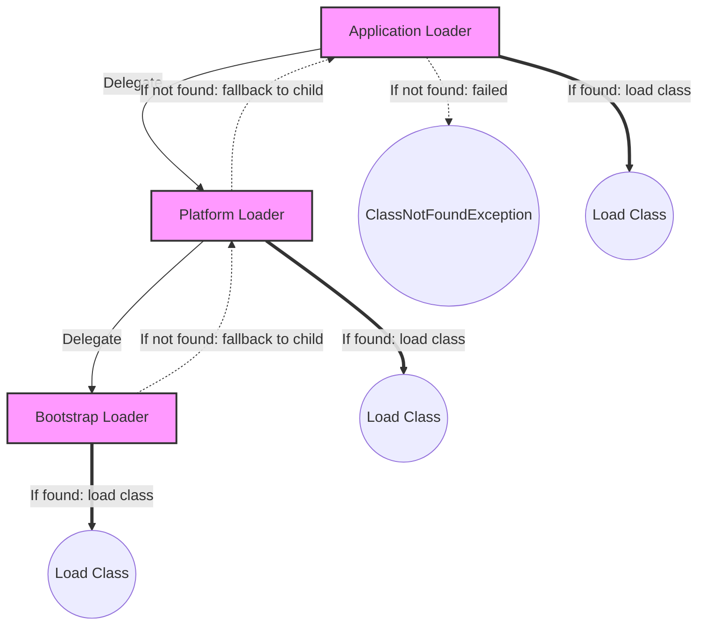
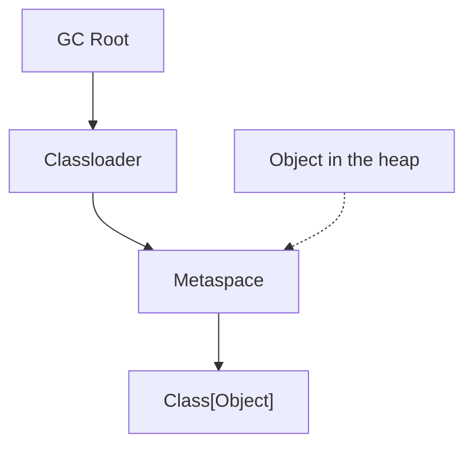

# Class Loading

There are 3 main class loaders:
1. Bootstrap Classloader
2. Platform Classloader
3. Application Classloader

And also we have many custom class loaders which are created by tomcat, app servers, for loading class in the applications

## Bootstrap Classloader:
- This loads all the Java Core classes, like String, Thread, Object

## Platform Classloader:
- This loads all the JDK platform modules like java.sql.* , java.xml.* , java.net.http.*

## Application Classloader:
- This loads all the application classes present in the classpath, jar files
---

# Parent Delegation Model

- When the class is being loaded first the application classloader asks the platform classloader to load it, which in turn asks Bootstrap classloader whether it can be loaded or not

---

# Class Loading lifecycle

- When a `new Employee()` is called, JVM performs:
- ### Loading:
	- Reads Employee.class
- ### Linking:
	- Checks bytecode validity
	- Allocates memory for static fields
	- Create class object in heap memory without initialization
- ### Resolution:
	- Converts symbolic references into runtime references
- ### Initialization:
	- Executes the static blocks and assigns the static variable values

---

## Class metadata vs Class Object

When employee is loaded, there is class metadata created in the metaspace containing all the metadata like field, method, constant pool (a space for storing the values which are referenced by numbers like #1 -> name, it is used in the class like class #1 so that the values can be reused again).

There is another object created for referencing the class in the heap, this contains the static variables and static objects. This class object is created only once per class.

The reference chart is as follows

So there will not be any references other than the stack memory to the objects in the heap and for the static variables we have them in the class object in the heap having the references from the classloader

The objects will have a invisible pointer to the class metadata but once the reference is removed for the object it is completely removed

The GC only checks if the object is reachable via any reference, it does not check what references it is holding

---
# GC Roots

- Common GC Roots:
	1. Thread Stacks
	2. Static Variables
	3. Classloaders
	4. JNI References
	5. Active Threads

- Normally GC asks can i reach the object from the GC Root

---

# Class Unloading

A class can be unloaded if all of the below are true:
1. No live instances
2. Class object is unreachable
3. Classloader unavailable (Most important)

### Why classes never unload in application
- Normally in applications, application classloader would be living until the jvm is shutdown
- Therefore the 3rd condition does not get satisfied and the classes are not unloaded
