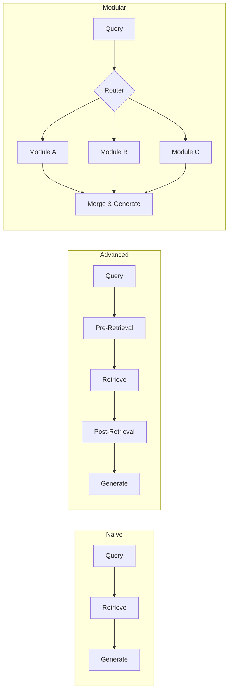
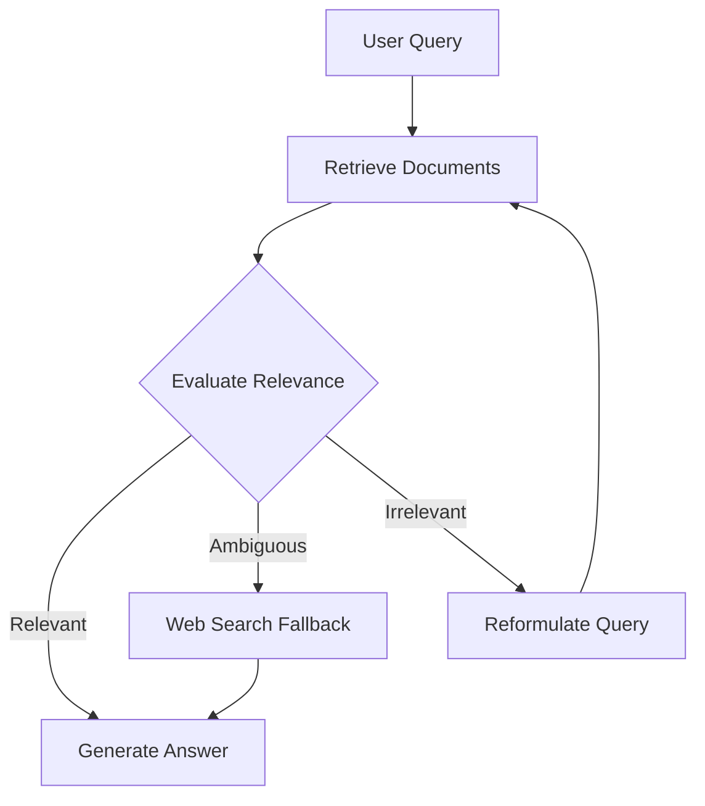
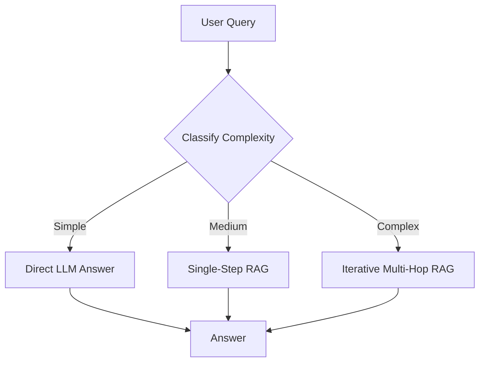

# Advanced RAG Patterns

> [!abstract] Prerequisites
> This note assumes you've read [[RAG - Retrieval Augmented Generation]] and understand chunking, hybrid search, re-ranking, and RAGAS evaluation. Here we go **deep** into the patterns that separate production RAG from toy demos.

---

## 1. Naive RAG vs Advanced RAG vs Modular RAG

Let's frame the three generations of RAG architecture:

| Generation | Pipeline | Weakness |
|:-----------|:---------|:---------|
| **Naive RAG** | Query → Retrieve → Generate | No query optimization, noisy context, one-shot retrieval |
| **Advanced RAG** | Pre-retrieval optimization → Retrieve → Post-retrieval processing → Generate | Fixed pipeline, hard to swap components |
| **Modular RAG** | Composable modules wired together per use-case | More complex to build and maintain |



Think of Naive as a bicycle, Advanced as a car, and Modular as a configurable vehicle where you pick the engine, chassis, and wheels independently.

---

## 2. Pre-Retrieval Optimization

The biggest bang-for-buck improvement. Most RAG failures are **retrieval failures**, and most retrieval failures are **query failures**.

### 2.1 Query Transformation

**Query Rewriting** — rephrase the user's messy question into something the retriever handles well:

```python
rewrite_prompt = """Rewrite this user question to be more specific and 
search-friendly. Keep the same intent.
User question: {query}
Rewritten:"""
rewritten = llm.invoke(rewrite_prompt.format(query=user_query))
docs = retriever.retrieve(rewritten)
```

**Query Expansion** — add synonyms and related terms so we cast a wider net:

```
Original: "How do I fix OOM errors in my Spring app?"
Expanded: "How do I fix OutOfMemoryError heap space Spring Boot 
           JVM memory tuning -Xmx garbage collection"
```

**HyDE (Hypothetical Document Embeddings)** — this one is clever. Instead of embedding the *question*, we ask the LLM to generate a *hypothetical answer*, embed *that*, and retrieve documents similar to the answer:

```
User Query ──► LLM generates hypothetical answer
                       │
               Embed the hypothetical answer
                       │
               Retrieve real docs similar to it
```

Why does this work? Because a hypothetical answer lives in the same semantic space as real answers — closer than a question would be to its answer.

**Step-Back Prompting** — for overly specific questions, ask a broader question first to gather context, then answer the specific one:

```
Specific: "Why did my Kafka consumer lag spike at 3am on Tuesday?"
Step-back: "What are common causes of Kafka consumer lag spikes?"
```

### 2.2 Query Routing

Not all queries should hit the same index. Route intelligently:

```python
def route_query(query: str) -> str:
    """Route to the right index based on query classification."""
    classification = classifier.predict(query)
    routes = {
        "technical": "code_and_docs_index",
        "policy": "compliance_index",
        "recent_events": "news_index",
        "historical": "archive_index",
    }
    return routes.get(classification, "general_index")
```

Routing strategies:
- **Metadata-based**: date range → time-partitioned index, department → scoped collection
- **Semantic routing**: embed the query, compare to route descriptions, pick the closest
- **Keyword routing**: regex or keyword detection for known patterns

### 2.3 Query Decomposition

Complex questions need to be broken into sub-questions:

```
Complex: "Compare the error handling in our payment service vs 
          the shipping service and recommend improvements."

Sub-questions:
  1. "How does the payment service handle errors?"
  2. "How does the shipping service handle errors?"  
  3. "What are best practices for error handling in microservices?"

→ Answer each independently → Synthesize into final comparison
```

This is especially powerful with [[LangChain Fundamentals]] chains that can fan-out sub-questions in parallel.

---

## 3. Advanced Retrieval Strategies

### 3.1 Parent Document Retrieval

The core tension: **small chunks** = precise embedding matches, **large chunks** = better context for generation. Parent document retrieval gives us both:

```
┌─────────────────────────────────┐
│       Parent Document           │  ← Stored, returned for context
│  ┌─────┐  ┌─────┐  ┌─────┐    │
│  │Child│  │Child│  │Child│    │  ← Embedded, used for retrieval
│  │  1  │  │  2  │  │  3  │    │
│  └─────┘  └─────┘  └─────┘    │
└─────────────────────────────────┘
```

```python
# Store small chunks with a reference to their parent
for parent_doc in documents:
    parent_id = store_parent(parent_doc)
    for child_chunk in split_into_small_chunks(parent_doc):
        child_chunk.metadata["parent_id"] = parent_id
        vector_store.add(child_chunk)

# At retrieval time: search children, return parents
child_results = vector_store.similarity_search(query, k=5)
parent_ids = set(r.metadata["parent_id"] for r in child_results)
context = [get_parent(pid) for pid in parent_ids]
```

### 3.2 Contextual Compression

After retrieval, chunks often contain irrelevant sections. Compress them:

```python
# LLM-based compression
compress_prompt = """Given this context chunk and the user's question,
extract ONLY the parts relevant to answering the question.

Question: {question}
Chunk: {chunk}
Relevant extract:"""
```

**Extractive compression** pulls exact sentences. **Abstractive compression** (LLM-based) rewrites. Extractive is cheaper; abstractive is more flexible.

### 3.3 Multi-Vector Retrieval

Generate multiple representations of each document and store them all in [[Vector Databases]]:

```
Original Document
    ├── Summary embedding      → "This doc covers X and Y..."
    ├── Generated Q&A embedding → "Q: What is X? Q: How does Y work?"
    └── Keyword embedding      → "X, Y, configuration, setup"
    
All three point back to the original document.
```

When a user asks a question, it might match the Q&A representation better than the raw text. We retrieve whichever representation matches best, but always return the **original document**.

### 3.4 Recursive Retrieval

Build a tree of summaries — retrieve top-down:

```
Level 0:  [Corpus Summary]
              │
Level 1:  [Topic A Summary]  [Topic B Summary]  [Topic C Summary]
              │                    │
Level 2:  [Doc 1] [Doc 2]    [Doc 3] [Doc 4]
```

Start at Level 0, find which Level 1 topics are relevant, drill into those, and retrieve the actual documents. This scales to millions of documents because you never search the whole corpus — just the relevant branches.

---

## 4. Post-Retrieval Processing

### 4.1 Re-Ranking (Deep Dive)

Bi-encoders (used in initial retrieval) are fast but imprecise. Cross-encoders are slow but much more accurate. Use them as a second pass:

| Model | Speed | Accuracy | Use Case |
|:------|:------|:---------|:---------|
| **Bi-encoder** | Fast (separate embeddings) | Good | Initial retrieval (top-100) |
| **Cross-encoder** | Slow (joint encoding) | Excellent | Re-rank top-100 → top-5 |
| **ColBERT** | Medium (late interaction) | Very Good | Balance of speed + accuracy |
| **Cohere Rerank** | API call | Excellent | Drop-in re-ranking API |

### 4.2 Contextual Reordering — The "Lost in the Middle" Problem

LLMs pay most attention to the **beginning** and **end** of the context window. Content in the middle gets "lost". So after ranking, reorder:

```
Position:  [1st - HIGH attention] [2nd] [3rd - LOW attention] [4th] [5th - HIGH attention]
Strategy:  [Most relevant]  [3rd best]  [5th best]  [4th best]  [2nd most relevant]
```

Put your best chunks at positions 1 and N. Bury the weakest in the middle.

### 4.3 Diversity Selection (MMR)

If your top-5 chunks all say the same thing, you're wasting context window. **Maximal Marginal Relevance** balances relevance with diversity:

$$MMR = \arg\max_{d_i} \left[ \lambda \cdot Sim(d_i, q) - (1 - \lambda) \cdot \max_{d_j \in S} Sim(d_i, d_j) \right]$$

- $\lambda = 1.0$ → pure relevance (might get duplicates)
- $\lambda = 0.5$ → balanced (good default)
- $\lambda = 0.0$ → pure diversity (might lose relevance)

---

## 5. Advanced RAG Architectures

This is where it gets really interesting. These aren't just pipelines — they're **decision-making systems**.

### 5.1 Corrective RAG (CRAG)

After retrieval, **evaluate** whether the documents are actually useful before generating:



```python
def crag_pipeline(query: str):
    docs = retriever.retrieve(query)
    relevance = evaluate_relevance(query, docs)  # LLM-as-judge
    
    if relevance == "relevant":
        return generate(query, docs)
    elif relevance == "ambiguous":
        web_docs = web_search(query)
        return generate(query, docs + web_docs)
    else:  # irrelevant
        new_query = rewrite_query(query)
        return crag_pipeline(new_query)  # retry with better query
```

### 5.2 Self-RAG

The model itself decides **when** and **whether** to retrieve:

```
User: "What is 2 + 2?"
Model thinks: "I know this. No retrieval needed." → Answers directly.

User: "What was our Q3 revenue?"
Model thinks: "I don't have this info. Retrieve." → Triggers RAG.
```

Self-RAG introduces **reflection tokens** — special signals the model emits:
- `[Retrieve]` / `[No Retrieve]` — should I look something up?
- `[Relevant]` / `[Irrelevant]` — was this retrieval useful?
- `[Supported]` / `[Not Supported]` — is my answer grounded in the context?

This makes the model **self-aware** about its own knowledge gaps.

### 5.3 Agentic RAG

RAG becomes one tool in an [[What are AI Agents|AI Agent's]] toolkit:

```
Agent Loop:
  1. Receive query
  2. Think: "Do I need external info?"
  3. Choose action:
     a) Retrieve from vector store
     b) Search the web
     c) Query a database
     d) Ask user for clarification
     e) Answer from internal knowledge
  4. Evaluate: "Do I have enough info?"
     - Yes → Generate final answer
     - No  → Go to step 3 with refined query
```

The key difference from plain RAG: **iterative retrieval**. The agent can retrieve, reason about what's missing, and retrieve again. This is how you handle multi-hop questions like *"Which team lead approved the policy that caused the shipping delay last month?"* — that requires chaining multiple lookups.

See [[What are AI Agents]] for the full agent architecture and [[Spring AI Framework]] for Java-based implementations.

### 5.4 Graph RAG

Vector search finds **semantically similar** chunks. But some questions require **relationship traversal**: *"Who reports to the person who approved budget X?"*

```
┌──────────┐    approved    ┌──────────┐    reports_to    ┌──────────┐
│  Alice   │ ──────────────►│ Budget X │◄─────────────── │   Bob    │
└──────────┘                └──────────┘                  └──────────┘
       │                                                        │
       │  works_in                                  works_in    │
       ▼                                                        ▼
  ┌──────────┐                                          ┌──────────┐
  │ Finance  │                                          │ Finance  │
  └──────────┘                                          └──────────┘
```

**Microsoft's GraphRAG** approach:
1. Extract entities and relationships from all documents → build knowledge graph
2. Detect **communities** (clusters of related entities) using Leiden algorithm
3. Generate **community summaries** at multiple levels
4. At query time: map query to relevant communities → retrieve summaries → generate

Graph RAG excels at **global questions** ("What are the main themes across all documents?") where vector search struggles because no single chunk contains the full answer.

### 5.5 Adaptive RAG

Why use the same heavy pipeline for every query? Classify first, then pick the right strategy:



- **Simple** (*"What does RAG stand for?"*) → No retrieval, direct answer. Saves cost and latency.
- **Medium** (*"How do we configure retry policies?"*) → Standard single-step RAG.
- **Complex** (*"Compare our retry strategy across all microservices and find inconsistencies"*) → Multi-hop with query decomposition.

---

## 6. Multi-Modal RAG

RAG isn't just for text anymore.

**Images + Text**: Use CLIP or similar models to embed images into the same vector space as text. A query like *"show me the architecture diagram for the payment service"* retrieves the actual image.

**Tables**: Tables are notoriously hard for embeddings. Best approach: parse tables into structured text or Markdown, embed with the surrounding context, and optionally store as structured data for SQL-based retrieval.

**Code**: Use code-specific embedding models (e.g., `code-search-ada`, StarCoder embeddings) that understand syntax and semantics. Embed functions/classes individually with their docstrings.

> [!tip] Practical Tip
> For multi-modal, use **separate indexes per modality** with a unified query router rather than forcing everything into one vector space. The embeddings won't align well across modalities unless you use a model specifically trained for that (like CLIP for image-text).

---

## 7. Evaluation for Advanced RAG

> [!warning] Don't Skip This
> Every pattern above can help or hurt depending on your data. Measure everything.

**Component-level testing** — test retrieval and generation independently:
- Retrieval: Precision@K, Recall@K, MRR, NDCG
- Generation: Faithfulness, answer relevance, hallucination rate

**End-to-end benchmarks** — golden Q&A datasets where you know the expected answer and source documents.

**Regression testing** — when you swap a component (new embedding model, different chunking strategy), run the full eval suite before and after. Track:

| Change | Retrieval Recall@5 | Faithfulness | Latency (p95) | Cost/query |
|:-------|:-------------------|:-------------|:---------------|:-----------|
| Baseline | 0.72 | 0.85 | 1.2s | $0.03 |
| + HyDE | 0.78 | 0.84 | 2.1s | $0.05 |
| + Reranking | 0.81 | 0.88 | 1.8s | $0.04 |
| + CRAG | 0.83 | 0.91 | 2.5s | $0.07 |

Every advanced pattern adds latency and cost. The question is always: **is the quality gain worth it for your use case?**

---

## Key Takeaways

1. **Naive RAG fails on hard queries** — pre-retrieval optimization (especially query rewriting and HyDE) gives the biggest quality uplift for the least effort.
2. **Parent Document Retrieval** solves the chunk-size dilemma — embed small, retrieve big.
3. **Not every query needs the same pipeline** — Adaptive RAG saves cost by matching complexity to strategy.
4. **CRAG and Self-RAG add self-correction** — the system detects when retrieval failed and retries or falls back.
5. **Agentic RAG is the future** — RAG as one tool among many in an agent loop, with iterative retrieval and reasoning.
6. **Graph RAG unlocks multi-hop reasoning** — when relationships between entities matter more than semantic similarity.
7. **The "Lost in the Middle" problem is real** — reorder your context so the best chunks are at the start and end.
8. **Always measure** — every pattern adds latency and cost. Use component-level and end-to-end evaluation to justify each addition.
9. **Modular RAG is the architecture goal** — composable modules you can swap, test, and iterate on independently.
10. **Start simple, add complexity only when evaluation shows a gap** — Naive RAG + good chunking + re-ranking gets you surprisingly far.

---

> [!quote] Related Notes
> - [[RAG - Retrieval Augmented Generation]] — foundational RAG concepts
> - [[Vector Databases]] — embedding storage and retrieval
> - [[What are AI Agents]] — agent architectures that use RAG as a tool
> - [[LangChain Fundamentals]] — framework for building RAG pipelines
> - [[Spring AI Framework]] — Java/Spring-based RAG implementations
