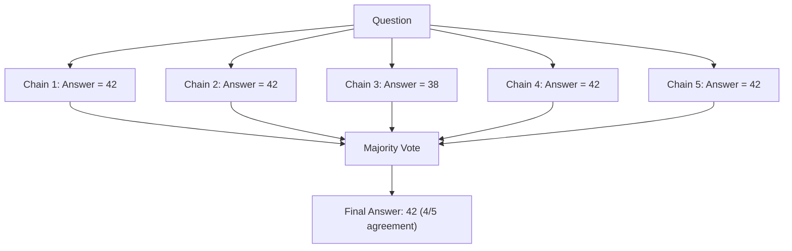
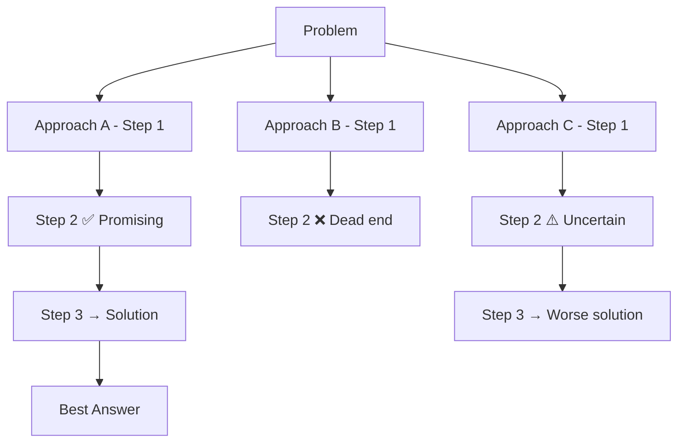

# Chain of Thought Prompting

We saw in [[Prompt Engineering]] that how you phrase inputs dramatically changes LLM outputs. Chain of Thought (CoT) takes that idea to its logical extreme: **make the model show its work**. The result? Massive accuracy gains on reasoning-heavy tasks — arithmetic, logic, multi-step planning — often for just a few extra tokens.

---

## What is Chain of Thought?

### The Key Insight

LLMs are next-token predictors. When you ask "What's 247 × 38?" the model has to jump straight to the answer in a single forward pass. That's like asking a junior dev to solve a complex problem in their head without writing anything down. Unsurprisingly, they get it wrong.

CoT says: **let the model write down intermediate steps**. Each step generates tokens that serve as working memory for the next step. The model essentially "thinks on paper."

### The Original Paper (Wei et al., 2022)

The landmark paper showed that simply adding step-by-step reasoning examples to prompts improved performance on GSM8K (grade-school math) from **17.9% to 58.1%** with a 540B parameter model. The bigger the model, the more dramatic the improvement — CoT barely helps small models.

> [!tip] Mental Model
> Think of it like asking a developer to explain their reasoning during a code review, not just show the final diff. The explanation forces them to think more carefully — and you can spot where they went wrong.

### Why CoT Works

1. **Decomposition** — Complex problems become sequences of simpler sub-problems
2. **Working memory** — Intermediate tokens act as scratch space the model can reference
3. **Error localization** — When the model gets something wrong, you can see exactly *where* the reasoning broke
4. **Alignment with training data** — The internet is full of step-by-step explanations (tutorials, Stack Overflow, textbooks). CoT activates this training distribution.

### When CoT Helps vs When It Doesn't

| Task Type | CoT Benefit | Why |
|-----------|-------------|-----|
| Arithmetic / math | ✅ High | Requires multi-step computation |
| Logical reasoning | ✅ High | Needs sequential deduction |
| Multi-step planning | ✅ High | Benefits from decomposition |
| Simple fact recall | ❌ Low | "What's the capital of France?" doesn't need reasoning |
| Creative writing | ❌ Low | Not a reasoning-heavy task |
| Classification | ⚠️ Mixed | Helps for ambiguous cases, wasteful for clear-cut ones |

> [!warning] Don't Overthink It
> Using CoT for trivial tasks wastes tokens and money. "Translate 'hello' to French" doesn't need chain-of-thought reasoning. Save CoT for tasks where accuracy matters and the problem has multiple steps.

---

## Zero-Shot CoT

The simplest form — no examples needed. Just append a magic phrase to your prompt.

### "Let's think step by step"

Kojima et al. (2022) showed that simply adding **"Let's think step by step"** to the end of a prompt triggers the model to generate reasoning chains — without any examples. This is zero-shot because you provide no demonstrations.

**Why it works:** During pre-training, the model encountered countless tutorials, explanations, and walkthroughs that begin with phrases like this. The phrase activates the "explanation" distribution in the model's weights.

### Variations

| Phrase | Effectiveness | Notes |
|--------|--------------|-------|
| "Let's think step by step" | ✅ Strong | The original — reliable across tasks |
| "Let's work through this carefully" | ✅ Strong | Slightly more deliberate |
| "Break this down into steps" | ✅ Good | More directive |
| "Think about this logically" | ⚠️ Moderate | Vaguer, less consistent |
| "Show your reasoning" | ✅ Good | Direct and clear |

### Code Example: Zero-Shot CoT

```python
from openai import OpenAI

client = OpenAI()

def zero_shot_cot(question: str) -> str:
    """Use zero-shot chain of thought prompting."""
    response = client.chat.completions.create(
        model="gpt-4o",
        messages=[
            {
                "role": "system",
                "content": "You are a helpful assistant. Always show your reasoning step by step."
            },
            {
                "role": "user",
                "content": f"{question}\n\nLet's think step by step."
            }
        ],
        temperature=0.0
    )
    return response.choices[0].message.content

# Example: logistics problem
answer = zero_shot_cot(
    "A warehouse receives 3 shipments per hour. Each shipment contains 45 packages. "
    "If the warehouse operates for 8 hours and 12% of packages are damaged, "
    "how many undamaged packages are processed?"
)
print(answer)
```

---

## Few-Shot CoT

Provide explicit examples of reasoning chains. This is more reliable than zero-shot because you control the format and depth of reasoning.

### How to Construct Good Examples

1. **Match the problem domain** — math examples for math problems, logic for logic
2. **Show the right level of detail** — not too terse, not overly verbose
3. **Include diverse patterns** — different sub-problems, not all identical
4. **Use correct reasoning** — wrong examples poison the model's reasoning

### Code Example: Few-Shot CoT

```python
def few_shot_cot(question: str) -> str:
    """Use few-shot chain of thought prompting with examples."""
    response = client.chat.completions.create(
        model="gpt-4o",
        messages=[
            {
                "role": "system",
                "content": "Solve problems step by step. Show all reasoning before the final answer."
            },
            {
                "role": "user",
                "content": (
                    "Q: A truck carries 200 boxes. At the first stop, it delivers 35% "
                    "of the boxes. At the second stop, it delivers half of what's left. "
                    "How many boxes remain?\n\n"
                    "A: Let's work through this:\n"
                    "- Start: 200 boxes\n"
                    "- First stop: delivers 200 × 0.35 = 70 boxes → 200 - 70 = 130 remain\n"
                    "- Second stop: delivers 130 / 2 = 65 boxes → 130 - 65 = 65 remain\n"
                    "- **Answer: 65 boxes remain**\n\n"
                    "---\n\n"
                    "Q: A fleet has 12 trucks. Each truck makes 3 trips per day and carries "
                    "8 tons per trip. If the fleet operates 5 days a week, what's the weekly "
                    "capacity?\n\n"
                    "A: Let's work through this:\n"
                    "- Per truck per day: 3 trips × 8 tons = 24 tons\n"
                    "- All trucks per day: 12 × 24 = 288 tons\n"
                    "- Per week: 288 × 5 = 1,440 tons\n"
                    "- **Answer: 1,440 tons per week**\n\n"
                    "---\n\n"
                    f"Q: {question}\n\nA: Let's work through this:"
                )
            }
        ],
        temperature=0.0
    )
    return response.choices[0].message.content

answer = few_shot_cot(
    "A distribution center processes 500 orders/hour. 8% are express (cost $12 each) "
    "and the rest are standard (cost $5 each). What's the total cost for a 10-hour shift?"
)
print(answer)
```

> [!example] Why Few-Shot Beats Zero-Shot
> Few-shot CoT gives you control over the *format* of reasoning. If you need the model to output structured steps that your application parses, few-shot lets you demonstrate that exact format. Zero-shot relies on the model choosing its own structure.

---

## Self-Consistency

### The Idea

One reasoning chain might go wrong. But if you sample **multiple independent chains** and take the **majority vote** on the final answer, errors tend to cancel out. This is the core insight of Wang et al. (2022).

### How It Works



### Implementation

```python
from collections import Counter
import re

def self_consistency(question: str, num_samples: int = 5) -> str:
    """Sample multiple reasoning chains and take majority vote."""
    answers = []
    for _ in range(num_samples):
        response = client.chat.completions.create(
            model="gpt-4o",
            messages=[
                {"role": "system", "content": "Solve step by step. End with 'ANSWER: <number>'"},
                {"role": "user", "content": f"{question}\n\nLet's think step by step."}
            ],
            temperature=0.7  # Higher temp for diverse reasoning paths
        )
        text = response.choices[0].message.content
        match = re.search(r"ANSWER:\s*(.+)", text)
        if match:
            answers.append(match.group(1).strip())

    # Majority vote
    vote = Counter(answers).most_common(1)
    return vote[0][0] if vote else "No consensus"
```

> [!warning] Cost Implication
> Self-consistency multiplies your API cost by the number of samples. 5 samples = 5× cost. Use it for high-stakes decisions where accuracy justifies the expense — like financial calculations or medical triaging, not casual Q&A.

---

## Tree of Thought

### Beyond Linear Reasoning

Standard CoT is a single chain: step 1 → step 2 → step 3. But what if the best approach isn't clear from the start? **Tree of Thought (ToT)** explores multiple reasoning branches and evaluates which path is most promising — like a chess engine considering several moves ahead.



### Comparison

| Technique | Paths Explored | Cost | Best For |
|-----------|---------------|------|----------|
| Zero-Shot CoT | 1 linear | Low | Simple reasoning |
| Few-Shot CoT | 1 linear | Low | Structured problems |
| Self-Consistency | N independent | Medium | Numerical answers |
| Tree of Thought | Branching tree | High | Creative problem-solving, puzzles |

---

## Chain of Thought Variations

### Step-Back Prompting

Instead of diving into the specifics, first **ask an abstract question** to get the relevant principles, *then* apply them to the specific problem.

```
Step 1: "What physics principles govern this problem?" → Newton's 2nd law, friction
Step 2: "Now solve: A 5kg box on a 30° incline with μ=0.3..."
```

This helps when the model gets lost in details without seeing the big picture.

### Plan-and-Solve Prompting

An evolution of zero-shot CoT that adds explicit planning:
1. "First, devise a plan to solve this"
2. "Then, carry out the plan step by step"

More structured than "Let's think step by step" — forces the model to plan before executing.

### Program of Thoughts (PoT)

Instead of reasoning in natural language, the model generates **code** to solve the problem. The code is then executed for the final answer.

```python
# Model generates this code instead of text reasoning:
shipments_per_hour = 150
hours_per_day = 16
days_per_week = 5
total = shipments_per_hour * hours_per_day * days_per_week
print(total)  # 12000 — precise, no arithmetic errors
```

> [!tip] When to Use PoT
> Program of Thoughts is ideal for math-heavy problems. The model's code generation is more reliable than its arithmetic. Let the model write the code, let Python do the math. See [[LLM Capabilities and Limitations]] for why LLMs struggle with arithmetic.

---

## CoT in Agent Systems

Chain of thought isn't just a prompting technique — it's the foundation of how agents reason. The connection to [[What are AI Agents|agents]] is direct.

### ReAct = CoT + Actions

The [[ReAct Pattern]] extends CoT by interleaving reasoning with tool calls:

```
Thought: I need the current exchange rate for USD to EUR.
Action: get_exchange_rate("USD", "EUR")
Observation: 1 USD = 0.92 EUR
Thought: Now I can calculate the total in EUR.
Action: calculate("1500 * 0.92")
Observation: 1380.0
Thought: I have the answer.
Answer: $1,500 USD is €1,380 EUR.
```

The "Thought" lines are CoT. The "Action" lines are [[Function Calling in LLMs|function calls]]. Together they form a powerful reasoning-and-acting loop.

### Scratchpad Patterns

Some agents use an explicit **scratchpad** — a section of the prompt where the model can write notes to itself. This is essentially CoT made persistent across multiple turns. Useful in [[Memory Systems for Agents|memory-constrained]] scenarios.

### Inner Monologue vs Visible Reasoning

- **Visible reasoning** — The user sees the model's thoughts (good for transparency)
- **Inner monologue** — Thoughts are hidden from the user but still generated (good for UX). OpenAI's o1 model uses this approach: reasons internally, only shows the final answer.

---

## Cost and Performance Trade-offs

More reasoning = more tokens = more cost. Here's the decision matrix:

| Technique | Extra Tokens | Accuracy Gain | When to Use |
|-----------|-------------|---------------|-------------|
| Direct answer | 0 | Baseline | Simple, well-known tasks |
| Zero-Shot CoT | +50–200 | +10–30% | Medium complexity, low budget |
| Few-Shot CoT | +200–500 | +20–40% | Structured problems, predictable format |
| Self-Consistency (5×) | +500–2000 | +5–15% over CoT | High-stakes numerical answers |
| Tree of Thought | +1000–5000 | +10–25% over CoT | Creative/puzzle tasks, exploration |

> [!tip] Compression Technique
> For production systems, you can use CoT during a "reasoning" phase and then summarize the chain into a concise answer. The user sees the clean result; you keep the reasoning in logs for debugging. This is exactly what [[Production Considerations|production agents]] do.

---

## Common Mistakes

1. **Using CoT for trivial tasks** — "Translate 'hello' to French. Let's think step by step." → Wasteful. Just ask directly.
2. **Poor example selection in few-shot** — Examples that don't match the problem domain confuse the model more than they help.
3. **Not handling hallucinations in reasoning chains** — The model can generate plausible-looking but *wrong* intermediate steps. Each wrong step compounds into a worse final answer.
4. **Confusing CoT with prompt chaining** — CoT is a single prompt with reasoning steps. Prompt chaining is multiple sequential LLM calls. Different techniques for different problems.
5. **Ignoring temperature** — CoT works best with low temperature (0.0–0.3) for deterministic reasoning. Self-consistency needs higher temperature for diverse paths.
6. **Not parsing the final answer** — If your application needs a structured answer, tell the model to clearly mark it (e.g., "ANSWER: ...") and parse it out.

---

## Interview Questions

> [!question] 1. What is Chain of Thought prompting and why does it improve LLM performance?
> CoT prompting asks the model to generate intermediate reasoning steps before the final answer. It improves performance because generated tokens act as working memory, allowing the model to decompose complex problems into simpler sub-problems rather than jumping to the answer in a single forward pass.

> [!question] 2. What's the difference between zero-shot and few-shot CoT? When would you use each?
> Zero-shot CoT uses a trigger phrase like "Let's think step by step" with no examples. Few-shot provides explicit reasoning demonstrations. Use zero-shot for quick prototyping and general problems; few-shot when you need a specific reasoning format or the task is domain-specific.

> [!question] 3. How does self-consistency improve upon standard CoT?
> Self-consistency samples multiple independent reasoning chains (using higher temperature) and takes a majority vote on the final answer. This reduces the impact of any single flawed reasoning path. The trade-off is multiplied API cost.

> [!question] 4. How does Chain of Thought relate to the ReAct pattern in agent systems?
> ReAct extends CoT by interleaving reasoning traces with tool actions. The "Thought" step in ReAct *is* CoT — the model reasons about what to do. The difference is ReAct adds "Action" and "Observation" steps that ground the reasoning in real-world data. See [[ReAct Pattern]] for details.

> [!question] 5. When should you NOT use Chain of Thought prompting?
> Don't use CoT for simple factual lookups, straightforward translations, or classification tasks with clear-cut answers. CoT adds token cost without accuracy benefit for tasks that don't require multi-step reasoning. Also avoid it with small models — CoT primarily benefits large models (100B+ parameters).

> [!question] 6. What is Program of Thoughts (PoT) and how does it differ from standard CoT?
> PoT has the model generate executable code instead of natural language reasoning. The code is run to produce the answer. It's more reliable for math-heavy problems because code execution is precise — no arithmetic errors. Standard CoT reasons in text and can make computational mistakes.

---

## Practice Exercises

### Exercise 1: Compare Zero-Shot vs Few-Shot CoT

Write a Python script that solves the same 5 logistics word problems using both zero-shot and few-shot CoT. Compare the accuracy and token usage. Which approach wins for your domain?

### Exercise 2: Implement Self-Consistency

Build a self-consistency pipeline that:
1. Takes a complex reasoning question
2. Samples 5 reasoning chains at temperature 0.7
3. Extracts and parses the final answer from each chain
4. Returns the majority vote with a confidence score (agreement %)
5. Falls back to the lowest-temperature chain if there's no consensus

### Exercise 3: Build a Step-Back Prompting Pipeline

Create a two-stage prompting system:
1. Stage 1: Ask the model to identify the abstract principles/concepts relevant to the problem
2. Stage 2: Feed those principles back along with the original question for the final answer

Compare accuracy against direct CoT on 10 test questions.

### Exercise 4: CoT Output Parser

Build a parser that extracts structured data from CoT responses — the intermediate steps (as a list) and the final answer (as a typed value). Handle cases where the model doesn't follow the expected format gracefully.

### Exercise 5: Cost Analysis Tool

Write a script that estimates the cost of different CoT strategies for a given workload. Input: number of queries per day, average query complexity, pricing per token. Output: daily cost comparison table for direct answer, zero-shot CoT, few-shot CoT, and self-consistency (3×, 5×, 7× samples). Use the [[OpenAI API Deep Dive|OpenAI pricing]] to make it realistic.

---

**Key Takeaways**

1. Chain of Thought forces models to **decompose problems** into intermediate steps, dramatically improving reasoning accuracy
2. **Zero-shot CoT** is cheap and easy — just add "Let's think step by step". Use it as your default for non-trivial questions.
3. **Few-shot CoT** gives you format control but requires crafting good examples
4. **Self-consistency** trades cost for reliability via majority voting — use for high-stakes decisions
5. CoT is the foundation of agent reasoning — the "Think" step in [[ReAct Pattern|ReAct]] is literally chain-of-thought
6. Always consider the **cost vs accuracy trade-off** — not every question needs a 5-chain self-consistency vote
7. For math-heavy tasks, consider **Program of Thoughts** — let the model write code and let Python do the arithmetic
