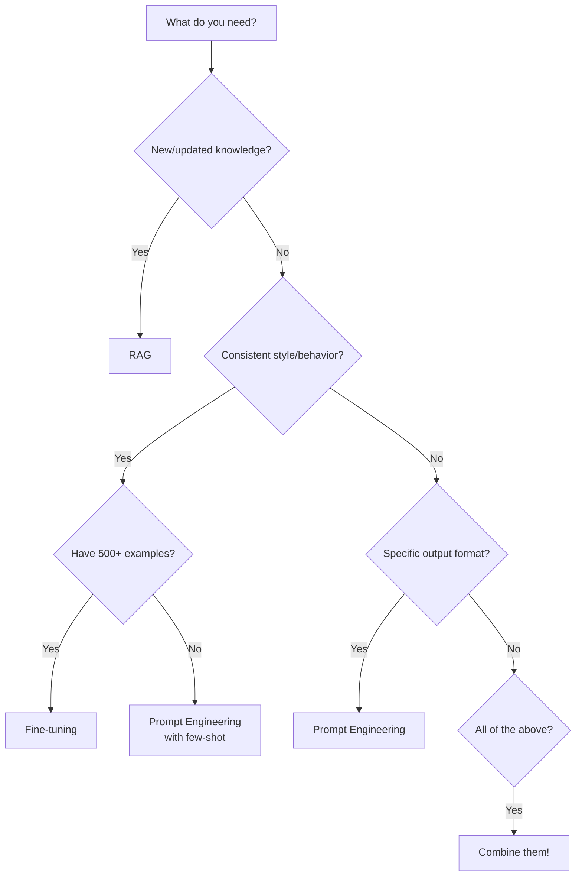

---
tags:
  - llm
  - fine-tuning
  - rag
  - prompt-engineering
  - phase-4
---

# Fine-Tuning vs RAG vs Prompt Engineering

You have a base LLM. You want it to do something specific for your domain. You have three levers to pull — and knowing *which* to pull (and when to combine them) separates hobby projects from production systems.

---

## The Three Approaches

| Approach | What it does | Analogy |
|----------|-------------|---------|
| **Prompt Engineering** | Tell the model *how* to behave at inference time | Giving instructions to a smart intern |
| **RAG** | Give the model *knowledge* at query time | Handing them a reference manual |
| **Fine-tuning** | Change the model's *weights* through additional training | Sending them to a specialized course |

Let's understand each deeply, then build a decision framework.

---

## Prompt Engineering

The cheapest, fastest approach. You don't change the model — you change what you *say* to it.

**Good for:**
- Controlling output format (JSON, tables, specific structure)
- Task specification ("You are a customs compliance checker...")
- Few-shot examples (show 3 examples, model generalizes)
- Behavioral constraints ("Never discuss pricing", "Always cite sources")

**Limitations:**
- **Context window limits** — You can only fit so much instruction/context
- **No new knowledge** — The model only knows what it learned during pre-training
- **Inconsistency** — Complex instructions may be followed inconsistently
- **Token cost** — Long system prompts cost money on every single request

**Cost:** Only the per-token cost of your prompts. Iterate in minutes.

```python
# Prompt engineering example - format control
system_prompt = """You are a shipping rate calculator.
Always respond in this exact JSON format:
{
  "route": "origin → destination",
  "mode": "ocean|air|rail",
  "estimated_cost_usd": number,
  "transit_days": number,
  "confidence": "high|medium|low"
}
Do not include any text outside the JSON."""
```

See [[Prompt Engineering Techniques]] for advanced strategies.

---

## RAG (Retrieval Augmented Generation)

Moderate cost, moderate complexity. You give the model access to external knowledge *at query time*.

**Good for:**
- **Up-to-date knowledge** — Documents change daily, RAG always retrieves current data
- **Domain-specific data** — Internal docs, company policies, technical manuals
- **Citations** — You know *which* document the answer came from
- **Large knowledge bases** — Can't fit 10,000 pages in a prompt, but can retrieve relevant chunks

**Limitations:**
- **Retrieval quality bottleneck** — If retrieval fails, generation fails
- **Latency** — Extra step (embed → search → retrieve) adds 100–500ms
- **Chunking challenges** — Bad chunking = bad retrieval = bad answers
- **Infrastructure** — Need a [[Vector Databases|vector database]], embedding pipeline, monitoring

**Cost:** Embedding model API calls + vector database infrastructure + slightly longer prompts (with retrieved context).

See [[RAG - Retrieval Augmented Generation]] for deep implementation details.

---

## Fine-Tuning

Expensive, slow iteration cycle. You actually change the model's internal weights by training on your specific data.

**Good for:**
- **Consistent style/tone** — Model *always* writes like your brand voice
- **Specialized domain language** — Medical terminology, legal jargon, logistics codes
- **Task-specific behavior** — The model reliably does one thing extremely well
- **Latency optimization** — A fine-tuned smaller model can outperform a prompted larger model

**Limitations:**
- **Catastrophic forgetting** — Model may lose general capabilities during fine-tuning
- **Data requirements** — Need hundreds to thousands of high-quality examples
- **Cost** — Training costs + need to re-train when requirements change
- **Slow iteration** — Hours/days to fine-tune, vs minutes for prompt changes
- **No new knowledge** — Fine-tuning teaches *behavior*, not facts (facts go stale)

**Cost:** Training compute ($5–$500+ depending on model size and data volume) + hosting the fine-tuned model.

```python
# Fine-tuning training data format (OpenAI)
{"messages": [
    {"role": "system", "content": "You are a freight classification assistant."},
    {"role": "user", "content": "Classify: 500 units of lithium batteries, 48V"},
    {"role": "assistant", "content": "HS Code: 8507.60\nClass: 9 (Miscellaneous Dangerous Goods)\nUN Number: UN3481\nPacking Group: II"}
]}
```

---

## Decision Framework

Think of this as a flowchart for choosing your approach:



### Quick Decision Table

| Need | First try | If not enough |
|------|-----------|---------------|
| Answer questions from your docs | RAG | RAG + re-ranking |
| Consistent JSON output | Prompt engineering | Fine-tuning |
| Domain terminology (medical, legal) | Prompt + few-shot | Fine-tuning |
| Up-to-date information | RAG | RAG + better chunking |
| Faster/cheaper inference | Prompt optimization | Fine-tune smaller model |
| Brand voice consistency | System prompt | Fine-tuning |
| Complex multi-step reasoning | [[Prompt Engineering Techniques|Chain-of-thought]] | Fine-tune on reasoning traces |

---

## Cost Comparison

| Factor | Prompt Engineering | RAG | Fine-Tuning |
|--------|-------------------|-----|-------------|
| Upfront cost | $0 | $100–$1000 (infra setup) | $50–$500+ (training) |
| Per-query cost | Tokens only | Tokens + embedding + DB query | Tokens (possibly cheaper model) |
| Iteration speed | Minutes | Hours (re-index) | Days |
| Maintenance | Update prompts | Update documents | Re-train periodically |
| Infrastructure | None | Vector DB + embedding pipeline | Training pipeline + model hosting |

---

## Hybrid Approaches

In practice, the best systems combine all three:

### Fine-tuned model + RAG + Good Prompts

```
┌─────────────────────────────────────────────┐
│  Fine-tuned smaller model (style/behavior)  │
│  + RAG (current knowledge from your docs)   │
│  + Prompt engineering (format/constraints)   │
└─────────────────────────────────────────────┘
```

**Example:** A customer support bot that:
- Is **fine-tuned** on your support transcripts (knows the tone, handles edge cases)
- Uses **RAG** to retrieve relevant KB articles and order data
- Has **prompt engineering** to format responses with ticket numbers and next steps

### The 80/20 Rule

For most teams, this progression works:

1. **Start with prompt engineering** — Get 80% of the way there
2. **Add RAG** when you need domain knowledge — Get to 90%
3. **Fine-tune** only when the above isn't enough — Get to 95%+

> [!warning] Don't start with fine-tuning
> It's the most expensive and slowest to iterate. Always exhaust prompt engineering and RAG first.

---

## Real-World Examples

### Customer Support Bot
- **Prompt eng:** Tone, format, escalation rules
- **RAG:** Product docs, FAQ, order history
- **Fine-tune:** Only if consistent tone across thousands of interactions matters
- **Winner:** RAG + Prompt Engineering (fine-tuning rarely needed)

### Code Assistant
- **Prompt eng:** Language, style, framework conventions
- **RAG:** Codebase documentation, API references, internal libraries
- **Fine-tune:** On company's actual code patterns (if budget allows)
- **Winner:** RAG + Prompt Engineering for most; fine-tune for code-specific models

### Medical Q&A
- **Prompt eng:** Safety disclaimers, citation requirements
- **RAG:** Medical literature, drug databases, clinical guidelines
- **Fine-tune:** On medical reasoning patterns and terminology
- **Winner:** All three — fine-tuned medical model + RAG for current literature + safety prompts

### Logistics Document Processor
- **Prompt eng:** Extraction format, field mappings
- **RAG:** Classification guides, Incoterms reference, port codes
- **Fine-tune:** On actual BOLs, invoices, packing lists from your operations
- **Winner:** Fine-tune for extraction accuracy + RAG for reference data

---

## Key Takeaways

1. **Prompt Engineering** is your first tool — cheapest, fastest, often sufficient for format control and task specification
2. **RAG** is for knowledge — when the model needs access to your specific, up-to-date data with citations
3. **Fine-tuning** is for behavior — when you need consistent style, domain fluency, or task-specific performance that prompting can't achieve
4. **Always start with prompting**, then add RAG, then consider fine-tuning — follow the cost/complexity escalation
5. The best production systems **combine all three** — a fine-tuned model, augmented with RAG, guided by well-crafted prompts
6. RAG gives you **knowledge that stays current**; fine-tuning gives you **behavior that's consistent** — they solve different problems
7. **Don't fine-tune for facts** — facts change. Fine-tune for *how* the model behaves, use RAG for *what* it knows
