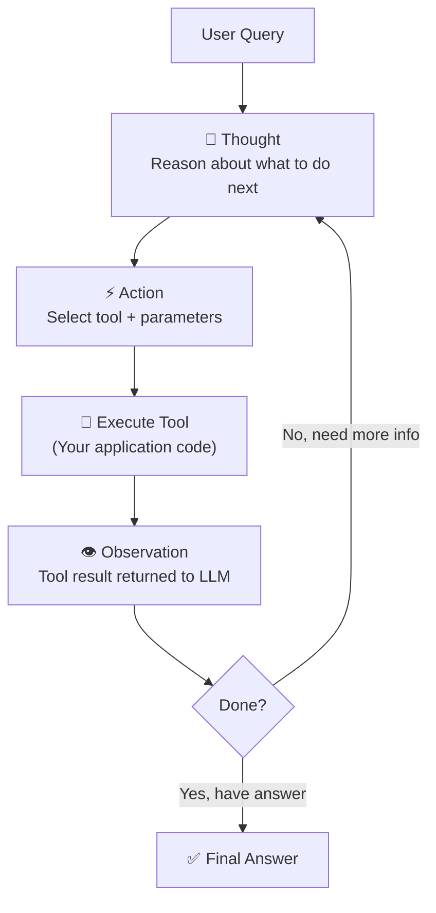
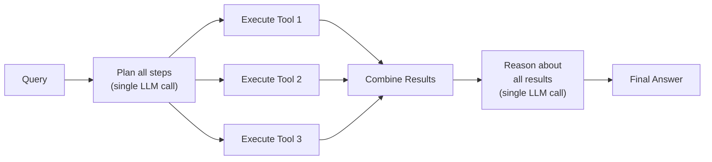

# ReAct Pattern

We saw in [[Agent Architecture Patterns]] that ReAct is the most common agent pattern. We've already built one from scratch in [[Building a Simple Agent in Python]]. Now let's go deep — understand the theory, the implementation details, the failure modes, and when to use something else.

---

## What is ReAct?

**ReAct = Reasoning + Acting** (Yao et al., 2022)

The key insight: neither reasoning alone (like [[Chain of Thought Prompting|Chain of Thought]]) nor acting alone (pure tool calling) is sufficient for complex tasks that require interacting with the real world.

- **CoT alone:** The model can reason about a problem but can't verify its assumptions against reality. It might plan perfectly but work with outdated or hallucinated information.
- **Tool use alone:** The model calls tools but without reasoning, it makes poor decisions about *which* tool to call and *what* to do with results. It acts without thinking.

ReAct combines both: the model **thinks out loud** about what to do, **takes an action**, **observes the result**, and then **reasons** about what to do next.

> [!tip] Mental Model
> Think of a developer debugging a production issue. They don't just blindly run commands (acting without reasoning). They don't just think about what *might* be wrong without checking (reasoning without acting). They **think** → "maybe it's a memory leak, let me check the heap" → **act** → `jmap -heap <pid>` → **observe** → "heap usage is at 98%" → **think** → "confirmed, let me check which objects are leaking" → and so on. That's ReAct.

---

## The ReAct Loop



### Each Step Explained

**Thought:** The model generates a reasoning trace — what it knows, what it needs, and what it plans to do. This is [[Chain of Thought Prompting|CoT]] applied to action planning.

```
Thought: The user wants the total revenue for Q3. I need to query the sales database 
for July, August, and September. Let me start with the quarterly summary endpoint.
```

**Action:** Based on the thought, the model selects a tool and provides parameters. This is [[Function Calling in LLMs|function calling]] in context.

```
Action: query_sales(period="Q3-2025", metric="revenue")
```

**Observation:** Your application executes the tool and returns the result. The model sees this as context for the next step.

```
Observation: {"total_revenue": 2450000, "breakdown": {"July": 780000, "August": 850000, "September": 820000}}
```

**Termination:** The loop ends when the model decides it has enough information to answer the user's question. It produces a final response instead of another action.

> [!example] Full ReAct Trace
> ```
> User: What's the shipping cost for a 25kg package from Sydney to Melbourne via express?
> 
> Thought: I need to look up the express shipping rate for this route and weight.
> Action: get_shipping_rate(origin="Sydney", dest="Melbourne", weight_kg=25, service="express")
> Observation: {"rate_per_kg": 4.50, "base_fee": 15.00, "estimated_days": 1}
> 
> Thought: I have the rate. Let me calculate: 25kg × $4.50/kg + $15 base fee.
> Action: calculate(expression="25 * 4.50 + 15.00")
> Observation: 127.5
> 
> Thought: Total cost is $127.50 with 1-day delivery. I have everything to answer.
> Answer: Express shipping for a 25kg package from Sydney to Melbourne costs $127.50 
>         (25kg × $4.50/kg + $15.00 base fee), with an estimated delivery of 1 business day.
> ```

---

## ReAct vs Other Patterns

| Pattern | Reasoning | Actions | Feedback | Best For |
|---------|-----------|---------|----------|----------|
| Standard Prompting | ❌ | ❌ | ❌ | Simple Q&A |
| [[Chain of Thought Prompting\|Chain of Thought]] | ✅ | ❌ | ❌ | Math, logic puzzles |
| Act-Only (tool use) | ❌ | ✅ | ✅ | Simple lookups, single-tool tasks |
| **ReAct** | ✅ | ✅ | ✅ | Multi-step tasks needing real data |
| [[Agent Architecture Patterns\|Plan-and-Execute]] | ✅ (upfront) | ✅ | ✅ | Complex multi-step tasks needing global planning |

**When to use ReAct:**
- Tasks that require 2–10 tool calls with reasoning between them
- Information retrieval that feeds into calculations or decisions
- Debugging/investigation workflows
- Any task where the next step depends on what you learn from the current step

**When ReAct isn't enough:**
- Tasks requiring 10+ steps → Plan-and-Execute gives better global coherence
- Tasks requiring parallel actions → ReAct is inherently sequential
- Tasks with clear upfront plans → Planning overhead of ReAct is wasteful

See [[Agent Architecture Patterns]] for the full landscape.

---

## Implementation Walkthrough

Here's a complete ReAct agent implementation. This extends the basic agent from [[Building a Simple Agent in Python]] with explicit thought-action-observation formatting.

### System Prompt for ReAct

```python
REACT_SYSTEM_PROMPT = """You are a helpful assistant that solves problems step by step.

You have access to tools. For each step, you MUST use this exact format:

Thought: [Your reasoning about what to do next]
Action: [Tool name and parameters — use the function calling mechanism]

After receiving tool results, reason about them before deciding the next step.

When you have enough information to answer the user's question, provide your final response directly without calling any more tools.

Rules:
- Always think before acting
- Use tools to get real data — never make up facts
- If a tool returns an error, reason about why and try a different approach
- Maximum 10 iterations — if you can't solve it by then, explain what you've tried
"""
```

### Tool Definitions

```python
from openai import OpenAI
import json

client = OpenAI()

tools = [
    {
        "type": "function",
        "function": {
            "name": "search_orders",
            "description": "Search for customer orders by customer ID, order ID, or date range.",
            "parameters": {
                "type": "object",
                "properties": {
                    "customer_id": {"type": "string", "description": "Customer ID to search"},
                    "order_id": {"type": "string", "description": "Specific order ID"},
                    "date_from": {"type": "string", "description": "Start date (YYYY-MM-DD)"},
                    "date_to": {"type": "string", "description": "End date (YYYY-MM-DD)"}
                },
                "required": []
            }
        }
    },
    {
        "type": "function",
        "function": {
            "name": "calculate",
            "description": "Evaluate a mathematical expression. Use for any computation.",
            "parameters": {
                "type": "object",
                "properties": {
                    "expression": {"type": "string", "description": "Math expression to evaluate"}
                },
                "required": ["expression"]
            }
        }
    },
    {
        "type": "function",
        "function": {
            "name": "get_shipping_rate",
            "description": "Get shipping rates for a route.",
            "parameters": {
                "type": "object",
                "properties": {
                    "origin": {"type": "string"},
                    "destination": {"type": "string"},
                    "weight_kg": {"type": "number"}
                },
                "required": ["origin", "destination", "weight_kg"]
            }
        }
    }
]
```

### The Agent Loop

```python
def execute_tool(tool_name: str, arguments: dict) -> str:
    """Execute a tool and return the result as a string."""
    try:
        if tool_name == "search_orders":
            # In production, this calls your actual order service
            return json.dumps({"orders": [{"id": "ORD-123", "status": "shipped", "total": 250.00}]})
        elif tool_name == "calculate":
            result = eval(arguments["expression"], {"__builtins__": {}}, {})
            return str(result)
        elif tool_name == "get_shipping_rate":
            return json.dumps({"rate_per_kg": 4.50, "base_fee": 15.00, "currency": "AUD"})
        else:
            return f"Error: Unknown tool '{tool_name}'"
    except Exception as e:
        return f"Error executing {tool_name}: {str(e)}"


def react_agent(user_query: str, max_iterations: int = 10) -> str:
    """Run a ReAct agent loop."""
    messages = [
        {"role": "system", "content": REACT_SYSTEM_PROMPT},
        {"role": "user", "content": user_query}
    ]
    
    for i in range(max_iterations):
        print(f"\n--- Iteration {i + 1} ---")
        
        response = client.chat.completions.create(
            model="gpt-4o",
            messages=messages,
            tools=tools,
            tool_choice="auto"
        )
        
        message = response.choices[0].message
        messages.append(message)
        
        # If no tool calls, the model is giving a final answer
        if not message.tool_calls:
            print(f"✓ Final answer reached in {i + 1} iterations")
            return message.content
        
        # Execute each tool call
        for tool_call in message.tool_calls:
            func_name = tool_call.function.name
            func_args = json.loads(tool_call.function.arguments)
            
            print(f"  Thought: {message.content or '(implicit reasoning)'}")
            print(f"  Action: {func_name}({func_args})")
            
            # Execute and observe
            result = execute_tool(func_name, func_args)
            print(f"  Observation: {result}")
            
            # Feed observation back into the conversation
            messages.append({
                "role": "tool",
                "tool_call_id": tool_call.id,
                "content": result
            })
    
    return "Maximum iterations reached. The agent could not complete the task."
```

### Handling Tool Errors Gracefully

A key design decision: **return errors as tool results**, don't crash. The LLM can often self-correct:

```python
def execute_tool_safe(tool_name: str, arguments: dict) -> str:
    """Execute tool with error handling that lets the LLM recover."""
    try:
        result = execute_tool(tool_name, arguments)
        return result
    except KeyError as e:
        return f"Missing required parameter: {e}. Please provide it and try again."
    except ValueError as e:
        return f"Invalid value: {e}. Check your parameters."
    except TimeoutError:
        return "Tool timed out. Try a simpler query or different approach."
    except Exception as e:
        return f"Unexpected error: {type(e).__name__}: {e}. Try a different approach."
```

> [!tip] Error Recovery
> When the LLM sees an error in the observation, it reasons about it in the next Thought step: "The search failed because the date format was wrong. Let me try YYYY-MM-DD instead." This self-correction is one of ReAct's superpowers — but only works if you return the error as a tool result rather than crashing the loop. See [[Tool Use Patterns]] for more on error handling.

---

## The Prompt Structure

### Few-Shot Examples in ReAct Prompts

For complex domains, include 1–2 full ReAct traces as examples in the system prompt:

```python
FEW_SHOT_EXAMPLE = """
Example:
User: How many orders did customer C-100 place last month?

Thought: I need to search for orders by customer C-100 in the last month. 
         Let me determine the date range first — last month would be April 2025.
Action: search_orders(customer_id="C-100", date_from="2025-04-01", date_to="2025-04-30")
Observation: {"orders": [{"id": "ORD-501"}, {"id": "ORD-502"}, {"id": "ORD-503"}], "total_count": 3}

Thought: The search returned 3 orders. I can answer directly.
Answer: Customer C-100 placed 3 orders last month (April 2025): ORD-501, ORD-502, and ORD-503.
"""
```

### Token Budget Considerations

Each ReAct iteration adds tokens to the context:
- **Thought:** ~50–150 tokens
- **Action:** ~20–50 tokens (function call JSON)
- **Observation:** varies wildly — tool results can be huge

> [!warning] Observation Size
> If a tool returns a 10,000-token document, that eats into your context window every subsequent iteration. **Truncate or summarize large tool outputs** before appending them. This is a common source of context window overflow in production agents. See [[Memory Systems for Agents]] for context management strategies.

---

## When ReAct Works Well

- **Information retrieval tasks** — "Find X, then use it to calculate Y"
- **Multi-step reasoning with real data** — can't just reason about it; needs to verify against reality
- **Tasks requiring verification** — "Check if this is true, then decide"
- **Complex calculations needing tools** — LLMs can't do reliable math, but they can call a calculator
- **Debugging workflows** — "Check this → observe → hypothesize → check that → narrow down"

> [!example] ReAct Shines When...
> The problem requires **interleaving reasoning and data gathering**. If you could answer the question just by thinking (use CoT) or just by calling one tool (use simple function calling), ReAct adds unnecessary overhead. ReAct's value is in the **loop** — think, check, think, check.

---

## When ReAct Fails

### Infinite Loops

The model calls the same tool with the same arguments repeatedly, never converging on an answer.

**Cause:** Ambiguous results that the model can't make progress on.
**Fix:** Maximum iteration limit + loop detection:

```python
def detect_loop(messages: list, window: int = 3) -> bool:
    """Detect if the agent is repeating the same tool calls."""
    recent_calls = []
    for msg in messages[-window * 2:]:
        if hasattr(msg, 'tool_calls') and msg.tool_calls:
            for tc in msg.tool_calls:
                recent_calls.append(f"{tc.function.name}:{tc.function.arguments}")
    
    # If all recent calls are identical, we're looping
    if len(recent_calls) >= window and len(set(recent_calls)) == 1:
        return True
    return False
```

### Wrong Tool Selection

The model picks a tool that can't help, wastes an iteration, then picks another wrong tool.

**Cause:** Poor tool descriptions or too many similar tools.
**Fix:** Write clear, distinct tool descriptions. Include negative examples: "Do NOT use this for X; use Y instead."

### Hallucinated Tool Names

The model invents tools that don't exist — `search_internet()` when you only have `search_orders()`.

**Cause:** The model's training data includes many tool names. It may "remember" tools from training rather than using your definitions.
**Fix:** Use OpenAI's `tool_choice` parameter and validate tool names in the loop.

### Catastrophic Action Chains

The model takes an irreversible action based on flawed reasoning — deletes data, sends wrong emails.

**Fix:** Implement [[Guardrails and Safety|guardrails]]:
```python
HIGH_RISK_TOOLS = {"delete_order", "send_email", "update_payment"}

def should_require_approval(tool_name: str) -> bool:
    return tool_name in HIGH_RISK_TOOLS
```

### Maximum Iteration Limits

Always set a hard cap. Without it, a confused agent can loop forever, burning API budget.

```python
MAX_ITERATIONS = 10  # Hard limit
WARN_ITERATIONS = 7  # Warn the model it's running long

# In the agent loop, at iteration WARN_ITERATIONS:
messages.append({
    "role": "system", 
    "content": f"Warning: You've used {i}/{MAX_ITERATIONS} iterations. "
               "Wrap up your reasoning and provide a final answer soon."
})
```

---

## ReAct in Production

### Framework Implementations

Most agent frameworks implement ReAct as their default pattern:

| Framework | ReAct Implementation | Notes |
|-----------|---------------------|-------|
| [[LangChain Fundamentals\|LangChain]] | `AgentExecutor` with `create_react_agent()` | Most common starting point |
| [[LangGraph and Agent Frameworks\|LangGraph]] | State machine with Think/Act/Observe nodes | More control, better for complex workflows |
| OpenAI Assistants | Built-in agent loop with tool calling | Managed, less customizable |
| [[Spring AI Framework\|Spring AI]] | `ChatClient` with function callbacks | Java/Spring native |

### Streaming Thoughts vs Actions

In production, you want users to see progress:

```python
# Stream thoughts to the user for transparency
async def stream_react(user_query: str):
    async for event in agent.stream(user_query):
        if event.type == "thought":
            yield f"🤔 Thinking: {event.content}\n"
        elif event.type == "action":
            yield f"⚡ Calling: {event.tool_name}...\n"
        elif event.type == "observation":
            yield f"📋 Got result\n"  # Don't leak raw data
        elif event.type == "answer":
            yield f"\n✅ {event.content}"
```

### Observability and Tracing

Log every iteration with structured data for debugging:

```python
import logging

logger = logging.getLogger("react_agent")

def log_iteration(iteration: int, thought: str, action: str, observation: str):
    logger.info(
        "react_iteration",
        extra={
            "iteration": iteration,
            "thought": thought,
            "action": action,
            "observation_length": len(observation),
            "observation_preview": observation[:200]
        }
    )
```

### Cost Management

Each ReAct iteration is an LLM call. A 5-iteration task costs 5× a single call. Monitor and budget accordingly:

```python
def estimate_cost(iterations: int, avg_input_tokens: int = 2000, avg_output_tokens: int = 500):
    """Rough cost estimate for a ReAct run (GPT-4o pricing)."""
    input_cost = iterations * avg_input_tokens * (2.50 / 1_000_000)  # $2.50/M input
    output_cost = iterations * avg_output_tokens * (10.00 / 1_000_000)  # $10/M output
    return input_cost + output_cost

# 5 iterations ≈ $0.05 per query — reasonable
# 50 iterations ≈ $0.50 per query — need to investigate why so many
```

See [[Production Considerations]] for comprehensive cost management strategies.

---

## Variants and Extensions

### ReWOO (Reasoning Without Observation)

**Idea:** Plan *all* tool calls upfront, execute them in parallel, then reason about all results at once.



**Pro:** Fewer LLM calls (2 instead of N), parallel tool execution.
**Con:** Can't adapt — if Tool 1's result changes what Tool 2 should be, it's too late.

### Reflexion

After a ReAct run fails or produces a poor result, the agent **reflects** on what went wrong and tries again:

```
Reflection: My previous attempt failed because I searched with the wrong date format. 
The API expects ISO 8601 (YYYY-MM-DD), not DD/MM/YYYY. I also wasted 2 iterations 
calling calculate() before I had the data. Next time, gather data first, then compute.

[New ReAct attempt with lessons applied]
```

This is the agent equivalent of a retrospective. Reflections can be stored in [[Memory Systems for Agents|memory]] for future runs.

### LATS (Language Agent Tree Search)

Combines ReAct with tree search — explore multiple action paths, evaluate each, and backtrack if needed. Think of it as Tree of Thought applied to action sequences.

**When it helps:** Tasks where the first approach often fails and backtracking saves time vs restarting.

See [[Planning and Reasoning]] for more on how these variants relate to planning strategies.

---

## Common Mistakes

1. **Not providing enough tools** — If the model needs data it can't access, it will hallucinate. Give it the tools it needs, or explicitly tell it to say "I don't have access to that information."

2. **Poor tool descriptions** — The model selects tools based on descriptions. Vague descriptions → wrong tool selection. Include what the tool does, what it returns, and when to use (or not use) it. See [[Tool Use Patterns]] for best practices.

3. **No maximum iteration limit** — A confused model will loop forever. Always set `max_iterations`. 10 is a reasonable default for most tasks.

4. **Not logging intermediate steps** — When things go wrong in production, you need the full thought-action-observation trace. Log everything. This is your debugging lifeline.

5. **Overly complex tool schemas** — If a tool takes 15 parameters, the model is more likely to get them wrong. Break complex tools into simpler, focused ones. Same principle as microservice API design.

6. **Not handling the "I don't know" case** — The model should be able to say "I couldn't find this information" rather than hallucinating an answer. Add explicit instructions for this in the system prompt.

---

## Interview Questions

> [!question] 1. What is the ReAct pattern and what problem does it solve?
> ReAct (Reasoning + Acting) combines chain-of-thought reasoning with tool usage in an interleaved loop. It solves the limitation of CoT alone (can't interact with the real world) and acting alone (makes poor decisions without reasoning). The agent thinks about what to do, takes an action, observes the result, and reasons about the next step.

> [!question] 2. Walk me through the ReAct loop. How does an iteration work?
> Each iteration has three phases: (1) **Thought** — the model reasons about current state and plans the next step. (2) **Action** — the model selects a tool and provides parameters via function calling. (3) **Observation** — the tool is executed and the result is appended to the conversation. The loop repeats until the model produces a final answer instead of a tool call.

> [!question] 3. What are the main failure modes of ReAct agents and how do you mitigate them?
> Key failures: (1) Infinite loops — solved with max iteration limits and loop detection. (2) Wrong tool selection — solved with clear, distinct tool descriptions. (3) Hallucinated tool names — solved by validating against the tool registry. (4) Catastrophic actions — solved with guardrails and human-in-the-loop for high-risk tools. (5) Context overflow — solved by truncating large observations.

> [!question] 4. How does ReAct differ from Plan-and-Execute? When would you choose one over the other?
> ReAct is reactive — it decides one step at a time based on observations. Plan-and-Execute creates an upfront plan, then executes it step by step. Choose ReAct when the next step genuinely depends on what you learn from the current step. Choose Plan-and-Execute when the task has a clear structure and benefits from global planning (e.g., multi-step migrations).

> [!question] 5. How do you handle errors in ReAct tool calls?
> Return errors as tool observation strings, not exceptions. The model sees the error in context and can reason about it: "The tool failed because of X, let me try Y instead." This self-correction is a key strength of ReAct. Never crash the loop on a tool error — let the model adapt.

> [!question] 6. What is ReWOO and when would you prefer it over standard ReAct?
> ReWOO (Reasoning Without Observation) plans all tool calls upfront in a single LLM call, executes them in parallel, then reasons about all results together. It's cheaper (2 LLM calls vs N) and faster (parallel execution). Prefer it when tool calls are independent and don't depend on each other's results. Use standard ReAct when later actions depend on earlier observations.

---

## Practice Exercises

### Exercise 1: Build a ReAct Agent with Domain Tools

Using the [[OpenAI API Deep Dive|OpenAI API]], build a ReAct agent with 3 logistics-domain tools:
1. `track_shipment(tracking_id)` — returns shipment status
2. `estimate_delivery(origin, destination, service_level)` — returns ETA
3. `calculate_cost(weight_kg, origin, destination)` — returns cost breakdown

Test it with multi-step queries like: "Track shipment TRK-789. If it's delayed, estimate how much a re-ship via express would cost for a 15kg package."

### Exercise 2: Add Loop Detection and Safety Rails

Extend the ReAct agent with:
1. A loop detector that catches when the model repeats the same tool call 3× in a row
2. A maximum iteration limit with a "wrap up" warning at 80% of the limit
3. A tool risk classifier that requires confirmation for write operations
4. Logging of every thought-action-observation triple to a JSON file

### Exercise 3: Compare ReAct vs ReWOO

Implement both ReAct and ReWOO for the same task: "Get the population of 3 cities and calculate which has the highest population density given their areas." Measure:
- Total LLM calls
- Total latency
- Token usage
- Answer accuracy

### Exercise 4: ReAct with Reflection

Build a ReAct agent that, when it fails to answer after max iterations:
1. Generates a reflection on what went wrong
2. Stores the reflection in a list
3. Retries with the reflection prepended to the system prompt
4. Test with intentionally tricky queries that require 2–3 attempts

Connect this to the concepts in [[Planning and Reasoning]] about self-reflection and critique.

---

**Key Takeaways**

1. ReAct interleaves **reasoning and acting** — Think → Act → Observe → repeat. It's the most common agent architecture pattern.
2. The agent loop is simple: send messages to LLM → execute tool calls → append results → repeat until the model stops calling tools ([[Building a Simple Agent in Python]])
3. **Always set a maximum iteration limit** — without one, confused agents loop forever and burn budget
4. **Return errors as observations**, not exceptions — let the model self-correct
5. ReAct is **sequential by nature** — for parallel tool execution, consider ReWOO or Plan-and-Execute
6. **Log every iteration** — the thought-action-observation trace is your debugging and [[Production Considerations|observability]] lifeline
7. Know when ReAct isn't enough: for complex multi-step tasks, combine it with [[Planning and Reasoning|planning strategies]]
