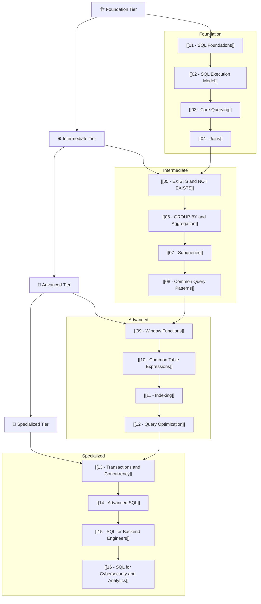
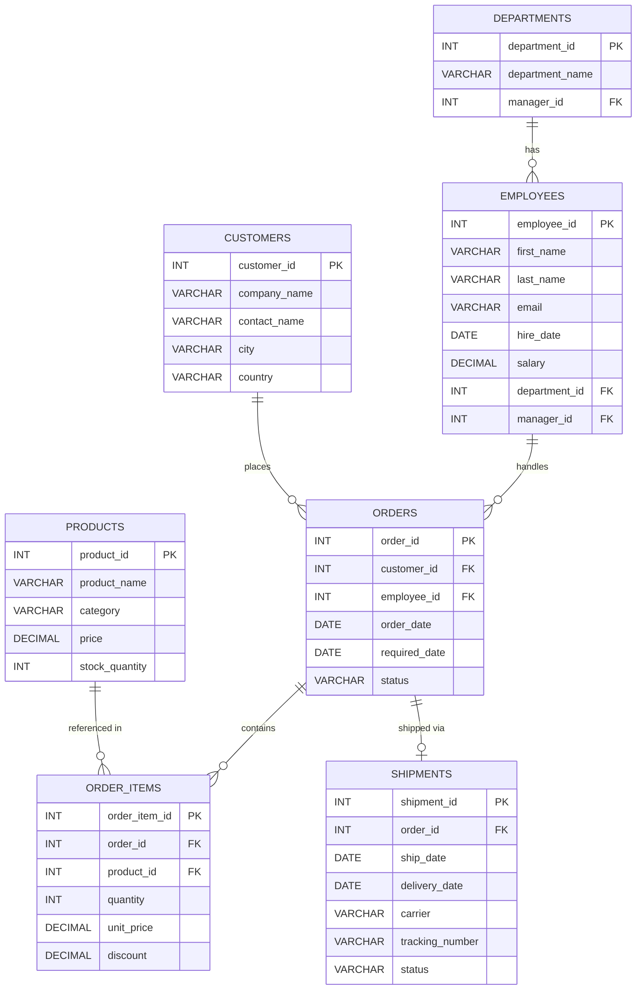

# SQL Mastery Roadmap

This is your **Map of Content (MOC)** for the entire SQL learning path — from relational foundations to advanced analytics and backend engineering patterns. Every note in this vault is designed to build **relational thinking**, not just syntax memorization.

> [!tip] How to Use These Notes
> 1. **Follow the tiers in order** — each note builds on concepts from the previous ones.
> 2. **Run every query yourself** — use the sample dataset below to practice.
> 3. **Read the "How beginners think vs How strong engineers think" sections** — these rewire your mental model.
> 4. **Do the practice exercises** before reading the answers.
> 5. **Revisit the execution model** ([[02 - SQL Execution Model]]) whenever a query confuses you — most confusion comes from not understanding execution order.

---

## Visual Roadmap



---

## Learning Tiers

### 🏗️ Tier 1 — Foundation

Build the mental model. Understand what SQL *is*, how queries execute, and how tables relate.

| Note | Focus | Key Outcome |
|------|-------|-------------|
| [[01 - SQL Foundations]] | Relational model, tables, keys, normalization | Think in relations, not spreadsheets |
| [[02 - SQL Execution Model]] | Logical execution order of a query | Understand WHY queries behave the way they do |
| [[03 - Core Querying]] | SELECT, WHERE, ORDER BY, LIMIT, operators | Write correct filtered queries confidently |
| [[04 - Joins]] | INNER, LEFT, RIGHT, FULL, CROSS, self-joins | Combine data from multiple tables fluently |

### ⚙️ Tier 2 — Intermediate

Move from writing queries that work to writing queries that are *correct and intentional*.

| Note | Focus | Key Outcome |
|------|-------|-------------|
| [[05 - EXISTS and NOT EXISTS]] | Semi-joins, anti-joins, correlated subqueries | Solve "find rows that have/don't have" problems |
| [[06 - GROUP BY and Aggregation]] | Aggregation, HAVING, grouping sets | Summarize data correctly, avoid grouping traps |
| [[07 - Subqueries]] | Scalar, row, table subqueries; correlated vs uncorrelated | Compose complex queries from simple parts |
| [[08 - Common Query Patterns]] | Top-N, deduplication, gaps, running totals | Recognize and apply reusable SQL patterns |

### 🚀 Tier 3 — Advanced

Write production-grade queries. Understand performance. Reason about the optimizer.

| Note | Focus | Key Outcome |
|------|-------|-------------|
| [[09 - Window Functions]] | ROW_NUMBER, RANK, LAG, LEAD, frames | Analyze data without collapsing rows |
| [[10 - Common Table Expressions]] | WITH clauses, recursive CTEs | Write readable, composable, hierarchical queries |
| [[11 - Indexing]] | B-tree, covering indexes, composite indexes | Design indexes that make queries fast |
| [[12 - Query Optimization]] | EXPLAIN plans, query rewriting, anti-patterns | Diagnose and fix slow queries |

### 🎯 Tier 4 — Specialized

Apply SQL in real-world engineering contexts.

| Note | Focus | Key Outcome |
|------|-------|-------------|
| [[13 - Transactions and Concurrency]] | ACID, isolation levels, locking, deadlocks | Write safe concurrent data access code |
| [[14 - Advanced SQL]] | Pivoting, JSON, recursive queries, lateral joins | Handle complex data transformations |
| [[15 - SQL for Backend Engineers]] | ORM pitfalls, migrations, connection pooling | Use SQL effectively in Spring Boot / microservices |
| [[16 - SQL for Cybersecurity and Analytics]] | Audit trails, anomaly detection, log analysis | Query for security events and analytical insights |

---

## Key Principles for SQL Mastery

> [!tip] The Five Pillars
> 1. **Think in sets, not loops.** SQL operates on entire result sets at once. Every query transforms one set into another.
> 2. **Understand execution order.** Written order ≠ execution order. Most mistakes come from not knowing when each clause runs.
> 3. **Relational thinking is the foundation.** Tables are relations. Joins are set operations. NULLs are unknowns, not values.
> 4. **The optimizer is your partner.** You declare WHAT you want; the database decides HOW to get it. Write for correctness first, then optimize.
> 5. **Every query tells a story.** Read a query as a sentence: "FROM these tables, WHERE this condition holds, GROUP BY these attributes, SELECT these columns."

---

## Sample Dataset

All notes in this vault use a consistent **logistics/supply chain dataset**. Set this up once and use it everywhere.

### Entity-Relationship Diagram



### DDL — Create Tables

```sql
-- Departments
CREATE TABLE departments (
    department_id   INT PRIMARY KEY AUTO_INCREMENT,
    department_name VARCHAR(100) NOT NULL,
    manager_id      INT NULL
);

-- Employees
CREATE TABLE employees (
    employee_id   INT PRIMARY KEY AUTO_INCREMENT,
    first_name    VARCHAR(50)  NOT NULL,
    last_name     VARCHAR(50)  NOT NULL,
    email         VARCHAR(100) NOT NULL UNIQUE,
    hire_date     DATE         NOT NULL,
    salary        DECIMAL(10,2) NOT NULL,
    department_id INT,
    manager_id    INT,
    FOREIGN KEY (department_id) REFERENCES departments(department_id),
    FOREIGN KEY (manager_id)    REFERENCES employees(employee_id)
);

-- Add FK from departments.manager_id -> employees after employees exists
ALTER TABLE departments
    ADD FOREIGN KEY (manager_id) REFERENCES employees(employee_id);

-- Customers
CREATE TABLE customers (
    customer_id  INT PRIMARY KEY AUTO_INCREMENT,
    company_name VARCHAR(100) NOT NULL,
    contact_name VARCHAR(100),
    city         VARCHAR(50),
    country      VARCHAR(50)
);

-- Products
CREATE TABLE products (
    product_id     INT PRIMARY KEY AUTO_INCREMENT,
    product_name   VARCHAR(100) NOT NULL,
    category       VARCHAR(50),
    price          DECIMAL(10,2) NOT NULL,
    stock_quantity INT DEFAULT 0
);

-- Orders
CREATE TABLE orders (
    order_id      INT PRIMARY KEY AUTO_INCREMENT,
    customer_id   INT NOT NULL,
    employee_id   INT,
    order_date    DATE NOT NULL,
    required_date DATE,
    status        VARCHAR(20) DEFAULT 'pending',
    FOREIGN KEY (customer_id) REFERENCES customers(customer_id),
    FOREIGN KEY (employee_id) REFERENCES employees(employee_id)
);

-- Order Items
CREATE TABLE order_items (
    order_item_id INT PRIMARY KEY AUTO_INCREMENT,
    order_id      INT NOT NULL,
    product_id    INT NOT NULL,
    quantity      INT NOT NULL,
    unit_price    DECIMAL(10,2) NOT NULL,
    discount      DECIMAL(4,2) DEFAULT 0.00,
    FOREIGN KEY (order_id)   REFERENCES orders(order_id),
    FOREIGN KEY (product_id) REFERENCES products(product_id)
);

-- Shipments
CREATE TABLE shipments (
    shipment_id     INT PRIMARY KEY AUTO_INCREMENT,
    order_id        INT NOT NULL,
    ship_date       DATE,
    delivery_date   DATE,
    carrier         VARCHAR(50),
    tracking_number VARCHAR(100),
    status          VARCHAR(20) DEFAULT 'pending',
    FOREIGN KEY (order_id) REFERENCES orders(order_id)
);
```

### DML — Sample Data

```sql
-- Departments
INSERT INTO departments (department_id, department_name) VALUES
(1, 'Logistics'),
(2, 'Sales'),
(3, 'Engineering'),
(4, 'Customer Support'),
(5, 'Finance');

-- Employees
INSERT INTO employees (employee_id, first_name, last_name, email, hire_date, salary, department_id, manager_id) VALUES
(1,  'Arjun',   'Mehta',     'arjun.mehta@acme.com',     '2019-03-15', 95000.00, 1, NULL),
(2,  'Priya',   'Sharma',    'priya.sharma@acme.com',    '2020-07-01', 88000.00, 2, 1),
(3,  'Ravi',    'Kumar',     'ravi.kumar@acme.com',      '2018-11-20', 72000.00, 1, 1),
(4,  'Sneha',   'Patel',     'sneha.patel@acme.com',     '2021-01-10', 67000.00, 3, 1),
(5,  'Vikram',  'Singh',     'vikram.singh@acme.com',    '2022-06-05', 55000.00, 2, 2),
(6,  'Ananya',  'Reddy',     'ananya.reddy@acme.com',    '2023-02-14', 60000.00, 4, 2),
(7,  'Karthik', 'Nair',      'karthik.nair@acme.com',    '2020-09-30', 78000.00, 3, 4),
(8,  'Deepa',   'Iyer',      'deepa.iyer@acme.com',      '2017-05-22', 92000.00, 5, NULL),
(9,  'Suresh',  'Menon',     'suresh.menon@acme.com',    '2021-08-15', 63000.00, 1, 3),
(10, 'Fatima',  'Khan',      'fatima.khan@acme.com',     '2024-01-08', 52000.00, 4, 6);

-- Update department managers
UPDATE departments SET manager_id = 1  WHERE department_id = 1;
UPDATE departments SET manager_id = 2  WHERE department_id = 2;
UPDATE departments SET manager_id = 4  WHERE department_id = 3;
UPDATE departments SET manager_id = 6  WHERE department_id = 4;
UPDATE departments SET manager_id = 8  WHERE department_id = 5;

-- Customers
INSERT INTO customers (customer_id, company_name, contact_name, city, country) VALUES
(1, 'Global Freight Co.',   'James Wilson',   'Sydney',    'Australia'),
(2, 'Pacific Logistics',    'Maria Chen',     'Singapore', 'Singapore'),
(3, 'EuroTransport GmbH',   'Hans Mueller',   'Berlin',    'Germany'),
(4, 'Cargo Express Ltd.',   'Sarah Brown',    'London',    'UK'),
(5, 'TransAsia Shipping',   'Wei Zhang',      'Shanghai',  'China');

-- Products
INSERT INTO products (product_id, product_name, category, price, stock_quantity) VALUES
(1, 'Pallet Jack',           'Equipment',   350.00, 120),
(2, 'Barcode Scanner',       'Electronics', 185.00, 300),
(3, 'Shipping Container 20ft', 'Containers', 2500.00, 45),
(4, 'Stretch Wrap Roll',     'Packaging',   28.00,  800),
(5, 'Cargo Net',             'Equipment',   95.00,  200),
(6, 'RFID Tag Pack (100)',   'Electronics', 75.00,  500),
(7, 'Insulated Container',   'Containers',  1800.00, 30),
(8, 'Packing Tape (6-pack)', 'Packaging',   12.50,  1500),
(9, 'Forklift Battery',      'Equipment',   680.00,  60),
(10,'Warehouse Label Printer','Electronics', 420.00, 85);

-- Orders
INSERT INTO orders (order_id, customer_id, employee_id, order_date, required_date, status) VALUES
(1, 1, 2, '2025-01-10', '2025-01-20', 'delivered'),
(2, 2, 5, '2025-01-15', '2025-01-25', 'delivered'),
(3, 3, 2, '2025-02-01', '2025-02-10', 'shipped'),
(4, 1, 3, '2025-02-14', '2025-02-28', 'processing'),
(5, 4, 5, '2025-03-01', '2025-03-10', 'pending'),
(6, 5, 9, '2025-03-05', '2025-03-15', 'pending'),
(7, 2, 2, '2025-03-10', '2025-03-20', 'cancelled'),
(8, 3, 3, '2025-03-15', '2025-03-25', 'processing');

-- Order Items
INSERT INTO order_items (order_item_id, order_id, product_id, quantity, unit_price, discount) VALUES
(1,  1, 1, 5,  350.00, 0.00),
(2,  1, 4, 20, 28.00,  0.10),
(3,  2, 2, 10, 185.00, 0.05),
(4,  2, 6, 15, 75.00,  0.00),
(5,  3, 3, 2,  2500.00,0.00),
(6,  3, 5, 8,  95.00,  0.00),
(7,  4, 7, 3,  1800.00,0.15),
(8,  4, 9, 2,  680.00, 0.00),
(9,  5, 8, 50, 12.50,  0.20),
(10, 5, 10,4,  420.00, 0.00),
(11, 6, 1, 10, 350.00, 0.10),
(12, 6, 2, 5,  185.00, 0.00),
(13, 7, 4, 30, 28.00,  0.00),
(14, 8, 3, 1,  2500.00,0.05),
(15, 8, 6, 20, 75.00,  0.00);

-- Shipments
INSERT INTO shipments (shipment_id, order_id, ship_date, delivery_date, carrier, tracking_number, status) VALUES
(1, 1, '2025-01-12', '2025-01-18', 'DHL',    'DHL-20250112-001', 'delivered'),
(2, 2, '2025-01-17', '2025-01-23', 'FedEx',  'FDX-20250117-002', 'delivered'),
(3, 3, '2025-02-03', NULL,         'Maersk', 'MSK-20250203-003', 'in_transit'),
(4, 4, NULL,         NULL,         NULL,      NULL,               'pending');
```

---

## Navigation

> [!question] Where should I start?
> If you're brand new to SQL, start with [[01 - SQL Foundations]]. If you already know basic SELECT/WHERE, jump to [[02 - SQL Execution Model]] — it will transform how you think about every query you write.

---

*Last updated: 2026-05-08*
