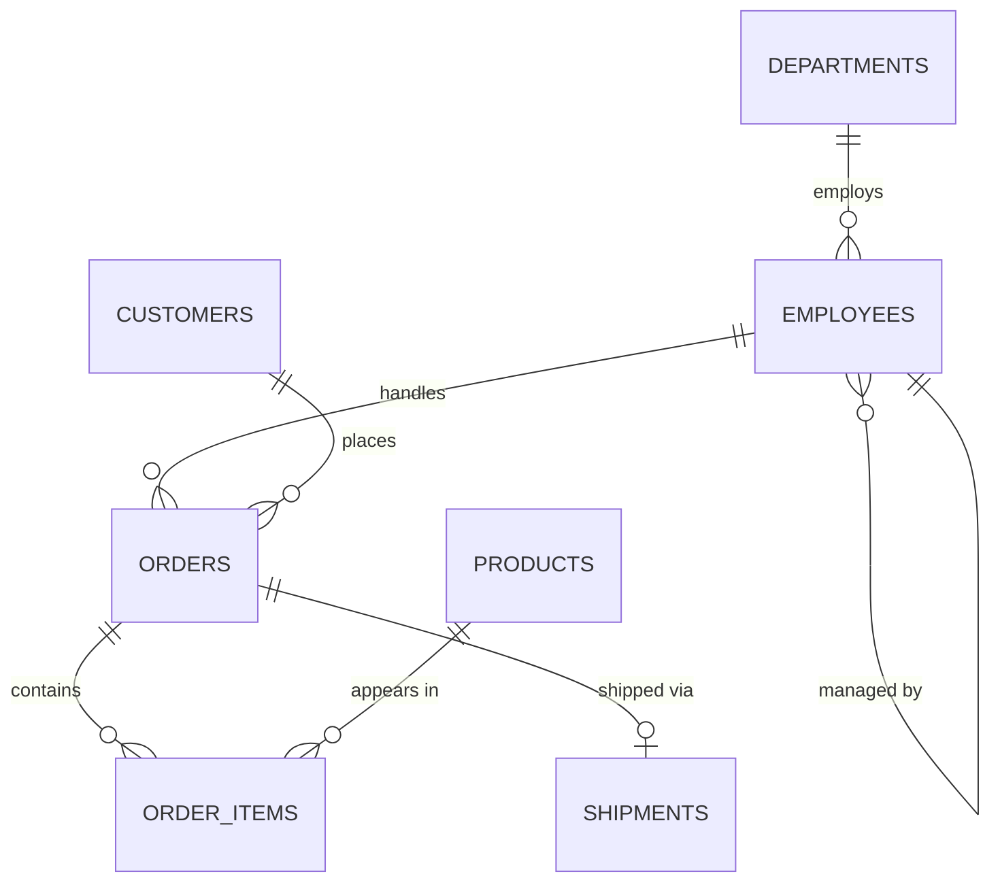
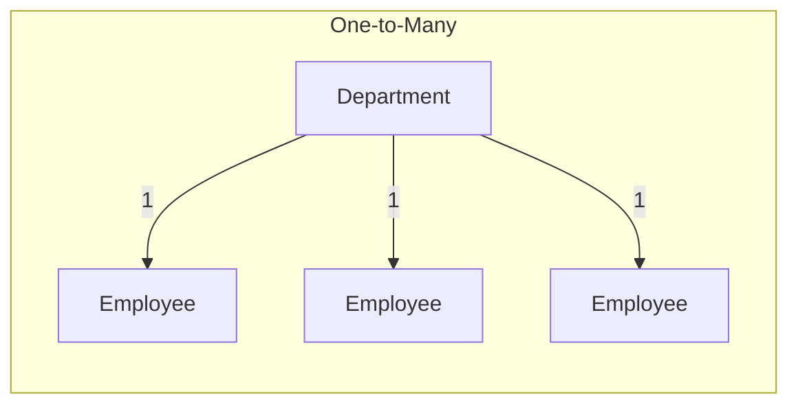

# SQL Foundations

> [!tip] Core Insight
> SQL is not a programming language for telling the computer *how* to get data. It is a **declarative language** for describing *what* data you want. The database engine decides *how* to get it. This single distinction separates people who *use* SQL from people who *think* in SQL.

**Prerequisites:** None — this is the starting point.
**Next:** [[02 - SQL Execution Model]]
**Related:** [[00 - SQL Roadmap]] · [[03 - Core Querying]] · [[04 - Joins]]

---

## 1. What SQL Is

### 1.1 History and Purpose

SQL (Structured Query Language) was born in the 1970s at IBM, based on Edgar F. Codd's **relational model** of data. It was designed to let non-programmers query data using something close to English. Despite being over 50 years old, SQL remains the **most widely used language for data access** — used in MySQL, PostgreSQL, Oracle, SQL Server, SQLite, and every major database system.

> [!example] The key idea
> Instead of writing step-by-step instructions to find data, you **describe the result you want**, and the database figures out the fastest way to produce it.

### 1.2 Declarative vs Imperative

| Aspect | Imperative (Java, Python) | Declarative (SQL) |
|--------|--------------------------|-------------------|
| You specify | Step-by-step instructions | The desired result |
| Control flow | Loops, conditionals, variables | Clauses (SELECT, WHERE, JOIN) |
| Execution plan | You decide | The optimizer decides |
| Mental model | "Do this, then that" | "Give me rows that match this" |
| Parallelism | You manage it | The engine manages it |

**Imperative approach (pseudocode):**
```
results = []
for each row in employees:
    if row.salary > 70000:
        if row.department_id == 1:
            results.append(row.first_name, row.salary)
sort results by salary descending
return first 5 of results
```

**Declarative approach (SQL):**
```sql
SELECT first_name, salary
FROM   employees
WHERE  salary > 70000
  AND  department_id = 1
ORDER BY salary DESC
LIMIT 5;
```

Both produce the same result. The SQL version says **what** you want; the engine decides whether to use an index, a table scan, which join algorithm, etc.

### 1.3 SQL as a Language for Sets

> [!warning] Critical Mental Shift
> SQL does not process rows one at a time. Every SQL operation takes a **set** of rows as input and produces a **set** of rows as output. If you find yourself thinking "for each row, do X," you're thinking imperatively — stop and rethink in terms of sets.

**Mental model:** Imagine SQL as asking questions to a librarian who organizes books relationally. You don't tell the librarian *which shelves to walk to* — you describe the books you want ("all books by authors who published after 2020 in the Science section"), and the librarian uses their knowledge of the library's organization to fetch them efficiently.

---

## 2. Relational Databases

### 2.1 What "Relational" Really Means

The word "relational" does **not** mean "tables are related to each other" (though they often are). It comes from the mathematical concept of a **relation** — an unordered set of tuples.

| Math Term | Database Term | Meaning |
|-----------|--------------|---------|
| Relation | Table | A set of tuples with the same attributes |
| Tuple | Row / Record | A single entry — one set of values |
| Attribute | Column / Field | A named property with a domain (type) |
| Domain | Data Type | The set of allowed values for an attribute |
| Cardinality | Row Count | Number of tuples in a relation |
| Degree / Arity | Column Count | Number of attributes in a relation |

> [!tip] Why This Matters
> Because a table is a **set**, rows have no inherent order. There is no "first row" or "last row" unless you explicitly use `ORDER BY`. Many bugs come from assuming row order.

### 2.2 Codd's Relational Model — Key Rules

1. **All data is represented as relations (tables).**
2. **Every row is unique** — guaranteed by a primary key.
3. **Column order is irrelevant** — you reference columns by name, not position.
4. **Row order is irrelevant** — the result set is unordered unless you say otherwise.
5. **Each cell contains a single atomic value** (1NF).

### 2.3 Sample Database ER Diagram



> See [[00 - SQL Roadmap]] for the full DDL and sample data.

---

## 3. Tables, Rows, Columns

### 3.1 Schema Definition

A **schema** is the blueprint of your database — it defines what tables exist, what columns each table has, what types those columns use, and what constraints apply.

```sql
CREATE TABLE employees (
    employee_id   INT PRIMARY KEY AUTO_INCREMENT,
    first_name    VARCHAR(50)    NOT NULL,
    last_name     VARCHAR(50)    NOT NULL,
    email         VARCHAR(100)   NOT NULL UNIQUE,
    hire_date     DATE           NOT NULL,
    salary        DECIMAL(10,2)  NOT NULL,
    department_id INT,
    manager_id    INT
);
```

Every element has a purpose:
- `INT PRIMARY KEY AUTO_INCREMENT` — surrogate key, auto-assigned
- `VARCHAR(50) NOT NULL` — variable-length string up to 50 chars, required
- `DECIMAL(10,2)` — exact numeric with 10 total digits, 2 after decimal
- `UNIQUE` — no two rows can share this value

### 3.2 Common Data Types

| Type | Use Case | Example | Notes |
|------|----------|---------|-------|
| `INT` | Whole numbers, IDs, quantities | `employee_id INT` | 4 bytes, range ±2.1 billion |
| `BIGINT` | Very large numbers | `tracking_id BIGINT` | 8 bytes, use for high-volume systems |
| `SMALLINT` | Small-range integers | `rating SMALLINT` | 2 bytes, range ±32,767 |
| `DECIMAL(p,s)` | Exact decimal — money, prices | `salary DECIMAL(10,2)` | Never use FLOAT for money |
| `FLOAT` / `DOUBLE` | Approximate decimal — science | `temperature FLOAT` | Has rounding errors — not for money |
| `VARCHAR(n)` | Variable-length strings | `first_name VARCHAR(50)` | Stores only actual length + overhead |
| `CHAR(n)` | Fixed-length strings | `country_code CHAR(2)` | Always uses `n` bytes, padded with spaces |
| `TEXT` | Large text blocks | `description TEXT` | No length limit (DB-specific max) |
| `DATE` | Calendar dates | `hire_date DATE` | `'2025-03-15'` — no time component |
| `TIMESTAMP` | Date + time | `created_at TIMESTAMP` | `'2025-03-15 14:30:00'` |
| `DATETIME` | Date + time (no timezone) | `event_time DATETIME` | Like TIMESTAMP but no TZ conversion |
| `BOOLEAN` | True/false | `is_active BOOLEAN` | Stored as TINYINT(1) in MySQL |
| `ENUM` | Fixed set of values | `status ENUM('active','inactive')` | DB-specific; avoid in portable schemas |

> [!danger] Never Use FLOAT for Money
> `FLOAT` and `DOUBLE` use binary floating-point representation and introduce rounding errors. Use `DECIMAL(10,2)` for prices, salaries, totals — any value where exact decimal precision matters.

### 3.3 NULL — The Unknown Value

`NULL` means **unknown** or **not applicable**. It is not zero. It is not an empty string. It is not false.

```sql
-- These are all DIFFERENT:
salary = 0        -- "This person earns zero dollars"
salary = ''       -- Invalid for a numeric column
salary IS NULL    -- "We don't know this person's salary"
```

**NULL behaves differently from values in every operation:**

| Expression | Result | Why |
|-----------|--------|-----|
| `NULL = NULL` | `NULL` (not TRUE) | You can't know if two unknowns are equal |
| `NULL <> 1` | `NULL` (not TRUE) | Comparing anything to unknown yields unknown |
| `NULL + 5` | `NULL` | Any arithmetic with unknown yields unknown |
| `NULL AND TRUE` | `NULL` | "Unknown AND true" is still unknown |
| `NULL OR TRUE` | `TRUE` | "Unknown OR true" — at least one is true |
| `NULL AND FALSE` | `FALSE` | "Unknown AND false" — false regardless |

> [!warning] The #1 NULL Mistake
> Writing `WHERE column = NULL` instead of `WHERE column IS NULL`. The first **always** evaluates to `NULL` (which is falsy), so it returns zero rows — silently.

---

## 4. Primary Keys

### 4.1 What Is a Primary Key?

A primary key is a column (or combination of columns) that **uniquely identifies every row** in a table. It enforces two constraints:
1. **Uniqueness** — no two rows can share the same PK value
2. **NOT NULL** — the PK value must always be present

### 4.2 Natural vs Surrogate Keys

| Aspect | Natural Key | Surrogate Key |
|--------|-------------|---------------|
| Definition | A real-world attribute (email, SSN, ISBN) | A system-generated ID (auto-increment, UUID) |
| Stability | Can change (people change emails) | Never changes |
| Readability | Meaningful to humans | Meaningless number |
| Size | Often larger (strings) | Usually compact (INT, BIGINT) |
| Recommended | Rarely as PK | Almost always as PK |

> [!tip] Best Practice
> Use a **surrogate key** (`INT AUTO_INCREMENT` or `BIGINT`) as the primary key. Add a `UNIQUE` constraint on the natural key (e.g., `email`) for business-level uniqueness.

```sql
CREATE TABLE employees (
    employee_id INT PRIMARY KEY AUTO_INCREMENT,  -- surrogate PK
    email       VARCHAR(100) NOT NULL UNIQUE      -- natural key as unique constraint
);
```

### 4.3 Composite Primary Keys

A composite PK uses **two or more columns together** as the key. Common in junction tables.

```sql
CREATE TABLE order_items (
    order_id   INT NOT NULL,
    product_id INT NOT NULL,
    quantity   INT NOT NULL,
    PRIMARY KEY (order_id, product_id)  -- composite PK
);
```

The combination `(order_id, product_id)` must be unique — the same product can't appear twice in the same order.

### 4.4 Common Mistakes

> [!danger] Anti-Patterns
> - **Using business data as PK** — company names change, email addresses change, phone numbers change. These break FK references.
> - **Not having a PK at all** — makes updates and deletes ambiguous. How do you update "that one specific row"?
> - **Using composite keys with 4+ columns** — makes JOINs verbose and error-prone. Use a surrogate key instead.

---

## 5. Foreign Keys

### 5.1 Referential Integrity

A **foreign key** is a column in one table that references the primary key of another table. It guarantees that every value in the FK column actually exists in the referenced table.

```sql
CREATE TABLE employees (
    employee_id   INT PRIMARY KEY AUTO_INCREMENT,
    department_id INT,
    FOREIGN KEY (department_id) REFERENCES departments(department_id)
);
```

This means: every `department_id` in `employees` must either be `NULL` or match an existing `department_id` in `departments`.

### 5.2 FK Actions

| Action | On DELETE of parent | On UPDATE of parent |
|--------|-------------------|-------------------|
| `RESTRICT` | Block the delete | Block the update |
| `CASCADE` | Delete child rows too | Update child FK values |
| `SET NULL` | Set child FK to NULL | Set child FK to NULL |
| `NO ACTION` | Same as RESTRICT (checked at statement end) | Same as RESTRICT |
| `SET DEFAULT` | Set child FK to default value | Set child FK to default value |

```sql
FOREIGN KEY (department_id)
    REFERENCES departments(department_id)
    ON DELETE SET NULL
    ON UPDATE CASCADE
```

> [!warning] Use CASCADE with Caution
> `ON DELETE CASCADE` can silently delete thousands of rows. In a logistics system, deleting an order could cascade-delete all its items and shipment records. Consider `RESTRICT` and handling deletions explicitly in application code.

### 5.3 Relationship Types



| Relationship | Example | How It's Modeled |
|-------------|---------|-----------------|
| **One-to-Many** | Department → Employees | FK in the "many" table pointing to the "one" table |
| **One-to-One** | Employee → Parking Spot | FK with UNIQUE constraint, or shared PK |
| **Many-to-Many** | Orders ↔ Products | Junction table (`order_items`) with two FKs |

### 5.4 Many-to-Many: Junction Tables

You cannot directly model many-to-many in a relational database. You use a **junction table** (also called bridge table, associative table, or join table):

```sql
-- An order can have many products; a product can appear in many orders.
CREATE TABLE order_items (
    order_item_id INT PRIMARY KEY AUTO_INCREMENT,
    order_id      INT NOT NULL,
    product_id    INT NOT NULL,
    quantity      INT NOT NULL,
    unit_price    DECIMAL(10,2) NOT NULL,
    FOREIGN KEY (order_id)   REFERENCES orders(order_id),
    FOREIGN KEY (product_id) REFERENCES products(product_id)
);
```

---

## 6. Normalization

Normalization is the process of structuring a database to **reduce redundancy** and **prevent anomalies** (insertion, update, and deletion anomalies).

### 6.1 Normal Forms Explained

#### First Normal Form (1NF)

> Each column contains **atomic** (indivisible) values. No repeating groups.

❌ **Violates 1NF:**

| order_id | products |
|----------|----------|
| 1 | Pallet Jack, Stretch Wrap, Cargo Net |

✅ **Satisfies 1NF:**

| order_id | product |
|----------|---------|
| 1 | Pallet Jack |
| 1 | Stretch Wrap |
| 1 | Cargo Net |

#### Second Normal Form (2NF)

> Must be in 1NF + every non-key column depends on the **whole** primary key (no partial dependencies). Only relevant for composite keys.

❌ **Violates 2NF:** (composite PK: `order_id, product_id`)

| order_id | product_id | quantity | **product_name** |
|----------|-----------|----------|-----------------|
| 1 | 1 | 5 | Pallet Jack |

`product_name` depends only on `product_id`, not on the full key `(order_id, product_id)`. Move it to the `products` table.

#### Third Normal Form (3NF)

> Must be in 2NF + no **transitive dependencies** — non-key columns must depend directly on the PK, not on other non-key columns.

❌ **Violates 3NF:**

| employee_id | department_id | **department_name** |
|------------|--------------|-------------------|
| 1 | 1 | Logistics |

`department_name` depends on `department_id`, which depends on `employee_id`. This is a transitive dependency. Move `department_name` to the `departments` table.

### 6.2 Summary Table

| Normal Form | Rule | Fixes |
|------------|------|-------|
| **1NF** | Atomic values, no repeating groups | Split multi-value cells into rows |
| **2NF** | No partial dependencies on composite key | Move partially-dependent columns to their own table |
| **3NF** | No transitive dependencies | Move transitively-dependent columns to their own table |

### 6.3 When to Denormalize

> [!tip] Normalization vs. Denormalization
> **Normalize for correctness first.** Denormalize only when you have measured a performance problem and denormalization is the proven solution.

Common denormalization patterns:

| Pattern | Example | Tradeoff |
|---------|---------|----------|
| **Caching computed values** | `order_total` column on `orders` | Faster reads, risk of stale data |
| **Materialized views** | Pre-joined, pre-aggregated tables | Fast analytics, storage cost |
| **Embedding lookup data** | Storing `country_name` alongside `country_code` | Avoids a JOIN, risks inconsistency |
| **Read replicas** | Separate denormalized DB for reporting | Complex sync, eventual consistency |

---

## 7. Relational Thinking vs Procedural Thinking

### How Beginners Think

> "I need to go through each employee, check their department, look up the department name, and if they earn more than $70K, add them to my result list."

```python
results = []
for emp in employees:
    for dept in departments:
        if emp.department_id == dept.department_id:
            if emp.salary > 70000:
                results.append({
                    'name': emp.first_name,
                    'dept': dept.department_name,
                    'salary': emp.salary
                })
```

### How Strong SQL Engineers Think

> "I want the set of (name, department, salary) tuples where the employee's salary exceeds 70,000, with each employee joined to their department."

```sql
SELECT e.first_name,
       d.department_name,
       e.salary
FROM   employees e
JOIN   departments d ON e.department_id = d.department_id
WHERE  e.salary > 70000;
```

### Side-by-Side Comparison

| Aspect | Procedural Thinker | Set-Based Thinker |
|--------|-------------------|-------------------|
| Unit of work | One row | Entire result set |
| Control flow | Loops, conditions | Clauses, predicates |
| "Find employees with no orders" | Loop employees, loop orders, check match, flag | `LEFT JOIN orders ... WHERE orders.order_id IS NULL` or `NOT EXISTS` |
| Performance model | O(n×m) nested loops | The optimizer chooses (hash join, merge join, index scan) |
| Debugging | Print each row | Examine the result set, check intermediate steps |

> [!tip] The Mental Shift
> Stop asking: "How do I iterate through the rows to find what I want?"
> Start asking: "What properties describe the result set I want?"

---

## 8. Declarative Querying

### You Say WHAT, Not HOW

When you write:

```sql
SELECT e.first_name, e.salary
FROM   employees e
JOIN   departments d ON e.department_id = d.department_id
WHERE  d.department_name = 'Logistics'
ORDER BY e.salary DESC;
```

You are declaring:
- **WHAT tables** to draw from (`employees`, `departments`)
- **WHAT condition** joins them (`ON e.department_id = d.department_id`)
- **WHAT filter** applies (`WHERE department_name = 'Logistics'`)
- **WHAT columns** you want (`first_name, salary`)
- **WHAT order** to present them (`ORDER BY salary DESC`)

You are **not** specifying:
- Which index to use
- Whether to do a hash join or nested-loop join
- Whether to scan the table or use an index
- How to allocate memory for sorting

The **query optimizer** makes all those decisions, often better than a human would.

### Why This Matters for Performance

Because SQL is declarative, the optimizer can:
- Reorder JOINs for efficiency
- Choose different join algorithms (hash, merge, nested-loop)
- Use indexes you didn't explicitly reference
- Parallelize operations
- Cache and reuse subquery results

> [!warning] Don't Fight the Optimizer
> Writing SQL that tries to "help" the optimizer (e.g., forcing index hints, breaking queries into procedural steps using cursors) usually makes performance *worse*. Write clear, correct, set-based SQL and let the optimizer do its job.

---

## 9. Sample Schema

> [!tip] Shared Dataset
> The complete CREATE TABLE and INSERT statements are in [[00 - SQL Roadmap]]. All notes in this vault use the same tables: `employees`, `departments`, `customers`, `products`, `orders`, `order_items`, `shipments`.

Quick reference for column names used throughout this vault:

| Table | Key Columns |
|-------|-------------|
| `employees` | `employee_id`, `first_name`, `last_name`, `email`, `hire_date`, `salary`, `department_id`, `manager_id` |
| `departments` | `department_id`, `department_name`, `manager_id` |
| `customers` | `customer_id`, `company_name`, `contact_name`, `city`, `country` |
| `products` | `product_id`, `product_name`, `category`, `price`, `stock_quantity` |
| `orders` | `order_id`, `customer_id`, `employee_id`, `order_date`, `required_date`, `status` |
| `order_items` | `order_item_id`, `order_id`, `product_id`, `quantity`, `unit_price`, `discount` |
| `shipments` | `shipment_id`, `order_id`, `ship_date`, `delivery_date`, `carrier`, `tracking_number`, `status` |

---

## 10. Practice Exercises

> [!question] Exercise 1
> Write a `CREATE TABLE` statement for a `warehouses` table with: `warehouse_id` (PK, auto-increment), `warehouse_name` (required, max 100 chars), `city` (max 50 chars), `capacity` (integer), `is_active` (boolean, default true).

> [!question] Exercise 2
> Given the `employees` table, what data type would you use for a new `phone_number` column? Why not `INT`?

> [!question] Exercise 3
> The `orders` table has a `status` column stored as `VARCHAR(20)`. What are the pros and cons of changing it to `ENUM('pending','processing','shipped','delivered','cancelled')`?

> [!question] Exercise 4
> Draw the relationship between `orders`, `order_items`, and `products`. What type of relationship exists between `orders` and `products`? How does `order_items` resolve it?

> [!question] Exercise 5
> A colleague stores shipment data like this:
>
> | shipment_id | items |
> |------------|-------|
> | 1 | Pallet Jack x5, Stretch Wrap x20 |
>
> What normal form does this violate? How would you fix it?

> [!question] Exercise 6
> Why does `SELECT * FROM employees WHERE manager_id = NULL` return zero rows even though some employees have no manager?

> [!question] Exercise 7
> A table has a composite primary key `(order_id, product_id)`. A developer adds a column `product_name` to this table. What normal form does this violate, and why?

---

## 11. Interview Questions

> [!question] Q1: What is the difference between `DELETE`, `TRUNCATE`, and `DROP`?

> [!question] Q2: Explain the difference between `CHAR(50)` and `VARCHAR(50)`. When would you choose each?

> [!question] Q3: Why should you never use `FLOAT` to store monetary values?

> [!question] Q4: What is referential integrity and how do foreign keys enforce it?

> [!question] Q5: Explain 1NF, 2NF, and 3NF with one example each.

> [!question] Q6: What is the difference between a natural key and a surrogate key? Which do you prefer as a primary key and why?

> [!question] Q7: Can a foreign key reference a non-primary key column? Under what conditions?

> [!question] Q8: What happens when you try to insert a row with a `department_id` that doesn't exist in the `departments` table, and there's a FK constraint?

---

## 12. Common Mistakes

| Mistake | Consequence | Fix |
|---------|-------------|-----|
| Using `FLOAT` for money | Rounding errors ($99.99 becomes $99.98999...) | Use `DECIMAL(10,2)` |
| `WHERE col = NULL` | Always returns 0 rows | Use `WHERE col IS NULL` |
| No primary key | Can't uniquely identify rows for updates/deletes | Always add a PK |
| Business data as PK | FK references break when business data changes | Use surrogate key + UNIQUE constraint |
| Storing comma-separated values | Violates 1NF, impossible to JOIN/filter | Use a junction table |
| Not defining FK constraints | Orphaned rows, data inconsistency | Add FK constraints |
| Over-normalizing | Too many JOINs for simple queries | Denormalize strategically with measurement |
| Choosing `TEXT` for everything | Wastes storage, can't index efficiently | Use `VARCHAR(n)` with appropriate length |

---

## Navigation

| Previous | Up | Next |
|----------|-----|------|
| — | [[00 - SQL Roadmap]] | [[02 - SQL Execution Model]] |

---

*Last updated: 2026-05-08*
