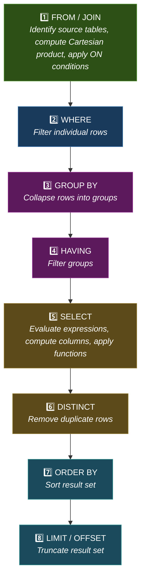
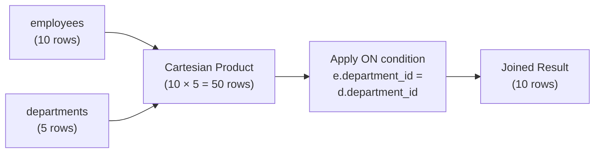
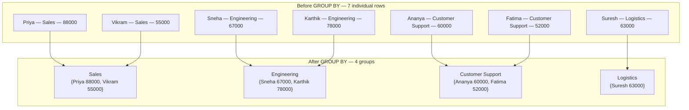
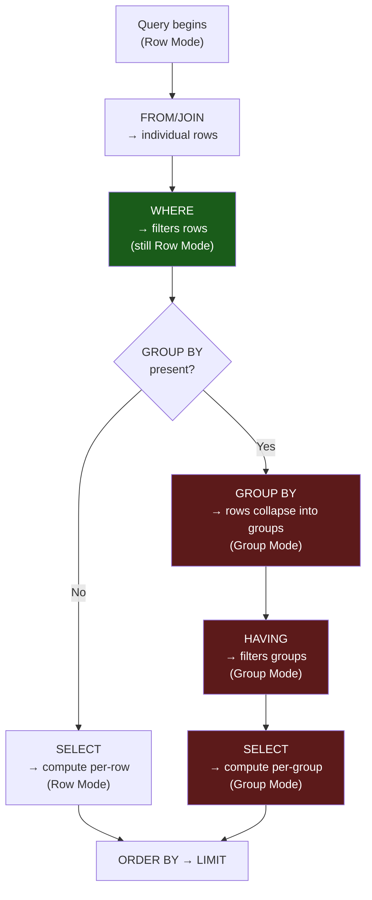

# SQL Execution Model

> [!danger] This Is the Most Important Note in the Vault
> More than 80% of SQL confusion — "why can't I use my alias here?", "why does HAVING exist?", "why does this aggregate fail?" — comes from **not knowing the logical execution order**. Master this page and every other topic becomes easier.

**Prerequisites:** [[01 - SQL Foundations]]
**Next:** [[03 - Core Querying]]
**Related:** [[06 - GROUP BY and Aggregation]] · [[09 - Window Functions]]

---

## 1. Logical Query Execution Order

### 1.1 Written Order vs Execution Order

When you **write** a SQL query, you write the clauses in this order:

```sql
SELECT   ...
FROM     ...
JOIN     ...
WHERE    ...
GROUP BY ...
HAVING   ...
ORDER BY ...
LIMIT    ...
```

But the database **executes** them in a completely different order:



### 1.2 Comparison Table

| Step | Written Position | Execution Position | What It Does |
|------|-----------------|-------------------|-------------|
| `SELECT` | 1st | **5th** | Evaluates expressions, creates output columns |
| `FROM` | 2nd | **1st** | Identifies source tables |
| `JOIN` | 3rd | **1st** (with FROM) | Combines tables using join conditions |
| `WHERE` | 4th | **2nd** | Filters individual rows |
| `GROUP BY` | 5th | **3rd** | Groups rows by specified columns |
| `HAVING` | 6th | **4th** | Filters groups |
| `ORDER BY` | 7th | **7th** | Sorts the result |
| `LIMIT` | 8th | **8th** | Restricts the number of rows returned |

> [!tip] Memory Aid
> **F**rom → **W**here → **G**roup → **H**aving → **S**elect → **D**istinct → **O**rder → **L**imit
>
> **"Fierce Warriors Grind Hard; Steel Daggers Only Last."**

---

## 2. Each Step Explained In Detail

We'll use this query as our running example and trace through every step:

```sql
SELECT   d.department_name,
         COUNT(*) AS employee_count,
         AVG(e.salary) AS avg_salary
FROM     employees e
JOIN     departments d ON e.department_id = d.department_id
WHERE    e.hire_date >= '2020-01-01'
GROUP BY d.department_name
HAVING   COUNT(*) >= 2
ORDER BY avg_salary DESC
LIMIT    3;
```

---

### Step 1: FROM and JOIN

**What happens:** The database identifies the source tables and combines them. For a JOIN, it conceptually computes the Cartesian product of all rows, then applies the ON condition to filter matched pairs.

**Conceptually:**



**After this step** — every employee is matched with their department:

| employee_id | first_name | salary | hire_date | department_id | department_name |
|------------|-----------|--------|-----------|--------------|----------------|
| 1 | Arjun | 95000 | 2019-03-15 | 1 | Logistics |
| 2 | Priya | 88000 | 2020-07-01 | 2 | Sales |
| 3 | Ravi | 72000 | 2018-11-20 | 1 | Logistics |
| 4 | Sneha | 67000 | 2021-01-10 | 3 | Engineering |
| 5 | Vikram | 55000 | 2022-06-05 | 2 | Sales |
| 6 | Ananya | 60000 | 2023-02-14 | 4 | Customer Support |
| 7 | Karthik | 78000 | 2020-09-30 | 3 | Engineering |
| 8 | Deepa | 92000 | 2017-05-22 | 5 | Finance |
| 9 | Suresh | 63000 | 2021-08-15 | 1 | Logistics |
| 10 | Fatima | 52000 | 2024-01-08 | 4 | Customer Support |

**What you CAN reference:** Any column from any table in the FROM/JOIN clause.
**What you CANNOT reference:** Column aliases defined in SELECT (SELECT hasn't run yet).

---

### Step 2: WHERE

**What happens:** The database filters individual rows that don't satisfy the condition. This is a **row-level** operation — it examines each row independently.

**Condition:** `WHERE e.hire_date >= '2020-01-01'`

**Rows removed:** Arjun (2019), Ravi (2018), Deepa (2017)

**After this step:**

| employee_id | first_name | salary | hire_date | department_name |
|------------|-----------|--------|-----------|----------------|
| 2 | Priya | 88000 | 2020-07-01 | Sales |
| 4 | Sneha | 67000 | 2021-01-10 | Engineering |
| 5 | Vikram | 55000 | 2022-06-05 | Sales |
| 6 | Ananya | 60000 | 2023-02-14 | Customer Support |
| 7 | Karthik | 78000 | 2020-09-30 | Engineering |
| 9 | Suresh | 63000 | 2021-08-15 | Logistics |
| 10 | Fatima | 52000 | 2024-01-08 | Customer Support |

**What you CAN reference:** Any column from FROM/JOIN tables.
**What you CANNOT reference:** Column aliases from SELECT, aggregate functions, window functions.

> [!danger] Why You Can't Use Aggregates in WHERE
> `WHERE` runs **before** `GROUP BY`. At this point, rows haven't been grouped yet — there are no groups to aggregate. Writing `WHERE COUNT(*) > 2` makes no logical sense here because `COUNT(*)` doesn't exist yet.

---

### Step 3: GROUP BY

**What happens:** Rows are **collapsed** (folded) into groups based on the specified column(s). After this step, you are no longer in "row mode" — you are in "group mode." Each row in the result now represents a **group**, not an individual employee.

**Grouping:** `GROUP BY d.department_name`



**After this step** — the intermediate result conceptually looks like:

| department_name | (grouped rows) |
|----------------|----------------|
| Sales | {Priya 88000, Vikram 55000} |
| Engineering | {Sneha 67000, Karthik 78000} |
| Customer Support | {Ananya 60000, Fatima 52000} |
| Logistics | {Suresh 63000} |

**What you CAN reference:** Columns in the GROUP BY list, and aggregate functions (`COUNT`, `SUM`, `AVG`, `MAX`, `MIN`).
**What you CANNOT reference:** Individual row columns NOT in GROUP BY (which employee's `first_name` would you show for a group of 2 employees?).

> [!warning] The GROUP BY Contract
> Once you GROUP BY, every column in SELECT must either:
> 1. Be in the GROUP BY clause, OR
> 2. Be inside an aggregate function
>
> There is no exception. If you write `SELECT first_name, department_name, COUNT(*)` with `GROUP BY department_name`, `first_name` violates this contract — the database has multiple first names per group and doesn't know which one to pick.

---

### Step 4: HAVING

**What happens:** Filters **groups** (not individual rows). This is where you use aggregate conditions.

**Condition:** `HAVING COUNT(*) >= 2`

**Groups removed:** Logistics (only 1 employee)

**After this step:**

| department_name | employee_count | avg_salary |
|----------------|---------------|------------|
| Sales | 2 | 71500.00 |
| Engineering | 2 | 72500.00 |
| Customer Support | 2 | 56000.00 |

**What you CAN reference:** Columns in GROUP BY, aggregate functions.
**What you CANNOT reference:** Column aliases from SELECT (SELECT hasn't run yet in most databases).

> [!tip] WHERE vs HAVING
> | | WHERE | HAVING |
> |---|-------|--------|
> | **When it runs** | Step 2 (before GROUP BY) | Step 4 (after GROUP BY) |
> | **Operates on** | Individual rows | Groups |
> | **Can use aggregates?** | ❌ No | ✅ Yes |
> | **Can use non-aggregated columns?** | ✅ Yes | Only if in GROUP BY |
> | **Performance** | Filters early → fewer rows to group | Filters late → groups already computed |
>
> **Rule of thumb:** Filter as early as possible. If a condition doesn't involve an aggregate, put it in WHERE, not HAVING.

---

### Step 5: SELECT

**What happens:** The database evaluates expressions, computes new columns, applies aliases, and builds the output columns. This is where column aliases like `AS employee_count` are **created**.

**Output after this step:**

| department_name | employee_count | avg_salary |
|----------------|---------------|------------|
| Sales | 2 | 71500.00 |
| Engineering | 2 | 72500.00 |
| Customer Support | 2 | 56000.00 |

**What you CAN reference:** Everything from the previous steps.
**Key insight:** Column aliases are **born** here. They did not exist during WHERE, GROUP BY, or HAVING.

> [!danger] This Is Why You Can't Use Aliases in WHERE
> ```sql
> -- ❌ FAILS: "avg_salary" doesn't exist during WHERE
> SELECT AVG(salary) AS avg_salary
> FROM   employees
> WHERE  avg_salary > 60000;
>
> -- ✅ CORRECT: Use HAVING (which runs after GROUP BY)
> SELECT   department_id, AVG(salary) AS avg_salary
> FROM     employees
> GROUP BY department_id
> HAVING   AVG(salary) > 60000;
> ```

---

### Step 6: DISTINCT

**What happens:** If `SELECT DISTINCT` is used, duplicate rows in the result set are removed. This runs **after** SELECT has computed all the output columns.

Our example doesn't use DISTINCT, so this step is a no-op.

**Important:** DISTINCT compares **entire rows**, not individual columns.

```sql
-- These two rows are NOT duplicates (different salary):
-- ('Sales', 2, 71500.00)
-- ('Sales', 2, 72000.00)    ← different avg_salary = different row
```

---

### Step 7: ORDER BY

**What happens:** The result set is sorted according to the specified column(s) and direction(s).

**Sorting:** `ORDER BY avg_salary DESC`

**After this step:**

| department_name | employee_count | avg_salary |
|----------------|---------------|------------|
| Engineering | 2 | 72500.00 |
| Sales | 2 | 71500.00 |
| Customer Support | 2 | 56000.00 |

**What you CAN reference:** Column aliases from SELECT (because SELECT has already run!), columns from source tables, expressions, ordinal positions.

> [!tip] This Is Why You CAN Use Aliases in ORDER BY
> ORDER BY runs **after** SELECT, so aliases like `avg_salary` exist and can be referenced. This is the exception that confuses people — aliases work in ORDER BY but not in WHERE.

---

### Step 8: LIMIT / OFFSET

**What happens:** The sorted result is truncated to return only the specified number of rows.

**Condition:** `LIMIT 3`

Since we only have 3 rows, the result is unchanged. If we had `LIMIT 2`:

| department_name | employee_count | avg_salary |
|----------------|---------------|------------|
| Engineering | 2 | 72500.00 |
| Sales | 2 | 71500.00 |

> [!warning] LIMIT Without ORDER BY
> `LIMIT` without `ORDER BY` returns an **arbitrary** subset of rows. The database makes no guarantee about which rows you'll get. Always pair LIMIT with ORDER BY for deterministic results.

---

## 3. Why Execution Order Matters

### 3.1 Why You Can't Use Column Aliases in WHERE

```sql
-- ❌ WRONG
SELECT salary * 1.1 AS new_salary
FROM   employees
WHERE  new_salary > 80000;
-- Error: "Unknown column 'new_salary' in WHERE clause"
```

**Why:** WHERE runs at step 2; SELECT (where `new_salary` is created) runs at step 5. The alias doesn't exist yet.

**Fix — repeat the expression:**
```sql
SELECT salary * 1.1 AS new_salary
FROM   employees
WHERE  salary * 1.1 > 80000;
```

**Or use a subquery/CTE:**
```sql
WITH salaries AS (
    SELECT *, salary * 1.1 AS new_salary
    FROM employees
)
SELECT * FROM salaries WHERE new_salary > 80000;
```

### 3.2 Why You CAN Use Aliases in ORDER BY

```sql
-- ✅ WORKS
SELECT first_name, salary * 1.1 AS new_salary
FROM   employees
ORDER BY new_salary DESC;
```

**Why:** ORDER BY runs at step 7, after SELECT (step 5) has created the alias.

### 3.3 Why HAVING Exists Separately from WHERE

```sql
-- ❌ WRONG: Can't aggregate in WHERE
SELECT   department_id, COUNT(*) AS cnt
FROM     employees
WHERE    COUNT(*) > 2        -- COUNT(*) doesn't exist here
GROUP BY department_id;

-- ✅ CORRECT: Aggregate in HAVING
SELECT   department_id, COUNT(*) AS cnt
FROM     employees
GROUP BY department_id
HAVING   COUNT(*) > 2;
```

**Why:** WHERE filters rows *before* grouping. HAVING filters groups *after* grouping. They serve fundamentally different purposes.

### 3.4 Why Aggregate Functions Can't Go in WHERE

Aggregates like `COUNT()`, `SUM()`, `AVG()` compute values **across groups**. At step 2 (WHERE), groups don't exist yet — the data is still individual rows.

### 3.5 Why Window Functions Can't Go in WHERE or HAVING

```sql
-- ❌ WRONG
SELECT *
FROM   employees
WHERE  ROW_NUMBER() OVER (ORDER BY salary DESC) <= 5;
```

Window functions execute conceptually as part of SELECT (step 5). Neither WHERE (step 2) nor HAVING (step 4) can reference them. Use a subquery or CTE:

```sql
-- ✅ CORRECT
WITH ranked AS (
    SELECT *, ROW_NUMBER() OVER (ORDER BY salary DESC) AS rn
    FROM employees
)
SELECT * FROM ranked WHERE rn <= 5;
```

---

## 4. Row-Level vs Group-Level Operations

### 4.1 The Two Modes of SQL



### 4.2 Mental Model: GROUP BY as "Folding"

Think of GROUP BY as folding a stack of papers:
- **Before folding:** Each paper is one row. You can read any column of any paper.
- **The fold:** You stack papers by department. Each stack is now one group.
- **After folding:** You can see the label on each stack (the GROUP BY column), and you can *count* the papers in each stack or *sum* a value across papers — but you can't read an individual paper without unfolding.

```
Before:          After GROUP BY department:
┌──────────┐     ┌──────────────────┐
│ Arjun    │     │ Logistics (3)    │ ← COUNT = 3
│ Logistics│     │ ┌──┐┌──┐┌──┐    │   SUM = 230000
│ 95000    │     │ │A ││R ││S │    │   AVG = 76666.67
├──────────┤     │ └──┘└──┘└──┘    │
│ Ravi     │     └──────────────────┘
│ Logistics│     ┌──────────────────┐
│ 72000    │     │ Sales (2)        │ ← COUNT = 2
├──────────┤     │ ┌──┐┌──┐        │   SUM = 143000
│ Priya    │     │ │P ││V │        │   AVG = 71500
│ Sales    │     │ └──┘└──┘        │
├──────────┤     └──────────────────┘
│ Vikram   │     ... and so on
│ Sales    │
├──────────┤
│ Suresh   │
│ Logistics│
└──────────┘
```

### 4.3 What Happens to Non-Aggregated Columns

```sql
-- ❌ WRONG: Which first_name should it pick for the group?
SELECT   department_id, first_name, COUNT(*)
FROM     employees
GROUP BY department_id;
-- MySQL (non-strict): Picks an ARBITRARY first_name — DANGEROUS
-- PostgreSQL/SQL Server: Error — "must appear in GROUP BY or aggregate"

-- ✅ CORRECT options:
-- Option A: Add to GROUP BY (one row per employee-department pair)
SELECT   department_id, first_name, COUNT(*)
FROM     employees
GROUP BY department_id, first_name;

-- Option B: Aggregate it
SELECT   department_id, GROUP_CONCAT(first_name) AS names, COUNT(*)
FROM     employees
GROUP BY department_id;

-- Option C: Remove it from SELECT
SELECT   department_id, COUNT(*)
FROM     employees
GROUP BY department_id;
```

> [!danger] MySQL's Non-Strict Mode
> MySQL (with `ONLY_FULL_GROUP_BY` disabled) silently allows non-aggregated columns not in GROUP BY. It picks an **arbitrary** value from the group. This is a notorious source of bugs. Always enable `ONLY_FULL_GROUP_BY` in MySQL, or use PostgreSQL/SQL Server which enforce it by default.

---

## 5. Complete Walkthrough: Tracing a Complex Query

Let's trace a different query step by step:

```sql
SELECT   d.department_name,
         MAX(e.salary) AS top_salary,
         COUNT(*) AS headcount
FROM     employees e
JOIN     departments d ON e.department_id = d.department_id
WHERE    e.salary > 50000
GROUP BY d.department_name
HAVING   COUNT(*) > 1
ORDER BY top_salary DESC
LIMIT    2;
```

### Step 1: FROM + JOIN

Join `employees` with `departments` on `department_id`:

| employee_id | first_name | salary | department_name |
|------------|-----------|--------|----------------|
| 1 | Arjun | 95000 | Logistics |
| 2 | Priya | 88000 | Sales |
| 3 | Ravi | 72000 | Logistics |
| 4 | Sneha | 67000 | Engineering |
| 5 | Vikram | 55000 | Sales |
| 6 | Ananya | 60000 | Customer Support |
| 7 | Karthik | 78000 | Engineering |
| 8 | Deepa | 92000 | Finance |
| 9 | Suresh | 63000 | Logistics |
| 10 | Fatima | 52000 | Customer Support |

**Row count: 10**

### Step 2: WHERE `salary > 50000`

Remove Fatima (52000 > 50000 ✅ — wait, 52000 > 50000, so she stays).

Actually all employees have salary > 50000 in our sample data. All 10 rows remain.

**Row count: 10**

### Step 3: GROUP BY `department_name`

| department_name | members |
|----------------|---------|
| Logistics | {Arjun 95000, Ravi 72000, Suresh 63000} |
| Sales | {Priya 88000, Vikram 55000} |
| Engineering | {Sneha 67000, Karthik 78000} |
| Customer Support | {Ananya 60000, Fatima 52000} |
| Finance | {Deepa 92000} |

**Group count: 5**

### Step 4: HAVING `COUNT(*) > 1`

| department_name | COUNT(*) | Passes? |
|----------------|---------|---------|
| Logistics | 3 | ✅ |
| Sales | 2 | ✅ |
| Engineering | 2 | ✅ |
| Customer Support | 2 | ✅ |
| Finance | 1 | ❌ removed |

**Group count: 4**

### Step 5: SELECT

| department_name | top_salary | headcount |
|----------------|-----------|-----------|
| Logistics | 95000 | 3 |
| Sales | 88000 | 2 |
| Engineering | 78000 | 2 |
| Customer Support | 60000 | 2 |

### Step 6: DISTINCT — not used, skip.

### Step 7: ORDER BY `top_salary DESC`

| department_name | top_salary | headcount |
|----------------|-----------|-----------|
| Logistics | 95000 | 3 |
| Sales | 88000 | 2 |
| Engineering | 78000 | 2 |
| Customer Support | 60000 | 2 |

### Step 8: LIMIT 2

| department_name | top_salary | headcount |
|----------------|-----------|-----------|
| **Logistics** | **95000** | **3** |
| **Sales** | **88000** | **2** |

**Final result: 2 rows.** ✅

---

## 6. Common Mistakes

### 6.1 Using Column Aliases in WHERE

```sql
-- ❌ WRONG
SELECT salary * 12 AS annual_salary
FROM   employees
WHERE  annual_salary > 800000;

-- ✅ FIX: Repeat the expression
SELECT salary * 12 AS annual_salary
FROM   employees
WHERE  salary * 12 > 800000;
```

### 6.2 Mixing Row-Level and Group-Level Logic

```sql
-- ❌ WRONG: first_name is row-level but we're in group mode
SELECT   department_id, first_name, AVG(salary)
FROM     employees
GROUP BY department_id;

-- ✅ FIX: Use an aggregate on first_name or add it to GROUP BY
SELECT   department_id, MAX(first_name) AS example_name, AVG(salary)
FROM     employees
GROUP BY department_id;
```

### 6.3 Forgetting SELECT Runs After GROUP BY

```sql
-- ❌ Confused: "Why can't I filter on this computed column?"
SELECT   department_id,
         COUNT(*) AS cnt
FROM     employees
GROUP BY department_id
WHERE    cnt > 2;  -- WHERE runs BEFORE GROUP BY, "cnt" doesn't exist

-- ✅ FIX: Use HAVING
SELECT   department_id,
         COUNT(*) AS cnt
FROM     employees
GROUP BY department_id
HAVING   COUNT(*) > 2;
```

### 6.4 DISTINCT in the Wrong Place

```sql
-- ❌ This applies DISTINCT to the final result, not to department_name alone
SELECT DISTINCT department_id, salary
FROM   employees;
-- Returns rows where the (department_id, salary) PAIR is unique

-- If you want distinct departments only:
SELECT DISTINCT department_id
FROM   employees;
```

### 6.5 LIMIT Without ORDER BY

```sql
-- ❌ UNPREDICTABLE: Which 5 rows will you get?
SELECT * FROM employees LIMIT 5;

-- ✅ DETERMINISTIC: Top 5 by salary
SELECT * FROM employees ORDER BY salary DESC LIMIT 5;
```

### 6.6 Using Window Functions in WHERE

```sql
-- ❌ WRONG: Window functions run during SELECT, not available in WHERE
SELECT employee_id, salary,
       RANK() OVER (ORDER BY salary DESC) AS salary_rank
FROM   employees
WHERE  salary_rank <= 3;

-- ✅ FIX: Use a CTE or subquery
WITH ranked AS (
    SELECT employee_id, salary,
           RANK() OVER (ORDER BY salary DESC) AS salary_rank
    FROM   employees
)
SELECT * FROM ranked WHERE salary_rank <= 3;
```

---

## 7. Quick Reference: What Can Be Referenced Where?

| Clause | Table Columns | Aliases from SELECT | Aggregates | Window Functions |
|--------|:------------:|:------------------:|:----------:|:---------------:|
| **FROM/JOIN** | ✅ (define them) | ❌ | ❌ | ❌ |
| **WHERE** | ✅ | ❌ | ❌ | ❌ |
| **GROUP BY** | ✅ | ❌ (most DBs) | ❌ | ❌ |
| **HAVING** | ✅ (if in GROUP BY) | ❌ (most DBs) | ✅ | ❌ |
| **SELECT** | ✅ | ✅ (being created) | ✅ | ✅ |
| **ORDER BY** | ✅ | ✅ | ✅ | ✅ |
| **LIMIT** | ❌ | ❌ | ❌ | ❌ |

> [!tip] Simplified Rule
> - **WHERE:** Only raw table columns and expressions — no aliases, no aggregates, no window functions.
> - **HAVING:** Raw columns (if in GROUP BY) and aggregates — no aliases, no window functions.
> - **ORDER BY:** Everything — table columns, aliases, aggregates, window functions, ordinal positions.

---

## 8. How Beginners Think vs How Strong Engineers Think

| Scenario | Beginner Thinking | Strong Engineer Thinking |
|----------|-------------------|--------------------------|
| "Filter by aggregate" | "Put COUNT(*) in WHERE" | "Aggregates need GROUP BY first → use HAVING" |
| "Use alias in filter" | "I named it `total`, why can't WHERE see it?" | "WHERE runs before SELECT → alias doesn't exist yet" |
| "Top N per group" | "LIMIT inside GROUP BY?" | "Window function + CTE → filter on row_number" |
| "Why does my query return weird values?" | "The database is broken" | "Check execution order — am I referencing something that doesn't exist at this step?" |
| "Optimize a slow query" | "Add indexes everywhere" | "Trace the execution plan — WHERE filters early, reduce the dataset ASAP" |

---

## 9. Practice Exercises

> [!question] Exercise 1: Predict the Error
> What's wrong with this query?
> ```sql
> SELECT   department_id, AVG(salary) AS avg_sal
> FROM     employees
> WHERE    avg_sal > 60000
> GROUP BY department_id;
> ```
> **Hint:** Think about when `avg_sal` is created vs when WHERE runs.

> [!question] Exercise 2: Fix This Query
> The intent is: "Find departments with more than 2 employees, show only the department name."
> ```sql
> SELECT   d.department_name
> FROM     employees e
> JOIN     departments d ON e.department_id = d.department_id
> WHERE    COUNT(*) > 2
> GROUP BY d.department_name;
> ```

> [!question] Exercise 3: Trace the Execution
> For this query, write out the intermediate result at each step (FROM → WHERE → GROUP BY → HAVING → SELECT → ORDER BY → LIMIT):
> ```sql
> SELECT   category,
>          SUM(price * stock_quantity) AS inventory_value
> FROM     products
> WHERE    stock_quantity > 50
> GROUP BY category
> HAVING   SUM(price * stock_quantity) > 10000
> ORDER BY inventory_value DESC
> LIMIT    2;
> ```

> [!question] Exercise 4: Why Does This Work?
> Explain why this query is valid — specifically, why can `ORDER BY` reference `total`:
> ```sql
> SELECT   product_name,
>          price * stock_quantity AS total
> FROM     products
> ORDER BY total DESC;
> ```

> [!question] Exercise 5: Rewrite Using Execution Order Knowledge
> A developer wrote:
> ```sql
> SELECT   DISTINCT department_id
> FROM     employees
> ORDER BY salary;
> ```
> This fails in PostgreSQL. Why? How do you fix it while preserving the intent?

> [!question] Exercise 6: What's Wrong? (Tricky)
> ```sql
> SELECT   d.department_name,
>          e.first_name,
>          MAX(e.salary) AS top_salary
> FROM     employees e
> JOIN     departments d ON e.department_id = d.department_id
> GROUP BY d.department_name;
> ```
> **Hint:** `first_name` is not aggregated and not in GROUP BY.

> [!question] Exercise 7: Window Function Placement
> Why does this fail? Rewrite it correctly.
> ```sql
> SELECT *
> FROM   orders
> WHERE  ROW_NUMBER() OVER (PARTITION BY customer_id ORDER BY order_date DESC) = 1;
> ```

---

## 10. Interview Questions

> [!question] Q1
> In what order does a SQL database logically process the clauses of a SELECT query?

> [!question] Q2
> Why can you use a column alias in ORDER BY but not in WHERE?

> [!question] Q3
> What is the difference between WHERE and HAVING? When would you use each?

> [!question] Q4
> Can you use a window function in a WHERE clause? If not, how do you work around it?

> [!question] Q5
> A query has both WHERE and HAVING. From a performance perspective, which one is preferable for filtering when possible, and why?

> [!question] Q6
> What does `SELECT DISTINCT a, b FROM t` do — does it deduplicate based on column `a` only, column `b` only, or both?

> [!question] Q7
> Explain what happens when you write `GROUP BY department_id` and include `first_name` in SELECT without aggregating it. How does MySQL handle this differently from PostgreSQL?

---

## Navigation

| Previous | Up | Next |
|----------|-----|------|
| [[01 - SQL Foundations]] | [[00 - SQL Roadmap]] | [[03 - Core Querying]] |

---

*Last updated: 2026-05-08*
