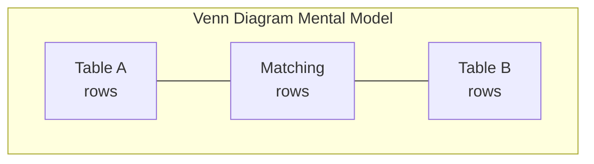
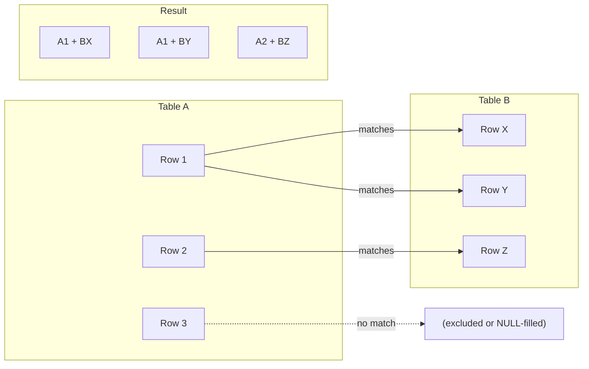
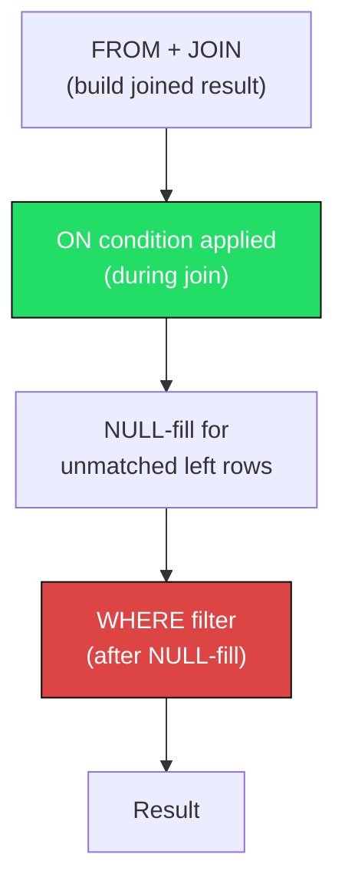
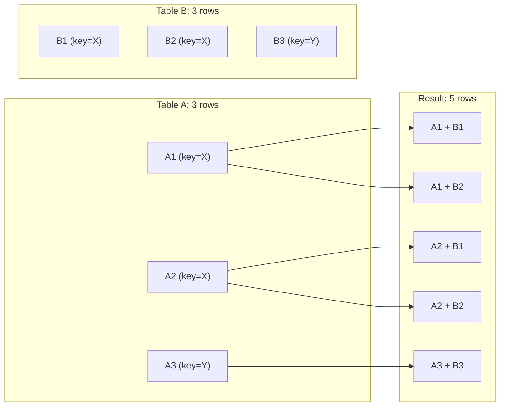
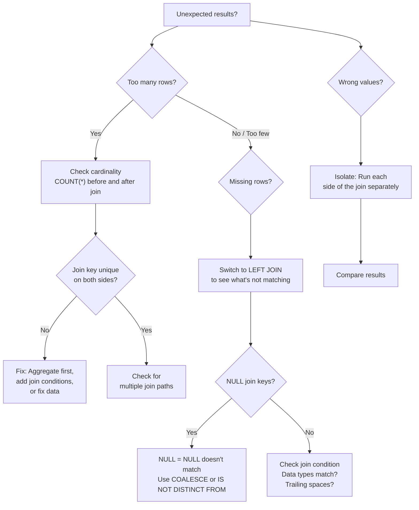

# Joins

> [!tip] Mental Model
> A join is not "combining two tables." A join is: **for each row in one table, find matching rows in the other table based on a condition, and produce a combined row for each match.** The number of output rows depends entirely on **how many matches exist** — this is called **cardinality**, and it is the single most important concept in this note.

Joins are the heart of relational SQL. Data is normalized across tables to avoid redundancy. Joins bring it back together. This note covers every join type, how they affect row counts, how to debug them, and how to write them correctly.

**Prerequisite:** [[01 - SQL Foundations]], [[02 - SQL Execution Model]]

**Sample tables used throughout:**

```sql
-- employees (id, name, department_id, salary, hire_date, manager_id, is_active)
-- departments (id, name, location)
-- orders (id, customer_id, order_date, status, total_amount)
-- order_items (id, order_id, product_id, quantity, unit_price)
-- products (id, name, category, price, stock_quantity)
-- customers (id, name, email, city, created_at)
-- shipments (id, order_id, carrier, tracking_number, shipped_date, delivered_date, status)
```

---

## The Concept of Joining

### What a Join Really Is

Mathematically, a join is a **Cartesian product** (every combination of rows from both tables) followed by a **filter** (the join condition). The database doesn't literally build the full Cartesian product — the optimizer uses efficient algorithms — but the *logical* result is identical.

```
Join = Cartesian Product → Filter by ON condition → (Optional: add NULLs for outer joins)
```

### Why Joins Exist

In a well-designed relational database, data is **normalized** — facts are stored once, in one place. An employee's department name lives in the `departments` table, not repeated in every `employees` row. Joins reconnect these related facts at query time.

### Mental Models

**Venn Diagrams (Common but Limited):**



> [!warning] Venn Diagrams Are Misleading
> Venn diagrams show *membership* (which rows appear) but hide **cardinality** (how many result rows). A single row in Table A matching 5 rows in Table B produces 5 output rows — Venn diagrams make it look like 1.

**Better Mental Model — Row Matching:**



Think of it as: *for each row in A, scan B for matches. Each match produces one output row.* No match? INNER JOIN drops it; LEFT JOIN keeps it with NULLs.

---

## INNER JOIN

### Concept

An `INNER JOIN` returns only the rows where the join condition is satisfied in **both** tables. Rows from either table that have no match in the other are excluded.

### Syntax

```sql
-- Explicit JOIN syntax (preferred — self-documenting)
SELECT e.name, d.name AS department_name
FROM employees e
INNER JOIN departments d ON e.department_id = d.id;

-- Implicit comma join (old-style — avoid)
SELECT e.name, d.name AS department_name
FROM employees e, departments d
WHERE e.department_id = d.id;
```

> [!tip] Always Use Explicit JOIN Syntax
> - Makes join conditions (`ON`) visually separate from filter conditions (`WHERE`)
> - Harder to accidentally create a cross join
> - Easier for the next person to read

### Multiple Join Conditions

```sql
-- Join on composite key
SELECT oi.*, p.name
FROM order_items oi
INNER JOIN products p
    ON oi.product_id = p.id
   AND oi.unit_price = p.price;  -- additional condition
```

### Non-Equality Joins

```sql
-- Find employees who earn more than the average salary in their department
SELECT e.name, e.salary, da.avg_salary
FROM employees e
INNER JOIN (
    SELECT department_id, AVG(salary) AS avg_salary
    FROM employees
    GROUP BY department_id
) da ON e.department_id = da.department_id
    AND e.salary > da.avg_salary;
```

### Example with Sample Data

**employees:**

| id | name | department_id |
|----|------|---------------|
| 1 | Alice | 1 |
| 2 | Bob | 2 |
| 3 | Charlie | NULL |

**departments:**

| id | name |
|----|------|
| 1 | Engineering |
| 2 | Sales |
| 3 | Operations |

```sql
SELECT e.name, d.name AS dept
FROM employees e
INNER JOIN departments d ON e.department_id = d.id;
```

**Result:**

| name | dept |
|------|------|
| Alice | Engineering |
| Bob | Sales |

> Charlie is excluded (department_id is NULL → no match). Operations is excluded (no employees in department 3).

---

## LEFT JOIN (LEFT OUTER JOIN)

### Concept

A `LEFT JOIN` returns **all rows from the left table**, plus matching rows from the right table. If no match exists, the right table's columns are filled with NULL.

```sql
SELECT e.name, d.name AS dept
FROM employees e
LEFT JOIN departments d ON e.department_id = d.id;
```

**Result (same data as above):**

| name | dept |
|------|------|
| Alice | Engineering |
| Bob | Sales |
| Charlie | NULL |

> Charlie is included with NULL for `dept` because LEFT JOIN preserves all left-table rows.

### When to Use LEFT JOIN

- **Optional relationships:** Not every employee must have a department
- **Finding missing data:** Orders without shipments, customers without orders
- **Preserving a "master" list:** Show all products, even those never ordered

### Anti-Join Pattern: LEFT JOIN + WHERE IS NULL

```sql
-- Find customers who have never placed an order
SELECT c.*
FROM customers c
LEFT JOIN orders o ON c.id = o.customer_id
WHERE o.id IS NULL;
```

This is called an **anti-join** — find rows in A with no match in B. It's equivalent to `NOT EXISTS` (see [[05 - EXISTS and NOT EXISTS]]) and often performs the same.

### The Critical WHERE vs ON Mistake for Outer Joins

> [!danger] This Is the #1 Outer Join Bug
> When you add a filter on the **right** table of a LEFT JOIN, putting it in `WHERE` vs `ON` produces completely different results.

**Scenario:** List all customers. For those with orders, only show orders with status = 'D' (Delivered).

```sql
-- ❌ WRONG: Filter in WHERE converts LEFT JOIN to INNER JOIN
SELECT c.name, o.id AS order_id, o.status
FROM customers c
LEFT JOIN orders o ON c.id = o.customer_id
WHERE o.status = 'D';
-- Customers without delivered orders are EXCLUDED because:
-- o.status is NULL for non-matching rows, and NULL = 'D' → UNKNOWN → row excluded
```

```sql
-- ✅ CORRECT: Filter in ON preserves LEFT JOIN behavior
SELECT c.name, o.id AS order_id, o.status
FROM customers c
LEFT JOIN orders o ON c.id = o.customer_id
                  AND o.status = 'D';
-- Customers without delivered orders still appear, with NULL for order columns
```

**Why this happens:**



- `ON` is evaluated **during** the join, before NULL-fill
- `WHERE` is evaluated **after** the join and NULL-fill
- So `WHERE o.status = 'D'` filters out the NULL-filled rows, destroying the LEFT JOIN

> [!tip] Rule of Thumb
> **Conditions on the preserved table (left) go in WHERE.**
> **Conditions on the optional table (right) go in ON.**

---

## RIGHT JOIN

### Concept

A `RIGHT JOIN` is the mirror of LEFT JOIN — all rows from the **right** table are preserved, and the left table is NULL-filled where there's no match.

```sql
SELECT e.name, d.name AS dept
FROM employees e
RIGHT JOIN departments d ON e.department_id = d.id;
```

**Result:**

| name | dept |
|------|------|
| Alice | Engineering |
| Bob | Sales |
| NULL | Operations |

### Why RIGHT JOIN Is Rarely Used

You can always rewrite a RIGHT JOIN as a LEFT JOIN by swapping the table order:

```sql
-- These are identical:
SELECT e.name, d.name FROM employees e RIGHT JOIN departments d ON e.department_id = d.id;
SELECT e.name, d.name FROM departments d LEFT JOIN employees e ON e.department_id = d.id;
```

> [!tip] Convention
> Most teams standardize on LEFT JOIN exclusively. This makes join direction consistent and easier to read. Use RIGHT JOIN only if it makes a specific query significantly clearer.

---

## FULL OUTER JOIN

### Concept

A `FULL OUTER JOIN` returns all rows from **both** tables. Where there's no match, the missing side is NULL-filled.

```sql
SELECT e.name, d.name AS dept
FROM employees e
FULL OUTER JOIN departments d ON e.department_id = d.id;
```

**Result:**

| name | dept |
|------|------|
| Alice | Engineering |
| Bob | Sales |
| Charlie | NULL |
| NULL | Operations |

### Use Cases

- **Data reconciliation:** Comparing two datasets to find mismatches
- **Finding orphans on both sides:** Items in A not in B AND items in B not in A

```sql
-- Find all mismatches between a staging table and production table
SELECT s.id AS staging_id, p.id AS prod_id,
       COALESCE(s.amount, 0) AS staging_amount,
       COALESCE(p.amount, 0) AS prod_amount
FROM staging_orders s
FULL OUTER JOIN production_orders p ON s.id = p.id
WHERE s.id IS NULL OR p.id IS NULL
   OR s.amount != p.amount;
```

### Emulating FULL OUTER JOIN in MySQL

MySQL doesn't support `FULL OUTER JOIN`. Emulate with `UNION`:

```sql
-- MySQL: emulate FULL OUTER JOIN
SELECT e.name, d.name AS dept
FROM employees e
LEFT JOIN departments d ON e.department_id = d.id

UNION

SELECT e.name, d.name AS dept
FROM employees e
RIGHT JOIN departments d ON e.department_id = d.id;
```

> [!warning] Use `UNION` (not `UNION ALL`) to eliminate duplicates from the intersection, or use `UNION ALL` with a `WHERE ... IS NULL` filter on the second query to avoid re-scanning the matched rows.

---

## CROSS JOIN

### Concept

A `CROSS JOIN` produces the **Cartesian product** — every row from the left table combined with every row from the right table. No `ON` clause.

```sql
-- If employees has 100 rows and departments has 5 rows, result has 500 rows
SELECT e.name, d.name AS dept
FROM employees e
CROSS JOIN departments d;
```

### Legitimate Use Cases

**Generating date ranges:**
```sql
-- All combinations of months and years
SELECT m.month_num, y.year_num
FROM (SELECT 1 AS month_num UNION ALL SELECT 2 UNION ALL ... SELECT 12) m
CROSS JOIN (SELECT 2023 AS year_num UNION ALL SELECT 2024 UNION ALL SELECT 2025) y;
```

**Generating a matrix for reporting:**
```sql
-- All product-region combinations (even those with no sales)
SELECT p.name, r.region_name
FROM products p
CROSS JOIN regions r;
```

### Accidental Cross Joins

> [!danger] Forgetting the ON Clause = Accidental Cross Join
> ```sql
> -- ❌ Missing ON clause — this is a cross join, not an inner join!
> SELECT e.name, d.name
> FROM employees e
> JOIN departments d;  -- WHERE IS THE ON CLAUSE?
>
> -- ❌ Old-style comma syntax without WHERE is also a cross join
> SELECT e.name, d.name
> FROM employees e, departments d;
> ```
> If your tables have 10,000 and 5,000 rows, this returns **50 million** rows.

### Performance Warning

> [!warning] Row Explosion
> Cross join result size = `|Left| × |Right|`. Even medium tables can produce enormous results. Always be deliberate about cross joins.

---

## SELF JOIN

### Concept

A self join joins a table **to itself**. This is useful for comparing rows within the same table or traversing hierarchical relationships.

### Employee–Manager Relationship

```sql
-- Find each employee's manager name
SELECT e.name AS employee,
       m.name AS manager
FROM employees e
LEFT JOIN employees m ON e.manager_id = m.id;
```

**Result:**

| employee | manager |
|----------|---------|
| Alice | David |
| Bob | David |
| David | NULL |

### Employees Who Earn More Than Their Manager

```sql
SELECT e.name AS employee,
       e.salary AS emp_salary,
       m.name AS manager,
       m.salary AS mgr_salary
FROM employees e
INNER JOIN employees m ON e.manager_id = m.id
WHERE e.salary > m.salary;
```

### Comparing Rows (Finding Duplicates)

```sql
-- Find customers with the same email (potential duplicates)
SELECT a.id AS id_1, b.id AS id_2, a.email
FROM customers a
INNER JOIN customers b ON a.email = b.email
WHERE a.id < b.id;  -- avoid (A,B) and (B,A) duplicates + self-match
```

> [!tip] `a.id < b.id` is the standard trick to avoid duplicate pairs and self-matches in self joins.

### Table Aliases Are Mandatory

```sql
-- ❌ Error: ambiguous table reference
SELECT name FROM employees JOIN employees ON ...;

-- ✅ Must use aliases
SELECT e.name, m.name
FROM employees e
JOIN employees m ON e.manager_id = m.id;
```

---

## Join Cardinality

> [!danger] This Is the Most Important Section in This Note
> If you understand cardinality, you understand joins. If you don't, you will produce wrong results and not know why.

### What Is Cardinality?

**Cardinality** describes the relationship between the rows of two tables:
- **One-to-One (1:1):** Each row in A matches at most one row in B
- **One-to-Many (1:N):** Each row in A matches zero or more rows in B
- **Many-to-Many (M:N):** Multiple rows in A match multiple rows in B

### One-to-One Joins

```sql
-- Each employee has exactly one department (assuming department_id is NOT NULL and unique per employee)
SELECT e.name, d.name
FROM employees e
JOIN departments d ON e.department_id = d.id;
-- Result rows = employee rows (no duplication)
```

### One-to-Many Joins (Row Duplication!)

```sql
-- Each order has MANY order items
SELECT o.id AS order_id, o.total_amount, oi.product_id, oi.quantity
FROM orders o
JOIN order_items oi ON o.id = oi.order_id;
-- If order #1 has 3 items, order #1 appears 3 times in the result!
```

> [!warning] Row Duplication in One-to-Many
> When you join `orders` (1) to `order_items` (N), each order row is **duplicated** once per matching order item. If you then `SUM(o.total_amount)`, you'll get an inflated total because `total_amount` is counted once per item, not once per order.

```sql
-- ❌ BAD: total_amount is duplicated per order item, SUM is inflated
SELECT SUM(o.total_amount) AS wrong_total
FROM orders o
JOIN order_items oi ON o.id = oi.order_id;

-- ✅ GOOD: aggregate at the right level
SELECT SUM(total_amount) AS correct_total
FROM orders;
```

### Many-to-Many Joins (Row Explosion!)



For key=X: 2 rows in A × 2 rows in B = **4** result rows. This is a many-to-many explosion.

### Cardinality Impact Table

| Left Rows with Key | Right Rows with Key | Result Rows for That Key |
|--------------------:|--------------------:|-------------------------:|
| 1 | 1 | 1 |
| 1 | 5 | 5 |
| 3 | 1 | 3 |
| 3 | 5 | **15** |
| 100 | 100 | **10,000** |

### How to Think About It

> [!question] How Beginners Think About Joins
> - "A join just combines two tables side by side"
> - "The result should have the same number of rows as my main table"
> - "I'll just add DISTINCT if I get duplicates"
> - "More joins = more data"

> [!tip] How Strong SQL Engineers Think About Joins
> - "What is the **cardinality** of this join? 1:1, 1:N, or M:N?"
> - "Will this join **multiply** my rows? If so, I need to aggregate at the right level"
> - "I check `COUNT(*)` before and after joining to verify my assumption"
> - "If I see unexpected duplicates, the join key is not unique on one side — I need to investigate"
> - "DISTINCT is a band-aid, not a fix. The root cause is wrong cardinality"

---

## Duplicate Row Explosions

### Why They Happen

Duplicates in the join result occur when the **join key is not unique** on one or both sides:

```sql
-- If orders has duplicate order_ids (data quality issue):
-- orders: (1, 'A'), (1, 'B')   ← duplicate order_id=1
-- order_items: (10, 1), (11, 1)  ← two items for order_id=1
-- JOIN produces: 2 × 2 = 4 rows instead of expected 2
```

### How to Detect Them

```sql
-- Step 1: Count rows in source table
SELECT COUNT(*) FROM orders;       -- e.g., 1000

-- Step 2: Count rows after join
SELECT COUNT(*)
FROM orders o
JOIN order_items oi ON o.id = oi.order_id;  -- e.g., 3500 (expected if 1:N)

-- Step 3: Check if join key is unique
SELECT order_id, COUNT(*) AS cnt
FROM order_items
GROUP BY order_id
HAVING COUNT(*) > 1;  -- shows which orders have multiple items

-- Step 4: Check for unexpected duplicates on the "one" side
SELECT id, COUNT(*) AS cnt
FROM orders
GROUP BY id
HAVING COUNT(*) > 1;  -- should return 0 rows if id is truly unique
```

### How to Fix Them

**Option 1 — Fix the join condition:**
```sql
-- Maybe you need an additional join predicate
SELECT * FROM table_a a
JOIN table_b b ON a.id = b.a_id AND a.version = b.version;
```

**Option 2 — Aggregate before joining:**
```sql
-- Aggregate the many-side first, then join
SELECT o.id, o.total_amount, item_summary.total_qty
FROM orders o
JOIN (
    SELECT order_id, SUM(quantity) AS total_qty
    FROM order_items
    GROUP BY order_id
) item_summary ON o.id = item_summary.order_id;
```

**Option 3 — Use DISTINCT (last resort):**
```sql
-- Only if duplicates are truly irrelevant
SELECT DISTINCT o.id, o.total_amount
FROM orders o
JOIN order_items oi ON o.id = oi.order_id;
```

> [!danger] DISTINCT Is a Band-Aid
> Using DISTINCT to "fix" a join explosion hides the real problem. Always understand *why* there are duplicates first.

---

## Join Debugging Techniques

### Step-by-Step Debugging Approach



### Technique 1: Count Before and After

```sql
-- Before join
SELECT COUNT(*) AS orders_count FROM orders;          -- 1000
SELECT COUNT(*) AS items_count FROM order_items;      -- 3200

-- After join
SELECT COUNT(*) FROM orders o
JOIN order_items oi ON o.id = oi.order_id;            -- 3200 ✅ (1:N is expected)
                                                       -- 5000 ❌ (something is wrong!)
```

### Technique 2: LEFT JOIN to Find Non-Matches

```sql
-- What orders have NO items? (should they?)
SELECT o.*
FROM orders o
LEFT JOIN order_items oi ON o.id = oi.order_id
WHERE oi.id IS NULL;
```

### Technique 3: Check for NULL Join Keys

```sql
-- NULLs in join keys never match!
SELECT COUNT(*) FROM employees WHERE department_id IS NULL;
-- If this returns rows, those employees will be dropped by INNER JOIN
```

### Technique 4: Check Data Types

```sql
-- A common bug: joining VARCHAR to INT
-- '123' = 123 may work in some DBs but cause implicit casting issues
SELECT * FROM orders o
JOIN shipments s ON o.id = s.order_id;
-- If o.id is INT and s.order_id is VARCHAR, you may get wrong results or poor performance
```

### Technique 5: Start Simple, Add Complexity

```sql
-- Start with just the two core tables
SELECT o.id, c.name
FROM orders o
JOIN customers c ON o.customer_id = c.id;
-- Verify this looks right

-- Then add one more join at a time
SELECT o.id, c.name, s.status
FROM orders o
JOIN customers c ON o.customer_id = c.id
LEFT JOIN shipments s ON o.id = s.order_id;
-- Verify again

-- Continue adding joins one at a time
```

---

## Performance Considerations

### Join Algorithms

The database optimizer chooses a join algorithm based on data size, indexes, and statistics:

| Algorithm | How It Works | Best For |
|-----------|-------------|----------|
| **Nested Loop** | For each row in A, scan B for matches | Small tables, indexed join columns |
| **Hash Join** | Build hash table from smaller table, probe with larger | Medium/large tables, no index, equality joins |
| **Merge Join** (Sort-Merge) | Sort both tables on join key, merge | Both sides already sorted or indexed |

### Index on Join Columns

> [!tip] Always Index Join Columns
> The single most impactful performance optimization for joins is having indexes on the columns used in the `ON` clause.
>
> ```sql
> -- These should be indexed:
> -- employees.department_id  (FK → departments.id)
> -- orders.customer_id       (FK → customers.id)
> -- order_items.order_id     (FK → orders.id)
> -- shipments.order_id       (FK → orders.id)
>
> CREATE INDEX idx_employees_dept ON employees(department_id);
> CREATE INDEX idx_orders_customer ON orders(customer_id);
> ```

### Join Order

The optimizer usually reorders joins for efficiency, but you can help by:
- Filtering early (`WHERE` conditions that reduce row counts)
- Joining smaller tables first (some optimizers use this heuristic)
- Using `EXPLAIN` to verify the plan

### Avoid Unnecessary Joins

```sql
-- ❌ Joining departments just to filter, but not selecting from it
SELECT e.name, e.salary
FROM employees e
JOIN departments d ON e.department_id = d.id
WHERE d.location = 'Chennai';

-- ✅ If you only need the filter, a subquery may be cleaner
-- (though the optimizer usually produces the same plan)
SELECT name, salary
FROM employees
WHERE department_id IN (
    SELECT id FROM departments WHERE location = 'Chennai'
);
```

---

## Real-World Examples (Logistics / Supply Chain)

### 1. Join Orders with Shipments and Customers

```sql
-- Full order tracking view
SELECT o.id AS order_id,
       c.name AS customer_name,
       c.city AS customer_city,
       o.order_date,
       o.total_amount,
       s.carrier,
       s.tracking_number,
       s.shipped_date,
       s.delivered_date,
       s.status AS shipment_status
FROM orders o
INNER JOIN customers c ON o.customer_id = c.id
LEFT JOIN shipments s ON o.id = s.order_id
ORDER BY o.order_date DESC;
```

### 2. Find Orders Without Shipments (Not Yet Shipped)

```sql
SELECT o.id, o.order_date, o.status, c.name AS customer_name
FROM orders o
JOIN customers c ON o.customer_id = c.id
LEFT JOIN shipments s ON o.id = s.order_id
WHERE s.id IS NULL
  AND o.status != 'C'  -- exclude cancelled orders
ORDER BY o.order_date ASC;
```

### 3. Find Customers Who Have Never Ordered

```sql
SELECT c.id, c.name, c.email, c.city, c.created_at
FROM customers c
LEFT JOIN orders o ON c.id = o.customer_id
WHERE o.id IS NULL
ORDER BY c.created_at;
```

### 4. Track Shipment Status Across Carriers

```sql
SELECT s.carrier,
       COUNT(*) AS total_shipments,
       COUNT(CASE WHEN s.status = 'In Transit' THEN 1 END) AS in_transit,
       COUNT(CASE WHEN s.status = 'Delivered' THEN 1 END) AS delivered,
       COUNT(CASE WHEN s.status = 'Delayed' THEN 1 END) AS delayed,
       AVG(JULIANDAY(s.delivered_date) - JULIANDAY(s.shipped_date)) AS avg_delivery_days
FROM shipments s
WHERE s.shipped_date >= '2025-01-01'
GROUP BY s.carrier
ORDER BY total_shipments DESC;
```

### 5. Monthly Revenue by Product Category (Multi-Table Join)

```sql
SELECT DATE_TRUNC('month', o.order_date) AS month,
       p.category,
       SUM(oi.quantity * oi.unit_price) AS revenue,
       COUNT(DISTINCT o.id) AS order_count
FROM orders o
JOIN order_items oi ON o.id = oi.order_id
JOIN products p ON oi.product_id = p.id
WHERE o.status != 'C'
  AND o.order_date >= '2025-01-01'
GROUP BY DATE_TRUNC('month', o.order_date), p.category
ORDER BY month, revenue DESC;
```

---

## Bad Query vs Good Query

### Example 1: Accidental Cross Join

```sql
-- ❌ BAD: Missing join condition — produces Cartesian product
SELECT e.name, d.name AS department
FROM employees e, departments d;
-- 100 employees × 5 departments = 500 rows!

-- ✅ GOOD: Explicit join with condition
SELECT e.name, d.name AS department
FROM employees e
INNER JOIN departments d ON e.department_id = d.id;
-- Returns only matching rows
```

### Example 2: WHERE on Outer Join Table

```sql
-- ❌ BAD: WHERE on right table converts LEFT JOIN to INNER JOIN
SELECT c.name, o.id AS order_id, o.status
FROM customers c
LEFT JOIN orders o ON c.id = o.customer_id
WHERE o.status = 'D';
-- Customers without delivered orders are excluded!

-- ✅ GOOD: Filter on right table goes in ON
SELECT c.name, o.id AS order_id, o.status
FROM customers c
LEFT JOIN orders o ON c.id = o.customer_id
                  AND o.status = 'D';
-- All customers appear; only delivered orders are joined
```

### Example 3: Aggregation After One-to-Many Join

```sql
-- ❌ BAD: SUM is inflated because order row is duplicated per item
SELECT o.id,
       o.total_amount,
       SUM(o.total_amount) OVER () AS grand_total  -- WRONG: counts each order N times
FROM orders o
JOIN order_items oi ON o.id = oi.order_id;

-- ✅ GOOD: Aggregate at the correct level
-- Option A: Aggregate items separately
SELECT o.id,
       o.total_amount,
       oi_agg.item_count,
       oi_agg.items_total
FROM orders o
JOIN (
    SELECT order_id,
           COUNT(*) AS item_count,
           SUM(quantity * unit_price) AS items_total
    FROM order_items
    GROUP BY order_id
) oi_agg ON o.id = oi_agg.order_id;

-- Option B: Aggregate the orders table directly if you don't need item detail
SELECT SUM(total_amount) AS grand_total FROM orders;
```

---

## Practice Exercises

### Exercise 1 — Basic INNER JOIN
List each employee's name alongside their department name. Only include employees who belong to a department.

```sql
SELECT e.name AS employee, d.name AS department
FROM employees e
INNER JOIN departments d ON e.department_id = d.id;
```

### Exercise 2 — LEFT JOIN
List ALL departments, along with the count of employees in each. Include departments with zero employees.

```sql
SELECT d.name AS department, COUNT(e.id) AS employee_count
FROM departments d
LEFT JOIN employees e ON d.id = e.department_id
GROUP BY d.name
ORDER BY employee_count DESC;
```

> [!warning] Note: `COUNT(e.id)` counts non-NULL e.id values, so departments with no employees correctly show 0. `COUNT(*)` would show 1 (counting the NULL-filled row). See [[03 - Core Querying]] for NULL in aggregations.

### Exercise 3 — Anti-Join
Find all products that have never been ordered.

```sql
SELECT p.*
FROM products p
LEFT JOIN order_items oi ON p.id = oi.product_id
WHERE oi.id IS NULL;
```

### Exercise 4 — Self Join
List each employee alongside their manager's name. Include employees without a manager (show NULL).

```sql
SELECT e.name AS employee, m.name AS manager
FROM employees e
LEFT JOIN employees m ON e.manager_id = m.id;
```

### Exercise 5 — Multi-Table Join
For each order, show: customer name, order date, total amount, number of items, and shipment status (if shipped).

```sql
SELECT o.id AS order_id,
       c.name AS customer,
       o.order_date,
       o.total_amount,
       COUNT(oi.id) AS item_count,
       s.status AS shipment_status
FROM orders o
JOIN customers c ON o.customer_id = c.id
JOIN order_items oi ON o.id = oi.order_id
LEFT JOIN shipments s ON o.id = s.order_id
GROUP BY o.id, c.name, o.order_date, o.total_amount, s.status
ORDER BY o.order_date DESC;
```

### Exercise 6 — CROSS JOIN
Generate a report template with all combinations of product categories and months (Jan–Dec 2025), even if there are no sales.

```sql
WITH months AS (
    SELECT generate_series(
        '2025-01-01'::date,
        '2025-12-01'::date,
        '1 month'::interval
    ) AS month_start
),
categories AS (
    SELECT DISTINCT category FROM products
)
SELECT c.category, m.month_start
FROM categories c
CROSS JOIN months m
ORDER BY c.category, m.month_start;
```

### Exercise 7 — Cardinality Check
You have this query. How many rows will it return if there are 100 orders and each order has exactly 3 items?

```sql
SELECT o.id, oi.product_id
FROM orders o
JOIN order_items oi ON o.id = oi.order_id;
```

**Answer:** 300 rows. Each order (100) is joined with its 3 items = 100 × 3.

### Exercise 8 — Debug This Join
This query should find employees NOT in Engineering, but it returns zero rows. Why?

```sql
SELECT e.name
FROM employees e
LEFT JOIN departments d ON e.department_id = d.id
WHERE d.name != 'Engineering';
```

**Bug:** Employees with `department_id = NULL` have `d.name = NULL`, and `NULL != 'Engineering'` evaluates to UNKNOWN, so they're excluded. Fix:

```sql
SELECT e.name
FROM employees e
LEFT JOIN departments d ON e.department_id = d.id
WHERE d.name != 'Engineering' OR d.name IS NULL;

-- Or better: use NOT IN or NOT EXISTS
SELECT name FROM employees
WHERE department_id NOT IN (
    SELECT id FROM departments WHERE name = 'Engineering'
)
   OR department_id IS NULL;
```

### Exercise 9 — FULL OUTER JOIN
Compare orders from January 2025 in two systems (staging vs production). Find orders that exist in only one system or have different totals.

```sql
SELECT COALESCE(s.id, p.id) AS order_id,
       s.total_amount AS staging_amount,
       p.total_amount AS prod_amount,
       CASE
           WHEN s.id IS NULL THEN 'Missing in Staging'
           WHEN p.id IS NULL THEN 'Missing in Production'
           ELSE 'Amount Mismatch'
       END AS issue
FROM staging_orders s
FULL OUTER JOIN production_orders p ON s.id = p.id
WHERE s.id IS NULL
   OR p.id IS NULL
   OR s.total_amount != p.total_amount;
```

### Exercise 10 — Row Explosion Detection
You run this query and get 50,000 rows. The `orders` table has 1,000 rows. What's wrong?

```sql
SELECT o.*, s.*
FROM orders o
JOIN shipments s ON o.id = s.order_id;
```

**Investigation:**
```sql
-- Check if shipments has multiple records per order
SELECT order_id, COUNT(*) AS cnt
FROM shipments
GROUP BY order_id
HAVING COUNT(*) > 1
ORDER BY cnt DESC;
```

**Possible causes:**
- Multiple shipments per order (split shipments) — this is legitimate, but you may need to aggregate
- Duplicate data in shipments table — fix the data
- Missing filter (e.g., you want only the latest shipment)

---

## Interview Questions

### Q1: What's the difference between INNER JOIN and LEFT JOIN?
**Answer:** INNER JOIN returns only rows with matches in both tables. LEFT JOIN returns all rows from the left table, with NULLs for non-matching right-table columns. LEFT JOIN preserves the "completeness" of the left table.

### Q2: How does the placement of a filter condition in ON vs WHERE differ for a LEFT JOIN?
**Answer:** A condition in `ON` is applied *during* the join (before NULL-fill for unmatched rows). A condition in `WHERE` is applied *after* the join (after NULL-fill). Putting a right-table filter in `WHERE` effectively converts a LEFT JOIN to an INNER JOIN because it excludes NULL-filled rows.

### Q3: What is a Cartesian product, and when would you get one?
**Answer:** A Cartesian product is every combination of rows from both tables (`|A| × |B|` rows). You get one when using `CROSS JOIN`, or accidentally when you forget the `ON` clause or the `WHERE` condition in old-style comma joins.

### Q4: How do you find rows in Table A that have no match in Table B?
**Answer:** Three approaches:
1. `LEFT JOIN b ON ... WHERE b.id IS NULL` (anti-join)
2. `NOT EXISTS (SELECT 1 FROM b WHERE ...)` (see [[05 - EXISTS and NOT EXISTS]])
3. `NOT IN (SELECT id FROM b)` — but beware of NULLs! (see [[03 - Core Querying]])

### Q5: Explain how a 1-to-many join affects aggregations.
**Answer:** In a 1:N join, the "one" side rows are duplicated for each matching "many" side row. If you aggregate a column from the "one" side (e.g., `SUM(order.total_amount)`), the value is counted multiple times — once per matching row from the "many" side — producing inflated results. Fix: aggregate at the correct level before joining, or aggregate only columns from the "many" side.

### Q6: What's wrong with this query?

```sql
SELECT c.name, SUM(o.total_amount) AS total_spent
FROM customers c
JOIN orders o ON c.id = o.customer_id
JOIN order_items oi ON o.id = oi.order_id
GROUP BY c.name;
```

**Answer:** `SUM(o.total_amount)` is inflated. Each order is duplicated once per order item. If order #1 has total_amount=100 and 3 items, the SUM counts 100 three times (=300). Fix: either aggregate items separately, or don't join order_items if you only need order-level data.

### Q7: When would you use a FULL OUTER JOIN?
**Answer:** Data reconciliation — comparing two datasets to find mismatches. Example: comparing staging vs production data, syncing two systems, or finding orphan records on both sides of a relationship.

### Q8: Can you join on a condition that isn't equality?
**Answer:** Yes. You can join on `<`, `>`, `BETWEEN`, `LIKE`, or any boolean expression. This is called a **non-equi join** or **theta join**. Example: finding all employees hired before a specific department was created.

```sql
SELECT e.name, d.name
FROM employees e
JOIN departments d ON e.department_id = d.id
                  AND e.hire_date < d.created_date;
```

### Q9: You join two tables and get more rows than either table has. What happened?
**Answer:** This indicates a **many-to-many** join. The join key is not unique on either side, causing a row explosion. Investigate by checking `SELECT join_key, COUNT(*) FROM table GROUP BY join_key HAVING COUNT(*) > 1` on both tables. Fix by adding additional join conditions, aggregating before joining, or fixing duplicate data.

---

> [!example] Next Steps
> - [[05 - EXISTS and NOT EXISTS]] — NULL-safe alternatives to IN/NOT IN for anti-joins and semi-joins
> - [[06 - GROUP BY and Aggregation]] — How to aggregate after joining (and avoid inflation traps)
> - [[03 - Core Querying]] — WHERE, NULL handling, CASE expressions
> - [[01 - SQL Foundations]] — Relational model, set theory basics
