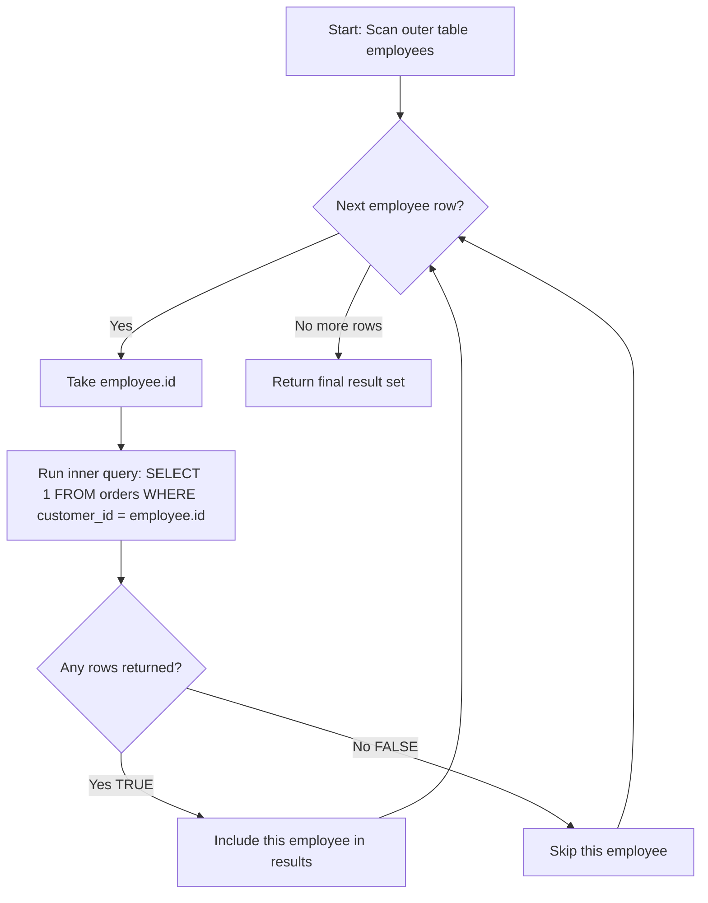

# EXISTS and NOT EXISTS

EXISTS is one of the most powerful and misunderstood operators in SQL. It shifts your thinking from "give me data" to "does data exist?" — a fundamentally different question that unlocks elegant solutions for membership tests, anti-joins, and data validation.

> [!tip] Core Insight
> EXISTS doesn't return data. It returns **TRUE** or **FALSE**. The moment it finds one matching row, it stops looking. This short-circuit behavior is what makes it fast.

---

## Existence Logic

### What EXISTS Actually Does

EXISTS is a **boolean test**. It evaluates a subquery and returns:
- `TRUE` → if the subquery returns **at least one row**
- `FALSE` → if the subquery returns **zero rows**

```sql
-- "Give me all customers who have placed at least one order"
SELECT c.name
FROM customers c
WHERE EXISTS (
    SELECT 1
    FROM orders o
    WHERE o.customer_id = c.id
);
```

### The SELECT Inside EXISTS Doesn't Matter

A common misconception: people think `SELECT *` inside EXISTS is slower than `SELECT 1`. **It's not.** The database ignores what you select — it only cares whether rows exist.

```sql
-- These are ALL equivalent:
WHERE EXISTS (SELECT 1 FROM orders WHERE ...)
WHERE EXISTS (SELECT * FROM orders WHERE ...)
WHERE EXISTS (SELECT 42 FROM orders WHERE ...)
WHERE EXISTS (SELECT 'hello' FROM orders WHERE ...)
```

> [!question] Why does SQL even allow SELECT * inside EXISTS?
> Because EXISTS only checks for row **existence**, not row **content**. The optimizer knows this and never materializes the selected columns.

### Mental Model: Knocking on a Door

Think of EXISTS like knocking on a door:
- You knock → "Is anyone home?"
- Someone answers → `TRUE` (you don't care *who* answered)
- No one answers → `FALSE`

You never ask "give me everyone inside." You just care: **is there someone?**

---

## Correlated Subqueries

### How EXISTS Creates a Correlated Subquery

EXISTS almost always uses a **correlated subquery** — the inner query references a column from the outer query.

```sql
SELECT e.name, e.salary
FROM employees e
WHERE EXISTS (
    SELECT 1
    FROM orders o
    WHERE o.customer_id = e.id  -- correlation: e.id comes from outer query
);
```

### Execution Model

Conceptually, the database processes this as:

```
For each row in the outer query (employees):
    Run the inner query using that row's values
    If the inner query returns ≥ 1 row → include this outer row
    If the inner query returns 0 rows → skip this outer row
```



### Performance: Seems Expensive, Often Isn't

> [!tip] Optimizer Magic
> Although the conceptual model is "run inner query for every outer row," modern optimizers often rewrite EXISTS as a **semi-join** — a much faster operation that stops scanning the inner table after the first match.

The key insight: EXISTS **short-circuits**. The moment one matching row is found, it returns TRUE and moves on. This is fundamentally different from a regular JOIN which must find *all* matches.

---

## NOT EXISTS (Anti-Joins)

NOT EXISTS answers: **"Does NO matching row exist?"** — the inverse of EXISTS.

This is the bread and butter of **anti-join** patterns: finding rows in one table that have no counterpart in another.

```sql
-- Customers who have NEVER placed an order
SELECT c.name, c.email
FROM customers c
WHERE NOT EXISTS (
    SELECT 1
    FROM orders o
    WHERE o.customer_id = c.id
);
```

### The Three Anti-Join Approaches

There are three common ways to find "rows without matches." They are NOT all equivalent.

#### Approach 1: NOT EXISTS

```sql
SELECT c.name
FROM customers c
WHERE NOT EXISTS (
    SELECT 1 FROM orders o WHERE o.customer_id = c.id
);
```

#### Approach 2: LEFT JOIN WHERE IS NULL

```sql
SELECT c.name
FROM customers c
LEFT JOIN orders o ON o.customer_id = c.id
WHERE o.id IS NULL;
```

#### Approach 3: NOT IN

```sql
SELECT c.name
FROM customers c
WHERE c.id NOT IN (
    SELECT customer_id FROM orders
);
```

### Comparison Table

| Aspect | NOT EXISTS | LEFT JOIN + IS NULL | NOT IN |
|---|---|---|---|
| **NULL safety** | ✅ Safe | ✅ Safe | ❌ **DANGEROUS** |
| **Readability** | Clear intent | Moderate | Seems simple |
| **Performance** | Excellent (semi-join) | Excellent | Variable |
| **Duplicates** | No duplication | No duplication | No duplication |
| **When subquery has NULLs** | Works correctly | Works correctly | **Returns empty set!** |
| **Recommendation** | ✅ Preferred | ✅ Good alternative | ⚠️ Avoid with nullable columns |

> [!danger] NOT IN with NULLs — The Silent Bug
> If the subquery in `NOT IN` returns even **one NULL value**, the entire NOT IN evaluates to **UNKNOWN** for every row, and you get **zero results**.
>
> ```sql
> -- Suppose one order has customer_id = NULL
> SELECT c.name
> FROM customers c
> WHERE c.id NOT IN (SELECT customer_id FROM orders);
> -- Returns NOTHING! Even for customers who genuinely have no orders.
> ```
>
> This is because `x NOT IN (1, 2, NULL)` becomes `x != 1 AND x != 2 AND x != NULL`. The last comparison is UNKNOWN, making the entire expression UNKNOWN. SQL treats UNKNOWN as "not true" and excludes the row.
>
> **This is a CRITICAL interview topic.** Memorize it.

### How to Fix NOT IN with NULLs

```sql
-- Option 1: Filter NULLs explicitly
WHERE c.id NOT IN (SELECT customer_id FROM orders WHERE customer_id IS NOT NULL)

-- Option 2: Just use NOT EXISTS (always safe)
WHERE NOT EXISTS (SELECT 1 FROM orders o WHERE o.customer_id = c.id)
```

---

## EXISTS vs JOIN

### When EXISTS Preserves What JOIN Destroys

> [!warning] JOIN Can Multiply Your Rows
> When you JOIN to a table with multiple matching rows, your result set **explodes**. EXISTS never does this — it preserves the cardinality of the outer query.

```sql
-- BAD: If a customer has 5 orders, they appear 5 times
SELECT c.name
FROM customers c
JOIN orders o ON o.customer_id = c.id;

-- GOOD: Each customer appears exactly once
SELECT c.name
FROM customers c
WHERE EXISTS (
    SELECT 1 FROM orders o WHERE o.customer_id = c.id
);
```

If you only care about **whether** a match exists (not the matched data), EXISTS is the right tool.

### Decision Table

| Question You're Asking | Use |
|---|---|
| "Does at least one match exist?" | `EXISTS` |
| "I need data from both tables" | `JOIN` |
| "How many matches exist?" | `JOIN` + `GROUP BY` or subquery |
| "Does NO match exist?" | `NOT EXISTS` or `LEFT JOIN + IS NULL` |
| "I need all rows, matched or not" | `LEFT JOIN` |

### Performance Comparison

```sql
-- EXISTS: stops at first match per outer row
-- Cost: O(n) outer × O(1) amortized inner (with index)
SELECT c.name
FROM customers c
WHERE EXISTS (SELECT 1 FROM orders o WHERE o.customer_id = c.id);

-- JOIN: finds ALL matches, then you DISTINCT away duplicates
-- Cost: O(n × m) then dedup
SELECT DISTINCT c.name
FROM customers c
JOIN orders o ON o.customer_id = c.id;
```

> [!tip] Rule of Thumb
> If you're writing `SELECT DISTINCT ... JOIN`, consider whether `EXISTS` would be cleaner and faster.

---

## EXISTS vs COUNT

### Short-Circuit vs Full Scan

```sql
-- BAD: Counts ALL matching orders just to check if any exist
SELECT c.name
FROM customers c
WHERE (SELECT COUNT(*) FROM orders o WHERE o.customer_id = c.id) > 0;

-- GOOD: Stops at the first matching order
SELECT c.name
FROM customers c
WHERE EXISTS (SELECT 1 FROM orders o WHERE o.customer_id = c.id);
```

> [!example] Analogy
> Imagine you need to know if there's milk in the fridge.
> - `COUNT(*)` → You open the fridge, count every single item, then check if milk_count > 0.
> - `EXISTS` → You open the fridge, see milk immediately, close the fridge. Done.

### When COUNT Is Actually Needed

Use COUNT when you care about the **actual number**:

```sql
-- "Customers with MORE THAN 5 orders" — you need the count
SELECT c.name
FROM customers c
WHERE (SELECT COUNT(*) FROM orders o WHERE o.customer_id = c.id) > 5;
```

---

## Presence Validation

### Checking Before Inserting

```sql
-- Only insert if the department exists
INSERT INTO employees (name, department_id, salary, hire_date, is_active)
SELECT 'New Hire', 10, 75000, CURRENT_DATE, TRUE
WHERE EXISTS (SELECT 1 FROM departments d WHERE d.id = 10);
```

### Conditional Logic with EXISTS in CASE

```sql
SELECT
    e.name,
    CASE
        WHEN EXISTS (
            SELECT 1 FROM orders o
            JOIN shipments s ON s.order_id = o.id
            WHERE o.customer_id = e.id AND s.status = 'delayed'
        ) THEN 'Has Delayed Shipments'
        ELSE 'All Clear'
    END AS shipment_status
FROM customers e;
```

---

## Missing Data Detection

These are the most common real-world uses of NOT EXISTS.

### Customers Without Orders

```sql
SELECT c.name, c.email, c.city
FROM customers c
WHERE NOT EXISTS (
    SELECT 1 FROM orders o WHERE o.customer_id = c.id
);
```

### Products Never Ordered

```sql
SELECT p.name, p.category, p.price
FROM products p
WHERE NOT EXISTS (
    SELECT 1 FROM order_items oi WHERE oi.product_id = p.id
);
```

### Shipments Without Tracking Updates

```sql
-- Orders that have been placed but never shipped
SELECT o.id AS order_id, o.order_date, o.status, o.total_amount
FROM orders o
WHERE NOT EXISTS (
    SELECT 1 FROM shipments s WHERE s.order_id = o.id
)
AND o.status = 'confirmed';
```

### Employees Without a Manager Assignment

```sql
-- Employees whose manager_id references no existing employee
SELECT e.name, e.department_id
FROM employees e
WHERE e.manager_id IS NOT NULL
AND NOT EXISTS (
    SELECT 1 FROM employees mgr WHERE mgr.id = e.manager_id
);
```

---

## Real Backend Use Cases

### 1. Authorization Check

```sql
-- Does this user have admin permission?
SELECT
    CASE WHEN EXISTS (
        SELECT 1 FROM user_roles ur
        JOIN roles r ON r.id = ur.role_id
        WHERE ur.user_id = 42 AND r.name = 'admin'
    ) THEN 'authorized'
    ELSE 'denied'
    END AS auth_status;
```

### 2. Data Validation — Referential Integrity

```sql
-- Find order_items referencing non-existent products (data corruption check)
SELECT oi.id, oi.order_id, oi.product_id
FROM order_items oi
WHERE NOT EXISTS (
    SELECT 1 FROM products p WHERE p.id = oi.product_id
);
```

### 3. Soft Delete Filters

```sql
-- Active customers who have at least one active (non-cancelled) order
SELECT c.name
FROM customers c
WHERE EXISTS (
    SELECT 1 FROM orders o
    WHERE o.customer_id = c.id
    AND o.status != 'cancelled'
);
```

### 4. Inventory Availability Check

```sql
-- Can this order be fulfilled? Check ALL items are in stock.
SELECT
    CASE WHEN NOT EXISTS (
        SELECT 1 FROM order_items oi
        JOIN products p ON p.id = oi.product_id
        WHERE oi.order_id = 101
        AND p.stock_quantity < oi.quantity
    ) THEN 'Ready to Ship'
    ELSE 'Insufficient Stock'
    END AS fulfillment_status;
```

> [!tip] Notice the double-negative pattern
> "NOT EXISTS (items where stock is insufficient)" means "ALL items have sufficient stock." This is the SQL equivalent of universal quantification (∀).

---

## How Beginners Think vs How Strong SQL Engineers Think

| Aspect | Beginner | Strong Engineer |
|---|---|---|
| Checking existence | `SELECT COUNT(*) ... > 0` | `EXISTS (...)` |
| Anti-join | `NOT IN (subquery)` | `NOT EXISTS` or `LEFT JOIN + IS NULL` |
| NULL awareness | Doesn't consider NULLs | Always asks "what if the subquery returns NULLs?" |
| Row duplication | Uses `JOIN` then `DISTINCT` | Uses `EXISTS` to avoid duplication entirely |
| Universal quantification | Doesn't know how to express "for all" | Uses `NOT EXISTS (... NOT ...)` pattern |

---

## Common Mistakes

### 1. Using COUNT When EXISTS Would Suffice

```sql
-- ❌ Scans ALL matching rows
WHERE (SELECT COUNT(*) FROM orders WHERE customer_id = c.id) > 0

-- ✅ Stops at first match
WHERE EXISTS (SELECT 1 FROM orders WHERE customer_id = c.id)
```

### 2. NOT IN with Nullable Columns

```sql
-- ❌ Returns EMPTY if any customer_id in orders is NULL
WHERE c.id NOT IN (SELECT customer_id FROM orders)

-- ✅ Always safe
WHERE NOT EXISTS (SELECT 1 FROM orders o WHERE o.customer_id = c.id)
```

> [!danger] This is the #1 EXISTS-related bug in production code.
> Always use NOT EXISTS instead of NOT IN when the subquery column can be NULL.

### 3. Forgetting the Correlation

```sql
-- ❌ WRONG: No correlation — this checks if ANY orders exist at all
SELECT c.name
FROM customers c
WHERE EXISTS (SELECT 1 FROM orders);

-- ✅ CORRECT: Correlated to the outer row
SELECT c.name
FROM customers c
WHERE EXISTS (SELECT 1 FROM orders o WHERE o.customer_id = c.id);
```

### 4. Over-Complicating with EXISTS

```sql
-- ❌ Unnecessary EXISTS when you need the joined data anyway
SELECT c.name
FROM customers c
WHERE EXISTS (SELECT 1 FROM orders o WHERE o.customer_id = c.id)
-- then later: JOIN orders to get order data

-- ✅ Just use JOIN if you need the data
SELECT c.name, o.order_date, o.total_amount
FROM customers c
JOIN orders o ON o.customer_id = c.id;
```

---

## Practice Exercises

### Exercise 1: Active Customers
Find all customers who have placed at least one order with status `'delivered'`.

### Exercise 2: Dormant Products
Find all products that have never appeared in any `order_items`.

### Exercise 3: Unshipped Orders
Find all orders that do not have a corresponding row in the `shipments` table.

### Exercise 4: Managers Who Are Also Individual Contributors
Find employees who are listed as `manager_id` for at least one other employee but also have their own `manager_id` set (they report to someone).

### Exercise 5: Customers in Cities Without Other Customers
Find customers who are the only customer in their city (no other customer shares their city).

### Exercise 6: Departments With High Earners
Find departments that have at least one employee earning more than 100,000.

### Exercise 7: Complete Orders
Find orders where **every** order item's product is currently in stock (`stock_quantity >= quantity`). Hint: use the NOT EXISTS (... NOT ...) pattern for universal quantification.

### Exercise 8: Carrier Performance
Find carriers (from `shipments`) that have **never** had a shipment with status `'lost'`.

### Exercise 9: Referential Integrity Audit
Write a query to find all `order_items` rows that reference a `product_id` not present in the `products` table AND an `order_id` not present in the `orders` table.

### Exercise 10: Multi-Level Existence
Find customers who have placed orders containing products from the `'Electronics'` category. Use EXISTS with nested subqueries.

---

## Interview Questions

### Q1: What is the difference between EXISTS and IN?
**Expected Answer:** EXISTS checks for the existence of rows and returns TRUE/FALSE. IN checks if a value matches any value in a list or subquery result. EXISTS handles NULLs safely; NOT IN does not. EXISTS short-circuits; IN may evaluate the entire subquery. EXISTS is typically preferred for correlated checks.

### Q2: Why is NOT IN dangerous with NULLs?
**Expected Answer:** If the subquery returns any NULL value, `NOT IN` evaluates to UNKNOWN for every outer row, returning zero results. This is because `x != NULL` is UNKNOWN, and `TRUE AND UNKNOWN` is UNKNOWN, which WHERE treats as false.

### Q3: How does EXISTS differ from JOIN in terms of result cardinality?
**Expected Answer:** EXISTS preserves the cardinality of the outer query — each outer row appears at most once. JOIN can multiply rows when there are multiple matches in the joined table.

### Q4: Does the SELECT list inside EXISTS affect performance?
**Expected Answer:** No. The database ignores what's selected inside EXISTS. `SELECT 1`, `SELECT *`, and `SELECT column` are all equivalent. The optimizer only checks for row existence.

### Q5: How do you express "for all" (universal quantification) in SQL?
**Expected Answer:** SQL has no direct `FOR ALL` operator. You use double negation: `NOT EXISTS (SELECT ... WHERE NOT ...)`. Example: "all items are in stock" → "there does NOT EXIST an item that is NOT in stock."

### Q6: When would you choose LEFT JOIN + IS NULL over NOT EXISTS?
**Expected Answer:** They're generally equivalent in performance. LEFT JOIN + IS NULL can be preferable when you need columns from both tables in the result. NOT EXISTS is preferable for readability when you only need columns from the outer table. Some databases optimize one better than the other — always check the execution plan.

---

## Query Debugging Walkthrough

### Scenario: "My NOT IN query returns no results"

A developer writes this query to find customers without orders:

```sql
SELECT c.name
FROM customers c
WHERE c.id NOT IN (SELECT customer_id FROM orders);
```

**Expected:** 15 customers without orders.
**Actual:** 0 rows returned.

#### Step 1: Check for NULLs in the Subquery

```sql
SELECT COUNT(*) FROM orders WHERE customer_id IS NULL;
-- Result: 3
```

There are 3 orders with `customer_id = NULL`.

#### Step 2: Understand the NULL Logic

```
c.id NOT IN (1, 2, 3, NULL)
= c.id != 1 AND c.id != 2 AND c.id != 3 AND c.id != NULL
= TRUE AND TRUE AND TRUE AND UNKNOWN
= UNKNOWN
```

Every row evaluates to UNKNOWN → no rows pass the WHERE filter.

#### Step 3: Fix with NOT EXISTS

```sql
SELECT c.name
FROM customers c
WHERE NOT EXISTS (
    SELECT 1 FROM orders o WHERE o.customer_id = c.id
);
-- Now returns 15 rows correctly ✅
```

#### Step 4: Why NOT EXISTS Works

NOT EXISTS asks: "Is there any order where `customer_id = c.id`?" For a customer with `id = 99`:
- The inner query: `SELECT 1 FROM orders WHERE customer_id = 99`
- Orders with `customer_id = NULL`: `NULL = 99` → UNKNOWN → row not returned
- So `NULL` rows are **ignored** in the inner query, and NOT EXISTS correctly returns TRUE.

> [!tip] Takeaway
> Always prefer `NOT EXISTS` over `NOT IN` when the subquery column can contain NULLs. When in doubt, use `NOT EXISTS` — it's always safe.

---

## Related Notes

- [[04 - Joins]] — JOIN types and when EXISTS is a better alternative
- [[06 - GROUP BY and Aggregation]] — Combining EXISTS with aggregate logic
- [[07 - Subqueries]] — EXISTS is a special form of correlated subquery
- [[10 - Common Table Expressions]] — Refactoring complex EXISTS logic into CTEs
- [[02 - SQL Execution Model]] — How the optimizer rewrites EXISTS into semi-joins
