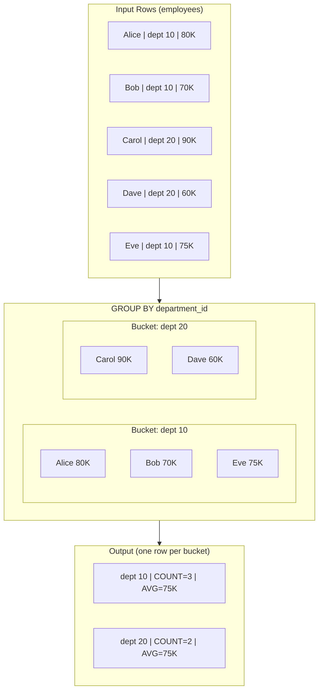
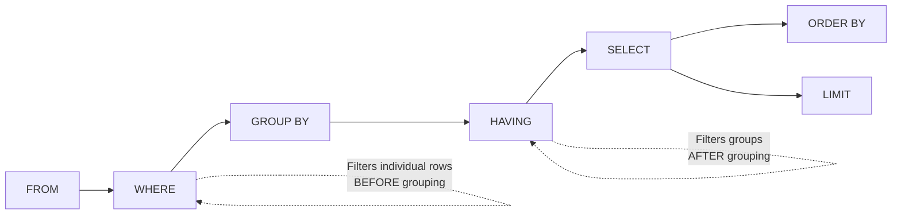

# GROUP BY and Aggregation

GROUP BY is where SQL shifts from **row-level thinking** to **set-level thinking**. It transforms many rows into fewer rows by collapsing groups. Mastering GROUP BY means mastering the transition from "individual records" to "summaries about groups of records."

> [!tip] Core Insight
> GROUP BY doesn't just group rows — it **changes what your SELECT is allowed to express**. After GROUP BY, every column in SELECT must either be a grouping column or wrapped in an aggregate function. There is no in-between.

---

## Aggregate Functions

### Overview Table

| Function | Purpose | NULL Behavior | Returns NULL When |
|---|---|---|---|
| `COUNT(*)` | Count all rows | Counts rows with NULLs | Never (returns 0) |
| `COUNT(col)` | Count non-NULL values | Skips NULLs | Never (returns 0) |
| `COUNT(DISTINCT col)` | Count unique non-NULL values | Skips NULLs | Never (returns 0) |
| `SUM(col)` | Sum of values | Skips NULLs | All values are NULL |
| `AVG(col)` | Average of values | Skips NULLs (affects denominator!) | All values are NULL |
| `MIN(col)` | Minimum value | Skips NULLs | All values are NULL |
| `MAX(col)` | Maximum value | Skips NULLs | All values are NULL |

---

### COUNT

#### COUNT(*) vs COUNT(column) vs COUNT(DISTINCT column)

This distinction is an **interview classic** and a common source of bugs.

```sql
-- Sample data in employees:
-- id | name    | department_id
-- 1  | Alice   | 10
-- 2  | Bob     | NULL
-- 3  | Carol   | 10
-- 4  | Dave    | 20
-- 5  | Eve     | NULL
```

```sql
SELECT
    COUNT(*)                    AS total_rows,          -- 5 (counts ALL rows)
    COUNT(department_id)        AS non_null_depts,      -- 3 (skips 2 NULLs)
    COUNT(DISTINCT department_id) AS unique_depts       -- 2 (only 10 and 20)
FROM employees;
```

| Metric | Result | Why |
|---|---|---|
| `COUNT(*)` | 5 | Counts every row regardless of NULLs |
| `COUNT(department_id)` | 3 | Excludes rows where `department_id IS NULL` |
| `COUNT(DISTINCT department_id)` | 2 | Only unique non-NULL values: 10, 20 |

> [!warning] Common Mistake
> Using `COUNT(column)` when you mean `COUNT(*)`. If the column has NULLs, these give different results. Always ask yourself: "Am I counting rows or counting non-NULL values?"

---

### SUM

```sql
-- SUM ignores NULLs
SELECT SUM(salary) FROM employees;
-- If salaries are: 50000, 60000, NULL, 70000
-- Result: 180000 (NULL is skipped, NOT treated as 0)
```

> [!danger] SUM Returns NULL When All Values Are NULL
> ```sql
> SELECT SUM(salary) FROM employees WHERE department_id = 999;
> -- No matching rows → Result: NULL (not 0!)
> ```
> 
> **The fix:** Always wrap with COALESCE when you need a zero default:
> ```sql
> SELECT COALESCE(SUM(salary), 0) AS total_salary
> FROM employees WHERE department_id = 999;
> -- Result: 0
> ```

---

### AVG

AVG is the most misunderstood aggregate because **NULLs change the denominator**.

```sql
-- Salaries: 50000, 60000, NULL, 70000
SELECT AVG(salary) FROM employees;
-- = (50000 + 60000 + 70000) / 3 = 60000
-- NOT (50000 + 60000 + 0 + 70000) / 4 = 45000
```

> [!example] AVG with NULLs vs AVG Treating NULLs as 0
> ```sql
> -- Data: bonus values are 100, NULL, 300, NULL, 500
> 
> -- AVG ignoring NULLs (default SQL behavior)
> SELECT AVG(bonus) FROM employees;
> -- = (100 + 300 + 500) / 3 = 300.00
> 
> -- AVG treating NULLs as 0 (explicit conversion)
> SELECT AVG(COALESCE(bonus, 0)) FROM employees;
> -- = (100 + 0 + 300 + 0 + 500) / 5 = 180.00
> ```
> 
> **These are fundamentally different results!** Choose based on business logic:
> - "Average bonus among employees who received one" → `AVG(bonus)`
> - "Average bonus across all employees" → `AVG(COALESCE(bonus, 0))`

---

### MIN / MAX

```sql
-- Work on numbers
SELECT MIN(salary), MAX(salary) FROM employees;

-- Work on dates
SELECT MIN(hire_date) AS earliest_hire, MAX(hire_date) AS latest_hire
FROM employees;

-- Work on strings (lexicographic order)
SELECT MIN(name), MAX(name) FROM employees;
-- MIN: 'Alice', MAX: 'Eve'

-- NULLs are ignored
SELECT MIN(salary) FROM employees WHERE department_id = 999;
-- No rows → NULL
```

---

## GROUP BY Semantics

### What GROUP BY Actually Does

GROUP BY **partitions** rows into groups based on one or more columns. Each group is then collapsed into a single output row. Within each group, aggregate functions compute a summary value.

### Mental Model: Sorting Rows into Buckets



```sql
SELECT
    department_id,
    COUNT(*) AS employee_count,
    AVG(salary) AS avg_salary
FROM employees
GROUP BY department_id;
```

### The Golden Rule

> [!danger] Every non-aggregated column in SELECT **MUST** appear in GROUP BY.
> ```sql
> -- ❌ INVALID: name is not in GROUP BY and not aggregated
> SELECT department_id, name, COUNT(*)
> FROM employees
> GROUP BY department_id;
> 
> -- ✅ VALID: all non-aggregated columns are in GROUP BY
> SELECT department_id, COUNT(*), AVG(salary)
> FROM employees
> GROUP BY department_id;
> ```

**Why?** After grouping, each group produces ONE row. If you include `name` without aggregating it, which name should SQL pick from the 3 employees in department 10? Alice? Bob? Eve? There's no deterministic answer, so SQL forbids it.

> [!tip] MySQL Exception
> MySQL historically allowed non-aggregated columns not in GROUP BY (it picks an arbitrary value). This is almost always a bug. Use `ONLY_FULL_GROUP_BY` mode to enforce the standard behavior.

### GROUP BY with Multiple Columns

```sql
-- Group by TWO columns: each unique combination gets its own bucket
SELECT
    department_id,
    is_active,
    COUNT(*) AS count,
    AVG(salary) AS avg_salary
FROM employees
GROUP BY department_id, is_active;
```

| department_id | is_active | count | avg_salary |
|---|---|---|---|
| 10 | true | 2 | 77500 |
| 10 | false | 1 | 70000 |
| 20 | true | 2 | 75000 |

---

## HAVING

### WHERE vs HAVING



Link: [[02 - SQL Execution Model]]

### Key Difference

```sql
-- WHERE: filters ROWS before grouping
SELECT department_id, AVG(salary)
FROM employees
WHERE is_active = TRUE         -- filter rows first
GROUP BY department_id;

-- HAVING: filters GROUPS after grouping
SELECT department_id, AVG(salary)
FROM employees
GROUP BY department_id
HAVING AVG(salary) > 70000;    -- filter groups by aggregate result
```

> [!warning] You CANNOT Use Aggregates in WHERE
> ```sql
> -- ❌ INVALID: aggregate in WHERE
> SELECT department_id, AVG(salary)
> FROM employees
> WHERE AVG(salary) > 70000
> GROUP BY department_id;
> -- ERROR: aggregate functions are not allowed in WHERE
> 
> -- ✅ CORRECT: aggregate in HAVING
> SELECT department_id, AVG(salary)
> FROM employees
> GROUP BY department_id
> HAVING AVG(salary) > 70000;
> ```

### Combined WHERE + HAVING

```sql
-- "Average salary of active employees per department,
--  but only departments with average salary above 70000"
SELECT
    department_id,
    COUNT(*) AS active_count,
    AVG(salary) AS avg_salary
FROM employees
WHERE is_active = TRUE             -- Step 1: keep only active employees
GROUP BY department_id             -- Step 2: group into departments
HAVING AVG(salary) > 70000;        -- Step 3: keep only high-paying departments
```

---

## Row Filtering vs Group Filtering

### Side-by-Side Comparison

| Aspect | WHERE | HAVING |
|---|---|---|
| **Operates on** | Individual rows | Groups (after GROUP BY) |
| **When executed** | Before GROUP BY | After GROUP BY |
| **Can use aggregates?** | ❌ No | ✅ Yes |
| **Can reference columns?** | ✅ Any column | ✅ GROUP BY columns + aggregates |
| **Performance** | Reduces data early (faster) | Processes all groups first |

### How Beginners Think vs How Strong SQL Engineers Think

| Aspect | Beginner | Strong Engineer |
|---|---|---|
| **Filtering approach** | Puts everything in HAVING | Filters as early as possible with WHERE |
| **Reasoning** | "HAVING works, so I'll use it" | "WHERE reduces rows before grouping → less work for the database" |
| **Performance awareness** | Doesn't consider execution order | Knows WHERE runs first, reducing the dataset before expensive grouping |

```sql
-- ❌ Beginner: filtering in HAVING (works but wasteful)
SELECT department_id, COUNT(*)
FROM employees
GROUP BY department_id
HAVING department_id != 999;

-- ✅ Engineer: filtering in WHERE (faster — excludes rows before grouping)
SELECT department_id, COUNT(*)
FROM employees
WHERE department_id != 999
GROUP BY department_id;
```

> [!tip] Rule of Thumb
> If a filter condition doesn't involve an aggregate function, it belongs in WHERE, not HAVING. Always filter as early as possible.

---

## Conditional Aggregation

### CASE Inside Aggregate Functions

This technique lets you compute multiple aggregates with different conditions in a single pass.

#### Counting with Conditions

```sql
SELECT
    department_id,
    COUNT(*) AS total_employees,
    SUM(CASE WHEN is_active = TRUE THEN 1 ELSE 0 END) AS active_count,
    SUM(CASE WHEN is_active = FALSE THEN 1 ELSE 0 END) AS inactive_count,
    SUM(CASE WHEN salary > 80000 THEN 1 ELSE 0 END) AS high_earners
FROM employees
GROUP BY department_id;
```

#### Selective Summing

```sql
SELECT
    DATE_TRUNC('month', o.order_date) AS month,
    SUM(o.total_amount) AS total_revenue,
    SUM(CASE WHEN o.status = 'delivered' THEN o.total_amount ELSE 0 END) AS delivered_revenue,
    SUM(CASE WHEN o.status = 'cancelled' THEN o.total_amount ELSE 0 END) AS cancelled_revenue,
    SUM(CASE WHEN o.status = 'pending' THEN o.total_amount ELSE 0 END) AS pending_revenue
FROM orders o
GROUP BY DATE_TRUNC('month', o.order_date)
ORDER BY month;
```

#### FILTER Clause (PostgreSQL)

```sql
-- PostgreSQL-specific: cleaner alternative to CASE
SELECT
    department_id,
    COUNT(*) AS total,
    COUNT(*) FILTER (WHERE is_active = TRUE) AS active_count,
    AVG(salary) FILTER (WHERE hire_date > '2023-01-01') AS avg_new_hire_salary
FROM employees
GROUP BY department_id;
```

#### Pivoting Data with Conditional Aggregation

```sql
-- Transform rows into columns: shipment counts by status per carrier
SELECT
    s.carrier,
    COUNT(*) AS total_shipments,
    SUM(CASE WHEN s.status = 'delivered' THEN 1 ELSE 0 END) AS delivered,
    SUM(CASE WHEN s.status = 'in_transit' THEN 1 ELSE 0 END) AS in_transit,
    SUM(CASE WHEN s.status = 'delayed' THEN 1 ELSE 0 END) AS delayed,
    SUM(CASE WHEN s.status = 'lost' THEN 1 ELSE 0 END) AS lost
FROM shipments s
GROUP BY s.carrier
ORDER BY total_shipments DESC;
```

| carrier | total_shipments | delivered | in_transit | delayed | lost |
|---|---|---|---|---|---|
| FedEx | 150 | 120 | 20 | 8 | 2 |
| UPS | 130 | 110 | 15 | 4 | 1 |
| DHL | 80 | 60 | 12 | 6 | 2 |

---

## Aggregation Pitfalls

### 1. Forgetting GROUP BY

```sql
-- Without GROUP BY, the entire table is ONE group
SELECT COUNT(*), AVG(salary)
FROM employees;
-- Returns a single row: count and average across ALL employees
```

This isn't wrong — it's just aggregating over the entire table. But it's a common source of confusion when you expected per-department results.

### 2. Non-Aggregated Columns Not in GROUP BY

```sql
-- ❌ Which employee name should appear for department 10?
SELECT department_id, name, AVG(salary)
FROM employees
GROUP BY department_id;
-- Standard SQL: ERROR
-- MySQL (without ONLY_FULL_GROUP_BY): picks arbitrary name — BUG!
```

### 3. DISTINCT Inside Aggregates

```sql
-- COUNT(DISTINCT ...) counts unique values
SELECT
    department_id,
    COUNT(manager_id) AS total_manager_refs,      -- counts non-NULL manager_ids (with dupes)
    COUNT(DISTINCT manager_id) AS unique_managers  -- counts unique non-NULL manager_ids
FROM employees
GROUP BY department_id;
```

### 4. NULL Groups

```sql
-- Rows with NULL in the GROUP BY column form their own group
SELECT department_id, COUNT(*)
FROM employees
GROUP BY department_id;
-- If some employees have department_id = NULL:
-- NULL | 3  ← all NULL-department employees grouped together
```

### 5. Accidental Aggregation Over Duplicated Rows from JOINs

> [!danger] This Is the Most Common GROUP BY Bug in Practice

When you JOIN before aggregating, a one-to-many relationship **duplicates** rows, inflating your aggregates.

```sql
-- ❌ WRONG: If an order has 3 order_items, the order's total_amount is counted 3 times
SELECT
    c.name,
    SUM(o.total_amount) AS total_spent
FROM customers c
JOIN orders o ON o.customer_id = c.id
JOIN order_items oi ON oi.order_id = o.id
GROUP BY c.name;
-- total_spent is INFLATED because each order row is duplicated per order_item
```

```sql
-- ✅ CORRECT: Aggregate in a subquery first, then join
SELECT
    c.name,
    order_totals.total_spent
FROM customers c
JOIN (
    SELECT customer_id, SUM(total_amount) AS total_spent
    FROM orders
    GROUP BY customer_id
) order_totals ON order_totals.customer_id = c.id;
```

```sql
-- ✅ ALSO CORRECT: Use DISTINCT inside the aggregate
SELECT
    c.name,
    SUM(DISTINCT o.total_amount) AS total_spent
FROM customers c
JOIN orders o ON o.customer_id = c.id
JOIN order_items oi ON oi.order_id = o.id
GROUP BY c.name;
-- Warning: SUM(DISTINCT) only works if order amounts are unique per customer
```

> [!warning] Double-Counting After JOINs
> Always ask: "Does my JOIN introduce duplicate rows before my aggregate runs?"
> 
> **Diagnosis:** Run the query without GROUP BY and check if rows are duplicated.
> 
> **Fix:** Either aggregate in a subquery first, or use DISTINCT inside the aggregate (if applicable).

---

## Practical Business Examples

### Revenue by Department

```sql
SELECT
    d.name AS department,
    d.location,
    COUNT(e.id) AS headcount,
    SUM(e.salary) AS total_salary_cost,
    ROUND(AVG(e.salary), 2) AS avg_salary
FROM departments d
LEFT JOIN employees e ON e.department_id = d.id AND e.is_active = TRUE
GROUP BY d.name, d.location
ORDER BY total_salary_cost DESC;
```

### Order Count by Customer

```sql
SELECT
    c.name,
    c.city,
    COUNT(o.id) AS order_count,
    COALESCE(SUM(o.total_amount), 0) AS total_spent,
    MIN(o.order_date) AS first_order,
    MAX(o.order_date) AS last_order
FROM customers c
LEFT JOIN orders o ON o.customer_id = c.id
GROUP BY c.name, c.city
ORDER BY total_spent DESC;
```

### Average Salary by Department (having > 5 employees)

```sql
SELECT
    d.name AS department,
    COUNT(e.id) AS employee_count,
    ROUND(AVG(e.salary), 2) AS avg_salary,
    MIN(e.salary) AS min_salary,
    MAX(e.salary) AS max_salary
FROM departments d
JOIN employees e ON e.department_id = d.id
WHERE e.is_active = TRUE
GROUP BY d.name
HAVING COUNT(e.id) > 5
ORDER BY avg_salary DESC;
```

### Monthly Order Trends

```sql
SELECT
    DATE_TRUNC('month', order_date) AS month,
    COUNT(*) AS order_count,
    SUM(total_amount) AS monthly_revenue,
    ROUND(AVG(total_amount), 2) AS avg_order_value,
    COUNT(DISTINCT customer_id) AS unique_customers
FROM orders
WHERE order_date >= '2025-01-01'
GROUP BY DATE_TRUNC('month', order_date)
ORDER BY month;
```

### Top 3 Products by Revenue

```sql
SELECT
    p.name AS product_name,
    p.category,
    SUM(oi.quantity) AS total_units_sold,
    SUM(oi.quantity * oi.unit_price) AS total_revenue
FROM products p
JOIN order_items oi ON oi.product_id = p.id
GROUP BY p.name, p.category
ORDER BY total_revenue DESC
LIMIT 3;
```

### Shipment Status Distribution by Carrier

```sql
SELECT
    s.carrier,
    COUNT(*) AS total_shipments,
    ROUND(100.0 * SUM(CASE WHEN s.status = 'delivered' THEN 1 ELSE 0 END) / COUNT(*), 1) AS pct_delivered,
    ROUND(100.0 * SUM(CASE WHEN s.status = 'delayed' THEN 1 ELSE 0 END) / COUNT(*), 1) AS pct_delayed,
    ROUND(AVG(EXTRACT(EPOCH FROM (s.delivered_date - s.shipped_date)) / 86400), 1) AS avg_delivery_days
FROM shipments s
GROUP BY s.carrier
HAVING COUNT(*) >= 10
ORDER BY pct_delivered DESC;
```

---

## Bad Query vs Good Query

### Comparison 1: Filtering in the Wrong Place

```sql
-- ❌ BAD: Filtering by non-aggregate condition in HAVING
SELECT department_id, COUNT(*)
FROM employees
GROUP BY department_id
HAVING department_id IN (10, 20, 30);

-- ✅ GOOD: Filtering in WHERE (runs before GROUP BY, processes fewer rows)
SELECT department_id, COUNT(*)
FROM employees
WHERE department_id IN (10, 20, 30)
GROUP BY department_id;
```

### Comparison 2: Double-Counting After JOIN

```sql
-- ❌ BAD: SUM is inflated because of the JOIN to order_items
SELECT
    o.customer_id,
    SUM(o.total_amount) AS total_revenue
FROM orders o
JOIN order_items oi ON oi.order_id = o.id
GROUP BY o.customer_id;
-- If order #1 has 3 items, total_amount is added 3 times!

-- ✅ GOOD: Aggregate at the correct grain
SELECT
    customer_id,
    SUM(total_amount) AS total_revenue
FROM orders
GROUP BY customer_id;
-- Each order counted exactly once
```

### Comparison 3: Using COUNT(*) > 0 Instead of EXISTS

```sql
-- ❌ BAD: Counts all orders just to check existence
SELECT c.name
FROM customers c
WHERE (SELECT COUNT(*) FROM orders o WHERE o.customer_id = c.id) > 0;

-- ✅ GOOD: Stops at first match
SELECT c.name
FROM customers c
WHERE EXISTS (SELECT 1 FROM orders o WHERE o.customer_id = c.id);
```

See also: [[05 - EXISTS and NOT EXISTS]]

### Comparison 4: SUM Without COALESCE

```sql
-- ❌ BAD: Returns NULL for customers with no orders (confusing to application code)
SELECT
    c.name,
    (SELECT SUM(o.total_amount) FROM orders o WHERE o.customer_id = c.id) AS total_spent
FROM customers c;
-- Customers with no orders get NULL instead of 0

-- ✅ GOOD: Explicit default value
SELECT
    c.name,
    COALESCE(
        (SELECT SUM(o.total_amount) FROM orders o WHERE o.customer_id = c.id),
        0
    ) AS total_spent
FROM customers c;
```

---

## Practice Exercises

### Exercise 1: Basic Aggregation
Count the number of employees in each department. Include the department name.

### Exercise 2: Conditional Counting
For each department, count active and inactive employees separately in a single query.

### Exercise 3: NULL-Aware Averaging
Calculate the average salary two ways: ignoring NULLs and treating NULLs as 0. Show both results side by side.

### Exercise 4: HAVING Filter
Find departments where the average salary exceeds the company-wide average salary.

### Exercise 5: Monthly Trends
Show the number of orders and total revenue per month for the year 2025. Include months with zero orders.

### Exercise 6: Top Customers
Find the top 5 customers by total order amount. Include their order count and average order value.

### Exercise 7: Carrier Performance
For each carrier in the shipments table, calculate: total shipments, percentage delivered on time (delivered_date <= shipped_date + 5 days), and average delivery time in days.

### Exercise 8: Product Category Analysis
For each product category, show: number of products, total units sold (from order_items), total revenue, and the best-selling product name.

### Exercise 9: Double-Counting Prevention
Write a query that shows each customer's total order amount AND total number of items ordered, without double-counting the order amounts. Use a subquery or CTE to aggregate at the correct level.

### Exercise 10: Conditional Aggregation Pivot
Create a report showing each department as a row, with columns for: headcount, average salary, count of employees hired in 2024, count hired in 2025, and count earning above 80K.

---

## Interview Questions

### Q1: What is the difference between WHERE and HAVING?
**Expected Answer:** WHERE filters individual rows before GROUP BY. HAVING filters groups after GROUP BY. WHERE cannot use aggregate functions; HAVING can. Always prefer WHERE when the condition doesn't involve an aggregate, because it reduces data earlier in the execution pipeline.

### Q2: What is the difference between COUNT(*) and COUNT(column)?
**Expected Answer:** COUNT(*) counts all rows including those with NULLs. COUNT(column) counts only rows where that column is not NULL. This matters when the column has NULLs.

### Q3: What happens to NULLs in AVG?
**Expected Answer:** AVG ignores NULLs — they are excluded from both the numerator and denominator. This means AVG(bonus) where some values are NULL gives a different result than AVG(COALESCE(bonus, 0)), because the latter includes NULLs as zeros in both numerator and denominator.

### Q4: How do you prevent double-counting when joining and aggregating?
**Expected Answer:** When a JOIN introduces duplicate rows (one-to-many), aggregates like SUM get inflated. Fix by: (1) aggregating in a subquery before joining, (2) using DISTINCT inside the aggregate if values are unique, or (3) restructuring the query to avoid the problematic join.

### Q5: What does SUM return when there are no matching rows?
**Expected Answer:** SUM returns NULL, not 0. Use COALESCE(SUM(column), 0) to get 0 instead.

### Q6: Can you use an alias defined in SELECT inside HAVING?
**Expected Answer:** In standard SQL, no — HAVING is evaluated before SELECT. However, some databases (MySQL, PostgreSQL) allow it as an extension. For portability, repeat the expression: `HAVING COUNT(*) > 5` instead of `HAVING cnt > 5`.

### Q7: How does GROUP BY handle NULLs?
**Expected Answer:** All NULL values in the GROUP BY column are treated as a single group. So if 3 employees have department_id = NULL, they form one group with COUNT(*) = 3.

### Q8: What is conditional aggregation and when would you use it?
**Expected Answer:** Conditional aggregation uses CASE expressions inside aggregate functions to compute different aggregates based on conditions. Example: `SUM(CASE WHEN status = 'active' THEN 1 ELSE 0 END)`. It's used to pivot data, create cross-tab reports, or compute multiple filtered aggregates in a single query pass without multiple subqueries.

---

## Debugging Walkthrough

### Scenario: "My SUM is way too high after adding a JOIN"

A developer writes:

```sql
SELECT
    c.name,
    SUM(o.total_amount) AS total_spent,
    COUNT(oi.id) AS items_purchased
FROM customers c
JOIN orders o ON o.customer_id = c.id
JOIN order_items oi ON oi.order_id = o.id
GROUP BY c.name;
```

**Expected:** Customer "Alice" with 2 orders totaling $500.
**Actual:** Customer "Alice" shows $1,500.

#### Step 1: Remove GROUP BY and Inspect Raw Rows

```sql
SELECT c.name, o.id AS order_id, o.total_amount, oi.id AS item_id
FROM customers c
JOIN orders o ON o.customer_id = c.id
JOIN order_items oi ON oi.order_id = o.id
WHERE c.name = 'Alice';
```

| name | order_id | total_amount | item_id |
|---|---|---|---|
| Alice | 1 | 200 | 101 |
| Alice | 1 | 200 | 102 |
| Alice | 1 | 200 | 103 |
| Alice | 2 | 300 | 201 |
| Alice | 2 | 300 | 202 |

Order 1 (amount $200) appears 3 times because it has 3 items. Order 2 (amount $300) appears twice.
SUM = 200×3 + 300×2 = 1200 ≠ 500.

#### Step 2: Fix by Aggregating at the Right Level

```sql
-- Option A: Aggregate orders separately
SELECT
    c.name,
    order_summary.total_spent,
    order_summary.items_purchased
FROM customers c
JOIN (
    SELECT
        o.customer_id,
        SUM(o.total_amount) AS total_spent,
        SUM(item_counts.cnt) AS items_purchased
    FROM orders o
    JOIN (
        SELECT order_id, COUNT(*) AS cnt
        FROM order_items
        GROUP BY order_id
    ) item_counts ON item_counts.order_id = o.id
    GROUP BY o.customer_id
) order_summary ON order_summary.customer_id = c.id;
```

```sql
-- Option B: Simpler — use two separate aggregations
SELECT
    c.name,
    (SELECT SUM(o.total_amount) FROM orders o WHERE o.customer_id = c.id) AS total_spent,
    (SELECT COUNT(*) FROM order_items oi JOIN orders o ON o.id = oi.order_id WHERE o.customer_id = c.id) AS items_purchased
FROM customers c;
```

#### Step 3: Verify

Both approaches now return:
| name | total_spent | items_purchased |
|---|---|---|
| Alice | 500 | 5 |

> [!tip] The Lesson
> Whenever you JOIN a one-to-many relationship and then aggregate, **check for row duplication**. The fix is always: aggregate at the correct granularity first, then join.

---

## Related Notes

- [[02 - SQL Execution Model]] — Execution order: FROM → WHERE → GROUP BY → HAVING → SELECT
- [[04 - Joins]] — How JOINs interact with GROUP BY (double-counting)
- [[05 - EXISTS and NOT EXISTS]] — When to use EXISTS instead of COUNT > 0
- [[07 - Subqueries]] — Using subqueries to aggregate at the right level
- [[10 - Common Table Expressions]] — Refactoring complex aggregation logic into CTEs
