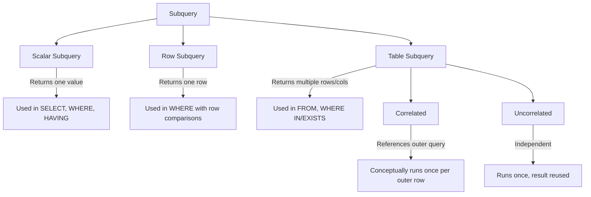
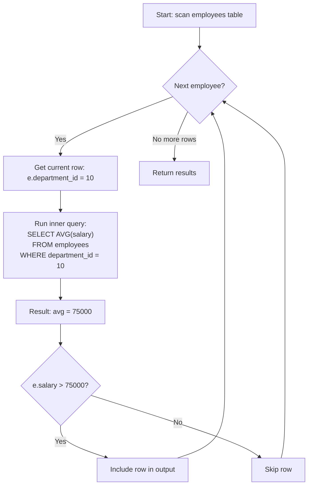
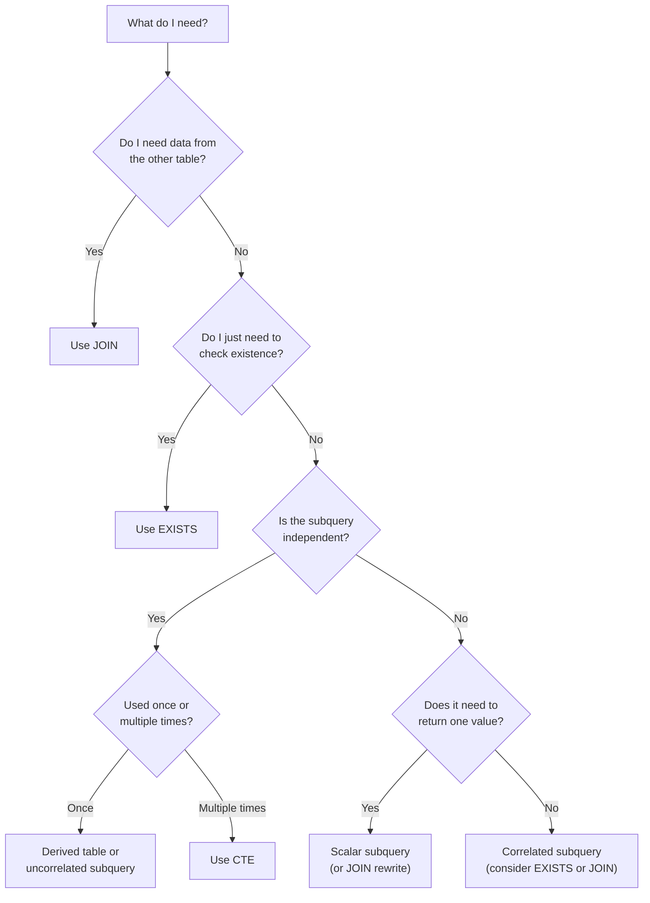

# Subqueries

A subquery is a query nested inside another query. Subqueries are the SQL equivalent of "solve a smaller problem first, then use the result." They appear in SELECT, FROM, WHERE, and HAVING clauses — each placement changes their behavior and performance characteristics.

> [!tip] Core Insight
> Every subquery answers an intermediate question. Before writing a subquery, articulate what question it answers in plain English. If you can't, you don't understand your query yet.

---

## Types of Subqueries — Overview



| Type | Returns | Example Placement | Correlated? |
|---|---|---|---|
| Scalar | Single value (1 row, 1 col) | SELECT, WHERE, HAVING | Can be either |
| Row | Single row (1 row, N cols) | WHERE with row comparison | Rare |
| Table | Multiple rows and columns | FROM (derived table), WHERE IN, EXISTS | Can be either |

---

## Scalar Subqueries

A scalar subquery returns **exactly one value** (one row, one column). If it returns more than one row, SQL throws an error.

### In SELECT — Adding Computed Columns

```sql
-- Each employee's salary compared to their department average
SELECT
    e.name,
    e.salary,
    e.department_id,
    (SELECT AVG(e2.salary)
     FROM employees e2
     WHERE e2.department_id = e.department_id) AS dept_avg_salary,
    e.salary - (SELECT AVG(e2.salary)
                FROM employees e2
                WHERE e2.department_id = e.department_id) AS diff_from_avg
FROM employees e
ORDER BY e.department_id, diff_from_avg DESC;
```

### In WHERE — Comparison Against a Computed Value

```sql
-- Employees earning more than the company average
SELECT name, salary
FROM employees
WHERE salary > (SELECT AVG(salary) FROM employees);
```

### In HAVING — Filtering Groups Against a Computed Value

```sql
-- Departments with average salary above the company-wide average
SELECT department_id, AVG(salary) AS dept_avg
FROM employees
GROUP BY department_id
HAVING AVG(salary) > (SELECT AVG(salary) FROM employees);
```

### Error: More Than One Row

```sql
-- ❌ ERROR: scalar subquery returns more than one row
SELECT name
FROM employees
WHERE salary = (SELECT salary FROM employees WHERE department_id = 10);
-- If dept 10 has multiple employees with different salaries, this fails

-- ✅ FIX: Use IN instead of =
SELECT name
FROM employees
WHERE salary IN (SELECT salary FROM employees WHERE department_id = 10);
```

> [!warning] Scalar Subquery Failure
> A scalar subquery MUST return 0 or 1 rows. If it returns 0 rows, the result is NULL (not an error). If it returns 2+ rows, it's a runtime error. Always ensure your subquery's WHERE clause is selective enough.

### Performance Considerations

Scalar subqueries in SELECT are conceptually executed **once per outer row** — they're correlated subqueries. For large outer result sets, this can be slow. Consider rewriting as a JOIN:

```sql
-- ❌ Scalar subquery: runs the AVG once per employee
SELECT
    e.name,
    e.salary,
    (SELECT AVG(e2.salary) FROM employees e2 WHERE e2.department_id = e.department_id) AS dept_avg
FROM employees e;

-- ✅ JOIN: computes all averages once in a derived table
SELECT
    e.name,
    e.salary,
    dept_avgs.avg_salary AS dept_avg
FROM employees e
JOIN (
    SELECT department_id, AVG(salary) AS avg_salary
    FROM employees
    GROUP BY department_id
) dept_avgs ON dept_avgs.department_id = e.department_id;
```

---

## Correlated Subqueries

A correlated subquery **references columns from the outer query**. This creates a dependency: the inner query cannot run independently.

### How It Works

```sql
-- For each employee, check if they earn more than their department average
SELECT e.name, e.salary, e.department_id
FROM employees e
WHERE e.salary > (
    SELECT AVG(e2.salary)
    FROM employees e2
    WHERE e2.department_id = e.department_id  -- correlation: uses e.department_id
);
```

### Execution Model (Conceptual)

```
For each row in employees (outer query):
    1. Take the current employee's department_id
    2. Run the inner query: AVG(salary) WHERE department_id = [current dept]
    3. Compare: is this employee's salary > that average?
    4. If yes → include in results
```



### When the Optimizer Rewrites Them

> [!tip] Optimizer Intelligence
> Modern databases often **decorrelate** correlated subqueries, rewriting them as JOINs internally. The conceptual "once per row" execution doesn't always happen in practice. But write your query for correctness first, then check the execution plan.

### Connection to EXISTS

EXISTS is the most common use of correlated subqueries. See [[05 - EXISTS and NOT EXISTS]] for detailed coverage.

```sql
-- Classic correlated EXISTS
SELECT c.name
FROM customers c
WHERE EXISTS (
    SELECT 1 FROM orders o
    WHERE o.customer_id = c.id       -- correlated
    AND o.status = 'delivered'
);
```

### Performance Characteristics

| Scenario | Performance | Why |
|---|---|---|
| Correlated, no index on inner table | O(n × m) | Full scan per outer row |
| Correlated, index on correlated column | O(n × log m) | Index lookup per outer row |
| Optimizer decorrelates to JOIN | O(n + m) | Hash/merge join |
| Uncorrelated subquery | O(n + m) | Inner runs once |

---

## Derived Tables (Inline Views)

A subquery in the **FROM clause** creates a virtual table that the outer query can SELECT from, JOIN to, or filter.

### Basic Syntax

```sql
-- Derived table: pre-aggregate, then join
SELECT
    c.name,
    order_summary.total_orders,
    order_summary.total_spent
FROM customers c
JOIN (
    SELECT
        customer_id,
        COUNT(*) AS total_orders,
        SUM(total_amount) AS total_spent
    FROM orders
    GROUP BY customer_id
) AS order_summary ON order_summary.customer_id = c.id
WHERE order_summary.total_spent > 1000;
```

> [!warning] Derived Tables Must Have an Alias
> ```sql
> -- ❌ ERROR: no alias
> SELECT * FROM (SELECT id, name FROM employees);
> 
> -- ✅ CORRECT: aliased
> SELECT * FROM (SELECT id, name FROM employees) AS emp_subset;
> ```

### When to Use Derived Tables

1. **Aggregate before joining** — prevent double-counting (see [[06 - GROUP BY and Aggregation]])
2. **Pre-filter** — reduce rows before an expensive operation
3. **Compute intermediate values** — then reference in the outer query

### Derived Table vs CTE

| Aspect | Derived Table | CTE |
|---|---|---|
| **Syntax** | Inline in FROM | `WITH ... AS (...)` before main query |
| **Readability** | Can get deeply nested | Flat, top-to-bottom reading |
| **Reusability** | Must duplicate if used multiple times | Define once, reference multiple times |
| **Recursion** | Not possible | Supported |
| **Scope** | Only within the query it's defined in | Only within the statement |
| **Performance** | Usually identical | Usually identical (depends on DB) |

See [[10 - Common Table Expressions]] for when CTEs are the better choice.

### Scope Limitations

A derived table can only reference:
- Its own tables and subqueries
- Columns from the outer query **only if** it's a lateral join (not standard derived tables)

```sql
-- ❌ This does NOT work in standard SQL:
SELECT e.name, dt.avg_sal
FROM employees e
JOIN (
    SELECT AVG(salary) AS avg_sal
    FROM employees
    WHERE department_id = e.department_id  -- ERROR: can't reference e here
) dt;

-- ✅ Use LATERAL JOIN (PostgreSQL) or a correlated subquery instead
SELECT e.name, dt.avg_sal
FROM employees e
JOIN LATERAL (
    SELECT AVG(salary) AS avg_sal
    FROM employees
    WHERE department_id = e.department_id
) dt ON TRUE;
```

---

## Nested Queries

### Subqueries Within Subqueries

```sql
-- Find customers whose total spending is above the average customer spending
SELECT c.name, customer_totals.total_spent
FROM customers c
JOIN (
    SELECT customer_id, SUM(total_amount) AS total_spent
    FROM orders
    GROUP BY customer_id
) customer_totals ON customer_totals.customer_id = c.id
WHERE customer_totals.total_spent > (
    SELECT AVG(total_spent) FROM (
        SELECT SUM(total_amount) AS total_spent
        FROM orders
        GROUP BY customer_id
    ) avg_calc
);
```

### Readability Concerns

> [!warning] Deeply Nested Subqueries Are Hard to Read
> If you nest more than 2 levels deep, the query becomes very difficult to understand, debug, and maintain. Consider refactoring into CTEs.

```sql
-- ✅ Same query refactored with CTEs — much clearer
WITH customer_totals AS (
    SELECT customer_id, SUM(total_amount) AS total_spent
    FROM orders
    GROUP BY customer_id
),
avg_spending AS (
    SELECT AVG(total_spent) AS avg_total FROM customer_totals
)
SELECT c.name, ct.total_spent
FROM customers c
JOIN customer_totals ct ON ct.customer_id = c.id
WHERE ct.total_spent > (SELECT avg_total FROM avg_spending);
```

See [[10 - Common Table Expressions]] for the full CTE treatment.

---

## Subquery in SELECT

### One Value Per Row

A subquery in SELECT must return exactly one value for each outer row. It's essentially a computed column.

```sql
SELECT
    e.name,
    e.salary,
    (SELECT d.name FROM departments d WHERE d.id = e.department_id) AS dept_name,
    (SELECT COUNT(*) FROM orders o
     JOIN customers cu ON cu.id = o.customer_id
     WHERE cu.city = (SELECT d.location FROM departments d WHERE d.id = e.department_id)
    ) AS orders_in_dept_city
FROM employees e;
```

### The N+1 Query Problem in SQL

> [!danger] Performance Anti-Pattern
> Correlated subqueries in SELECT are SQL's version of the N+1 problem from ORMs. For N outer rows, you execute N inner queries.
>
> ```sql
> -- ❌ N+1 pattern: for 1000 customers, runs 1000 subqueries
> SELECT
>     c.name,
>     (SELECT COUNT(*) FROM orders o WHERE o.customer_id = c.id) AS order_count
> FROM customers c;
>
> -- ✅ JOIN pattern: single pass
> SELECT
>     c.name,
>     COALESCE(order_counts.cnt, 0) AS order_count
> FROM customers c
> LEFT JOIN (
>     SELECT customer_id, COUNT(*) AS cnt
>     FROM orders
>     GROUP BY customer_id
> ) order_counts ON order_counts.customer_id = c.id;
> ```

### When to Keep Subqueries in SELECT

- Small outer result sets (after WHERE filtering)
- The subquery is simple and well-indexed
- Readability matters more than micro-optimization
- The optimizer decorrelates it anyway (check your EXPLAIN plan)

---

## Subquery in WHERE

### IN (Subquery)

```sql
-- Employees in departments located in 'New York'
SELECT e.name, e.salary
FROM employees e
WHERE e.department_id IN (
    SELECT d.id FROM departments d WHERE d.location = 'New York'
);
```

> [!tip] IN vs EXISTS
> - `IN` → good for uncorrelated subqueries (independent list)
> - `EXISTS` → good for correlated subqueries (per-row check)
> - For large datasets, EXISTS often performs better because it short-circuits

### EXISTS (Subquery)

See [[05 - EXISTS and NOT EXISTS]] for comprehensive coverage.

```sql
-- Customers who have at least one shipped order
SELECT c.name
FROM customers c
WHERE EXISTS (
    SELECT 1 FROM orders o
    JOIN shipments s ON s.order_id = o.id
    WHERE o.customer_id = c.id
    AND s.status = 'delivered'
);
```

### Comparison with Subquery

```sql
-- Employees earning more than the average salary in their department
SELECT e.name, e.salary, e.department_id
FROM employees e
WHERE e.salary > (
    SELECT AVG(e2.salary)
    FROM employees e2
    WHERE e2.department_id = e.department_id
);
```

### ALL / ANY / SOME Operators

These compare a value against **every row** or **any row** returned by a subquery.

```sql
-- Employees earning more than ALL employees in department 20
SELECT e.name, e.salary
FROM employees e
WHERE e.salary > ALL (
    SELECT salary FROM employees WHERE department_id = 20
);
-- Equivalent to: salary > MAX(salary in dept 20)

-- Employees earning more than ANY employee in department 20
SELECT e.name, e.salary
FROM employees e
WHERE e.salary > ANY (
    SELECT salary FROM employees WHERE department_id = 20
);
-- Equivalent to: salary > MIN(salary in dept 20)
```

| Operator | Meaning | Equivalent Aggregate |
|---|---|---|
| `> ALL (subquery)` | Greater than every value | `> MAX(subquery)` |
| `< ALL (subquery)` | Less than every value | `< MIN(subquery)` |
| `> ANY (subquery)` | Greater than at least one | `> MIN(subquery)` |
| `< ANY (subquery)` | Less than at least one | `< MAX(subquery)` |
| `= ANY (subquery)` | Equal to at least one | `IN (subquery)` |

> [!tip] In Practice
> ALL and ANY are rarely used directly. Most SQL engineers rewrite them as MIN/MAX or EXISTS for clarity.

---

## Subquery in FROM

### Derived Tables for Pre-Aggregation

The most important use of FROM subqueries: **aggregate at the right level before joining**.

```sql
-- Total revenue per customer, with customer details
SELECT
    c.name,
    c.city,
    rev.total_revenue,
    rev.order_count
FROM customers c
JOIN (
    SELECT
        customer_id,
        SUM(total_amount) AS total_revenue,
        COUNT(*) AS order_count
    FROM orders
    WHERE status != 'cancelled'
    GROUP BY customer_id
) rev ON rev.customer_id = c.id
ORDER BY rev.total_revenue DESC;
```

### Pre-Filtering

```sql
-- Join only to recent shipments (reduces join size)
SELECT
    o.id AS order_id,
    o.total_amount,
    recent_ship.carrier,
    recent_ship.status
FROM orders o
JOIN (
    SELECT * FROM shipments
    WHERE shipped_date >= '2025-01-01'
) recent_ship ON recent_ship.order_id = o.id;
```

### Computing Intermediate Values

```sql
-- Rank customers by spending, then filter top 10%
SELECT name, total_spent, spending_rank
FROM (
    SELECT
        c.name,
        SUM(o.total_amount) AS total_spent,
        RANK() OVER (ORDER BY SUM(o.total_amount) DESC) AS spending_rank
    FROM customers c
    JOIN orders o ON o.customer_id = c.id
    GROUP BY c.name
) ranked
WHERE spending_rank <= (
    SELECT COUNT(DISTINCT customer_id) * 0.1 FROM orders
);
```

---

## When Subqueries Become Expensive

### Signs Your Subquery Needs Refactoring

1. **Execution time grows linearly with outer row count** → correlated subquery without index
2. **Same subquery repeated multiple times** → extract into CTE or derived table
3. **Deeply nested (3+ levels)** → refactor into CTEs for readability
4. **EXPLAIN shows "dependent subquery"** → optimizer couldn't decorrelate it

### Decision Matrix

| Scenario | Best Tool | Why |
|---|---|---|
| "Does a matching row exist?" | `EXISTS` | Short-circuits, semi-join optimization |
| "Get matching data from another table" | `JOIN` | Single pass, no per-row overhead |
| "Filter by a list of values" | `IN` (small list) / `EXISTS` (large) | IN materializes list; EXISTS short-circuits |
| "Compare against an aggregate" | Scalar subquery or CTE | Computes once, reuses |
| "Aggregate at different granularity" | Derived table / CTE | Prevents double-counting |
| "Reference same computation multiple times" | CTE | Define once, use many times |
| "Rank/window over groups" | Window function | No self-join needed |



---

## How Beginners Think vs How Strong SQL Engineers Think

| Aspect | Beginner | Strong Engineer |
|---|---|---|
| **Default tool** | Nests everything into subqueries | Chooses the right tool: JOIN, subquery, CTE, or window function |
| **Correlated subqueries** | Uses them everywhere because they "read naturally" | Knows they can be O(n×m) and checks EXPLAIN |
| **Derived tables** | Doesn't know they exist | Uses them to aggregate at the right granularity |
| **Readability** | Writes one giant nested query | Breaks complex logic into named CTEs |
| **Performance** | Doesn't think about it | Knows that uncorrelated > correlated, and checks execution plans |
| **NULL handling** | Forgets about NULLs in IN | Uses NOT EXISTS instead of NOT IN for safety |

> [!example] Beginner vs Expert: Same Problem, Different Approach
> 
> **Problem:** Find employees earning above their department's average salary.
> 
> **Beginner approach:** Correlated scalar subquery
> ```sql
> SELECT e.name, e.salary
> FROM employees e
> WHERE e.salary > (
>     SELECT AVG(e2.salary)
>     FROM employees e2
>     WHERE e2.department_id = e.department_id
> );
> ```
> 
> **Expert approach:** CTE + JOIN (computes averages once)
> ```sql
> WITH dept_avg AS (
>     SELECT department_id, AVG(salary) AS avg_salary
>     FROM employees
>     GROUP BY department_id
> )
> SELECT e.name, e.salary, da.avg_salary
> FROM employees e
> JOIN dept_avg da ON da.department_id = e.department_id
> WHERE e.salary > da.avg_salary;
> ```
> 
> Both are correct. The expert version computes each department average exactly once.

---

## Common Mistakes

### 1. Subquery Returning Multiple Rows Where Scalar Expected

```sql
-- ❌ ERROR if department 10 has multiple salary values
SELECT name
FROM employees
WHERE salary = (SELECT salary FROM employees WHERE department_id = 10);

-- ✅ Use IN for multiple values
WHERE salary IN (SELECT salary FROM employees WHERE department_id = 10);

-- ✅ Or use a specific aggregate for a scalar
WHERE salary = (SELECT MAX(salary) FROM employees WHERE department_id = 10);
```

### 2. Not Aliasing Derived Tables

```sql
-- ❌ Syntax error in most databases
SELECT * FROM (SELECT id, name FROM employees);

-- ✅ Always alias
SELECT * FROM (SELECT id, name FROM employees) AS emp;
```

### 3. Overusing Correlated Subqueries

```sql
-- ❌ Correlated subquery runs per row — slow for large tables
SELECT
    e.name,
    (SELECT d.name FROM departments d WHERE d.id = e.department_id) AS dept_name,
    (SELECT COUNT(*) FROM employees e2 WHERE e2.department_id = e.department_id) AS dept_size,
    (SELECT AVG(salary) FROM employees e2 WHERE e2.department_id = e.department_id) AS dept_avg
FROM employees e;

-- ✅ JOIN + window function — single pass
SELECT
    e.name,
    d.name AS dept_name,
    COUNT(*) OVER (PARTITION BY e.department_id) AS dept_size,
    AVG(e.salary) OVER (PARTITION BY e.department_id) AS dept_avg
FROM employees e
JOIN departments d ON d.id = e.department_id;
```

### 4. NOT IN with Nullable Subquery Results

```sql
-- ❌ DANGEROUS: If any customer_id in orders is NULL, returns 0 rows
SELECT name FROM customers
WHERE id NOT IN (SELECT customer_id FROM orders);

-- ✅ SAFE: NOT EXISTS handles NULLs correctly
SELECT name FROM customers c
WHERE NOT EXISTS (SELECT 1 FROM orders o WHERE o.customer_id = c.id);
```

See [[05 - EXISTS and NOT EXISTS]] for the full explanation of this NULL trap.

### 5. Duplicating Subquery Logic

```sql
-- ❌ Same subquery written THREE times
SELECT
    e.name,
    e.salary,
    e.salary - (SELECT AVG(salary) FROM employees WHERE department_id = e.department_id) AS diff,
    CASE
        WHEN e.salary > (SELECT AVG(salary) FROM employees WHERE department_id = e.department_id)
        THEN 'Above Average'
        ELSE 'Below Average'
    END AS status,
    ROUND(e.salary * 100.0 / (SELECT AVG(salary) FROM employees WHERE department_id = e.department_id), 1) AS pct_of_avg
FROM employees e;

-- ✅ Compute once with CTE
WITH dept_avg AS (
    SELECT department_id, AVG(salary) AS avg_salary
    FROM employees
    GROUP BY department_id
)
SELECT
    e.name,
    e.salary,
    e.salary - da.avg_salary AS diff,
    CASE WHEN e.salary > da.avg_salary THEN 'Above Average' ELSE 'Below Average' END AS status,
    ROUND(e.salary * 100.0 / da.avg_salary, 1) AS pct_of_avg
FROM employees e
JOIN dept_avg da ON da.department_id = e.department_id;
```

---

## Practice Exercises

### Exercise 1: Above-Average Earners
Find all employees who earn more than the average salary across the entire company. Show their name, salary, and how much above average they are.

### Exercise 2: Department's Highest Earner
For each department, find the employee with the highest salary. If there's a tie, show all tied employees. (Hint: use a correlated subquery or derived table.)

### Exercise 3: Customers Above Average Spending
Find customers whose total order amount exceeds the average total order amount across all customers.

### Exercise 4: Products More Expensive Than Category Average
Find products priced above the average price within their own category. Show the product name, price, category, and the category average.

### Exercise 5: Orders with Above-Average Item Count
Find orders that contain more items (from `order_items`) than the average number of items per order.

### Exercise 6: Second Highest Salary
Find the employee(s) with the second highest salary. Do this WITHOUT using window functions — use subqueries only.

### Exercise 7: Shipment Delays
Find orders where the shipment's delivery took longer than the average delivery time for that carrier. Show order_id, carrier, actual days, and average days for the carrier.

### Exercise 8: Correlated to JOIN Rewrite
Take this correlated subquery and rewrite it as a JOIN:
```sql
SELECT e.name, e.salary,
    (SELECT d.name FROM departments d WHERE d.id = e.department_id) AS dept_name,
    (SELECT MAX(e2.salary) FROM employees e2 WHERE e2.department_id = e.department_id) AS dept_max_salary
FROM employees e;
```

### Exercise 9: Multi-Level Subquery
Write a query to find the department(s) where the number of employees is greater than the average number of employees per department. Use nested subqueries.

### Exercise 10: Uncorrelated → Correlated Conversion
Given this uncorrelated subquery:
```sql
SELECT name FROM employees WHERE salary > (SELECT AVG(salary) FROM employees);
```
Modify it to be correlated: find employees earning above their **own department's** average. Then rewrite it as a CTE + JOIN.

---

## Interview Questions

### Q1: What is the difference between a correlated and uncorrelated subquery?
**Expected Answer:** An uncorrelated subquery is independent — it can run on its own without referencing the outer query. It executes once. A correlated subquery references columns from the outer query, creating a dependency. Conceptually, it executes once per outer row, though the optimizer may rewrite it.

### Q2: When would you use a subquery in FROM vs a CTE?
**Expected Answer:** They're functionally equivalent in most cases. Use a CTE when: (1) the subquery is referenced multiple times, (2) you need recursion, or (3) readability matters (complex logic benefits from named steps). Use derived tables for simple, single-use transformations. Performance is usually identical.

### Q3: What happens if a scalar subquery returns no rows?
**Expected Answer:** It returns NULL, not an error. This can cause unexpected behavior if not handled. For example, `WHERE salary > (subquery returning NULL)` evaluates to UNKNOWN, and no rows match.

### Q4: How do ALL and ANY operators work with subqueries?
**Expected Answer:** `> ALL (subquery)` means "greater than every value returned" (equivalent to `> MAX`). `> ANY (subquery)` means "greater than at least one value" (equivalent to `> MIN`). `= ANY` is equivalent to `IN`. They're rarely used in practice because aggregates (MIN/MAX) are clearer.

### Q5: Why is NOT IN dangerous with subqueries?
**Expected Answer:** If the subquery returns any NULL value, `NOT IN` evaluates to UNKNOWN for every outer row, returning zero results. This is because `x != NULL` is UNKNOWN. Use `NOT EXISTS` instead — it handles NULLs correctly. See [[05 - EXISTS and NOT EXISTS]].

### Q6: How would you refactor a deeply nested subquery?
**Expected Answer:** Extract each subquery level into a named CTE using `WITH ... AS (...)`. This gives each step a meaningful name, makes the query read top-to-bottom, and allows reuse. It also makes debugging easier because you can run each CTE independently. See [[10 - Common Table Expressions]].

### Q7: What is the N+1 problem in SQL subqueries?
**Expected Answer:** When a correlated subquery appears in SELECT, it conceptually runs once per outer row — similar to the N+1 problem in ORMs. For 1000 outer rows, the inner query runs 1000 times. The fix is to rewrite as a JOIN to a derived table or CTE, computing the result in a single pass.

---

## Query Debugging Walkthrough

### Scenario: "My subquery works alone but returns wrong results inside the main query"

A developer writes:

```sql
-- Goal: find employees in departments with more than 5 people
SELECT e.name, e.department_id
FROM employees e
WHERE e.department_id IN (
    SELECT department_id
    FROM employees
    GROUP BY department_id
    HAVING COUNT(*) > 5
);
```

**Expected:** Employees in large departments only.
**Actual:** Some employees from small departments appear.

#### Step 1: Run the Subquery Independently

```sql
SELECT department_id, COUNT(*)
FROM employees
GROUP BY department_id
HAVING COUNT(*) > 5;
```

| department_id | count |
|---|---|
| 10 | 8 |
| 20 | 12 |
| NULL | 6 |

The subquery returns **NULL** as one of the departments!

#### Step 2: Understand the NULL in IN

```sql
WHERE e.department_id IN (10, 20, NULL)
```

For an employee with `department_id = 30`:
```
30 IN (10, 20, NULL)
= 30 = 10 OR 30 = 20 OR 30 = NULL
= FALSE OR FALSE OR UNKNOWN
= UNKNOWN
```

This employee is excluded (correct behavior here, actually). But what about employees with `department_id = NULL`?

```
NULL IN (10, 20, NULL)
= NULL = 10 OR NULL = 20 OR NULL = NULL
= UNKNOWN OR UNKNOWN OR UNKNOWN
= UNKNOWN
```

Employees with NULL department_id are **excluded** from results, even though there are 6 of them (which is > 5).

#### Step 3: Debug Further — The Real Issue

The developer expected NULL-department employees to appear (since there are 6 of them). But `NULL IN (...)` is UNKNOWN, so they're filtered out.

#### Step 4: Fix with EXISTS

```sql
SELECT e.name, e.department_id
FROM employees e
WHERE EXISTS (
    SELECT 1
    FROM employees e2
    WHERE (e2.department_id = e.department_id
           OR (e2.department_id IS NULL AND e.department_id IS NULL))
    GROUP BY e2.department_id
    HAVING COUNT(*) > 5
);
```

Or more cleanly, handle NULLs explicitly:

```sql
WITH large_depts AS (
    SELECT department_id
    FROM employees
    GROUP BY department_id
    HAVING COUNT(*) > 5
)
SELECT e.name, e.department_id
FROM employees e
WHERE e.department_id IN (SELECT department_id FROM large_depts WHERE department_id IS NOT NULL)
   OR (e.department_id IS NULL AND EXISTS (SELECT 1 FROM large_depts WHERE department_id IS NULL));
```

> [!tip] Takeaway
> When your subquery might return NULLs and you're using IN, be aware that NULL comparisons produce UNKNOWN. Test your subquery independently first, and watch out for NULL values in the result.

---

## Related Notes

- [[04 - Joins]] — When to use JOIN instead of a subquery
- [[05 - EXISTS and NOT EXISTS]] — EXISTS as a special correlated subquery pattern
- [[06 - GROUP BY and Aggregation]] — Aggregating in subqueries to prevent double-counting
- [[10 - Common Table Expressions]] — Refactoring subqueries into readable CTEs
- [[02 - SQL Execution Model]] — How subqueries fit into the execution pipeline
