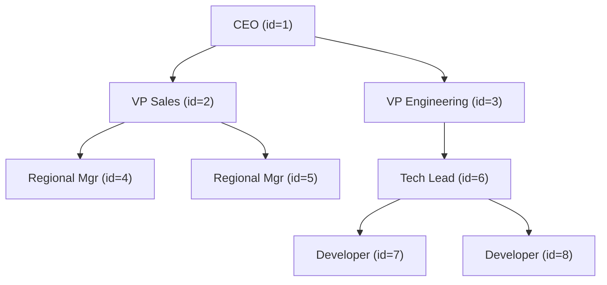
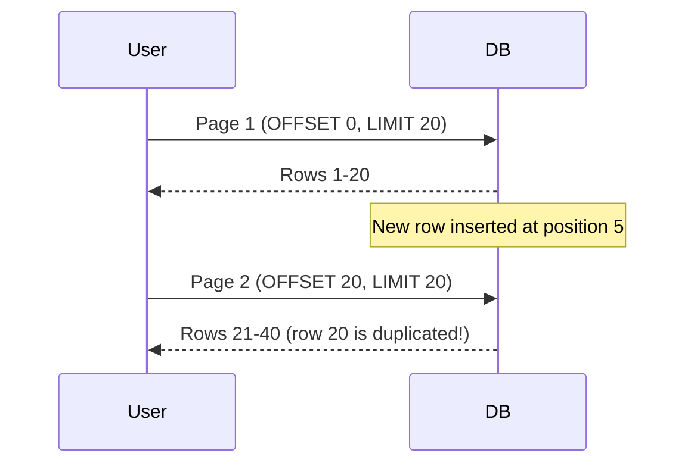

# Common Query Patterns

This is a **cookbook** of reusable SQL patterns. Every pattern here solves a problem you will encounter repeatedly — in production systems, data migrations, reporting pipelines, and interviews.

> [!tip] How to use this note
> Each pattern follows the same structure: **Problem → Solution → Why it works → Variations → Performance → Real-world context**. Bookmark the ones you use most. Link them into your project notes.

**Prerequisite notes:** [[04 - Joins]], [[06 - GROUP BY and Aggregation]], [[07 - Subqueries]]
**Next:** [[09 - Window Functions]], [[10 - Common Table Expressions]]

---

## Sample Tables Reference

All examples use these tables. They model a logistics/supply-chain system.

```sql
-- Core tables used throughout
CREATE TABLE departments (
    id INT PRIMARY KEY,
    name VARCHAR(100),
    location VARCHAR(100)
);

CREATE TABLE employees (
    id INT PRIMARY KEY,
    name VARCHAR(100),
    department_id INT REFERENCES departments(id),
    salary DECIMAL(10,2),
    hire_date DATE,
    manager_id INT REFERENCES employees(id),
    is_active BOOLEAN DEFAULT TRUE
);

CREATE TABLE customers (
    id INT PRIMARY KEY,
    name VARCHAR(100),
    email VARCHAR(150),
    city VARCHAR(100),
    created_at TIMESTAMP
);

CREATE TABLE orders (
    id INT PRIMARY KEY,
    customer_id INT REFERENCES customers(id),
    order_date DATE,
    status VARCHAR(20),  -- 'pending','shipped','delivered','cancelled'
    total_amount DECIMAL(12,2)
);

CREATE TABLE products (
    id INT PRIMARY KEY,
    name VARCHAR(100),
    category VARCHAR(50),
    price DECIMAL(10,2),
    stock_quantity INT
);

CREATE TABLE order_items (
    id INT PRIMARY KEY,
    order_id INT REFERENCES orders(id),
    product_id INT REFERENCES products(id),
    quantity INT,
    unit_price DECIMAL(10,2)
);

CREATE TABLE shipments (
    id INT PRIMARY KEY,
    order_id INT REFERENCES orders(id),
    carrier VARCHAR(50),
    tracking_number VARCHAR(100),
    shipped_date DATE,
    delivered_date DATE,
    status VARCHAR(20)  -- 'in_transit','delivered','returned','lost'
);
```

---

## 1. Duplicate Detection

### The Problem

You suspect your `orders` table has duplicate entries — maybe a bug in the API inserted the same order twice for the same customer on the same day.

### Finding Duplicate Rows

**GROUP BY + HAVING COUNT(\*) > 1** — the foundational pattern.

```sql
-- Find which (customer_id, order_date, total_amount) combinations appear more than once
SELECT customer_id, order_date, total_amount, COUNT(*) AS duplicate_count
FROM orders
GROUP BY customer_id, order_date, total_amount
HAVING COUNT(*) > 1
ORDER BY duplicate_count DESC;
```

> [!question] Why does this work?
> `GROUP BY` collapses rows with identical values in the grouped columns into a single group. `HAVING COUNT(*) > 1` filters to only groups where more than one row collapsed together — by definition, those are duplicates.

### Finding the Actual Duplicate Records

The query above tells you *which* combinations are duplicated. But you need the actual rows (with their `id`s) to fix the data.

**Approach 1: Self-join with the duplicate set**

```sql
SELECT o.*
FROM orders o
JOIN (
    SELECT customer_id, order_date, total_amount
    FROM orders
    GROUP BY customer_id, order_date, total_amount
    HAVING COUNT(*) > 1
) dups
ON o.customer_id = dups.customer_id
   AND o.order_date = dups.order_date
   AND o.total_amount = dups.total_amount
ORDER BY o.customer_id, o.order_date, o.id;
```

**Approach 2: Window function (cleaner)**

```sql
SELECT *
FROM (
    SELECT *,
           COUNT(*) OVER (
               PARTITION BY customer_id, order_date, total_amount
           ) AS dup_count
    FROM orders
) t
WHERE dup_count > 1
ORDER BY customer_id, order_date, id;
```

### Deleting Duplicates While Keeping One

Use `ROW_NUMBER()` to mark which row to keep (lowest `id`), then delete the rest.

```sql
-- Step 1: Identify which rows to delete
WITH ranked AS (
    SELECT id,
           ROW_NUMBER() OVER (
               PARTITION BY customer_id, order_date, total_amount
               ORDER BY id  -- keep the earliest inserted row
           ) AS rn
    FROM orders
)
-- Step 2: Delete all but the first
DELETE FROM orders
WHERE id IN (
    SELECT id FROM ranked WHERE rn > 1
);
```

> [!warning] Always preview before deleting
> Run the inner SELECT first to see which rows would be deleted. Never run DELETE on production without a WHERE clause you've verified.

```sql
-- Preview: see what would be deleted
WITH ranked AS (
    SELECT id, customer_id, order_date, total_amount,
           ROW_NUMBER() OVER (
               PARTITION BY customer_id, order_date, total_amount
               ORDER BY id
           ) AS rn
    FROM orders
)
SELECT * FROM ranked WHERE rn > 1;
```

### Performance Notes

- Duplicate detection scans the entire table — add indexes on the columns you're grouping by.
- For very large tables, consider checking in batches by date range.
- The window function approach requires a sort; the GROUP BY approach may use a hash aggregate — check your EXPLAIN plan.

### Real-World Context

In logistics systems, duplicate shipment records can cause double-billing. A common pattern is to add a `UNIQUE` constraint on `(order_id, carrier, tracking_number)` to prevent duplicates at the database level, then use this pattern to clean up existing data before adding the constraint.

---

## 2. Latest Row Per Group

### The Problem

"Show me the **most recent order** for each customer." This is one of the most common SQL problems and a frequent interview question.

> [!tip] This is a top-5 SQL interview question
> If you master this pattern with all three approaches, you'll handle most "latest/greatest per group" variations.

### Approach 1: Correlated Subquery

```sql
SELECT o.*
FROM orders o
WHERE o.order_date = (
    SELECT MAX(o2.order_date)
    FROM orders o2
    WHERE o2.customer_id = o.customer_id
);
```

**Why it works:** For each row in `orders`, the subquery finds the maximum `order_date` for that customer. Only rows matching their customer's max date survive.

> [!warning] Edge case: ties
> If two orders for the same customer have the same `order_date`, **both** are returned. This may or may not be what you want.

### Approach 2: JOIN with Derived Table (MAX)

```sql
SELECT o.*
FROM orders o
JOIN (
    SELECT customer_id, MAX(order_date) AS max_date
    FROM orders
    GROUP BY customer_id
) latest
ON o.customer_id = latest.customer_id
   AND o.order_date = latest.max_date;
```

**Why it works:** The derived table computes the latest date per customer. The JOIN filters orders to only those matching the latest date.

### Approach 3: ROW_NUMBER() — The Best Approach

```sql
WITH ranked_orders AS (
    SELECT *,
           ROW_NUMBER() OVER (
               PARTITION BY customer_id
               ORDER BY order_date DESC, id DESC
           ) AS rn
    FROM orders
)
SELECT *
FROM ranked_orders
WHERE rn = 1;
```

**Why it works:** `ROW_NUMBER()` assigns 1 to the most recent order per customer. Filtering `rn = 1` gives exactly one row per customer. Adding `id DESC` as a tiebreaker ensures deterministic results.

> [!tip] Why ROW_NUMBER() is the best approach
> - Guarantees exactly one row per group (no tie issues)
> - Easy to extend: change `rn = 1` to `rn <= 3` for top 3
> - Reads the table only once (no self-join)
> - Works with any "latest by" column, not just MAX-able values

See [[09 - Window Functions]] for a deep dive on ROW_NUMBER().

### Comparison Table

| Approach | Handles Ties | Table Scans | Readability | Works for Top-N | Performance |
|---|---|---|---|---|---|
| Correlated subquery | Returns all ties | 2 (outer + per-row) | Medium | No | Worst — O(n²) risk |
| JOIN + MAX | Returns all ties | 2 (aggregate + join) | Medium | No | Good with index |
| ROW_NUMBER() | One row guaranteed | 1 (sort + filter) | Best | Yes (`rn <= N`) | Best — single pass + sort |

### Edge Cases

- **NULLs in order_date:** `MAX(NULL)` returns NULL; ROW_NUMBER with `ORDER BY order_date DESC` puts NULLs first or last depending on DBMS. Use `ORDER BY order_date DESC NULLS LAST`.
- **Ties:** Only ROW_NUMBER guarantees one row per group (but the choice among ties is arbitrary unless you add a tiebreaker).
- **Customers with no orders:** None of these approaches return them. Use `LEFT JOIN` from `customers` if needed.

---

## 3. Top N Per Category

### The Problem

"Find the **top 3 products by revenue** in each category."

### ROW_NUMBER vs RANK vs DENSE_RANK

```sql
-- Sample data: revenue per product
WITH product_revenue AS (
    SELECT p.category, p.name, SUM(oi.quantity * oi.unit_price) AS revenue
    FROM products p
    JOIN order_items oi ON oi.product_id = p.id
    GROUP BY p.category, p.name
),
ranked AS (
    SELECT *,
           ROW_NUMBER() OVER (PARTITION BY category ORDER BY revenue DESC) AS row_num,
           RANK()       OVER (PARTITION BY category ORDER BY revenue DESC) AS rnk,
           DENSE_RANK() OVER (PARTITION BY category ORDER BY revenue DESC) AS dense_rnk
    FROM product_revenue
)
SELECT * FROM ranked
WHERE row_num <= 3;  -- exactly 3 per category
-- WHERE rnk <= 3;   -- 3 or more if ties exist
-- WHERE dense_rnk <= 3;  -- top 3 distinct revenue levels
```

### Comparison: Which Ranking to Use?

Given products with revenues: 100, 90, 90, 80, 70

| Revenue | ROW_NUMBER | RANK | DENSE_RANK |
|---|---|---|---|
| 100 | 1 | 1 | 1 |
| 90 | 2 | 2 | 2 |
| 90 | 3 | 2 | 2 |
| 80 | 4 | 4 | 3 |
| 70 | 5 | 5 | 4 |

- **ROW_NUMBER:** Use when you need exactly N results, period.
- **RANK:** Use when ties should share a position and you want to skip positions after.
- **DENSE_RANK:** Use when you want top N *distinct* levels (e.g., "top 3 salary bands").

### LATERAL JOIN Approach (PostgreSQL)

```sql
-- PostgreSQL-specific: elegant alternative
SELECT c.category, t.*
FROM (SELECT DISTINCT category FROM products) c
CROSS JOIN LATERAL (
    SELECT p.name, SUM(oi.quantity * oi.unit_price) AS revenue
    FROM products p
    JOIN order_items oi ON oi.product_id = p.id
    WHERE p.category = c.category
    GROUP BY p.name
    ORDER BY revenue DESC
    LIMIT 3
) t;
```

> [!tip] When to use LATERAL
> LATERAL lets the subquery reference columns from preceding tables in the FROM clause. It's like a correlated subquery in the FROM clause. Great for top-N-per-group when combined with `LIMIT`.

---

## 4. Missing Relationships

### The Problem

Find entities that **don't** have related records: customers who never ordered, products never shipped, employees with no department.

### Three Approaches

**Approach 1: LEFT JOIN + WHERE IS NULL**

```sql
-- Customers who never placed an order
SELECT c.*
FROM customers c
LEFT JOIN orders o ON o.customer_id = c.id
WHERE o.id IS NULL;
```

**Why it works:** LEFT JOIN keeps all customers. For those with no matching order, all `o` columns are NULL. Filtering `WHERE o.id IS NULL` isolates the unmatched customers.

**Approach 2: NOT EXISTS**

```sql
SELECT c.*
FROM customers c
WHERE NOT EXISTS (
    SELECT 1 FROM orders o WHERE o.customer_id = c.id
);
```

**Why it works:** For each customer, the engine checks if any matching order exists. If none does, the row passes the filter.

**Approach 3: NOT IN**

```sql
SELECT c.*
FROM customers c
WHERE c.id NOT IN (
    SELECT customer_id FROM orders
);
```

> [!danger] NOT IN has a critical NULL trap!
> If `orders.customer_id` contains **any NULL** value, the entire `NOT IN` returns no results — for ALL customers. This is because `x NOT IN (1, 2, NULL)` evaluates to `UNKNOWN` due to three-valued logic.
>
> **Always prefer NOT EXISTS or LEFT JOIN over NOT IN** unless you're 100% certain the subquery column has no NULLs.

### Safe NOT IN (if you must use it)

```sql
SELECT c.*
FROM customers c
WHERE c.id NOT IN (
    SELECT customer_id FROM orders WHERE customer_id IS NOT NULL
);
```

### Comparison Table

| Approach | NULL-safe | Readability | Performance | Recommendation |
|---|---|---|---|---|
| LEFT JOIN + IS NULL | ✅ Yes | Good | Excellent (index) | ✅ Best default |
| NOT EXISTS | ✅ Yes | Good | Excellent (stops early) | ✅ Best for correctness |
| NOT IN | ❌ No | Simple | Varies | ⚠️ Avoid unless column is NOT NULL |

### Real-World Example: Logistics

```sql
-- Orders that have never been shipped
SELECT o.id, o.customer_id, o.order_date, o.status
FROM orders o
LEFT JOIN shipments s ON s.order_id = o.id
WHERE s.id IS NULL
  AND o.status != 'cancelled'
  AND o.order_date < CURRENT_DATE - INTERVAL '3 days';
-- Orders placed over 3 days ago with no shipment record and not cancelled
```

---

## 5. Soft Deletes

### The Problem

Instead of physically deleting records, you mark them as deleted. This preserves data integrity and audit trails but adds complexity to every query.

### Common Patterns

```sql
-- Boolean flag
ALTER TABLE employees ADD COLUMN is_active BOOLEAN DEFAULT TRUE;

-- Timestamp (more informative — you know WHEN it was deleted)
ALTER TABLE employees ADD COLUMN deleted_at TIMESTAMP DEFAULT NULL;
```

### Filtering Active Records

```sql
-- Boolean approach
SELECT * FROM employees WHERE is_active = TRUE;

-- Timestamp approach (NULL = not deleted)
SELECT * FROM employees WHERE deleted_at IS NULL;
```

> [!warning] Every query must filter for active records
> This is the #1 source of bugs with soft deletes. If you forget `WHERE is_active = TRUE`, you'll include "deleted" employees in reports, salary calculations, headcount, etc.

### Historical Queries

```sql
-- Show all employees including deleted ones (for audit)
SELECT *, 
       CASE WHEN deleted_at IS NOT NULL THEN 'DELETED' ELSE 'ACTIVE' END AS record_status
FROM employees;

-- Find who was deleted in the last 30 days
SELECT * FROM employees
WHERE deleted_at >= CURRENT_DATE - INTERVAL '30 days';
```

### Performance Implications

Soft deletes cause **table bloat** — deleted rows still occupy space and slow down scans.

```sql
-- Partial index (PostgreSQL) — only index active rows
CREATE INDEX idx_employees_active ON employees (department_id, salary)
WHERE is_active = TRUE;

-- Filtered index helps queries that always filter for active records
-- Without it, every query scans through deleted rows too
```

### Index Considerations

| Strategy | Pros | Cons |
|---|---|---|
| No special index | Simple | Full table scans include deleted rows |
| Composite index with `is_active` | Works on all DBMS | Index is larger than needed |
| Partial/filtered index | Smallest, fastest | PostgreSQL/SQL Server only |

### Real-World Context

In shipment systems, you never truly delete a shipment record — regulatory compliance requires keeping shipment history for years. Soft deletes with `deleted_at` timestamps are standard. Views that filter `WHERE deleted_at IS NULL` simplify application code.

---

## 6. Hierarchical Queries

### The Problem

Employees have managers, who have managers. Categories have subcategories. You need to traverse these tree structures in SQL.

### Self-Referential Table

```sql
-- employees.manager_id references employees.id
-- CEO has manager_id = NULL

SELECT e.name AS employee, m.name AS manager
FROM employees e
LEFT JOIN employees m ON e.manager_id = m.id;
```

### Recursive CTE: Full Hierarchy

```sql
-- Find all reports (direct and indirect) under manager id = 1
WITH RECURSIVE org_tree AS (
    -- Anchor: start with the manager
    SELECT id, name, manager_id, 1 AS depth
    FROM employees
    WHERE id = 1

    UNION ALL

    -- Recursive: find direct reports of current level
    SELECT e.id, e.name, e.manager_id, ot.depth + 1
    FROM employees e
    JOIN org_tree ot ON e.manager_id = ot.id
)
SELECT * FROM org_tree ORDER BY depth, name;
```

See [[10 - Common Table Expressions]] for a complete recursive CTE deep-dive.



### Hierarchy Models Comparison

| Model | Read Speed | Write Speed | Depth Queries | Complexity |
|---|---|---|---|---|
| Adjacency list (parent_id) | Slow (recursive) | Fast (1 update) | Recursive CTE | Simple |
| Nested set (lft, rgt) | Fast (BETWEEN) | Slow (renumber) | Single query | Complex |
| Materialized path ("/1/3/6/7") | Fast (LIKE) | Medium | LIKE query | Medium |
| Closure table | Fast (JOIN) | Medium (insert rows) | Single JOIN | More tables |

### Real-World Context

Supply chain: a product's bill of materials is a tree — a truck contains pallets, pallets contain boxes, boxes contain items. Recursive CTEs let you "explode" a BOM to calculate total weight, cost, or component count.

---

## 7. Pagination

### The Problem

You have 1 million orders and need to display them 20 at a time in a UI.

### Approach 1: OFFSET / LIMIT (Simple but Slow)

```sql
-- Page 1
SELECT * FROM orders ORDER BY order_date DESC, id DESC LIMIT 20 OFFSET 0;

-- Page 2
SELECT * FROM orders ORDER BY order_date DESC, id DESC LIMIT 20 OFFSET 20;

-- Page 500
SELECT * FROM orders ORDER BY order_date DESC, id DESC LIMIT 20 OFFSET 9980;
```

> [!danger] OFFSET is O(n) — it gets slower as you go deeper
> `OFFSET 9980` means the database must scan and discard 9,980 rows before returning 20. At page 50,000 it's scanning a million rows to return 20. This is a performance killer.

### Approach 2: Keyset Pagination (WHERE id > last_seen)

```sql
-- Page 1 (no cursor yet)
SELECT * FROM orders ORDER BY order_date DESC, id DESC LIMIT 20;
-- Last row returned: order_date = '2025-12-01', id = 4520

-- Page 2 (use last row as cursor)
SELECT * FROM orders
WHERE (order_date, id) < ('2025-12-01', 4520)
ORDER BY order_date DESC, id DESC
LIMIT 20;
```

**Why keyset is O(1):** The `WHERE` clause uses an index to jump directly to the right position — no scanning/discarding.

### Approach 3: Cursor-Based Pagination

Encode the cursor as an opaque token (base64 of the keyset values) and pass it between client and server.

```sql
-- Backend pseudocode:
-- cursor = base64_encode("2025-12-01|4520")
-- Decode cursor, extract order_date and id, use in WHERE clause
```

### Comparison Table

| Approach | Time Complexity | Supports "Jump to Page" | Consistent Under Inserts | Backend Complexity |
|---|---|---|---|---|
| OFFSET/LIMIT | O(offset) — slow | ✅ Yes | ❌ No — pages shift | Simple |
| Keyset | O(1) — fast | ❌ No | ✅ Yes | Medium |
| Cursor-based | O(1) — fast | ❌ No | ✅ Yes | Higher |

See [[15 - SQL for Backend Engineers]] for implementing pagination in application code.

### Why OFFSET Breaks Under Concurrent Writes



With OFFSET, inserts/deletes between page requests cause rows to shift — users see duplicates or miss rows. Keyset pagination avoids this because it anchors to a specific row value, not a position.

---

## 8. Audit Queries

### The Problem

"What changed in the shipments table between yesterday and today?"

### Before/After Comparisons with Audit Tables

```sql
-- Audit table pattern
CREATE TABLE shipments_audit (
    audit_id SERIAL PRIMARY KEY,
    shipment_id INT,
    field_name VARCHAR(50),
    old_value TEXT,
    new_value TEXT,
    changed_at TIMESTAMP DEFAULT CURRENT_TIMESTAMP,
    changed_by VARCHAR(100)
);

-- What changed for shipment 42?
SELECT field_name, old_value, new_value, changed_at, changed_by
FROM shipments_audit
WHERE shipment_id = 42
ORDER BY changed_at DESC;
```

### Temporal Comparisons: Snapshot Diffing

```sql
-- Compare today's order statuses to yesterday's
-- (Assumes you have daily snapshots in orders_snapshot)
WITH today AS (
    SELECT order_id, status FROM orders_snapshot WHERE snapshot_date = CURRENT_DATE
),
yesterday AS (
    SELECT order_id, status FROM orders_snapshot WHERE snapshot_date = CURRENT_DATE - 1
)
SELECT
    COALESCE(t.order_id, y.order_id) AS order_id,
    y.status AS old_status,
    t.status AS new_status,
    CASE
        WHEN y.order_id IS NULL THEN 'NEW'
        WHEN t.order_id IS NULL THEN 'DELETED'
        WHEN y.status != t.status THEN 'CHANGED'
        ELSE 'UNCHANGED'
    END AS change_type
FROM today t
FULL OUTER JOIN yesterday y ON t.order_id = y.order_id
WHERE y.status IS DISTINCT FROM t.status;
```

### Event Sourcing Style

```sql
-- Reconstruct order state at a point in time from event log
SELECT order_id, 
       MAX(CASE WHEN event_type = 'status_change' THEN new_value END) AS current_status,
       MAX(event_timestamp) AS last_event
FROM order_events
WHERE event_timestamp <= '2025-06-01 00:00:00'
GROUP BY order_id;
```

---

## 9. Gap and Island Detection

### The Problem

You have sequential IDs or dates and need to find **gaps** (missing values) or **islands** (consecutive ranges).

### Finding Gaps in Sequences

```sql
-- Find missing order IDs (gaps in the sequence)
SELECT prev_id + 1 AS gap_start, id - 1 AS gap_end
FROM (
    SELECT id, LAG(id) OVER (ORDER BY id) AS prev_id
    FROM orders
) t
WHERE id - prev_id > 1;
```

### Finding Islands (Consecutive Ranges)

```sql
-- Find consecutive date ranges where an employee was active
-- Classic "islands" problem using the difference technique
WITH numbered AS (
    SELECT 
        employee_id,
        work_date,
        work_date - (ROW_NUMBER() OVER (PARTITION BY employee_id ORDER BY work_date) * INTERVAL '1 day') AS grp
    FROM attendance
)
SELECT 
    employee_id,
    MIN(work_date) AS island_start,
    MAX(work_date) AS island_end,
    COUNT(*) AS consecutive_days
FROM numbered
GROUP BY employee_id, grp
ORDER BY employee_id, island_start;
```

> [!question] Why does the "difference" technique work?
> If dates are consecutive (1, 2, 3), subtracting their row numbers (1, 2, 3) gives the same value (0, 0, 0). A gap breaks this — dates (1, 2, 5) minus row numbers (1, 2, 3) gives (0, 0, 2). Grouping by this difference separates the islands.

### Date Range Gaps: Missing Shipment Dates

```sql
-- Find dates with no shipments in the last 90 days
WITH date_range AS (
    SELECT generate_series(
        CURRENT_DATE - INTERVAL '90 days',
        CURRENT_DATE,
        '1 day'::interval
    )::date AS dt
)
SELECT dr.dt AS missing_date
FROM date_range dr
LEFT JOIN shipments s ON s.shipped_date = dr.dt
WHERE s.id IS NULL
ORDER BY dr.dt;
```

---

## 10. Running Totals and Cumulative Sums

### The Problem

"Show each order with a running total of revenue for that customer."

### Window Function Approach (Best)

```sql
SELECT 
    customer_id,
    order_date,
    total_amount,
    SUM(total_amount) OVER (
        PARTITION BY customer_id 
        ORDER BY order_date
        ROWS BETWEEN UNBOUNDED PRECEDING AND CURRENT ROW
    ) AS running_total
FROM orders
ORDER BY customer_id, order_date;
```

### Self-Join Approach (Worse)

```sql
-- Don't do this — it's O(n²)
SELECT 
    o1.customer_id,
    o1.order_date,
    o1.total_amount,
    SUM(o2.total_amount) AS running_total
FROM orders o1
JOIN orders o2 
    ON o2.customer_id = o1.customer_id
   AND o2.order_date <= o1.order_date
GROUP BY o1.customer_id, o1.order_date, o1.total_amount
ORDER BY o1.customer_id, o1.order_date;
```

> [!warning] The self-join approach is O(n²) per customer
> For each row, it joins with all previous rows. With 10,000 orders per customer, that's 100 million row comparisons. The window function does it in a single ordered pass.

See [[09 - Window Functions]] for frame specifications and more cumulative patterns.

---

## 11. Data Reconciliation

### The Problem

You have data in two systems (or two tables) and need to find mismatches.

### FULL OUTER JOIN for Mismatches

```sql
-- Compare orders in system A vs system B
SELECT
    COALESCE(a.order_id, b.order_id) AS order_id,
    a.total_amount AS system_a_amount,
    b.total_amount AS system_b_amount,
    CASE
        WHEN a.order_id IS NULL THEN 'MISSING_IN_A'
        WHEN b.order_id IS NULL THEN 'MISSING_IN_B'
        WHEN a.total_amount != b.total_amount THEN 'AMOUNT_MISMATCH'
        ELSE 'MATCH'
    END AS recon_status
FROM system_a_orders a
FULL OUTER JOIN system_b_orders b ON a.order_id = b.order_id
WHERE a.order_id IS NULL 
   OR b.order_id IS NULL 
   OR a.total_amount != b.total_amount;
```

### EXCEPT / INTERSECT

```sql
-- Rows in A but not in B
SELECT order_id, total_amount FROM system_a_orders
EXCEPT
SELECT order_id, total_amount FROM system_b_orders;

-- Rows in both A and B (matching)
SELECT order_id, total_amount FROM system_a_orders
INTERSECT
SELECT order_id, total_amount FROM system_b_orders;
```

> [!tip] EXCEPT and INTERSECT compare entire rows
> They treat NULLs as equal (unlike `=`), which is useful for reconciliation. But they don't tell you *which* columns differ — FULL OUTER JOIN is better for that.

### Real-World Context: Logistics

When integrating a new carrier, you might load shipment data from the carrier's API into a staging table and reconcile it against your internal `shipments` table to find tracking numbers that don't match, deliveries missing from your system, or amount discrepancies.

---

## "How Beginners Think" vs "How Strong SQL Engineers Think"

| Scenario | Beginner Approach | Expert Approach |
|---|---|---|
| Latest order per customer | Subquery in WHERE with MAX() | ROW_NUMBER() OVER (PARTITION BY ... ORDER BY ...) |
| Find missing relationships | NOT IN | LEFT JOIN + IS NULL or NOT EXISTS |
| Running totals | Self-join (O(n²)) | Window function SUM() OVER() |
| Duplicates | Manual inspection or app code | GROUP BY + HAVING + ROW_NUMBER for deletion |
| Pagination | OFFSET/LIMIT for everything | Keyset pagination for performance |
| Data comparison | Export to Excel, compare manually | FULL OUTER JOIN + EXCEPT |
| Hierarchies | Multiple JOINs for fixed depth | Recursive CTE for arbitrary depth |

> [!tip] The fundamental difference
> Beginners think **procedurally** — "loop through rows, check each one." Strong engineers think in **sets** — "describe the set of rows I want, let the engine figure out how to get them."

---

## Practice Exercises

> [!example] Exercise 1: Duplicate Detection
> Find all products that appear more than once with the same `name` and `category`. Return the duplicate rows with their IDs.

> [!example] Exercise 2: Latest Shipment Per Order
> For each order, find the most recent shipment record (by `shipped_date`). Include orders that have no shipments.

> [!example] Exercise 3: Customers Without Orders
> Find all customers who registered more than 6 months ago but have never placed an order.

> [!example] Exercise 4: Top 3 Products Per Category
> Find the top 3 products by total revenue (`quantity * unit_price` from `order_items`) in each category. Handle ties using DENSE_RANK.

> [!example] Exercise 5: Gaps in Order IDs
> Find all gaps in the `orders.id` sequence. Return each gap as `gap_start` and `gap_end`.

> [!example] Exercise 6: Running Total
> For each customer, calculate the running total of `total_amount` across orders, ordered by `order_date`.

> [!example] Exercise 7: Keyset Pagination
> Write a keyset pagination query for `shipments` ordered by `shipped_date DESC, id DESC`. Show how to get page 1, and then how to get the next page using the last row from page 1.

> [!example] Exercise 8: Data Reconciliation
> You have `orders` and `orders_backup`. Write a query using FULL OUTER JOIN to find: rows in `orders` not in backup, rows in backup not in `orders`, and rows where `total_amount` differs.

> [!example] Exercise 9: Soft Delete Cleanup
> Find all departments where every employee has been soft-deleted (`is_active = FALSE`). These are "ghost departments."

> [!example] Exercise 10: Hierarchy Depth
> Using a recursive CTE, find the depth of each employee in the org chart (CEO = depth 0). Then find the maximum depth in the organization.

> [!example] Exercise 11: Island Detection
> Given a table `daily_sales (sale_date DATE, revenue DECIMAL)`, find consecutive date ranges (islands) where revenue exceeded $1,000 per day.

---

## Interview Questions

> [!question] Q1: How do you find duplicates in a table?
> GROUP BY the columns that define uniqueness, HAVING COUNT(*) > 1. To get the actual rows, use ROW_NUMBER() OVER (PARTITION BY ...) to identify which are duplicates.

> [!question] Q2: What are three ways to find the latest record per group? Which is best and why?
> Correlated subquery (slow, ties), JOIN + MAX (moderate, ties), ROW_NUMBER (best — single scan, no ties, extensible to top-N).

> [!question] Q3: Why should you avoid NOT IN with nullable columns?
> Because if the subquery returns any NULL, the NOT IN evaluates to UNKNOWN for all rows, returning zero results. Use NOT EXISTS or LEFT JOIN + IS NULL instead.

> [!question] Q4: Explain the difference between OFFSET and keyset pagination.
> OFFSET skips N rows (O(n) — scans discarded rows). Keyset uses WHERE to jump to the right position (O(1) — index seek). Keyset is faster for deep pages and consistent under concurrent writes.

> [!question] Q5: How would you detect data drift between two systems?
> FULL OUTER JOIN the two tables on the primary key. Check for NULL on either side (missing rows) and compare column values for mismatches. EXCEPT can also find rows present in one but not the other.

> [!question] Q6: What are the trade-offs of soft deletes?
> Pros: data recovery, audit trail, referential integrity. Cons: every query must filter for active records (bug-prone), table bloat, indexes must account for the flag. Mitigation: partial indexes, application-level defaults (views/scopes).

> [!question] Q7: How do you handle hierarchical data in SQL?
> Adjacency list (parent_id) with recursive CTEs for traversal. Alternatives: nested sets (fast reads, slow writes), materialized paths (fast reads, moderate writes), closure tables (fast reads, more storage).

> [!question] Q8: Explain the "gap and island" problem.
> Gaps: missing values in a sequence (use LAG to detect jumps). Islands: consecutive ranges (use the ROW_NUMBER difference technique to group consecutive values). Common in time-series analysis, attendance tracking, and sequence auditing.
