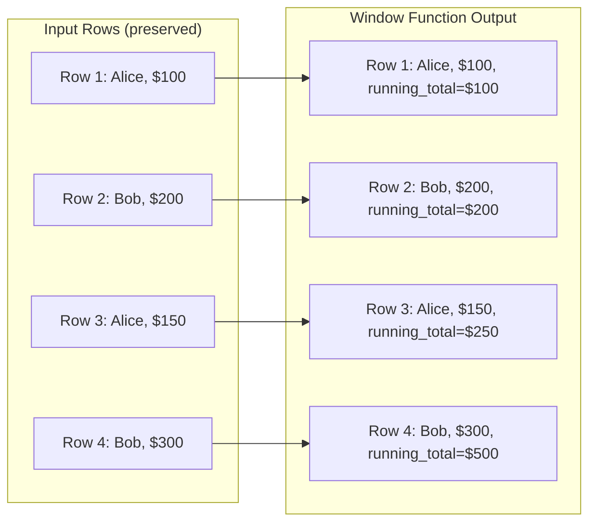
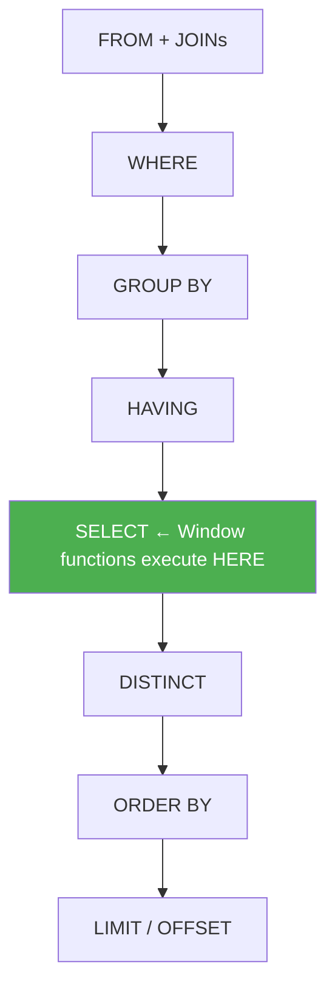
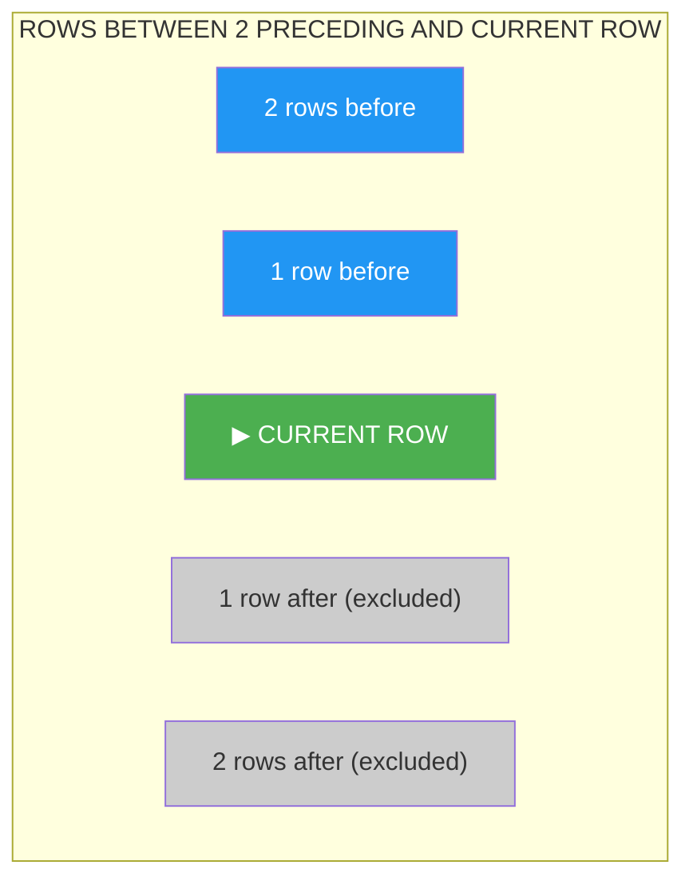
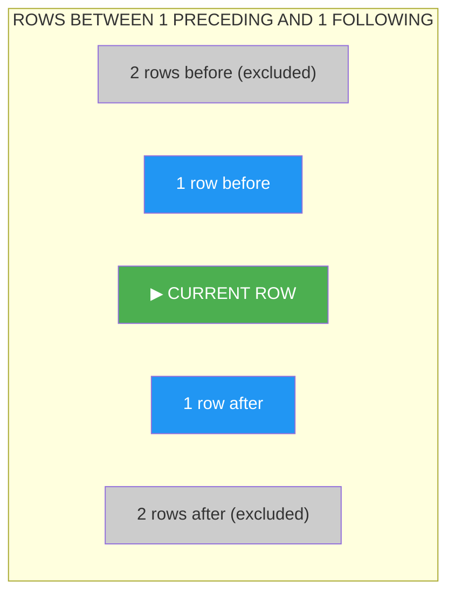

# Window Functions

Window functions are the single most powerful analytical tool in SQL. They let you perform calculations **across a set of rows related to the current row** — without collapsing the result set like `GROUP BY` does.

> [!tip] Why this matters
> Before window functions, calculating a running total, a rank, or a percentage-of-total required ugly self-joins or correlated subqueries. Window functions do all of this in a **single pass** over the data, cleanly and efficiently.

**Prerequisites:** [[05 - Aggregations and GROUP BY]], [[02 - SQL Execution Model]]
**Used heavily in:** [[08 - Common Query Patterns]], [[10 - Common Table Expressions]]

---

## What Are Window Functions?

A window function performs a calculation across a **window** of rows that are somehow related to the current row. Unlike `GROUP BY`, window functions **do not collapse rows** — you keep every original row and add computed columns.

### Mental Model

Imagine you have a spreadsheet of orders. For each row, you want to see the running total of the `total_amount` column. You wouldn't collapse all rows into one — you'd add a new column that shows the cumulative sum **at each row**. That's exactly what a window function does.



### Where Window Functions Execute

This is critical for understanding what you can and cannot do:



> [!danger] You CANNOT use window functions in WHERE or HAVING
> Because window functions execute during SELECT (after WHERE and HAVING), you cannot filter on them directly. You must wrap them in a subquery or CTE.
>
> ```sql
> -- ❌ WRONG: This will error
> SELECT *, ROW_NUMBER() OVER (ORDER BY salary DESC) AS rn
> FROM employees
> WHERE rn = 1;
>
> -- ✅ CORRECT: Wrap in CTE
> WITH ranked AS (
>     SELECT *, ROW_NUMBER() OVER (ORDER BY salary DESC) AS rn
>     FROM employees
> )
> SELECT * FROM ranked WHERE rn = 1;
> ```

See [[02 - SQL Execution Model]] for the full execution order.

---

## The OVER Clause

The `OVER` clause defines the **window** — which rows the function operates on.

### OVER() — Entire Result Set

```sql
-- Every employee's salary alongside the company average
SELECT name, salary,
       AVG(salary) OVER() AS company_avg
FROM employees;
```

| name | salary | company_avg |
|---|---|---|
| Alice | 80000 | 75000 |
| Bob | 70000 | 75000 |
| Carol | 90000 | 75000 |
| Dave | 60000 | 75000 |

`OVER()` with nothing inside means "the window is ALL rows in the result set."

### OVER(PARTITION BY ...) — Window Per Group

```sql
-- Each employee's salary alongside their department average
SELECT name, department_id, salary,
       AVG(salary) OVER(PARTITION BY department_id) AS dept_avg
FROM employees;
```

`PARTITION BY` divides the result set into groups. Each group gets its own independent window.

### OVER(ORDER BY ...) — Ordered Window

```sql
-- Running total of salary ordered by hire_date
SELECT name, hire_date, salary,
       SUM(salary) OVER(ORDER BY hire_date) AS running_total
FROM employees;
```

`ORDER BY` inside `OVER` defines the ordering of rows within the window. This is essential for running totals, rankings, and LAG/LEAD.

### OVER(PARTITION BY ... ORDER BY ...) — Full Window Specification

```sql
-- Running total per department, ordered by hire_date
SELECT name, department_id, hire_date, salary,
       SUM(salary) OVER(
           PARTITION BY department_id 
           ORDER BY hire_date
       ) AS dept_running_total
FROM employees;
```

### Frame Specifications

The **frame** narrows the window further — which rows within the partition/order are included in the calculation.

```sql
function_name OVER (
    PARTITION BY ...
    ORDER BY ...
    {ROWS | RANGE | GROUPS} BETWEEN
        {UNBOUNDED PRECEDING | N PRECEDING | CURRENT ROW}
        AND
        {CURRENT ROW | N FOLLOWING | UNBOUNDED FOLLOWING}
)
```

Common frames:

| Frame | Meaning |
|---|---|
| `ROWS BETWEEN UNBOUNDED PRECEDING AND CURRENT ROW` | All rows from start to current (running total) |
| `ROWS BETWEEN 2 PRECEDING AND CURRENT ROW` | Current row and 2 before it (3-row moving average) |
| `ROWS BETWEEN UNBOUNDED PRECEDING AND UNBOUNDED FOLLOWING` | All rows in the partition |
| `ROWS BETWEEN 6 PRECEDING AND CURRENT ROW` | 7-day moving average (with daily data) |
| `ROWS BETWEEN CURRENT ROW AND 1 FOLLOWING` | Current and next row |

> [!warning] Default frame (easily missed!)
> When you specify `ORDER BY` in `OVER`, the default frame is:
> `RANGE BETWEEN UNBOUNDED PRECEDING AND CURRENT ROW`
>
> This is **not** `ROWS` — it's `RANGE`. The difference matters when there are ties.
> - `ROWS`: each physical row is treated individually
> - `RANGE`: all rows with the same ORDER BY value are treated as a group
>
> To be explicit and avoid surprises, always specify your frame.

---

## PARTITION BY vs GROUP BY

This distinction is fundamental.

| Feature | GROUP BY | PARTITION BY |
|---|---|---|
| Collapses rows? | ✅ Yes — one row per group | ❌ No — all rows preserved |
| Available functions | Only aggregate (SUM, COUNT, etc.) | Aggregate + ranking + offset |
| Filtering | HAVING clause | Wrap in CTE/subquery, use WHERE |
| Use case | Summary reports | Analytics alongside detail rows |
| Result size | Fewer rows | Same number of rows |

### Example: Same Question, Two Approaches

"What is each employee's salary as a percentage of their department's total?"

```sql
-- GROUP BY approach: requires a self-join to get back the detail rows
SELECT e.name, e.salary, 
       ROUND(e.salary * 100.0 / d.dept_total, 1) AS pct_of_dept
FROM employees e
JOIN (
    SELECT department_id, SUM(salary) AS dept_total
    FROM employees
    GROUP BY department_id
) d ON e.department_id = d.department_id;

-- Window function approach: clean, single pass
SELECT name, salary,
       ROUND(salary * 100.0 / SUM(salary) OVER(PARTITION BY department_id), 1) AS pct_of_dept
FROM employees;
```

---

## ROW_NUMBER()

Assigns a unique sequential integer to each row within its partition.

```sql
SELECT 
    customer_id, order_date, total_amount,
    ROW_NUMBER() OVER (
        PARTITION BY customer_id 
        ORDER BY order_date DESC
    ) AS rn
FROM orders;
```

| customer_id | order_date | total_amount | rn |
|---|---|---|---|
| 1 | 2025-12-15 | 500 | 1 |
| 1 | 2025-11-20 | 300 | 2 |
| 1 | 2025-10-05 | 200 | 3 |
| 2 | 2025-12-01 | 800 | 1 |
| 2 | 2025-11-15 | 450 | 2 |

> [!warning] Non-deterministic without unique ORDER BY
> If two orders have the same `order_date`, ROW_NUMBER arbitrarily assigns 1 and 2 — and the assignment might change between executions. Always add a tiebreaker column (usually the primary key):
>
> ```sql
> ROW_NUMBER() OVER (
>     PARTITION BY customer_id 
>     ORDER BY order_date DESC, id DESC  -- id as tiebreaker
> ) AS rn
> ```

### Key Use Cases

- **Latest record per group:** `WHERE rn = 1` (see [[08 - Common Query Patterns]])
- **Deduplication:** delete rows where `rn > 1`
- **Pagination:** assign row numbers and filter by range
- **Top N per group:** `WHERE rn <= N`

---

## RANK() and DENSE_RANK()

### RANK()

Same as ROW_NUMBER, but ties get the same rank. Gaps appear after ties.

```sql
SELECT name, category, revenue,
       RANK() OVER (PARTITION BY category ORDER BY revenue DESC) AS rnk
FROM product_revenue;
```

### DENSE_RANK()

Like RANK, but no gaps — the next distinct value gets the next integer.

### Comparison with Sample Data

Given employees with salaries: 90000, 80000, 80000, 70000, 60000

```sql
SELECT name, salary,
       ROW_NUMBER() OVER (ORDER BY salary DESC) AS row_num,
       RANK()       OVER (ORDER BY salary DESC) AS rnk,
       DENSE_RANK() OVER (ORDER BY salary DESC) AS dense_rnk
FROM employees;
```

| name | salary | row_num | rnk | dense_rnk |
|---|---|---|---|---|
| Carol | 90000 | 1 | 1 | 1 |
| Alice | 80000 | 2 | 2 | 2 |
| Bob | 80000 | 3 | 2 | 2 |
| Dave | 70000 | 4 | 4 | 3 |
| Eve | 60000 | 5 | 5 | 4 |

### When to Use Which

| Function | Ties | Gaps | Use When |
|---|---|---|---|
| ROW_NUMBER | Broken arbitrarily | None | You need exactly N rows (dedup, pagination) |
| RANK | Same rank | Yes (1,2,2,4) | Competition-style ranking (Olympic medals) |
| DENSE_RANK | Same rank | No (1,2,2,3) | "Top N distinct levels" (salary bands, tiers) |

---

## LAG() and LEAD()

Access values from **previous** (LAG) or **next** (LEAD) rows without a self-join.

### Syntax

```sql
LAG(column, offset, default_value) OVER (PARTITION BY ... ORDER BY ...)
LEAD(column, offset, default_value) OVER (PARTITION BY ... ORDER BY ...)
```

- `offset`: how many rows back (LAG) or forward (LEAD). Default is 1.
- `default_value`: returned for the first/last rows where there is no previous/next. Default is NULL.

### Example: Month-over-Month Revenue Change

```sql
WITH monthly_revenue AS (
    SELECT 
        DATE_TRUNC('month', order_date) AS month,
        SUM(total_amount) AS revenue
    FROM orders
    GROUP BY DATE_TRUNC('month', order_date)
)
SELECT 
    month,
    revenue,
    LAG(revenue) OVER (ORDER BY month) AS prev_month_revenue,
    revenue - LAG(revenue) OVER (ORDER BY month) AS revenue_change,
    ROUND(
        (revenue - LAG(revenue) OVER (ORDER BY month)) * 100.0 
        / NULLIF(LAG(revenue) OVER (ORDER BY month), 0), 1
    ) AS pct_change
FROM monthly_revenue
ORDER BY month;
```

| month | revenue | prev_month_revenue | revenue_change | pct_change |
|---|---|---|---|---|
| 2025-01 | 50000 | NULL | NULL | NULL |
| 2025-02 | 62000 | 50000 | 12000 | 24.0 |
| 2025-03 | 58000 | 62000 | -4000 | -6.5 |

### Example: Time Between Consecutive Shipments

```sql
SELECT 
    id, order_id, shipped_date,
    LAG(shipped_date) OVER (PARTITION BY order_id ORDER BY shipped_date) AS prev_ship_date,
    shipped_date - LAG(shipped_date) OVER (PARTITION BY order_id ORDER BY shipped_date) AS days_between
FROM shipments
ORDER BY order_id, shipped_date;
```

> [!tip] LEAD is just LAG looking forward
> Use LAG for "compare to previous" (most common). Use LEAD for "compare to next" — e.g., "how many days until the next shipment?"

---

## Running Totals

### SUM() OVER(ORDER BY ...)

```sql
SELECT 
    order_date,
    total_amount,
    SUM(total_amount) OVER (ORDER BY order_date) AS running_total
FROM orders
WHERE customer_id = 1
ORDER BY order_date;
```

| order_date | total_amount | running_total |
|---|---|---|
| 2025-01-10 | 200 | 200 |
| 2025-02-15 | 350 | 550 |
| 2025-03-20 | 150 | 700 |
| 2025-04-05 | 400 | 1100 |

### ROWS vs RANGE: The Subtle Difference

```sql
-- Imagine two orders on the same date
-- RANGE (default): treats same-date rows as a group
SUM(total_amount) OVER (ORDER BY order_date RANGE BETWEEN UNBOUNDED PRECEDING AND CURRENT ROW)
-- Both rows with same date see the same running total (including both)

-- ROWS: treats each physical row independently
SUM(total_amount) OVER (ORDER BY order_date ROWS BETWEEN UNBOUNDED PRECEDING AND CURRENT ROW)
-- Each row sees a different running total
```

Given orders: (Jan 10, $200), (Jan 10, $150), (Jan 15, $300):

| order_date | amount | RANGE running_total | ROWS running_total |
|---|---|---|---|
| Jan 10 | 200 | 350 (both Jan 10 rows summed) | 200 |
| Jan 10 | 150 | 350 (same value as above!) | 350 |
| Jan 15 | 300 | 650 | 650 |

> [!warning] RANGE is the default — and it's usually NOT what you want
> If you have duplicate ORDER BY values, RANGE will give both rows the same running total. Use `ROWS` explicitly for predictable row-by-row accumulation.

---

## Sliding Windows (Moving Averages)

### 7-Day Moving Average

```sql
SELECT 
    order_date,
    total_amount,
    AVG(total_amount) OVER (
        ORDER BY order_date
        ROWS BETWEEN 6 PRECEDING AND CURRENT ROW
    ) AS moving_avg_7day
FROM daily_order_totals
ORDER BY order_date;
```

### 3-Month Rolling Sum

```sql
WITH monthly_revenue AS (
    SELECT 
        DATE_TRUNC('month', order_date) AS month,
        SUM(total_amount) AS revenue
    FROM orders
    GROUP BY DATE_TRUNC('month', order_date)
)
SELECT 
    month,
    revenue,
    SUM(revenue) OVER (
        ORDER BY month
        ROWS BETWEEN 2 PRECEDING AND CURRENT ROW
    ) AS rolling_3month_sum
FROM monthly_revenue;
```

### Frame Specification Visualization





---

## Latest Record Selection

The most common window function pattern — see [[08 - Common Query Patterns]] for full coverage.

### ROW_NUMBER + WHERE rn = 1

```sql
-- Most recent shipment per order
WITH ranked_shipments AS (
    SELECT *,
           ROW_NUMBER() OVER (
               PARTITION BY order_id 
               ORDER BY shipped_date DESC, id DESC
           ) AS rn
    FROM shipments
)
SELECT * FROM ranked_shipments WHERE rn = 1;
```

### CTE vs Derived Table

```sql
-- CTE approach (more readable)
WITH ranked AS (
    SELECT *, ROW_NUMBER() OVER (PARTITION BY customer_id ORDER BY order_date DESC) AS rn
    FROM orders
)
SELECT * FROM ranked WHERE rn = 1;

-- Derived table approach (equivalent)
SELECT * FROM (
    SELECT *, ROW_NUMBER() OVER (PARTITION BY customer_id ORDER BY order_date DESC) AS rn
    FROM orders
) ranked
WHERE rn = 1;
```

Both produce identical execution plans. Use whichever is more readable for your context.

---

## Analytics Queries

### Percentile Calculations

```sql
SELECT 
    name, salary,
    PERCENT_RANK() OVER (ORDER BY salary) AS percentile,
    -- 0.0 for lowest, 1.0 for highest
    CUME_DIST() OVER (ORDER BY salary) AS cumulative_dist,
    -- fraction of rows with value <= current row
    NTILE(4) OVER (ORDER BY salary) AS quartile
    -- divide into N equal groups
FROM employees;
```

| name | salary | percentile | cumulative_dist | quartile |
|---|---|---|---|---|
| Eve | 60000 | 0.00 | 0.20 | 1 |
| Dave | 70000 | 0.25 | 0.40 | 1 |
| Bob | 80000 | 0.50 | 0.60 | 2 |
| Alice | 80000 | 0.50 | 0.80 | 3 |
| Carol | 90000 | 1.00 | 1.00 | 4 |

### Year-over-Year Comparison

```sql
WITH yearly_revenue AS (
    SELECT 
        EXTRACT(YEAR FROM order_date) AS year,
        SUM(total_amount) AS annual_revenue
    FROM orders
    GROUP BY EXTRACT(YEAR FROM order_date)
)
SELECT 
    year,
    annual_revenue,
    LAG(annual_revenue) OVER (ORDER BY year) AS prev_year,
    ROUND(
        (annual_revenue - LAG(annual_revenue) OVER (ORDER BY year)) * 100.0
        / NULLIF(LAG(annual_revenue) OVER (ORDER BY year), 0), 1
    ) AS yoy_growth_pct
FROM yearly_revenue;
```

### Contribution Percentage

```sql
-- Each product's contribution to total revenue
SELECT 
    p.name,
    SUM(oi.quantity * oi.unit_price) AS product_revenue,
    ROUND(
        SUM(oi.quantity * oi.unit_price) * 100.0 
        / SUM(SUM(oi.quantity * oi.unit_price)) OVER(), 2
    ) AS pct_of_total
FROM order_items oi
JOIN products p ON p.id = oi.product_id
GROUP BY p.name
ORDER BY product_revenue DESC;
```

> [!tip] The nested SUM(SUM(...)) OVER() pattern
> The inner `SUM(oi.quantity * oi.unit_price)` is a regular aggregate (per GROUP BY). The outer `SUM(...) OVER()` is a window function over the entire result set. This lets you divide each group's total by the grand total in one query.

### Running Count and Running Average

```sql
SELECT 
    order_date,
    total_amount,
    COUNT(*) OVER (ORDER BY order_date ROWS UNBOUNDED PRECEDING) AS running_count,
    AVG(total_amount) OVER (ORDER BY order_date ROWS UNBOUNDED PRECEDING) AS running_avg
FROM orders
ORDER BY order_date;
```

---

## FIRST_VALUE / LAST_VALUE / NTH_VALUE

### FIRST_VALUE

```sql
-- Compare each employee's salary to the highest in their department
SELECT 
    name, department_id, salary,
    FIRST_VALUE(name) OVER (
        PARTITION BY department_id 
        ORDER BY salary DESC
    ) AS top_earner,
    FIRST_VALUE(salary) OVER (
        PARTITION BY department_id 
        ORDER BY salary DESC
    ) AS top_salary,
    salary - FIRST_VALUE(salary) OVER (
        PARTITION BY department_id 
        ORDER BY salary DESC
    ) AS diff_from_top
FROM employees;
```

### LAST_VALUE — The Gotcha

> [!danger] LAST_VALUE default frame trap!
> By default, `LAST_VALUE` with `ORDER BY` uses the frame `RANGE BETWEEN UNBOUNDED PRECEDING AND CURRENT ROW`. This means it only sees rows up to the current row — so `LAST_VALUE` just returns the current row's value. Useless!
>
> You **must** specify `ROWS BETWEEN UNBOUNDED PRECEDING AND UNBOUNDED FOLLOWING`:
>
> ```sql
> -- ❌ WRONG: returns the current row's value (default frame)
> LAST_VALUE(salary) OVER (
>     PARTITION BY department_id ORDER BY salary DESC
> ) AS lowest_salary
>
> -- ✅ CORRECT: see all rows in the partition
> LAST_VALUE(salary) OVER (
>     PARTITION BY department_id ORDER BY salary DESC
>     ROWS BETWEEN UNBOUNDED PRECEDING AND UNBOUNDED FOLLOWING
> ) AS lowest_salary
> ```

### NTH_VALUE

```sql
-- Get the 2nd highest salary per department
SELECT name, department_id, salary,
       NTH_VALUE(salary, 2) OVER (
           PARTITION BY department_id 
           ORDER BY salary DESC
           ROWS BETWEEN UNBOUNDED PRECEDING AND UNBOUNDED FOLLOWING
       ) AS second_highest
FROM employees;
```

---

## Common Mistakes

### 1. Using Window Functions in WHERE

```sql
-- ❌ This errors
SELECT * FROM orders
WHERE ROW_NUMBER() OVER (ORDER BY order_date DESC) = 1;

-- ✅ Use a CTE or subquery
WITH ranked AS (
    SELECT *, ROW_NUMBER() OVER (ORDER BY order_date DESC) AS rn FROM orders
)
SELECT * FROM ranked WHERE rn = 1;
```

### 2. Forgetting ORDER BY in ROW_NUMBER

```sql
-- ❌ Non-deterministic: which row gets rn=1? Arbitrary!
ROW_NUMBER() OVER (PARTITION BY customer_id) AS rn

-- ✅ Always specify ORDER BY
ROW_NUMBER() OVER (PARTITION BY customer_id ORDER BY order_date DESC, id DESC) AS rn
```

### 3. Not Understanding Frame Specifications

```sql
-- ❌ This doesn't give a true running total if there are ties in order_date
SUM(amount) OVER (ORDER BY order_date)  -- default RANGE frame

-- ✅ Explicit ROWS frame for row-by-row accumulation
SUM(amount) OVER (ORDER BY order_date ROWS UNBOUNDED PRECEDING)
```

### 4. LAST_VALUE Without Full Frame

See the LAST_VALUE section above — the default frame makes it return the current row's value.

### 5. Mixing Window Functions with GROUP BY Incorrectly

```sql
-- ❌ This errors: name is not in GROUP BY
SELECT name, department_id,
       SUM(salary) OVER (PARTITION BY department_id) AS dept_total
FROM employees
GROUP BY department_id;

-- ✅ Option A: No GROUP BY (window function on detail rows)
SELECT name, department_id, salary,
       SUM(salary) OVER (PARTITION BY department_id) AS dept_total
FROM employees;

-- ✅ Option B: GROUP BY first, then window function on aggregated results
SELECT department_id, SUM(salary) AS dept_salary,
       SUM(SUM(salary)) OVER () AS grand_total
FROM employees
GROUP BY department_id;
```

---

## Performance Considerations

### Window Functions Need Sorting

Every `ORDER BY` inside an `OVER` clause requires the database to sort the data. Multiple window functions with **different** ORDER BY clauses mean multiple sorts.

```sql
-- 3 different sorts needed!
SELECT 
    ROW_NUMBER() OVER (ORDER BY order_date) AS rn1,        -- sort 1
    ROW_NUMBER() OVER (ORDER BY total_amount DESC) AS rn2,  -- sort 2
    SUM(total_amount) OVER (ORDER BY customer_id) AS rt     -- sort 3
FROM orders;
```

> [!tip] Minimize distinct OVER() specifications
> Try to use the same PARTITION BY and ORDER BY across window functions. The optimizer can reuse the same sort.
>
> ```sql
> -- ✅ Good: single sort, reused for all three
> SELECT 
>     ROW_NUMBER() OVER w AS rn,
>     SUM(total_amount) OVER w AS running_total,
>     LAG(total_amount) OVER w AS prev_amount
> FROM orders
> WINDOW w AS (PARTITION BY customer_id ORDER BY order_date);
> ```

### Index Alignment

If your window function has `PARTITION BY department_id ORDER BY salary DESC`, an index on `(department_id, salary DESC)` lets the engine avoid a sort entirely.

### When NOT to Use Window Functions

| Scenario | Better Alternative |
|---|---|
| Simple aggregation (one row per group) | GROUP BY |
| You only need the top 1 per group | Sometimes `DISTINCT ON` (PostgreSQL) or a correlated subquery with a good index |
| Very large datasets with many partitions | Consider pre-aggregation into summary tables |

---

## "How Beginners Think" vs "How Strong SQL Engineers Think"

| Task | Beginner | Expert |
|---|---|---|
| "Add department total alongside each row" | GROUP BY + self-join back to detail | `SUM() OVER(PARTITION BY dept_id)` — no collapse, no rejoin |
| "Rank employees by salary" | Sort in application code | `RANK() OVER(ORDER BY salary DESC)` — let the DB do it |
| "Compare to previous row" | Self-join `ON a.id = b.id + 1` (fragile) | `LAG(column) OVER(ORDER BY ...)` |
| "Running total" | Cursor or self-join | `SUM() OVER(ORDER BY ... ROWS UNBOUNDED PRECEDING)` |
| "Latest record per group" | GROUP BY + rejoin | `ROW_NUMBER() OVER(...) = 1` |
| "Percentage of total" | Two queries or subquery | `value / SUM(value) OVER()` |

> [!tip] The key insight
> Beginners **collapse** rows with GROUP BY and then **re-expand** by joining back to the detail table. Window functions let you **skip both steps** — compute the aggregate alongside each row in a single pass.

---

## Named Window Definitions (WINDOW Clause)

When you use the same window specification multiple times, name it with the `WINDOW` clause:

```sql
SELECT 
    name, department_id, salary,
    ROW_NUMBER() OVER dept_sal AS rank_in_dept,
    SUM(salary) OVER dept_sal AS running_salary,
    LAG(salary) OVER dept_sal AS prev_salary
FROM employees
WINDOW dept_sal AS (PARTITION BY department_id ORDER BY salary DESC);
```

Benefits:
- DRY — don't repeat the same OVER clause
- Easier to read and maintain
- Optimizer can clearly see they share the same sort

---

## Practice Exercises

> [!example] Exercise 1: Department Salary Ranking
> Rank all employees by salary within their department. Use ROW_NUMBER, RANK, and DENSE_RANK side by side. Show the results for a department where two employees have the same salary.

> [!example] Exercise 2: Running Total
> Calculate a running total of `total_amount` for each customer's orders, ordered by `order_date`. Use an explicit ROWS frame specification.

> [!example] Exercise 3: Month-over-Month Growth
> Calculate the month-over-month percentage change in total order revenue. Handle the first month (no previous data) gracefully.

> [!example] Exercise 4: Latest Order Per Customer
> Using ROW_NUMBER, find the most recent order for each customer. Include a tiebreaker column. Wrap in a CTE and filter.

> [!example] Exercise 5: Moving Average
> Calculate a 3-order moving average of `total_amount` for each customer (i.e., average of current order and the two before it).

> [!example] Exercise 6: Contribution Percentage
> For each product category, show each product's revenue and its percentage contribution to the category total. Order by contribution descending within each category.

> [!example] Exercise 7: Consecutive Days
> Using LAG, identify orders where the same customer placed orders on consecutive days. Show the customer, both order dates, and the gap in days.

> [!example] Exercise 8: Quartile Analysis
> Divide all employees into salary quartiles using NTILE(4). Show the min, max, and average salary per quartile.

> [!example] Exercise 9: Gap Detection with LEAD
> Using LEAD, find shipments where the gap between one delivery and the next (for the same carrier) was more than 14 days.

> [!example] Exercise 10: Top 3 Earners Per Department
> Find the top 3 highest-paid employees in each department using DENSE_RANK. Include ties (if the 3rd and 4th employees have the same salary, include both).

---

## Interview Questions

> [!question] Q1: What is the difference between ROW_NUMBER, RANK, and DENSE_RANK?
> ROW_NUMBER assigns unique sequential numbers (ties broken arbitrarily). RANK assigns the same number to ties but leaves gaps (1,2,2,4). DENSE_RANK assigns the same number to ties with no gaps (1,2,2,3).

> [!question] Q2: Can you use a window function in a WHERE clause? Why or why not?
> No. Window functions execute during SELECT, which happens after WHERE in the SQL execution order. You must wrap the window function in a CTE or subquery to filter on it.

> [!question] Q3: What is the default frame when you specify ORDER BY in OVER?
> `RANGE BETWEEN UNBOUNDED PRECEDING AND CURRENT ROW`. This means ties in the ORDER BY column are treated as a group, which can produce unexpected running totals. Use `ROWS` explicitly to avoid this.

> [!question] Q4: How do you calculate a 7-day moving average?
> `AVG(value) OVER (ORDER BY date_col ROWS BETWEEN 6 PRECEDING AND CURRENT ROW)`. The "6 PRECEDING AND CURRENT ROW" gives 7 rows total.

> [!question] Q5: What's the difference between PARTITION BY and GROUP BY?
> GROUP BY collapses rows — you get one row per group. PARTITION BY preserves all rows — it defines the "window" for the calculation but doesn't reduce the result set.

> [!question] Q6: Explain the LAST_VALUE gotcha.
> With `ORDER BY`, the default frame is `RANGE BETWEEN UNBOUNDED PRECEDING AND CURRENT ROW`, so LAST_VALUE only sees up to the current row. You must specify `ROWS BETWEEN UNBOUNDED PRECEDING AND UNBOUNDED FOLLOWING` to see all rows.

> [!question] Q7: How do you optimize queries with multiple window functions?
> Use the same PARTITION BY and ORDER BY across window functions so the optimizer can reuse the same sort. Use the WINDOW clause to name shared specifications. Align indexes with PARTITION BY + ORDER BY columns.

> [!question] Q8: When would you prefer a self-join over a window function?
> Rarely. Self-joins for running totals are O(n²), while window functions are O(n log n) at worst. However, if your DBMS doesn't support window functions (rare today) or you need to join with complex conditions that don't fit the OVER clause, a self-join might be necessary.

---

## Query Debugging Walkthrough

### Scenario: "My running total is wrong"

A developer writes:

```sql
SELECT order_date, total_amount,
       SUM(total_amount) OVER (ORDER BY order_date) AS running_total
FROM orders
WHERE customer_id = 1;
```

They expect the running total to increase row by row, but two rows with the same `order_date` show the **same** running total value.

**Diagnosis:**

1. The default frame is `RANGE BETWEEN UNBOUNDED PRECEDING AND CURRENT ROW`.
2. RANGE groups ties together — both rows with the same `order_date` see a running total that includes both.
3. Fix: Use `ROWS` instead of the default `RANGE`.

```sql
-- Fixed query
SELECT order_date, total_amount,
       SUM(total_amount) OVER (
           ORDER BY order_date, id  -- add tiebreaker
           ROWS BETWEEN UNBOUNDED PRECEDING AND CURRENT ROW  -- explicit ROWS
       ) AS running_total
FROM orders
WHERE customer_id = 1;
```

### Scenario: "ROW_NUMBER gives different results each time"

```sql
SELECT name, salary,
       ROW_NUMBER() OVER (PARTITION BY department_id ORDER BY salary DESC) AS rn
FROM employees;
```

Two employees with the same salary keep swapping between `rn = 2` and `rn = 3`.

**Diagnosis:**
ROW_NUMBER must assign unique numbers. With identical ORDER BY values, the assignment is arbitrary and non-deterministic. Add a tiebreaker:

```sql
ROW_NUMBER() OVER (PARTITION BY department_id ORDER BY salary DESC, id ASC) AS rn
```

### Scenario: "My window function returns NULL"

```sql
SELECT name, salary,
       NTH_VALUE(salary, 2) OVER (PARTITION BY department_id ORDER BY salary DESC) AS second_highest
FROM employees;
```

The first row in each partition shows NULL for `second_highest`.

**Diagnosis:**
Default frame is `RANGE BETWEEN UNBOUNDED PRECEDING AND CURRENT ROW`. On the first row, the frame only contains one row — there is no 2nd value. Fix:

```sql
NTH_VALUE(salary, 2) OVER (
    PARTITION BY department_id ORDER BY salary DESC
    ROWS BETWEEN UNBOUNDED PRECEDING AND UNBOUNDED FOLLOWING
) AS second_highest
```
