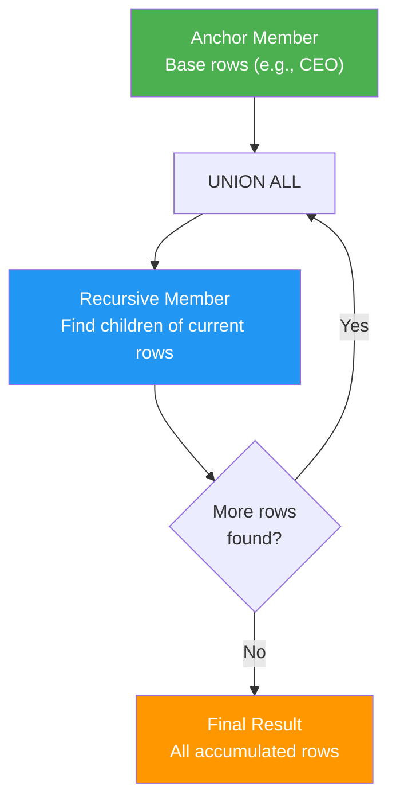
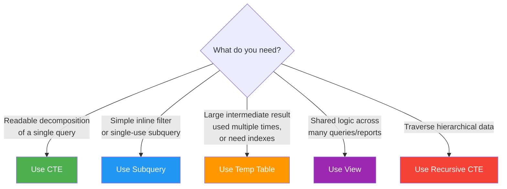

# Common Table Expressions (CTEs)

CTEs are **named, temporary result sets** defined with the `WITH` clause. They exist only for the duration of a single query and make complex SQL dramatically more readable.

> [!tip] Mental model
> Think of CTEs as **paragraphs** in a SQL **essay**. Each CTE handles one logical step, and the final SELECT combines them into the answer. Instead of one massive nested query, you write a series of named, self-documenting transformations.

**Prerequisites:** [[07 - Subqueries]], [[05 - Aggregations and GROUP BY]]
**Used in:** [[08 - Common Query Patterns]], [[09 - Window Functions]]

---

## Basic CTE Syntax

```sql
WITH cte_name AS (
    SELECT ...
)
SELECT * FROM cte_name;
```

### Simple Example

```sql
-- Without CTE: nested subquery
SELECT d.name, dept_stats.avg_salary
FROM departments d
JOIN (
    SELECT department_id, AVG(salary) AS avg_salary
    FROM employees
    WHERE is_active = TRUE
    GROUP BY department_id
) dept_stats ON d.id = dept_stats.department_id
WHERE dept_stats.avg_salary > 75000;

-- With CTE: same logic, much clearer
WITH dept_stats AS (
    SELECT department_id, AVG(salary) AS avg_salary
    FROM employees
    WHERE is_active = TRUE
    GROUP BY department_id
)
SELECT d.name, ds.avg_salary
FROM departments d
JOIN dept_stats ds ON d.id = ds.department_id
WHERE ds.avg_salary > 75000;
```

The logic is identical. The CTE version reads top-to-bottom: "first compute department stats, then join them with department names."

---

## Multiple CTEs in One Query

Chain CTEs with commas. Each CTE can reference the ones defined before it.

```sql
WITH 
-- Step 1: Get active employees
active_employees AS (
    SELECT id, name, department_id, salary
    FROM employees
    WHERE is_active = TRUE
),
-- Step 2: Compute department averages (from active employees)
dept_averages AS (
    SELECT department_id, AVG(salary) AS avg_salary, COUNT(*) AS headcount
    FROM active_employees
    GROUP BY department_id
),
-- Step 3: Find departments above the company average
above_avg_depts AS (
    SELECT department_id, avg_salary, headcount
    FROM dept_averages
    WHERE avg_salary > (SELECT AVG(avg_salary) FROM dept_averages)
)
-- Final: Join with department names
SELECT d.name, aad.avg_salary, aad.headcount
FROM above_avg_depts aad
JOIN departments d ON d.id = aad.department_id
ORDER BY aad.avg_salary DESC;
```

> [!tip] CTEs referencing other CTEs
> Each CTE can reference any CTE defined **before** it (above it in the WITH clause). This creates a pipeline of transformations, each building on the previous step.

---

## Query Readability: Before and After

### Complex Nested Query (Hard to Read)

```sql
SELECT c.name, c.email, order_summary.total_orders, order_summary.total_spent,
       order_summary.avg_order_value
FROM customers c
JOIN (
    SELECT customer_id,
           COUNT(*) AS total_orders,
           SUM(total_amount) AS total_spent,
           AVG(total_amount) AS avg_order_value
    FROM orders
    WHERE status != 'cancelled'
      AND order_date >= CURRENT_DATE - INTERVAL '1 year'
    GROUP BY customer_id
    HAVING COUNT(*) >= 5
) order_summary ON c.id = order_summary.customer_id
LEFT JOIN (
    SELECT customer_id, MAX(order_date) AS last_order_date
    FROM orders
    WHERE status != 'cancelled'
    GROUP BY customer_id
) last_order ON c.id = last_order.customer_id
WHERE last_order.last_order_date >= CURRENT_DATE - INTERVAL '90 days'
ORDER BY order_summary.total_spent DESC;
```

### Same Query with CTEs (Easy to Read)

```sql
WITH 
-- Step 1: Filter to valid orders in the last year
recent_orders AS (
    SELECT customer_id, order_date, total_amount
    FROM orders
    WHERE status != 'cancelled'
      AND order_date >= CURRENT_DATE - INTERVAL '1 year'
),
-- Step 2: Summarize per customer (at least 5 orders)
order_summary AS (
    SELECT 
        customer_id,
        COUNT(*) AS total_orders,
        SUM(total_amount) AS total_spent,
        AVG(total_amount) AS avg_order_value,
        MAX(order_date) AS last_order_date
    FROM recent_orders
    GROUP BY customer_id
    HAVING COUNT(*) >= 5
),
-- Step 3: Keep only customers active in the last 90 days
active_customers AS (
    SELECT * FROM order_summary
    WHERE last_order_date >= CURRENT_DATE - INTERVAL '90 days'
)
-- Final: Enrich with customer details
SELECT c.name, c.email, ac.total_orders, ac.total_spent, ac.avg_order_value
FROM active_customers ac
JOIN customers c ON c.id = ac.customer_id
ORDER BY ac.total_spent DESC;
```

> [!tip] CTE naming conventions
> - Use descriptive, snake_case names: `active_employees`, `monthly_revenue`, `ranked_orders`
> - Avoid generic names like `temp`, `data`, `cte1`
> - The name should tell you what the CTE contains, not what it does: `high_value_customers` not `filter_customers`

---

## Complex Query Decomposition

### Strategy: One CTE Per Transformation

When facing a complex business question, break it into steps:

1. **Filter** — narrow the data to what's relevant
2. **Transform** — reshape, calculate derived columns
3. **Aggregate** — group and summarize
4. **Combine** — join with other data sources
5. **Present** — final SELECT with formatting

### Example: Shipping Performance Report

*"For each carrier, show: total shipments, on-time delivery rate, average delivery time, and rank carriers by on-time rate."*

```sql
WITH 
-- Step 1: Only completed deliveries
completed_shipments AS (
    SELECT 
        id, order_id, carrier, shipped_date, delivered_date,
        delivered_date - shipped_date AS delivery_days
    FROM shipments
    WHERE status = 'delivered'
      AND delivered_date IS NOT NULL
),
-- Step 2: Determine on-time status (assume 5-day SLA)
with_on_time AS (
    SELECT *,
           CASE WHEN delivery_days <= 5 THEN 1 ELSE 0 END AS is_on_time
    FROM completed_shipments
),
-- Step 3: Aggregate per carrier
carrier_stats AS (
    SELECT 
        carrier,
        COUNT(*) AS total_deliveries,
        SUM(is_on_time) AS on_time_count,
        ROUND(SUM(is_on_time) * 100.0 / COUNT(*), 1) AS on_time_pct,
        ROUND(AVG(delivery_days), 1) AS avg_delivery_days
    FROM with_on_time
    GROUP BY carrier
),
-- Step 4: Rank carriers
ranked_carriers AS (
    SELECT *,
           RANK() OVER (ORDER BY on_time_pct DESC) AS carrier_rank
    FROM carrier_stats
)
-- Final: Present
SELECT carrier_rank, carrier, total_deliveries, on_time_pct, avg_delivery_days
FROM ranked_carriers
ORDER BY carrier_rank;
```

Each CTE is simple, testable, and self-documenting. You can debug any step by changing the final SELECT to `SELECT * FROM with_on_time LIMIT 10`.

---

## Recursive CTEs

Recursive CTEs traverse **hierarchical** or **graph-structured** data. They have two parts connected by `UNION ALL`:

1. **Anchor member** — the starting point (base case)
2. **Recursive member** — references the CTE itself (recursive case)



### Basic Syntax

```sql
WITH RECURSIVE cte_name AS (
    -- Anchor member: starting rows
    SELECT columns FROM table WHERE condition

    UNION ALL

    -- Recursive member: reference cte_name
    SELECT columns FROM table
    JOIN cte_name ON parent-child relationship
)
SELECT * FROM cte_name;
```

> [!warning] MySQL/SQL Server syntax
> - MySQL: Use `WITH RECURSIVE`
> - SQL Server: Just `WITH` (recursive is implied when the CTE references itself)
> - PostgreSQL: Use `WITH RECURSIVE`

### Use Case 1: Organizational Hierarchy

```sql
-- Find all direct and indirect reports under a manager (id = 1)
WITH RECURSIVE org_tree AS (
    -- Anchor: start with the root manager
    SELECT id, name, manager_id, 0 AS depth, 
           CAST(name AS VARCHAR(1000)) AS path
    FROM employees
    WHERE id = 1

    UNION ALL

    -- Recursive: find direct reports of current level
    SELECT e.id, e.name, e.manager_id, ot.depth + 1,
           CAST(ot.path || ' → ' || e.name AS VARCHAR(1000))
    FROM employees e
    JOIN org_tree ot ON e.manager_id = ot.id
)
SELECT depth, name, path
FROM org_tree
ORDER BY path;
```

Output:

| depth | name | path |
|---|---|---|
| 0 | CEO | CEO |
| 1 | VP Sales | CEO → VP Sales |
| 1 | VP Engineering | CEO → VP Engineering |
| 2 | Tech Lead | CEO → VP Engineering → Tech Lead |
| 3 | Developer A | CEO → VP Engineering → Tech Lead → Developer A |
| 2 | Regional Mgr | CEO → VP Sales → Regional Mgr |

### Use Case 2: Bill of Materials (BOM)

```sql
-- Explode a product's components recursively
WITH RECURSIVE bom AS (
    -- Anchor: top-level product
    SELECT component_id, component_name, quantity, 1 AS level
    FROM product_components
    WHERE parent_product_id = 100  -- the product to explode

    UNION ALL

    -- Recursive: sub-components
    SELECT pc.component_id, pc.component_name, 
           pc.quantity * bom.quantity AS total_quantity,
           bom.level + 1
    FROM product_components pc
    JOIN bom ON pc.parent_product_id = bom.component_id
)
SELECT level, component_name, total_quantity
FROM bom
ORDER BY level, component_name;
```

### Use Case 3: Category Trees

```sql
-- Build a full category path: "Electronics > Computers > Laptops"
WITH RECURSIVE category_path AS (
    SELECT id, name, parent_id, CAST(name AS VARCHAR(500)) AS full_path
    FROM categories
    WHERE parent_id IS NULL  -- root categories

    UNION ALL

    SELECT c.id, c.name, c.parent_id,
           CAST(cp.full_path || ' > ' || c.name AS VARCHAR(500))
    FROM categories c
    JOIN category_path cp ON c.parent_id = cp.id
)
SELECT * FROM category_path ORDER BY full_path;
```

### Use Case 4: Generating a Date Sequence

```sql
-- Generate dates for the last 30 days (no table needed)
WITH RECURSIVE date_series AS (
    SELECT CURRENT_DATE - INTERVAL '30 days' AS dt

    UNION ALL

    SELECT dt + INTERVAL '1 day'
    FROM date_series
    WHERE dt < CURRENT_DATE
)
SELECT dt FROM date_series;
```

> [!tip] Use generate_series() in PostgreSQL instead
> PostgreSQL has `generate_series()` built in, which is faster for date ranges. Use recursive CTEs for this pattern in MySQL or SQL Server where generate_series isn't available.

### Use Case 5: Graph Traversal (Route Finding)

```sql
-- Find all reachable cities from 'New York' in a routes table
WITH RECURSIVE reachable AS (
    SELECT destination AS city, 1 AS hops,
           CAST('New York → ' || destination AS VARCHAR(1000)) AS route
    FROM routes
    WHERE origin = 'New York'

    UNION ALL

    SELECT r.destination, re.hops + 1,
           CAST(re.route || ' → ' || r.destination AS VARCHAR(1000))
    FROM routes r
    JOIN reachable re ON r.origin = re.city
    WHERE re.hops < 5  -- prevent infinite loops
      AND re.route NOT LIKE '%' || r.destination || '%'  -- avoid cycles
)
SELECT DISTINCT city, hops, route
FROM reachable
ORDER BY hops, city;
```

### Termination Conditions

> [!danger] Recursive CTEs can loop forever!
> If there's a cycle in your data (A → B → C → A), the recursion never terminates. Always add safety guards:
>
> ```sql
> -- Guard 1: Maximum depth
> WHERE depth < 100
>
> -- Guard 2: Cycle detection via path tracking
> WHERE path NOT LIKE '%' || new_node || '%'
>
> -- Guard 3: Database-level limit
> -- SQL Server: OPTION (MAXRECURSION 100)
> -- PostgreSQL: No built-in limit (use WHERE clause)
> -- MySQL: @@cte_max_recursion_depth (default 1000)
> ```

### MAX RECURSION

```sql
-- SQL Server: limit recursion depth
WITH org_tree AS (
    SELECT id, name, manager_id, 0 AS depth FROM employees WHERE id = 1
    UNION ALL
    SELECT e.id, e.name, e.manager_id, ot.depth + 1
    FROM employees e JOIN org_tree ot ON e.manager_id = ot.id
    WHERE ot.depth < 50
)
SELECT * FROM org_tree
OPTION (MAXRECURSION 50);

-- MySQL: set session variable
SET @@cte_max_recursion_depth = 500;
```

### Performance with Large Hierarchies

Recursive CTEs can be slow for large hierarchies because:
- Each level requires a separate query execution
- No index can directly support the recursion
- Very deep hierarchies (100+ levels) accumulate overhead

**Alternatives for read-heavy workloads:**

| Model | Read Performance | Write Performance | When to Use |
|---|---|---|---|
| Recursive CTE (adjacency list) | O(depth × breadth) | O(1) — update one row | Small-medium hierarchies, frequent writes |
| Materialized path ("/1/3/6/") | O(1) — LIKE query | O(subtree) — update paths below | Read-heavy, moderate depth |
| Nested set (lft, rgt) | O(1) — BETWEEN query | O(n) — renumber tree | Read-heavy, rare writes |
| Closure table (ancestor, descendant) | O(1) — JOIN | O(depth) — insert rows | Balanced read/write, medium-large trees |

---

## CTE vs Subquery vs Temp Table vs View

| Feature | CTE | Subquery | Temp Table | View |
|---|---|---|---|---|
| **Scope** | Single statement | Single query position | Session / transaction | Permanent |
| **Persistence** | None — ephemeral | None | Until session ends / DROP | Until DROPped |
| **Materialized?** | Usually **not** (inlined by optimizer) | Not materialized | **Yes** — data stored on disk | Not materialized (virtual) |
| **Multiple references** | Can reference multiple times (but re-evaluated each time*) | Must duplicate the subquery | Reference as many times as needed | Reference from any query |
| **Index support** | No (it's virtual) | No | Yes — you can add indexes | No (uses base table indexes) |
| **Readability** | ✅ Best for decomposition | ⚠️ Nests deeply | ⚠️ Imperative style | ✅ Named, reusable |
| **Recursion** | ✅ Yes (RECURSIVE) | ❌ No | ❌ No | ❌ No |
| **Use when** | Complex single query | Simple inline filtering | Multi-step ETL, large intermediate results | Shared logic across queries |

> [!warning] CTEs are NOT always materialized
> Many developers assume CTEs are computed once and cached. In most databases (PostgreSQL 12+, MySQL, SQL Server), the optimizer **inlines** the CTE — treating it like a subquery. This means if you reference the CTE twice, it may execute twice.
>
> **PostgreSQL:** Use `AS MATERIALIZED` to force materialization:
> ```sql
> WITH expensive_calc AS MATERIALIZED (
>     SELECT ... -- complex computation
> )
> SELECT * FROM expensive_calc a
> JOIN expensive_calc b ON ...;
> ```
>
> **SQL Server:** The optimizer decides. To force materialization, use a temp table instead.

### When to Use Each



---

## CTE Scope and Limitations

### A CTE Only Lives for the Next Statement

```sql
-- ✅ This works: CTE used in the immediately following SELECT
WITH high_earners AS (
    SELECT * FROM employees WHERE salary > 100000
)
SELECT * FROM high_earners;

-- ❌ This FAILS: CTE is out of scope for the second query
WITH high_earners AS (
    SELECT * FROM employees WHERE salary > 100000
)
SELECT * FROM high_earners;
SELECT COUNT(*) FROM high_earners;  -- ERROR: "high_earners" does not exist
```

If you need to reuse the result across multiple statements, use a temp table:

```sql
CREATE TEMP TABLE high_earners AS
SELECT * FROM employees WHERE salary > 100000;

SELECT * FROM high_earners;
SELECT COUNT(*) FROM high_earners;  -- ✅ Works

DROP TABLE high_earners;
```

### CTEs in INSERT, UPDATE, DELETE

CTEs aren't just for SELECT. You can use them with DML:

```sql
-- CTE with DELETE: remove duplicate orders
WITH duplicates AS (
    SELECT id,
           ROW_NUMBER() OVER (
               PARTITION BY customer_id, order_date, total_amount
               ORDER BY id
           ) AS rn
    FROM orders
)
DELETE FROM orders
WHERE id IN (SELECT id FROM duplicates WHERE rn > 1);

-- CTE with INSERT: populate a summary table
WITH monthly_stats AS (
    SELECT DATE_TRUNC('month', order_date) AS month,
           COUNT(*) AS order_count,
           SUM(total_amount) AS revenue
    FROM orders
    GROUP BY DATE_TRUNC('month', order_date)
)
INSERT INTO revenue_summary (month, order_count, revenue)
SELECT * FROM monthly_stats;
```

---

## Common Mistakes

### 1. Assuming CTEs Are Cached/Materialized

```sql
-- ❌ This CTE may execute TWICE (once per reference)
WITH expensive AS (
    SELECT customer_id, SUM(total_amount) AS total
    FROM orders
    GROUP BY customer_id
)
SELECT a.customer_id, a.total, b.total
FROM expensive a
JOIN expensive b ON a.customer_id != b.customer_id;

-- ✅ Force materialization (PostgreSQL) or use a temp table
WITH expensive AS MATERIALIZED (
    SELECT customer_id, SUM(total_amount) AS total
    FROM orders
    GROUP BY customer_id
)
SELECT a.customer_id, a.total, b.total
FROM expensive a
JOIN expensive b ON a.customer_id != b.customer_id;
```

### 2. Recursive CTE Without Proper Termination

```sql
-- ❌ INFINITE LOOP if there's a cycle in manager_id
WITH RECURSIVE org AS (
    SELECT id, manager_id FROM employees WHERE id = 1
    UNION ALL
    SELECT e.id, e.manager_id
    FROM employees e JOIN org o ON e.manager_id = o.id
    -- No depth limit, no cycle detection!
)
SELECT * FROM org;

-- ✅ Safe: depth limit + cycle detection
WITH RECURSIVE org AS (
    SELECT id, manager_id, 0 AS depth, ARRAY[id] AS visited
    FROM employees WHERE id = 1
    UNION ALL
    SELECT e.id, e.manager_id, o.depth + 1, o.visited || e.id
    FROM employees e 
    JOIN org o ON e.manager_id = o.id
    WHERE o.depth < 20                -- depth limit
      AND e.id != ALL(o.visited)      -- cycle detection (PostgreSQL)
)
SELECT * FROM org;
```

### 3. Overusing CTEs for Simple Queries

```sql
-- ❌ Overkill: CTE adds noise to a simple query
WITH active AS (
    SELECT * FROM employees WHERE is_active = TRUE
)
SELECT name, salary FROM active WHERE salary > 70000;

-- ✅ Just write the query directly
SELECT name, salary FROM employees WHERE is_active = TRUE AND salary > 70000;
```

> [!tip] When to use CTEs vs inline
> CTEs shine when the query has **multiple logical steps** or when the same derived result is referenced more than once. For a single filter, just use WHERE.

### 4. Not Realizing CTE Scope Is One Statement

See the "CTE Scope" section above. A CTE defined in one query cannot be used in a subsequent query.

### 5. Using CTE When a Temp Table Is Better

If your CTE result is:
- Very large
- Referenced multiple times in the same session
- Needs an index for performance

Use a temp table instead. CTEs are not indexed and may re-execute.

---

## Debugging CTEs Step by Step

One of the biggest advantages of CTEs: you can **debug each step independently** by changing only the final SELECT.

```sql
WITH 
step_1 AS (
    SELECT customer_id, order_date, total_amount
    FROM orders WHERE status != 'cancelled'
),
step_2 AS (
    SELECT customer_id, COUNT(*) AS order_count, SUM(total_amount) AS total
    FROM step_1
    GROUP BY customer_id
),
step_3 AS (
    SELECT * FROM step_2 WHERE order_count >= 5
)
-- Debug: change this to inspect any step
-- SELECT * FROM step_1 LIMIT 10;
-- SELECT * FROM step_2 ORDER BY total DESC LIMIT 10;
SELECT c.name, s.order_count, s.total
FROM step_3 s
JOIN customers c ON c.id = s.customer_id
ORDER BY s.total DESC;
```

> [!tip] CTE debugging workflow
> 1. Write the first CTE, run `SELECT * FROM cte_1 LIMIT 10` to verify
> 2. Add the next CTE, run `SELECT * FROM cte_2 LIMIT 10`
> 3. Continue until all steps are verified
> 4. Write the final SELECT
>
> This step-by-step approach catches bugs early and makes complex queries tractable.

---

## Real-World Example: Shipment Delay Analysis

*"Find carriers whose average delivery time increased by more than 20% compared to the previous quarter."*

```sql
WITH 
-- Step 1: Calculate delivery time per shipment
delivery_times AS (
    SELECT 
        carrier,
        shipped_date,
        delivered_date,
        delivered_date - shipped_date AS delivery_days,
        DATE_TRUNC('quarter', shipped_date) AS quarter
    FROM shipments
    WHERE status = 'delivered'
      AND delivered_date IS NOT NULL
),
-- Step 2: Average delivery time per carrier per quarter
quarterly_avg AS (
    SELECT 
        carrier,
        quarter,
        ROUND(AVG(delivery_days), 1) AS avg_days,
        COUNT(*) AS shipment_count
    FROM delivery_times
    GROUP BY carrier, quarter
),
-- Step 3: Compare to previous quarter using LAG
with_prev_quarter AS (
    SELECT *,
           LAG(avg_days) OVER (PARTITION BY carrier ORDER BY quarter) AS prev_avg_days
    FROM quarterly_avg
),
-- Step 4: Calculate percentage change
pct_change AS (
    SELECT *,
           ROUND(
               (avg_days - prev_avg_days) * 100.0 / NULLIF(prev_avg_days, 0), 1
           ) AS pct_increase
    FROM with_prev_quarter
    WHERE prev_avg_days IS NOT NULL
)
-- Final: Carriers with >20% increase
SELECT carrier, quarter, avg_days, prev_avg_days, pct_increase, shipment_count
FROM pct_change
WHERE pct_increase > 20
ORDER BY pct_increase DESC;
```

This query combines CTEs with window functions ([[09 - Window Functions]]) — a common pattern for analytics queries. Each CTE is independently debuggable.

---

## "How Beginners Think" vs "How Strong SQL Engineers Think"

| Aspect | Beginner | Expert |
|---|---|---|
| Complex query | One massive nested query | Break into CTEs, each with a clear name |
| Reusing logic | Copy-paste subqueries | Define a CTE and reference by name |
| Debugging | Stare at 50-line nested query | Comment out final SELECT, inspect each CTE |
| Hierarchies | Fixed number of JOINs (3 levels max) | Recursive CTE (arbitrary depth) |
| Performance | "CTEs are faster because they cache" | "CTEs are usually inlined; use temp tables for materialization" |
| Query structure | Bottom-up (inner subquery first) | Top-down (write CTEs in logical order) |

---

## Practice Exercises

> [!example] Exercise 1: Basic CTE
> Rewrite this query using CTEs for readability:
> ```sql
> SELECT d.name, stats.emp_count, stats.avg_salary
> FROM departments d
> JOIN (SELECT department_id, COUNT(*) AS emp_count, AVG(salary) AS avg_salary
>       FROM employees WHERE is_active = TRUE GROUP BY department_id) stats
> ON d.id = stats.department_id
> WHERE stats.emp_count > 5;
> ```

> [!example] Exercise 2: Multiple CTEs
> Write a query using multiple CTEs to find: customers who have spent more than the average customer's total spend, along with their most recent order date.

> [!example] Exercise 3: CTE with Window Function
> Using a CTE with ROW_NUMBER, find the most expensive order item for each order. Show the order ID, product name, and price.

> [!example] Exercise 4: Recursive CTE — Org Chart
> Given the `employees` table with `manager_id`, write a recursive CTE that shows each employee's full management chain (e.g., "CEO → VP → Manager → Employee") and their depth level.

> [!example] Exercise 5: Recursive CTE — Date Series
> Generate a series of dates for the current month (from the 1st to today) using a recursive CTE. Left join with `orders` to find dates with zero orders.

> [!example] Exercise 6: CTE with DELETE
> Using a CTE with ROW_NUMBER, write a query to identify and delete duplicate `shipments` records (same `order_id`, `carrier`, `tracking_number`), keeping only the earliest record (lowest `id`).

> [!example] Exercise 7: Multi-Step Report
> Build a carrier performance report using CTEs:
> 1. Filter to delivered shipments in the last 6 months
> 2. Calculate average delivery time per carrier
> 3. Calculate on-time percentage per carrier (SLA = 5 business days)
> 4. Rank carriers by on-time percentage
> 5. Final output: carrier name, total shipments, avg delivery days, on-time %, rank

> [!example] Exercise 8: Recursive BOM Explosion
> Given a `product_components (parent_id, child_id, quantity)` table, write a recursive CTE to "explode" product ID 100 into all its sub-components with total quantities at each level.

---

## Interview Questions

> [!question] Q1: What is a CTE and when would you use one?
> A CTE (Common Table Expression) is a named temporary result set defined with the WITH clause. Use it to break complex queries into readable steps, to reference the same derived result multiple times, or for recursive queries traversing hierarchies.

> [!question] Q2: Are CTEs materialized? Do they improve performance?
> Usually **no**. Most modern optimizers inline CTEs as subqueries. CTEs improve **readability**, not performance. For materialization, use `AS MATERIALIZED` (PostgreSQL) or a temp table. The exception: recursive CTEs are always materialized.

> [!question] Q3: What's the difference between a CTE and a temp table?
> CTEs are scoped to a single statement, not materialized, and cannot be indexed. Temp tables persist for a session, are materialized on disk, and can have indexes. Use temp tables for large intermediate results or multi-statement workflows.

> [!question] Q4: Explain the parts of a recursive CTE.
> A recursive CTE has: (1) an **anchor member** — the base case that runs once, (2) `UNION ALL`, and (3) a **recursive member** — which references the CTE itself and runs repeatedly until no new rows are produced.

> [!question] Q5: How do you prevent infinite recursion in a recursive CTE?
> Three strategies: (1) Add a `WHERE depth < N` condition, (2) Track visited nodes in an array/path and check for cycles, (3) Use database-level limits like SQL Server's `OPTION (MAXRECURSION N)` or MySQL's `@@cte_max_recursion_depth`.

> [!question] Q6: Can you use a CTE in an INSERT, UPDATE, or DELETE statement?
> Yes. CTEs work with DML. A common pattern is using a CTE with ROW_NUMBER to identify duplicate rows, then DELETE where `rn > 1`. The CTE is defined before the DML keyword.
