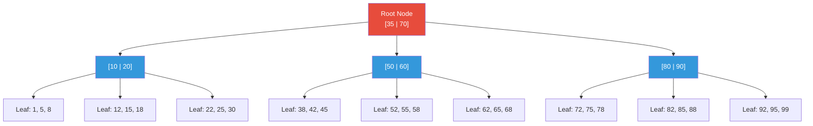
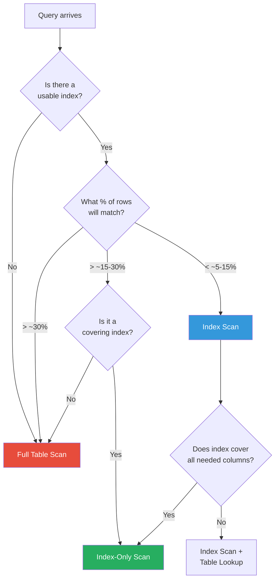

# Indexing

> [!tip] Core Insight
> An index is a **separate data structure** that maintains a sorted reference to rows in a table, enabling the database to find data without scanning every row. It is the single most impactful tool for query performance — and the most commonly misunderstood.

---

## What Indexes Are

### The Book Analogy

Imagine a 1,000-page textbook. You need to find every mention of "B-tree."

- **Without an index:** Read every page, front to back. This is a **full table scan**.
- **With an index:** Flip to the back, look up "B-tree," get page numbers 42, 187, 503. Go directly there.

A database index works identically — it's an **auxiliary data structure** that maps column values to the physical location of rows.

### The Trade-Off

| Aspect        | Without Index         | With Index              |
| ------------- | --------------------- | ----------------------- |
| Read speed    | O(n) — scan all rows  | O(log n) — tree lookup  |
| Write speed   | Fast — just append    | Slower — must update index |
| Storage       | Table data only       | Table data + index data |
| Maintenance   | None                  | Rebalancing, vacuuming  |

> [!warning] The Fundamental Trade-Off
> Indexes make **reads faster** and **writes slower**. Every `INSERT`, `UPDATE`, or `DELETE` must also update every relevant index. More indexes = more write overhead.

### Mental Model: Phone Book

- A phone book sorted by **last name** is an index on `last_name`.
- Finding "Venkatesh" is instant — binary search, O(log n).
- Finding everyone in "Chennai" requires reading every entry — no index on `city`.
- If you add a second index (a separate booklet sorted by city), city lookups become fast, but now every new entry must be written in **two** places.

---

## How Databases Store Data Without Indexes

### Heap Storage

Without indexes, a table is stored as a **heap** — an unordered pile of rows. Data is written wherever there's space.

```sql
-- This query on a heap table with 10 million rows...
SELECT * FROM orders WHERE customer_id = 42;

-- ...requires scanning ALL 10 million rows.
-- Even if only 5 rows match, the DB must check every single one.
```

### Full Table Scan (Sequential Scan)

```
Table: orders (10,000,000 rows)
Query: WHERE customer_id = 42

Row 1:    customer_id = 17  → skip
Row 2:    customer_id = 42  → MATCH ✅
Row 3:    customer_id = 91  → skip
Row 4:    customer_id = 42  → MATCH ✅
...
Row 9,999,999: customer_id = 3 → skip
Row 10,000,000: customer_id = 55 → skip

Result: 5 rows found after checking 10,000,000 rows
```

### Why This Becomes a Problem at Scale

| Table Size   | Full Scan Time (approx) | With Index (approx) |
| ------------ | ---------------------- | -------------------- |
| 1,000 rows   | < 1ms                 | < 1ms                |
| 100,000 rows | ~10ms                 | < 1ms                |
| 10M rows     | ~5 seconds            | < 1ms                |
| 1B rows      | ~8 minutes            | < 1ms                |

> [!danger] At Scale
> A query that takes 1ms on your dev database with 100 rows can take **minutes** in production with 100 million rows. Indexes are not optional at scale — they are a structural requirement.

---

## B-Tree Indexes (Primary Index Type)

### How B-Trees Work

A B-tree (Balanced Tree) is a self-balancing tree structure that maintains sorted data and allows searches, insertions, and deletions in **O(log n)** time.



### Key Properties

1. **Balanced:** All leaf nodes are at the same depth → consistent O(log n) lookups.
2. **Sorted:** Keys within each node are in order → enables range queries.
3. **Wide:** Each node holds many keys (high fan-out) → tree is shallow even for billions of rows.
4. **Linked leaves:** Leaf nodes are linked to each other → efficient range scans.

### How a Lookup Works

Looking up `customer_id = 55`:

```
Step 1: Root [35 | 70] → 55 is between 35 and 70 → go to middle child
Step 2: Node [50 | 60] → 55 is between 50 and 60 → go to middle child
Step 3: Leaf [52, 55, 58] → Found 55! → Row pointer says "go to disk page 4, offset 12"
Step 4: Fetch actual row from table

Total comparisons: ~3 (vs 10,000,000 for a full scan)
```

### Why B-Trees Support Both Equality and Range Queries

```sql
-- Equality: O(log n) — walk the tree to the exact key
WHERE customer_id = 55

-- Range: O(log n + k) — find the start, then scan linked leaves
WHERE customer_id BETWEEN 50 AND 60

-- Sorting: leaves are already sorted — no extra sort needed
ORDER BY customer_id
```

> [!tip] Key Insight
> B-trees are the **default** index type in PostgreSQL, MySQL, SQL Server, and Oracle. When someone says "index," they almost always mean a B-tree index.

---

## Types of Indexes

### Single Column Index

The most basic and most common index.

```sql
-- Syntax
CREATE INDEX idx_orders_customer_id ON orders (customer_id);

-- This accelerates:
SELECT * FROM orders WHERE customer_id = 42;
SELECT * FROM orders WHERE customer_id BETWEEN 10 AND 50;
SELECT * FROM orders ORDER BY customer_id;
```

**When to create:**
- Column appears frequently in `WHERE` clauses
- Column is used in `JOIN` conditions (especially foreign keys)
- Column is used in `ORDER BY` or `GROUP BY`
- Column has high selectivity (many distinct values)

---

### Composite (Multi-Column) Index

> [!danger] Column Order is CRITICAL
> The order of columns in a composite index determines which queries can use it. Get this wrong, and the index is useless.

```sql
CREATE INDEX idx_orders_cust_date ON orders (customer_id, order_date);
```

#### The Leftmost Prefix Rule

A composite index on `(a, b, c)` is like a phone book sorted by **last name, then first name, then middle name**. You can efficiently search:

- By last name alone ✅
- By last name + first name ✅
- By last name + first name + middle name ✅
- By first name alone ❌ (the book isn't sorted by first name!)

| Query Pattern                              | Uses INDEX(a, b, c)? | Explanation                                       |
| ------------------------------------------ | --------------------- | ------------------------------------------------- |
| `WHERE a = 1`                              | ✅ Full use           | Leftmost prefix satisfied                         |
| `WHERE a = 1 AND b = 2`                    | ✅ Full use           | First two columns of prefix                       |
| `WHERE a = 1 AND b = 2 AND c = 3`          | ✅ Full use           | All three columns used                            |
| `WHERE b = 2`                              | ❌ Cannot use         | Leftmost prefix violated                          |
| `WHERE b = 2 AND c = 3`                    | ❌ Cannot use         | Leftmost prefix violated                          |
| `WHERE a = 1 AND c = 3`                    | ⚠️ Partial           | Uses `a` only; skips to `c`, cannot use `b` gap   |
| `WHERE a = 1 AND b > 5 AND c = 3`          | ⚠️ Partial           | Range on `b` stops index use for `c`              |
| `WHERE a = 1 ORDER BY b`                   | ✅ Full use           | Index provides sort order for `b`                 |
| `WHERE a = 1 AND b = 2 ORDER BY c`         | ✅ Full use           | Index provides sort order for `c`                 |

> [!example] Practical Example
> ```sql
> -- Shipments table: find shipments for a carrier within a date range
> CREATE INDEX idx_ship_carrier_date ON shipments (carrier, shipped_date);
> 
> -- ✅ Uses index fully
> SELECT * FROM shipments WHERE carrier = 'FedEx' AND shipped_date >= '2024-01-01';
> 
> -- ❌ Cannot use this index (leftmost prefix violated)
> SELECT * FROM shipments WHERE shipped_date >= '2024-01-01';
> ```

#### Column Order Strategy

Put the column with **equality** conditions first, **range** conditions last:

```sql
-- Good: equality on carrier, range on shipped_date
CREATE INDEX idx_ship ON shipments (carrier, shipped_date);

-- Bad: range on shipped_date first stops index use for carrier
CREATE INDEX idx_ship_bad ON shipments (shipped_date, carrier);
```

---

### Covering Indexes

A covering index contains **all** columns needed by a query, so the database never needs to visit the actual table row.

```sql
-- Query
SELECT salary FROM employees WHERE department_id = 5;

-- Covering index — contains both department_id (for lookup) and salary (for output)
CREATE INDEX idx_emp_dept_salary ON employees (department_id, salary);
```

**What happens without a covering index:**
1. Search index → find row pointer
2. Go to table → fetch the full row
3. Extract `salary` from the row

**What happens with a covering index:**
1. Search index → `salary` is right there in the index leaf
2. Done. No table access needed. (Called an **index-only scan**)

> [!tip] Performance Impact
> Covering indexes can be **2-10x faster** than regular indexes because they eliminate the random I/O of fetching rows from the table. They are especially valuable for frequently-run queries.

```sql
-- PostgreSQL INCLUDE syntax for covering indexes
CREATE INDEX idx_orders_cover ON orders (customer_id) INCLUDE (total_amount, status);

-- This covers:
SELECT total_amount, status FROM orders WHERE customer_id = 42;
```

---

### Unique Indexes

```sql
-- Explicit unique index
CREATE UNIQUE INDEX idx_customers_email ON customers (email);

-- Implicitly created by constraints
ALTER TABLE customers ADD CONSTRAINT uq_email UNIQUE (email);
-- PRIMARY KEY also creates a unique index
```

**Properties:**
- Enforces uniqueness — rejects duplicate inserts
- Guarantees **at most one row** for equality lookups → optimizer knows this
- Automatically created for `PRIMARY KEY` and `UNIQUE` constraints

> [!example] Logistics Use Case
> ```sql
> -- Every shipment has a unique tracking number
> CREATE UNIQUE INDEX idx_ship_tracking ON shipments (tracking_number);
> 
> -- Lookup is guaranteed to return 0 or 1 row
> SELECT * FROM shipments WHERE tracking_number = 'FDX-2024-001';
> ```

---

### Partial / Filtered Indexes (PostgreSQL)

Index only a **subset** of rows matching a condition. Smaller index = faster lookups + less storage.

```sql
-- Only index active orders (80% of queries are about active orders)
CREATE INDEX idx_orders_active ON orders (customer_id)
WHERE status = 'active';

-- Only index undelivered shipments
CREATE INDEX idx_ship_pending ON shipments (carrier, shipped_date)
WHERE status != 'delivered';
```

> [!tip] When to Use
> - When most queries filter on a specific value (e.g., `status = 'active'`)
> - When the filtered subset is much smaller than the full table
> - When you need an index but the full column has low selectivity

---

### Hash Indexes

```sql
-- PostgreSQL
CREATE INDEX idx_orders_hash ON orders USING hash (customer_id);
```

| Property       | B-Tree        | Hash          |
| -------------- | ------------- | ------------- |
| Equality `=`   | ✅ O(log n)   | ✅ O(1)       |
| Range `>`, `<` | ✅ Supported  | ❌ Not supported |
| Sorting        | ✅ Supported  | ❌ Not supported |
| Use case       | General purpose | Exact match only |

> [!warning] Rarely Used in Practice
> B-tree is almost always better because it handles both equality and range queries. Hash indexes are a niche optimization for exact-match-only workloads. In MySQL, hash indexes only exist in MEMORY engine tables.

---

## Selectivity

### What Is Selectivity?

**Selectivity** = fraction of rows a condition matches. **Cardinality** = number of distinct values in a column.

```
Selectivity = 1 / Cardinality

High selectivity (good for indexing):
  email column: 1,000,000 distinct values in 1,000,000 rows → selectivity = 0.000001

Low selectivity (bad for indexing):
  is_active column: 2 distinct values in 1,000,000 rows → selectivity = 0.5
```

| Column           | Distinct Values | Selectivity | Worth Indexing? |
| ---------------- | --------------- | ----------- | --------------- |
| `id` (PK)        | 10,000,000      | Very high   | ✅ Always        |
| `email`          | 9,998,000       | Very high   | ✅ Excellent      |
| `tracking_number`| 10,000,000      | Very high   | ✅ Excellent      |
| `customer_id`    | 500,000         | High        | ✅ Good           |
| `department_id`  | 15              | Low         | ⚠️ Maybe         |
| `status`         | 5               | Very low    | ❌ Usually not    |
| `is_active`      | 2               | Very low    | ❌ Almost never   |

> [!warning] Anti-Pattern: Indexing Boolean Columns
> ```sql
> -- Almost never useful
> CREATE INDEX idx_emp_active ON employees (is_active);
> 
> -- With 1M rows, is_active = true matches ~900,000 rows
> -- The optimizer will prefer a full scan over an index that matches 90% of the table
> ```
>
> **Exception:** A partial index *is* useful:
> ```sql
> -- Only 1,000 inactive employees out of 1,000,000
> CREATE INDEX idx_emp_inactive ON employees (name) WHERE is_active = false;
> ```

---

## Index Scans vs Table Scans

### How the Optimizer Decides



### Scan Types Explained

| Scan Type         | What Happens                                    | When Used                             |
| ----------------- | ----------------------------------------------- | ------------------------------------- |
| **Seq Scan**      | Read every row in the table                     | No index, or low selectivity          |
| **Index Scan**    | Walk the index, then fetch rows from table      | High selectivity, need non-index cols |
| **Index Only Scan** | Walk the index, all data is in the index      | Covering index                        |
| **Bitmap Index Scan** | Build a bitmap of matching row locations, then fetch | Medium selectivity                |

> [!example] When a Full Scan is FASTER
> ```sql
> -- 10M orders, 8M have status = 'completed'
> SELECT * FROM orders WHERE status = 'completed';
> 
> -- Even with an index on status, the optimizer will choose a full scan.
> -- Why? Fetching 8M rows via index = 8M random I/O operations
> -- Full scan = sequential I/O, which is 100x faster per operation
> ```

---

## When Indexes Hurt Performance

### Write Overhead

Every data modification must update **all** indexes on the table:

```sql
-- Table: orders with 5 indexes
INSERT INTO orders (id, customer_id, order_date, status, total_amount)
VALUES (1001, 42, '2024-03-15', 'pending', 299.99);

-- This single INSERT triggers:
-- 1. Insert into table heap
-- 2. Insert into idx_orders_customer_id
-- 3. Insert into idx_orders_order_date
-- 4. Insert into idx_orders_status
-- 5. Insert into idx_orders_total_amount
-- 6. Insert into idx_orders_cust_date (composite)
-- = 6 write operations instead of 1
```

### Index Bloat

Over time, as rows are updated and deleted, indexes accumulate dead entries. This makes them larger and slower.

```sql
-- PostgreSQL: check index bloat
SELECT
    schemaname, tablename, indexname,
    pg_size_pretty(pg_relation_size(indexrelid)) AS index_size
FROM pg_stat_user_indexes
ORDER BY pg_relation_size(indexrelid) DESC;

-- Fix: rebuild bloated indexes
REINDEX INDEX idx_orders_customer_id;
```

### Finding Unused Indexes

```sql
-- PostgreSQL: find indexes that are never used
SELECT
    schemaname, tablename, indexname,
    idx_scan AS times_used,
    pg_size_pretty(pg_relation_size(indexrelid)) AS size
FROM pg_stat_user_indexes
WHERE idx_scan = 0
ORDER BY pg_relation_size(indexrelid) DESC;
```

> [!danger] Unused Indexes
> An unused index is **pure cost** — it slows down every write, consumes storage, and provides zero benefit. Audit your indexes regularly and drop the ones with zero scans.

---

## Index Strategy Design

### The Process

1. **Start with only the primary key index** (auto-created).
2. **Add indexes on foreign key columns** — these are used in JOINs.
3. **Identify slow queries** — use `EXPLAIN ANALYZE` or slow query logs.
4. **Add targeted indexes** — one index per slow query pattern.
5. **Monitor usage** — drop indexes with zero scans.
6. **Review after schema changes** — new columns or queries may need new indexes.

### Decision Matrix

| Question                                      | Action                                         |
| --------------------------------------------- | ---------------------------------------------- |
| Column used in WHERE with equality?            | Single-column index                            |
| Column used in WHERE with range?               | Single-column or composite (range col last)    |
| Multiple columns in WHERE?                     | Composite index (equality first, range last)   |
| Column used in JOIN ON?                        | Index on the FK column                         |
| Query returns few columns from indexed table?  | Covering index (INCLUDE extra columns)         |
| Column has very few distinct values?           | Probably skip; consider partial index           |
| Table is write-heavy?                          | Minimize indexes; benchmark write impact       |
| Existing index unused?                         | Drop it                                        |

### Guidelines for a Logistics System

```sql
-- 1. Foreign keys (most commonly missed!)
CREATE INDEX idx_orders_customer_id ON orders (customer_id);
CREATE INDEX idx_order_items_order_id ON order_items (order_id);
CREATE INDEX idx_order_items_product_id ON order_items (product_id);
CREATE INDEX idx_shipments_order_id ON shipments (order_id);
CREATE INDEX idx_employees_department_id ON employees (department_id);
CREATE INDEX idx_employees_manager_id ON employees (manager_id);

-- 2. Common query patterns
CREATE INDEX idx_orders_date_status ON orders (order_date, status);
CREATE INDEX idx_shipments_carrier_date ON shipments (carrier, shipped_date);
CREATE UNIQUE INDEX idx_shipments_tracking ON shipments (tracking_number);

-- 3. Covering index for dashboard queries
CREATE INDEX idx_orders_dashboard ON orders (status, order_date) 
INCLUDE (total_amount, customer_id);
```

---

## Common Mistakes

### 1. Indexing Every Column

```sql
-- ❌ Don't do this
CREATE INDEX idx1 ON orders (id);           -- PK already indexed
CREATE INDEX idx2 ON orders (customer_id);
CREATE INDEX idx3 ON orders (order_date);
CREATE INDEX idx4 ON orders (status);
CREATE INDEX idx5 ON orders (total_amount);
-- 5 indexes = 5x write overhead

-- ✅ Create indexes based on actual query patterns
CREATE INDEX idx_orders_cust ON orders (customer_id);
CREATE INDEX idx_orders_date_status ON orders (order_date, status);
-- 2 indexes covering the actual queries
```

### 2. Not Indexing Foreign Keys

> [!danger] This is the #1 missed optimization in most databases.
> Every `JOIN` uses a foreign key. Without an index on the FK column, the join requires a full table scan of the child table.

```sql
-- ❌ Missing index — every join with orders scans ALL order_items
SELECT o.id, oi.quantity
FROM orders o
JOIN order_items oi ON oi.order_id = o.id;

-- ✅ Add index on the foreign key
CREATE INDEX idx_order_items_order_id ON order_items (order_id);
```

### 3. Wrong Column Order in Composite Indexes

```sql
-- Query: find orders by customer within a date range
SELECT * FROM orders 
WHERE customer_id = 42 AND order_date >= '2024-01-01';

-- ❌ Wrong order: range column first
CREATE INDEX idx_bad ON orders (order_date, customer_id);
-- Range on order_date prevents efficient use of customer_id

-- ✅ Correct order: equality first, range last
CREATE INDEX idx_good ON orders (customer_id, order_date);
```

### 4. Using Functions on Indexed Columns

```sql
-- ❌ Function wraps the column — index on hire_date is USELESS
SELECT * FROM employees WHERE YEAR(hire_date) = 2024;

-- ✅ Rewrite as a range — index on hire_date is USED
SELECT * FROM employees WHERE hire_date >= '2024-01-01' AND hire_date < '2025-01-01';

-- ❌ Function wraps the column
SELECT * FROM customers WHERE UPPER(email) = 'JOHN@EXAMPLE.COM';

-- ✅ Use a functional index (PostgreSQL)
CREATE INDEX idx_customers_email_upper ON customers (UPPER(email));
-- Now UPPER(email) = 'JOHN@EXAMPLE.COM' uses the index

-- ✅ Or normalize data on insert
-- Store email as lowercase, query as lowercase
```

### 5. Misunderstanding NULLs and Indexes

```sql
-- In PostgreSQL: NULLs ARE included in B-tree indexes
-- In MySQL (InnoDB): NULLs ARE included in B-tree indexes
-- In Oracle: NULLs are NOT included in single-column B-tree indexes

-- This matters for:
SELECT * FROM shipments WHERE delivered_date IS NULL;
-- PostgreSQL/MySQL: can use index on delivered_date ✅
-- Oracle: cannot use single-column index on delivered_date ❌
```

---

## Real-World Examples

### 1. Optimizing Order Lookup by Customer and Date

```sql
-- Business query: "Show me all orders for customer 42 in the last 30 days"
SELECT id, order_date, status, total_amount
FROM orders
WHERE customer_id = 42 AND order_date >= CURRENT_DATE - INTERVAL '30 days'
ORDER BY order_date DESC;

-- Without index: Full table scan of 10M orders → ~5 seconds
-- With single-column index on customer_id: ~50ms (still sorting)
-- With composite index: ~2ms (sorted by design)

CREATE INDEX idx_orders_cust_date ON orders (customer_id, order_date DESC);

-- Even better — covering index eliminates table access:
CREATE INDEX idx_orders_cust_date_cover ON orders (customer_id, order_date DESC)
INCLUDE (status, total_amount);
-- → < 1ms, index-only scan
```

### 2. Shipment Tracking Lookup

```sql
-- Business query: "Where is my package?"
SELECT s.*, o.customer_id
FROM shipments s
JOIN orders o ON o.id = s.order_id
WHERE s.tracking_number = 'FDX-2024-ABC-789';

-- Unique index on tracking_number — guaranteed O(log n) single-row lookup
CREATE UNIQUE INDEX idx_ship_tracking ON shipments (tracking_number);

-- Also need index on orders PK (auto-created) for the JOIN
```

### 3. Product Search by Category and Price

```sql
-- Business query: "Show electronics under $500 sorted by price"
SELECT name, price, stock_quantity
FROM products
WHERE category = 'Electronics' AND price < 500
ORDER BY price ASC;

-- Composite index: equality on category, range on price
CREATE INDEX idx_products_cat_price ON products (category, price);

-- Covering index for extra speed:
CREATE INDEX idx_products_search ON products (category, price)
INCLUDE (name, stock_quantity);
```

---

## How Beginners Think vs How Strong SQL Engineers Think

| Aspect              | Beginner                                         | Strong Engineer                                   |
| ------------------- | ------------------------------------------------ | ------------------------------------------------- |
| **When to index**   | "Index every column to be safe"                  | "Index based on actual query patterns and EXPLAIN" |
| **Composite index** | "Just create separate indexes for each column"   | "One composite index is better than two singles"   |
| **Column order**    | "Order doesn't matter"                           | "Equality first, range last, leftmost prefix rule" |
| **Write impact**    | "Indexes only help, no downsides"                | "Every index costs write performance"              |
| **Selectivity**     | "Index on status will speed up my query"         | "Status has 5 values — index is useless here"      |
| **Covering index**  | Never heard of it                                | "Can I avoid the table lookup entirely?"           |
| **Monitoring**      | "Set and forget"                                 | "Audit unused indexes quarterly, check bloat"      |
| **Functions**       | `WHERE YEAR(date) = 2024`                        | `WHERE date >= '2024-01-01' AND date < '2025-01-01'` |

---

## Practice Exercises

### Exercise 1: Foreign Key Indexes
The `order_items` table has 50 million rows. The query `SELECT * FROM order_items WHERE order_id = 12345` takes 8 seconds. What's the most likely problem, and how do you fix it?

### Exercise 2: Composite Index Design
Design an index for this query:
```sql
SELECT id, total_amount FROM orders
WHERE customer_id = 42 AND status = 'shipped'
ORDER BY order_date DESC
LIMIT 10;
```
What columns, in what order? Should it be a covering index?

### Exercise 3: Leftmost Prefix
You have `INDEX(carrier, shipped_date, status)` on `shipments`. Which of these queries use the index?
1. `WHERE carrier = 'FedEx'`
2. `WHERE shipped_date = '2024-01-15'`
3. `WHERE carrier = 'FedEx' AND status = 'delivered'`
4. `WHERE carrier = 'FedEx' AND shipped_date >= '2024-01-01'`
5. `WHERE status = 'delivered' AND carrier = 'FedEx'`

### Exercise 4: Function Trap
Why is this query slow despite having an index on `email`?
```sql
SELECT * FROM customers WHERE LOWER(email) = 'john@example.com';
```
How do you fix it?

### Exercise 5: Selectivity Analysis
You have a `shipments` table with 10M rows. Column `status` has 4 values: 'pending' (5%), 'shipped' (15%), 'delivered' (79%), 'cancelled' (1%). Should you create an index on `status`? Under what conditions?

### Exercise 6: Write Overhead
A `shipments` table receives 10,000 inserts per second. It currently has 8 indexes. Inserts are taking 50ms each (too slow). Propose a strategy to reduce insert latency while maintaining query performance.

### Exercise 7: Covering Index
Rewrite this query's index strategy to achieve an index-only scan:
```sql
SELECT name, salary FROM employees
WHERE department_id = 5 AND is_active = true
ORDER BY salary DESC;
```

### Exercise 8: Index Audit
You inherit a database with these indexes on `orders`:
1. `idx_1 ON orders (id)` — PK already exists
2. `idx_2 ON orders (customer_id, order_date)`
3. `idx_3 ON orders (customer_id)`
4. `idx_4 ON orders (status)`
5. `idx_5 ON orders (order_date, customer_id)`

Which indexes are redundant or likely useless? Which would you drop?

---

## Interview Questions

### Q1: What is a database index, and why does it exist?
**Expected answer:** A data structure (usually B-tree) that provides O(log n) lookups instead of O(n) full scans. It trades write performance and storage for read performance.

### Q2: Explain the leftmost prefix rule for composite indexes.
**Expected answer:** A composite index on `(a, b, c)` can be used for queries filtering on `a`, `a+b`, or `a+b+c`, but NOT for queries filtering on `b` or `c` alone. The query must use a prefix starting from the leftmost column.

### Q3: What is a covering index?
**Expected answer:** An index that contains all columns needed by a query, allowing the database to answer the query entirely from the index without accessing the table. This is called an index-only scan.

### Q4: When would the optimizer choose a full table scan over an index scan?
**Expected answer:** When the query matches a large percentage of rows (low selectivity). Sequential I/O (full scan) is much faster than thousands of random I/O operations (index lookups). Typically, if more than 15-30% of rows match, a full scan wins.

### Q5: Why should you avoid wrapping indexed columns in functions?
**Expected answer:** `WHERE YEAR(date) = 2024` must evaluate `YEAR()` on every row — the optimizer cannot use the index because the stored value doesn't match the function output. Rewrite as a range: `WHERE date >= '2024-01-01' AND date < '2025-01-01'`.

### Q6: What's the impact of too many indexes on a write-heavy table?
**Expected answer:** Every INSERT, UPDATE, or DELETE must update all indexes. More indexes = more write I/O, more lock contention, more index bloat, more WAL (write-ahead log) volume. Write-heavy tables should have the minimum necessary indexes.

### Q7: How do you identify and remove unused indexes?
**Expected answer:** Query `pg_stat_user_indexes` (PostgreSQL) or `sys.dm_db_index_usage_stats` (SQL Server) for indexes with zero scans. Monitor over a full business cycle (at least a month) before dropping — some indexes are used for monthly reports.

### Q8: A query on a table with 100M rows takes 30 seconds. Walk through how you'd diagnose and fix it.
**Expected answer:** (1) Run EXPLAIN ANALYZE. (2) Check if it's doing a sequential scan. (3) Check if an appropriate index exists. (4) Check selectivity of the filter columns. (5) Consider composite or covering index. (6) Check for function-wrapped columns or implicit type conversions. (7) Verify statistics are up to date. (8) Test with the new index and compare execution plans.

---

**Related Notes:** [[12 - Query Optimization]] · [[13 - Transactions and Concurrency]]
