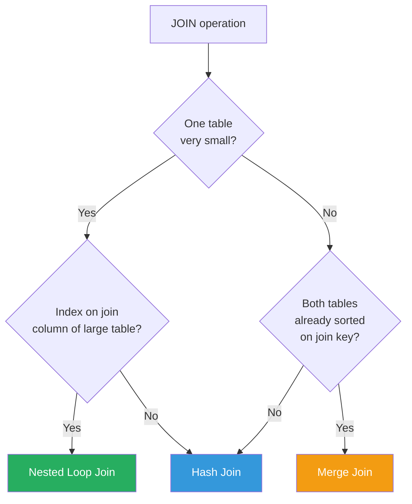
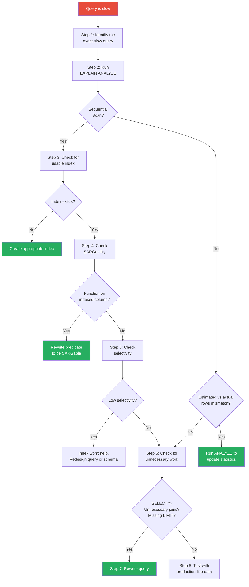

# Query Optimization

> [!tip] Core Insight
> Query optimization is not about tricks or hacks — it's about understanding **how the database engine thinks**. The optimizer evaluates dozens of possible execution strategies and picks the cheapest one. Your job is to give it the right information (indexes, statistics, SARGable predicates) so it can make good decisions.

---

## Execution Plans

### What They Are

An execution plan is the **step-by-step strategy** the database optimizer chooses to execute your query. It shows:

- **What operations** are performed (scan, join, sort, aggregate)
- **In what order** they happen
- **How much work** each step does (estimated and actual rows)
- **What indexes** are used (or not)

> [!warning] The #1 Performance Debugging Tool
> If you learn one thing about optimization, learn to read execution plans. They tell you **exactly** why a query is slow.

### EXPLAIN vs EXPLAIN ANALYZE

```sql
-- EXPLAIN: shows the plan WITHOUT executing the query
-- Fast, safe for production
EXPLAIN SELECT * FROM orders WHERE customer_id = 42;

-- EXPLAIN ANALYZE: executes the query AND shows actual timings
-- Slower, but shows real data. Be careful in production with write queries!
EXPLAIN ANALYZE SELECT * FROM orders WHERE customer_id = 42;

-- MySQL: use EXPLAIN
EXPLAIN SELECT * FROM orders WHERE customer_id = 42;

-- MySQL: more detail
EXPLAIN FORMAT=JSON SELECT * FROM orders WHERE customer_id = 42;
```

### How to Read an Execution Plan (PostgreSQL)

```sql
EXPLAIN ANALYZE
SELECT o.id, c.name, o.total_amount
FROM orders o
JOIN customers c ON c.id = o.customer_id
WHERE o.order_date >= '2024-01-01'
AND o.status = 'shipped';
```

```
Hash Join  (cost=12.50..1250.00 rows=500 width=48) (actual time=0.5..15.2 rows=487 loops=1)
  Hash Cond: (o.customer_id = c.id)
  ->  Bitmap Heap Scan on orders o  (cost=8.50..1200.00 rows=500 width=24) (actual time=0.3..12.1 rows=487 loops=1)
        Recheck Cond: (order_date >= '2024-01-01')
        Filter: (status = 'shipped')
        Rows Removed by Filter: 1230
        ->  Bitmap Index Scan on idx_orders_date  (cost=0.00..8.37 rows=1717 width=0) (actual time=0.1..0.1 rows=1717 loops=1)
              Index Cond: (order_date >= '2024-01-01')
  ->  Hash  (cost=3.00..3.00 rows=100 width=28) (actual time=0.1..0.1 rows=100 loops=1)
        ->  Seq Scan on customers c  (cost=0.00..3.00 rows=100 width=28) (actual time=0.0..0.1 rows=100 loops=1)
Planning Time: 0.2 ms
Execution Time: 15.8 ms
```

**Key elements to focus on:**

| Element              | What It Tells You                                          |
| -------------------- | ---------------------------------------------------------- |
| **Scan type**        | Seq Scan (bad for large tables), Index Scan (good), Bitmap |
| **cost**             | Optimizer's estimated expense (arbitrary units)            |
| **rows (estimated)** | How many rows the optimizer thinks will be returned        |
| **rows (actual)**    | How many rows actually came back                           |
| **actual time**      | Real wall-clock time for this step                         |
| **Rows Removed**     | Rows fetched but discarded by a filter (wasted work)       |
| **loops**            | How many times this step was executed                       |

> [!danger] Red Flag: Estimated vs Actual Mismatch
> If estimated rows = 10 but actual rows = 100,000, the optimizer made a **bad plan** based on stale statistics. Run `ANALYZE` on the table.

---

## Cost Estimation

### How the Optimizer Estimates Cost

The optimizer uses **table statistics** to estimate how many rows each operation will produce, and assigns a **cost** based on:

- Sequential I/O cost (reading pages in order)
- Random I/O cost (jumping to specific pages — 4x more expensive)
- CPU cost (comparisons, hashing, sorting)
- Memory cost (hash tables, sort buffers)

### Statistics and Cardinality Estimates

```sql
-- PostgreSQL: view statistics
SELECT
    attname,
    n_distinct,
    most_common_vals,
    most_common_freqs,
    histogram_bounds
FROM pg_stats
WHERE tablename = 'orders' AND attname = 'status';
```

The optimizer knows:
- How many rows are in the table
- How many distinct values each column has
- The distribution of values (histograms)
- Correlation between physical order and logical order

### Stale Statistics Problem

```sql
-- You bulk-loaded 5 million rows, but statistics still say 10,000 rows.
-- The optimizer plans for 10,000 rows → nested loop join (fine for small)
-- Reality: 5,000,000 rows → nested loop = catastrophically slow

-- Fix: update statistics
ANALYZE orders;                    -- PostgreSQL
UPDATE STATISTICS orders;          -- SQL Server
ANALYZE TABLE orders;              -- MySQL
```

> [!warning] Always ANALYZE After Bulk Operations
> After any bulk `INSERT`, `DELETE`, or significant `UPDATE`, run `ANALYZE` to refresh statistics. Stale statistics are a top cause of bad query plans.

---

## Join Optimization

The optimizer chooses between three main join algorithms:

### Nested Loop Join

```
For each row in table A:
    For each matching row in table B:
        Output combined row
```

- **Best when:** One table is small, the other has an index on the join column
- **Complexity:** O(n × m) without index, O(n × log m) with index
- **Analogy:** Looking up each order's customer by flipping to the customer's page

### Hash Join

```
Step 1: Build a hash table from the smaller table
Step 2: Scan the larger table, probe the hash table for matches
```

- **Best when:** Both tables are large, no useful index
- **Complexity:** O(n + m)
- **Analogy:** Building a lookup map of all customers, then scanning orders

### Merge Join (Sort-Merge Join)

```
Step 1: Sort both tables by the join key (if not already sorted)
Step 2: Walk through both sorted lists simultaneously
```

- **Best when:** Both tables are large and already sorted (or have indexes)
- **Complexity:** O(n log n + m log m) for sorting, O(n + m) for merging
- **Analogy:** Merging two sorted decks of cards

### Comparison Table

| Algorithm        | Best For                            | Index Needed? | Memory      | Preserves Order? |
| ---------------- | ----------------------------------- | ------------- | ----------- | ---------------- |
| **Nested Loop**  | Small outer + indexed inner         | Yes (inner)   | Low         | Yes              |
| **Hash Join**    | Large + large, no index             | No            | High (hash) | No               |
| **Merge Join**   | Large + large, both sorted          | Optional      | Medium      | Yes              |



> [!example] Practical Impact
> ```sql
> -- 10M orders JOIN 500K customers
> -- Without index on orders.customer_id: Hash Join (~5s)
> -- With index on orders.customer_id: Nested Loop (~0.5s for single customer)
> 
> -- The index lets the optimizer use Nested Loop for filtered queries
> SELECT o.*, c.name
> FROM customers c
> JOIN orders o ON o.customer_id = c.id
> WHERE c.id = 42;
> -- With index: Nested Loop on customer (1 row) → Index Scan on orders
> ```

---

## Predicate Pushdown

### What It Is

**Predicate pushdown** means applying filters (`WHERE` conditions) as early as possible in the execution plan — before joins, before aggregations.

### Why It Matters

```sql
-- Conceptually: "Join everything, then filter"
-- Reality: filtering first means fewer rows to join

-- ❌ Without pushdown (conceptual)
-- Step 1: Join orders (10M) with customers (500K) = 10M joined rows
-- Step 2: Filter WHERE city = 'Chennai' = 50K rows
-- Wasted work: joined 10M rows to discard 9.95M

-- ✅ With pushdown
-- Step 1: Filter customers WHERE city = 'Chennai' = 1K customers
-- Step 2: Join 1K customers with orders = 50K joined rows
-- 200x less work
```

### When the Optimizer CAN Push Down

```sql
-- ✅ Simple column comparison — always pushed down
SELECT o.*, c.name FROM orders o
JOIN customers c ON c.id = o.customer_id
WHERE c.city = 'Chennai';  -- Pushed down to customers scan

-- ✅ Conditions on the inner table in INNER JOIN — pushed down
SELECT * FROM orders o
JOIN shipments s ON s.order_id = o.id
WHERE s.status = 'delivered';
```

### When It CANNOT Push Down

```sql
-- ❌ Conditions on the outer table in LEFT JOIN
-- This changes semantics — filter must stay after the join
SELECT * FROM orders o
LEFT JOIN shipments s ON s.order_id = o.id
WHERE s.status = 'delivered';
-- This filters out non-matched rows, converting LEFT JOIN to INNER JOIN!

-- ✅ Correct: put the condition in the ON clause
SELECT * FROM orders o
LEFT JOIN shipments s ON s.order_id = o.id AND s.status = 'delivered';
```

See [[04 - Joins]] for more on `ON` vs `WHERE` in outer joins.

---

## Avoiding Full Table Scans

### SARGable vs Non-SARGable Predicates

**SARGable** (Search ARGument ABLE) = the predicate can use an index.

| SARGable ✅ (Index Usable)                  | Non-SARGable ❌ (Index Killed)                |
| ------------------------------------------- | --------------------------------------------- |
| `WHERE salary > 50000`                      | `WHERE salary + 1000 > 51000`                 |
| `WHERE name = 'John'`                       | `WHERE UPPER(name) = 'JOHN'`                  |
| `WHERE hire_date >= '2024-01-01'`           | `WHERE YEAR(hire_date) = 2024`                |
| `WHERE email = 'a@b.com'`                   | `WHERE SUBSTRING(email, 1, 3) = 'a@b'`       |
| `WHERE name LIKE 'John%'`                   | `WHERE name LIKE '%John%'`                    |
| `WHERE id = 42`                             | `WHERE CAST(id AS VARCHAR) = '42'`            |
| `WHERE status IN ('a', 'b')`               | `WHERE status != 'c'`                         |
| `WHERE a = 1 AND b = 2`                     | `WHERE a = 1 OR b = 2` (may not use index)    |

> [!danger] The #1 Performance Killer
> Wrapping an indexed column in a function is the most common way to accidentally disable an index. The optimizer cannot "see through" the function to the underlying column value.
>
> ```sql
> -- ❌ Index on hire_date is USELESS
> WHERE YEAR(hire_date) = 2024
> 
> -- ✅ Rewrite as a range scan
> WHERE hire_date >= '2024-01-01' AND hire_date < '2025-01-01'
> ```

### Implicit Type Conversions

```sql
-- Column: customer_id INT
-- ❌ Implicit conversion — index may not be used
WHERE customer_id = '42'    -- string compared to int

-- ✅ Correct type
WHERE customer_id = 42      -- int compared to int
```

### OR Conditions

```sql
-- ❌ OR can prevent index usage
WHERE customer_id = 42 OR status = 'shipped'
-- The optimizer may choose a full scan because no single index covers both

-- ✅ Rewrite as UNION ALL if possible
SELECT * FROM orders WHERE customer_id = 42
UNION ALL
SELECT * FROM orders WHERE status = 'shipped' AND customer_id != 42;
```

### Leading Wildcard LIKE

```sql
-- ❌ Leading wildcard — cannot use index (must scan all values)
WHERE tracking_number LIKE '%ABC%'

-- ✅ Trailing wildcard — uses index (prefix scan)
WHERE tracking_number LIKE 'FDX-2024%'

-- For full-text search, use dedicated solutions:
-- PostgreSQL: pg_trgm extension, GIN index, full-text search
-- MySQL: FULLTEXT index
```

---

## Query Smells

### 1. SELECT * (Fetches Unnecessary Data)

```sql
-- ❌ Bad: fetches all 20 columns when you need 3
SELECT * FROM orders WHERE customer_id = 42;

-- ✅ Good: fetch only what you need
SELECT id, order_date, total_amount FROM orders WHERE customer_id = 42;

-- Why it matters:
-- 1. More data to transfer over network
-- 2. More memory used
-- 3. Prevents covering index optimization (index-only scan)
-- 4. Breaks when columns are added/removed
```

See [[11 - Indexing]] for covering index benefits.

### 2. DISTINCT Hiding a Bad Join

```sql
-- ❌ Smell: DISTINCT to remove duplicates from a join
SELECT DISTINCT c.name, c.email
FROM customers c
JOIN orders o ON o.customer_id = c.id;
-- If you're getting duplicates, the JOIN is producing them — fix the JOIN

-- ✅ Fix: use EXISTS instead (no duplicates to remove)
SELECT c.name, c.email
FROM customers c
WHERE EXISTS (SELECT 1 FROM orders o WHERE o.customer_id = c.id);
```

### 3. ORDER BY RAND()

```sql
-- ❌ Terrible: sorts the ENTIRE table randomly, then picks one row
SELECT * FROM products ORDER BY RAND() LIMIT 1;
-- On 1M rows: creates 1M random numbers, sorts them, returns 1 row

-- ✅ Better: offset-based random selection
SELECT * FROM products
WHERE id >= (SELECT FLOOR(RAND() * (SELECT MAX(id) FROM products)))
ORDER BY id
LIMIT 1;
```

### 4. Correlated Subqueries That Could Be Joins

```sql
-- ❌ Correlated subquery: runs inner query for EACH outer row
SELECT e.name, e.salary,
    (SELECT d.name FROM departments d WHERE d.id = e.department_id) AS dept_name
FROM employees e;
-- Executes the subquery N times (once per employee)

-- ✅ Join: processes both tables once
SELECT e.name, e.salary, d.name AS dept_name
FROM employees e
JOIN departments d ON d.id = e.department_id;
```

### 5. NOT IN with Nullable Columns

```sql
-- ❌ DANGER: NOT IN with NULLs returns EMPTY RESULT SET
SELECT * FROM employees
WHERE department_id NOT IN (SELECT id FROM departments);
-- If departments.id has any NULL, this returns NO ROWS (three-valued logic)

-- ✅ Use NOT EXISTS instead
SELECT * FROM employees e
WHERE NOT EXISTS (SELECT 1 FROM departments d WHERE d.id = e.department_id);
```

### 6. HAVING Without GROUP BY

```sql
-- ❌ Smell: HAVING used as a WHERE clause
SELECT * FROM orders HAVING total_amount > 1000;

-- ✅ Use WHERE for row-level filtering
SELECT * FROM orders WHERE total_amount > 1000;

-- HAVING is for filtering aggregated results:
SELECT customer_id, SUM(total_amount)
FROM orders
GROUP BY customer_id
HAVING SUM(total_amount) > 10000;
```

### 7. UNION vs UNION ALL

```sql
-- ❌ UNION removes duplicates — requires a sort/hash operation
SELECT id FROM orders WHERE status = 'shipped'
UNION
SELECT id FROM orders WHERE status = 'delivered';

-- ✅ UNION ALL skips deduplication — much faster
SELECT id FROM orders WHERE status = 'shipped'
UNION ALL
SELECT id FROM orders WHERE status = 'delivered';
-- Use UNION ALL when you know results are already distinct
-- (or don't care about duplicates)
```

---

## N+1 Query Problem

### What It Is

The N+1 problem occurs when your application executes **1 query to fetch a list**, then **N additional queries to fetch related data for each item**.

```
Query 1: SELECT * FROM orders WHERE status = 'pending'
→ Returns 100 orders

Query 2:  SELECT * FROM customers WHERE id = 17   (for order 1)
Query 3:  SELECT * FROM customers WHERE id = 42   (for order 2)
Query 4:  SELECT * FROM customers WHERE id = 91   (for order 3)
...
Query 101: SELECT * FROM customers WHERE id = 8   (for order 100)

Total: 101 queries. If each takes 2ms, that's 202ms.
One JOIN query: ~5ms.
```

### How It Happens in Application Code

```java
// ❌ Classic N+1 in Java/JPA
List<Order> orders = orderRepository.findByStatus("pending"); // 1 query
for (Order order : orders) {
    Customer customer = order.getCustomer(); // N queries (lazy loading)
    System.out.println(customer.getName());
}
```

### How to Fix It

```sql
-- ✅ Solution 1: JOIN (single query)
SELECT o.*, c.name AS customer_name
FROM orders o
JOIN customers c ON c.id = o.customer_id
WHERE o.status = 'pending';

-- ✅ Solution 2: Batch IN query
SELECT * FROM customers WHERE id IN (17, 42, 91, ...);
-- Reduces 100 queries to 2 queries
```

```java
// ✅ JPA: Use @EntityGraph or JOIN FETCH
@Query("SELECT o FROM Order o JOIN FETCH o.customer WHERE o.status = :status")
List<Order> findByStatusWithCustomer(@Param("status") String status);

// ✅ Or use @BatchSize on the relationship
@BatchSize(size = 50)
@ManyToOne(fetch = FetchType.LAZY)
private Customer customer;
```

See [[15 - SQL for Backend Engineers]] for deeper ORM integration patterns.

---

## ORM-Generated SQL Issues

### Common Problems with Hibernate/JPA

#### 1. Lazy Loading → N+1

```java
// Default: @ManyToOne is EAGER, @OneToMany is LAZY
// EAGER loading can cause unexpected JOINs
// LAZY loading causes N+1 when you access the relationship

// ❌ This silently generates N+1 queries
orders.forEach(o -> log.info(o.getCustomer().getName()));
```

#### 2. Cartesian Product in Collection Fetching

```java
// ❌ Fetching two collections simultaneously
@Query("SELECT o FROM Order o " +
       "JOIN FETCH o.items " +
       "JOIN FETCH o.shipments")
// This creates a cartesian product: items × shipments
// 5 items × 3 shipments = 15 rows per order
```

```sql
-- What Hibernate generates:
SELECT o.*, oi.*, s.*
FROM orders o
JOIN order_items oi ON oi.order_id = o.id
JOIN shipments s ON s.order_id = o.id;
-- If order has 5 items and 3 shipments → 15 rows!
```

#### 3. Missing Indexes for Generated Queries

```sql
-- Hibernate generates queries like:
SELECT * FROM order_items WHERE order_id = ?;
-- If there's no index on order_items.order_id → full table scan

-- Always check that FK columns used in relationships have indexes!
```

#### 4. How to Audit ORM SQL

```yaml
# application.yml — log all SQL (dev only!)
spring:
  jpa:
    show-sql: true
    properties:
      hibernate:
        format_sql: true
        generate_statistics: true

logging:
  level:
    org.hibernate.SQL: DEBUG
    org.hibernate.type.descriptor.sql.BasicBinder: TRACE
```

> [!tip] When to Drop to Native SQL
> - Complex reporting queries with multiple aggregations
> - Queries requiring window functions
> - Performance-critical paths where ORM overhead matters
> - Queries the ORM generates poorly (inspect with logging!)
> 
> ```java
> @Query(value = "SELECT customer_id, SUM(total_amount) AS total " +
>                "FROM orders WHERE order_date >= :since " +
>                "GROUP BY customer_id HAVING SUM(total_amount) > :min",
>        nativeQuery = true)
> List<Object[]> findHighValueCustomers(@Param("since") LocalDate since,
>                                       @Param("min") BigDecimal min);
> ```

See [[15 - SQL for Backend Engineers]] for comprehensive ORM patterns.

---

## Performance Debugging Mindset

### Systematic Approach



### The Checklist

1. **Identify the query:** Enable slow query logging. Find queries taking > 100ms.
2. **EXPLAIN it:** Read the execution plan. Look for Seq Scans on large tables.
3. **Check indexes:** Does the right index exist? Is the column order correct?
4. **Check SARGability:** Are functions wrapping indexed columns?
5. **Check selectivity:** Is the filter matching too many rows for an index to help?
6. **Check for wasted work:** SELECT * ? Unnecessary JOINs? Missing LIMIT?
7. **Rewrite if needed:** Correlated subquery → JOIN. NOT IN → NOT EXISTS.
8. **Test with real data:** A query fast on 100 rows may be slow on 10M.

---

## Bad Query vs Good Query

### Example 1: Function on Indexed Column

```sql
-- ❌ Bad: Function kills index usage
EXPLAIN ANALYZE
SELECT * FROM employees WHERE YEAR(hire_date) = 2024;
-- Seq Scan on employees (cost=0..5000 rows=200) (actual time=0..45ms rows=180)
-- Filter: YEAR(hire_date) = 2024
-- Rows Removed by Filter: 49820
-- Execution Time: 45ms

-- ✅ Good: Range predicate uses index
EXPLAIN ANALYZE
SELECT * FROM employees
WHERE hire_date >= '2024-01-01' AND hire_date < '2025-01-01';
-- Index Scan using idx_emp_hire_date on employees (cost=0..12 rows=200) (actual time=0..0.5ms rows=180)
-- Index Cond: (hire_date >= '2024-01-01' AND hire_date < '2025-01-01')
-- Execution Time: 0.5ms
```

**Speedup: 90x**

### Example 2: Correlated Subquery vs JOIN

```sql
-- ❌ Bad: Correlated subquery runs once per order
EXPLAIN ANALYZE
SELECT o.id, o.total_amount,
    (SELECT c.name FROM customers c WHERE c.id = o.customer_id) AS customer_name
FROM orders o
WHERE o.status = 'shipped';
-- Execution Time: 850ms (subquery executed 50,000 times)

-- ✅ Good: JOIN processes both tables once
EXPLAIN ANALYZE
SELECT o.id, o.total_amount, c.name AS customer_name
FROM orders o
JOIN customers c ON c.id = o.customer_id
WHERE o.status = 'shipped';
-- Hash Join (cost=15..800 rows=50000) (actual time=1..25ms rows=49873)
-- Execution Time: 25ms
```

**Speedup: 34x**

### Example 3: NOT IN vs NOT EXISTS with NULLs

```sql
-- ❌ Bad: NOT IN with potential NULLs — may return empty set!
SELECT e.name FROM employees e
WHERE e.department_id NOT IN (
    SELECT d.id FROM departments d WHERE d.location = 'Remote'
);
-- If any d.id IS NULL, result is EMPTY (three-valued logic trap)
-- Also: may use a slow anti-join strategy

-- ✅ Good: NOT EXISTS — NULL-safe and often faster
SELECT e.name FROM employees e
WHERE NOT EXISTS (
    SELECT 1 FROM departments d
    WHERE d.id = e.department_id AND d.location = 'Remote'
);
-- Anti Join (cost=5..50 rows=45000) (actual time=0.5..8ms rows=44987)
```

### Example 4: SELECT * vs Specific Columns with Covering Index

```sql
-- ❌ Bad: SELECT * prevents index-only scan
EXPLAIN ANALYZE
SELECT * FROM orders WHERE customer_id = 42 AND status = 'shipped';
-- Index Scan using idx_orders_cust on orders
--   → then table lookup for all columns
-- Execution Time: 12ms

-- ✅ Good: select only needed columns → covering index possible
EXPLAIN ANALYZE
SELECT id, order_date, total_amount
FROM orders WHERE customer_id = 42 AND status = 'shipped';
-- With covering index: CREATE INDEX ... ON orders(customer_id, status) INCLUDE(id, order_date, total_amount)
-- Index Only Scan using idx_orders_cover
-- Execution Time: 0.8ms
```

**Speedup: 15x**

### Example 5: Missing LIMIT on Paginated Queries

```sql
-- ❌ Bad: fetch all rows, paginate in application
SELECT o.*, c.name
FROM orders o
JOIN customers c ON c.id = o.customer_id
ORDER BY o.order_date DESC;
-- Returns 10M rows, application shows first 20
-- Execution Time: 8 seconds + massive network transfer

-- ✅ Good: LIMIT + OFFSET at the database level
SELECT o.id, o.order_date, o.total_amount, c.name
FROM orders o
JOIN customers c ON c.id = o.customer_id
ORDER BY o.order_date DESC
LIMIT 20 OFFSET 0;
-- Execution Time: 5ms

-- ✅ Even better: keyset pagination for deep pages
SELECT o.id, o.order_date, o.total_amount, c.name
FROM orders o
JOIN customers c ON c.id = o.customer_id
WHERE o.order_date < '2024-03-15'  -- last seen value
ORDER BY o.order_date DESC
LIMIT 20;
-- Execution Time: 2ms regardless of page depth
```

---

## Common Mistakes

### 1. Premature Optimization

```sql
-- Don't spend hours optimizing a query that runs once a month
-- and takes 2 seconds. Focus on queries that:
-- 1. Run thousands of times per second (API endpoints)
-- 2. Take more than 1 second on production data
-- 3. Are growing slower as data grows
```

### 2. Optimizing Without Measuring

> [!danger] Always Measure First
> "I added an index, so it must be faster" — **no**. Run `EXPLAIN ANALYZE` before and after. Compare actual execution times. The optimizer may not even use your new index.

### 3. Over-Indexing

```sql
-- 15 indexes on a table that gets 5,000 writes/second
-- Each write updates ALL 15 indexes
-- Net effect: queries are fast, but writes are 15x slower

-- Rule of thumb for OLTP: 3-5 indexes per table maximum
-- Profile write impact before adding more
```

### 4. Not Testing with Realistic Data Volumes

```sql
-- Query on dev (100 rows): 0.1ms ✅
-- Same query on prod (50M rows): 45 seconds ❌

-- Always test with production-like data volumes
-- Use pg_dump to create a sanitized production copy
-- Or generate realistic test data with appropriate cardinality
```

---

## How Beginners Think vs How Strong SQL Engineers Think

| Aspect               | Beginner                                        | Strong Engineer                                    |
| -------------------- | ----------------------------------------------- | -------------------------------------------------- |
| **Slow query**       | "Add more RAM" or "Upgrade the server"          | "Run EXPLAIN ANALYZE, find the bottleneck"         |
| **Optimization**     | "Add indexes everywhere"                        | "Measure first, add targeted indexes"              |
| **Execution plan**   | Never read one                                  | Reads plans before deploying any query              |
| **SELECT \***        | "It's convenient"                               | "Explicitly list columns, enable covering indexes" |
| **Subqueries**       | "Correlated subqueries work fine"               | "Rewrite as JOINs or CTEs for set-based execution" |
| **N+1**              | "Just add a cache"                              | "Fix the data access pattern — use JOIN FETCH"     |
| **Statistics**       | "Never heard of ANALYZE"                        | "Runs ANALYZE after bulk loads, checks estimates"  |
| **Full scans**       | "Must need an index"                            | "Check SARGability first — might be a function trap"|
| **Testing**          | "Works on my 100-row test table"                | "Test with production-scale data before deploying"  |
| **UNION vs ALL**     | Always uses `UNION`                             | Uses `UNION ALL` when duplicates aren't a concern  |

---

## Practice Exercises

### Exercise 1: Read an Execution Plan
Run `EXPLAIN ANALYZE` on this query and identify the bottleneck:
```sql
SELECT e.name, d.name AS dept_name
FROM employees e
JOIN departments d ON d.id = e.department_id
WHERE UPPER(e.name) LIKE 'J%';
```
What's wrong? How would you fix it?

### Exercise 2: SARGability Audit
Rewrite each of these non-SARGable predicates to be SARGable:
1. `WHERE YEAR(order_date) = 2024`
2. `WHERE salary * 1.1 > 55000`
3. `WHERE SUBSTRING(tracking_number, 1, 3) = 'FDX'`
4. `WHERE DATEDIFF(day, shipped_date, GETDATE()) > 30`

### Exercise 3: N+1 Detection
You notice your shipment tracking page makes 201 HTTP queries to the database. The page shows 200 shipments with their order details. What's happening and how do you fix it?

### Exercise 4: Join Algorithm Prediction
For each scenario, predict which join algorithm the optimizer will choose:
1. `employees` (50K rows) JOIN `departments` (15 rows) — index on `employees.department_id`
2. `orders` (10M rows) JOIN `customers` (500K rows) — no indexes on join columns
3. `order_items` (50M rows) JOIN `products` (10K rows) — both have indexes on join columns, both sorted

### Exercise 5: Query Rewrite
Rewrite this query for better performance:
```sql
SELECT DISTINCT c.name, c.email
FROM customers c
JOIN orders o ON o.customer_id = c.id
WHERE o.total_amount > 1000
ORDER BY c.name;
```

### Exercise 6: Covering Index Design
Design a covering index for this query that achieves an index-only scan:
```sql
SELECT carrier, COUNT(*) AS shipment_count, AVG(DATEDIFF(day, shipped_date, delivered_date)) AS avg_days
FROM shipments
WHERE shipped_date >= '2024-01-01'
GROUP BY carrier;
```

### Exercise 7: Statistics Debugging
A query that was fast yesterday (5ms) is now slow (30 seconds). You bulk-loaded 2 million rows last night. `EXPLAIN` shows the optimizer estimating 100 rows but actual is 2,000,000. What happened and how do you fix it?

### Exercise 8: Query Smell Identification
Identify all the "query smells" in this SQL and rewrite it:
```sql
SELECT DISTINCT *
FROM orders o
JOIN customers c ON c.id = o.customer_id
WHERE YEAR(o.order_date) = 2024
AND o.customer_id NOT IN (SELECT customer_id FROM blacklist)
ORDER BY RAND()
LIMIT 10;
```

---

## Interview Questions

### Q1: What is an execution plan, and why is it important?
**Expected answer:** An execution plan shows the step-by-step strategy the optimizer chose to execute a query. It reveals scan types, join algorithms, costs, and row estimates. It's the primary tool for diagnosing query performance issues.

### Q2: What is a SARGable predicate?
**Expected answer:** A predicate that allows the optimizer to use an index. The column must be on one side of the comparison without any function wrapping it. `WHERE salary > 50000` is SARGable; `WHERE YEAR(date) = 2024` is not.

### Q3: Explain the three main join algorithms.
**Expected answer:** (1) Nested Loop: iterates outer table, looks up each row in inner table via index — best for small + large with index. (2) Hash Join: builds hash table from smaller table, probes with larger — best for large + large without index. (3) Merge Join: sorts both tables by join key and merges — best when both are already sorted.

### Q4: What is the N+1 query problem?
**Expected answer:** Executing 1 query to fetch a list, then N queries to fetch related data for each item. Common in ORMs with lazy loading. Fix by using JOIN FETCH, batch loading, or explicit JOINs.

### Q5: When should you use UNION ALL instead of UNION?
**Expected answer:** UNION ALL when you know the results are already distinct or don't care about duplicates. UNION performs deduplication (sort/hash), which is expensive. UNION ALL skips this step.

### Q6: How do stale statistics cause performance problems?
**Expected answer:** The optimizer uses statistics (row counts, value distributions) to estimate costs. After bulk operations, statistics become stale. The optimizer may estimate 100 rows when there are 2M, choosing a nested loop join that takes 30 seconds instead of a hash join that takes 1 second. Fix: run ANALYZE.

### Q7: What makes `NOT IN` dangerous with nullable columns?
**Expected answer:** If the subquery returns any NULL, `NOT IN` returns an empty result set due to three-valued logic (`x NOT IN (1, NULL)` = `x != 1 AND x != NULL` = `x != 1 AND UNKNOWN` = `UNKNOWN`). Use `NOT EXISTS` instead, which handles NULLs correctly.

### Q8: Walk through how you'd optimize a slow API endpoint that queries the database.
**Expected answer:** (1) Enable SQL logging to capture the exact queries. (2) Check for N+1 pattern. (3) Run EXPLAIN ANALYZE on the slowest query. (4) Check for missing indexes, non-SARGable predicates, SELECT *. (5) Add targeted indexes. (6) Verify with EXPLAIN ANALYZE after changes. (7) Test with production-scale data. (8) Monitor after deployment.

---

**Related Notes:** [[11 - Indexing]] · [[13 - Transactions and Concurrency]] · [[15 - SQL for Backend Engineers]]
