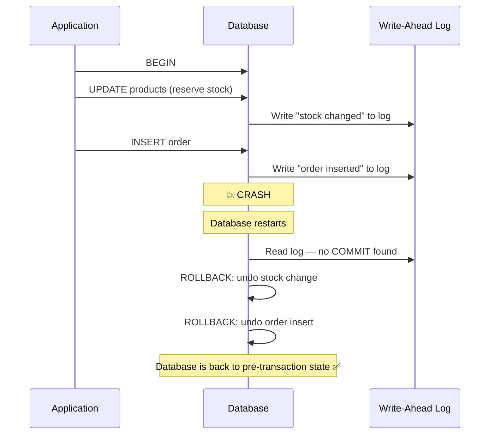
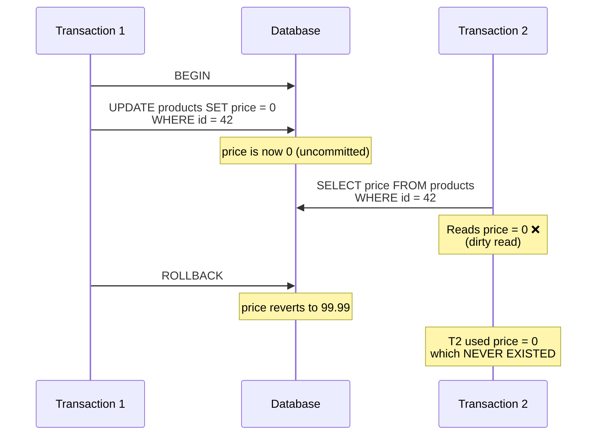
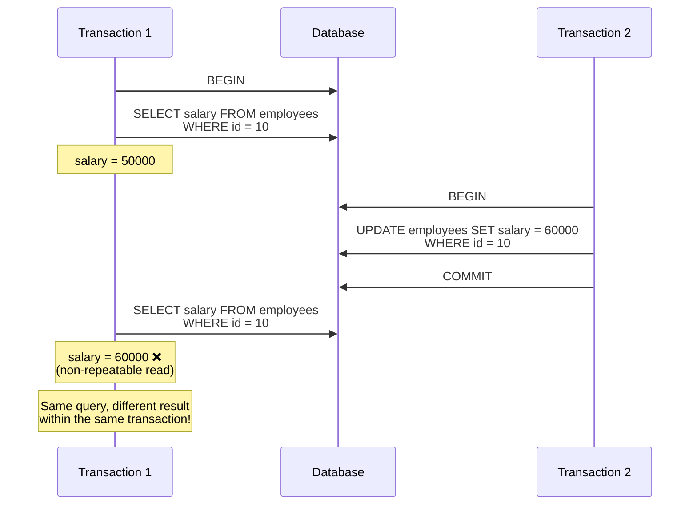
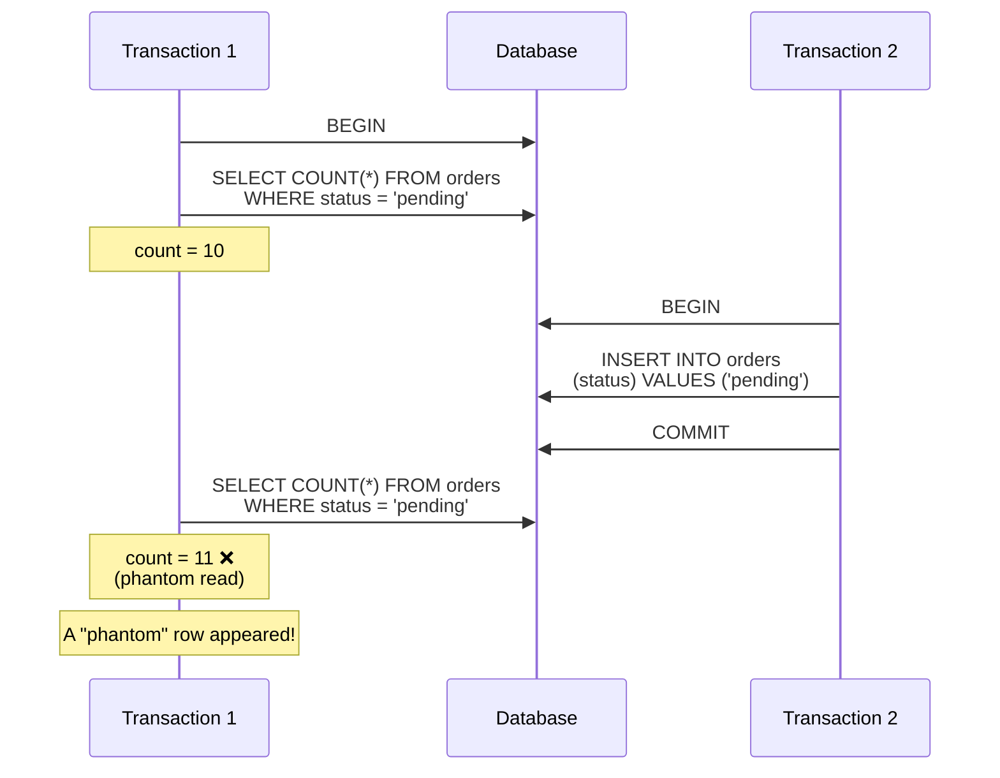
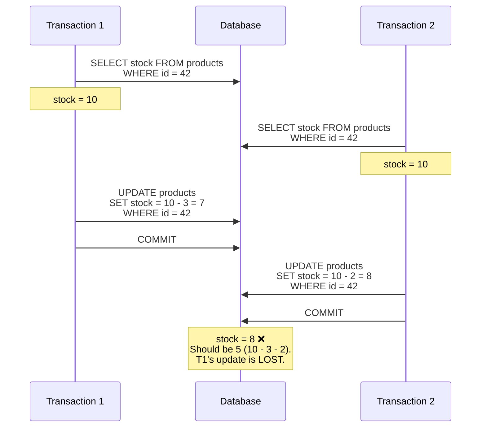
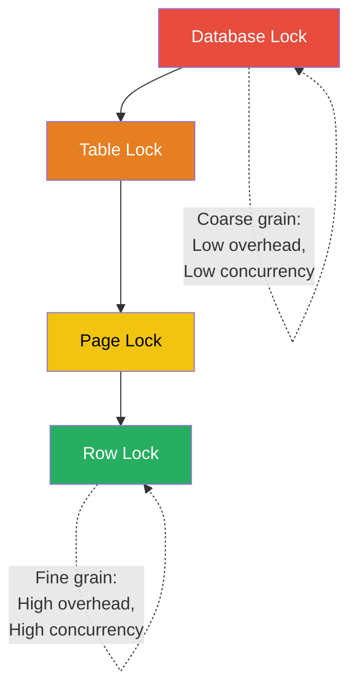
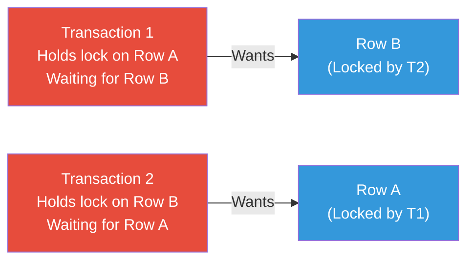
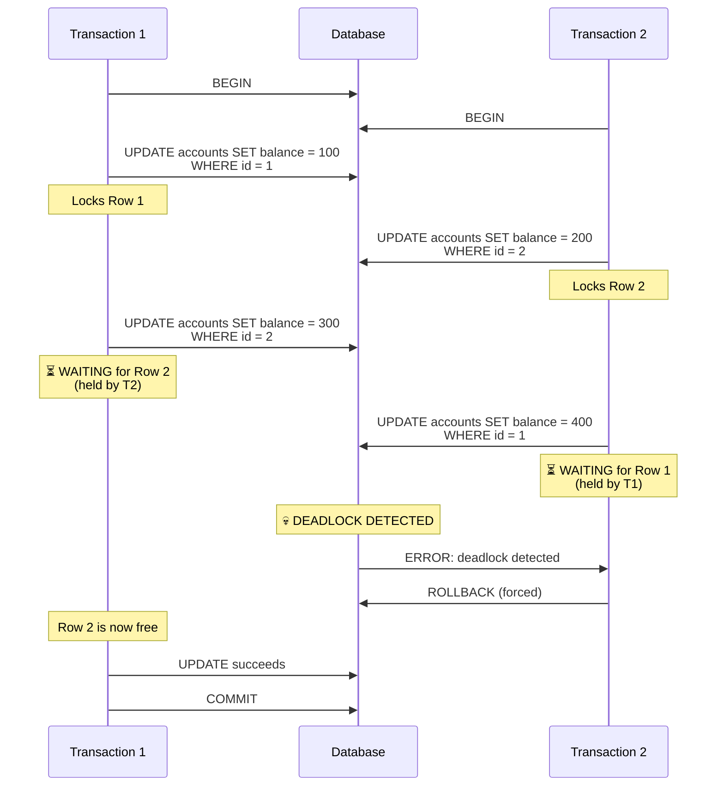
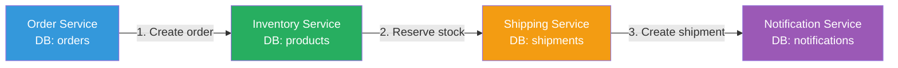

# Transactions and Concurrency

> [!tip] Core Insight
> A transaction is a **contract with the database**: "Execute all of these operations as one atomic unit, or none of them." Without transactions, concurrent access to shared data is a minefield of race conditions, lost updates, and corrupted state. Understanding isolation levels is what separates engineers who **hope** their code is correct from those who **know** it is.

---

## What Are Transactions?

### Definition

A **transaction** is a sequence of one or more SQL operations treated as a **single logical unit of work**. Either all operations succeed (COMMIT) or all are undone (ROLLBACK).

```sql
-- Basic transaction syntax
BEGIN;  -- or START TRANSACTION

UPDATE accounts SET balance = balance - 500 WHERE id = 1;  -- Debit
UPDATE accounts SET balance = balance + 500 WHERE id = 2;  -- Credit

COMMIT;  -- Make both changes permanent

-- If anything fails:
ROLLBACK;  -- Undo everything
```

### Mental Model: Bank Transfer

> [!example] The Classic Example
> Transfer $500 from Account A to Account B:
> 1. Debit $500 from Account A
> 2. Credit $500 to Account B
> 
> If step 1 succeeds but step 2 fails (crash, network error, constraint violation):
> - **Without transaction:** $500 vanishes. Account A lost money, Account B didn't receive it.
> - **With transaction:** Both changes are rolled back. Account A still has its money. System is consistent.

### Implicit vs Explicit Transactions

```sql
-- Implicit: every statement is its own transaction (autocommit mode)
INSERT INTO orders (customer_id, total_amount) VALUES (42, 299.99);
-- Automatically committed after execution

-- Explicit: you control the boundary
BEGIN;
INSERT INTO orders (customer_id, total_amount) VALUES (42, 299.99);
INSERT INTO order_items (order_id, product_id, quantity) VALUES (1001, 5, 2);
INSERT INTO shipments (order_id, carrier) VALUES (1001, 'FedEx');
COMMIT;
-- All three inserts succeed or none do
```

> [!warning] Autocommit Can Bite You
> In autocommit mode, each statement is independently committed. If your application logic requires multiple statements to be atomic, you **must** use explicit transactions.

---

## ACID Properties

### Atomicity — All or Nothing

**Atomicity** guarantees that a transaction is treated as a single, indivisible unit. All operations within it either **all succeed** or **all fail**.

```sql
BEGIN;
-- Step 1: Reserve inventory
UPDATE products SET stock_quantity = stock_quantity - 5 WHERE id = 42;

-- Step 2: Create order
INSERT INTO orders (customer_id, total_amount, status)
VALUES (17, 499.95, 'confirmed');

-- Step 3: What if the system crashes RIGHT HERE?
-- Without atomicity: inventory reserved, but no order created. Stock is "lost."
-- With atomicity: database recovers and rolls back both operations.

COMMIT;
```

#### What Happens During a Crash?



### Consistency — Valid State to Valid State

**Consistency** ensures the database transitions from one **valid state** to another. All constraints, triggers, and rules are enforced.

```sql
-- Constraint: balance can never be negative
ALTER TABLE accounts ADD CONSTRAINT chk_balance CHECK (balance >= 0);

BEGIN;
UPDATE accounts SET balance = balance - 10000 WHERE id = 1;
-- If Account 1 only has $5000:
-- CHECK constraint violated → transaction ABORTED
-- Database stays in consistent state
COMMIT;  -- This never executes
```

> [!tip] Consistency in Practice
> The database enforces consistency through:
> - `NOT NULL` constraints
> - `CHECK` constraints
> - `UNIQUE` constraints
> - `FOREIGN KEY` constraints
> - Triggers
> 
> These are your **last line of defense** against bad data — even if application code has bugs.

### Isolation — Concurrent Transactions Don't Interfere

**Isolation** determines how much one transaction can "see" of another transaction's uncommitted changes. The ideal is that concurrent transactions behave **as if they ran one after another** (serializably).

In reality, full serialization is expensive. Databases offer **isolation levels** that trade correctness for performance.

> Detailed coverage in the [Isolation Levels](#isolation-levels) section below.

### Durability — Committed Data Survives Crashes

**Durability** guarantees that once a transaction is committed, the data is **permanently saved** — even if the server crashes, loses power, or catches fire immediately after.

**How it works:**

1. **Write-Ahead Logging (WAL):** Before changing data, write the change to a sequential log file.
2. **fsync:** Ensure the log is flushed to disk (not just OS cache).
3. **Recovery:** On restart, replay the WAL to restore committed transactions.

```
Transaction commits at 14:32:05.123
Server crashes at 14:32:05.124 (1ms later)
Server restarts at 14:35:00.000

WAL replay: "Transaction T42 committed → apply changes"
Data is intact ✅
```

> [!warning] Durability Has a Cost
> `fsync` on every commit ensures durability but adds latency (~1-5ms per commit). For high-throughput systems, use:
> - **Batch commits:** Group multiple transactions into one fsync
> - **Asynchronous replication:** Acknowledge before replica confirms (risk: small data loss window)

---

## Isolation Levels

### The Spectrum

| Isolation Level      | Dirty Read | Non-Repeatable Read | Phantom Read | Performance |
| -------------------- | ---------- | ------------------- | ------------ | ----------- |
| **READ UNCOMMITTED** | ✅ Possible | ✅ Possible          | ✅ Possible   | Fastest     |
| **READ COMMITTED**   | ❌ Prevented | ✅ Possible          | ✅ Possible   | Fast        |
| **REPEATABLE READ**  | ❌ Prevented | ❌ Prevented          | ✅ Possible   | Medium      |
| **SERIALIZABLE**     | ❌ Prevented | ❌ Prevented          | ❌ Prevented   | Slowest     |

```sql
-- Setting isolation level
SET TRANSACTION ISOLATION LEVEL READ COMMITTED;

-- PostgreSQL: per-transaction
BEGIN ISOLATION LEVEL REPEATABLE READ;

-- MySQL: session-level
SET SESSION TRANSACTION ISOLATION LEVEL SERIALIZABLE;
```

### Default Isolation Levels

| Database    | Default Isolation Level |
| ----------- | ----------------------- |
| PostgreSQL  | READ COMMITTED          |
| MySQL       | REPEATABLE READ         |
| SQL Server  | READ COMMITTED          |
| Oracle      | READ COMMITTED          |

---

### READ UNCOMMITTED

The **weakest** isolation level. Transactions can read data that other transactions have modified but **not yet committed**.

```sql
-- Almost never used in practice. Useful only for:
-- - Approximate COUNT(*) on huge tables
-- - Monitoring dashboards where accuracy doesn't matter
-- - Debugging

-- MySQL
SET TRANSACTION ISOLATION LEVEL READ UNCOMMITTED;
```

> [!danger] Avoid in Production
> You can read data that will be rolled back — your application makes decisions based on data that **never existed**.

---

### READ COMMITTED

Each statement sees only data that was **committed before the statement began**. Most common default.

**Guarantees:** No dirty reads.
**Allows:** Non-repeatable reads, phantom reads.

```sql
-- Good for: Most OLTP workloads, API endpoints, simple CRUD
-- The "sensible default" for most applications
```

---

### REPEATABLE READ

Once a transaction reads a row, it always sees the **same version** of that row, even if another transaction modifies it.

**Guarantees:** No dirty reads, no non-repeatable reads.
**Allows:** Phantom reads (new rows can appear).

```sql
-- Good for: Reports that need consistent data within a transaction
-- MySQL default — uses MVCC (Multi-Version Concurrency Control)
```

> [!tip] MySQL's REPEATABLE READ
> MySQL's InnoDB implementation of REPEATABLE READ actually prevents phantom reads too (using next-key locking). It's closer to SERIALIZABLE than the SQL standard requires.

---

### SERIALIZABLE

The **strongest** isolation level. Transactions behave **as if they executed one at a time**, in some serial order.

**Guarantees:** No dirty reads, no non-repeatable reads, no phantom reads.
**Cost:** Highest lock contention, potential for serialization failures.

```sql
-- Good for: Financial transactions, inventory management, anything
--           where correctness is more important than throughput

BEGIN ISOLATION LEVEL SERIALIZABLE;
SELECT stock_quantity FROM products WHERE id = 42;  -- Returns 5
-- Another transaction tries to modify the same row: BLOCKED or ABORTED
UPDATE products SET stock_quantity = stock_quantity - 3 WHERE id = 42;
COMMIT;
```

> [!warning] Serializable Requires Retry Logic
> In PostgreSQL's SSI (Serializable Snapshot Isolation), conflicting transactions get an error:
> ```
> ERROR: could not serialize access due to concurrent update
> ```
> Your application **must** retry the transaction when this happens.

---

## Concurrency Problems

### Dirty Reads

**Reading uncommitted data** from another transaction that may be rolled back.



**Prevention:** READ COMMITTED or higher.

---

### Non-Repeatable Reads

**Same query returns different data** within one transaction because another transaction committed a change between the two reads.



**Prevention:** REPEATABLE READ or higher.

---

### Phantom Reads

**New rows appear** between two reads within the same transaction. An existing row didn't change — an entirely new row was inserted.



**Prevention:** SERIALIZABLE.

---

### Lost Updates

Two transactions read the same value, compute a new value based on it, and write back — the first write is **overwritten** by the second.



**Prevention:** Use atomic updates or `SELECT FOR UPDATE`:

```sql
-- ✅ Solution 1: Atomic update (best when possible)
UPDATE products SET stock_quantity = stock_quantity - 3 WHERE id = 42;
-- No read-then-write pattern — no lost update possible

-- ✅ Solution 2: SELECT FOR UPDATE (pessimistic locking)
BEGIN;
SELECT stock_quantity FROM products WHERE id = 42 FOR UPDATE;
-- Row is locked — T2 must wait
UPDATE products SET stock_quantity = stock_quantity - 3 WHERE id = 42;
COMMIT;

-- ✅ Solution 3: Optimistic locking (application-level)
UPDATE products SET stock_quantity = 7, version = 2
WHERE id = 42 AND version = 1;
-- If another transaction changed version, 0 rows affected → retry
```

---

## Locks

### Lock Types

| Lock Type    | Also Called | Allows Concurrent                | Blocks                |
| ------------ | ----------- | -------------------------------- | --------------------- |
| **Shared**   | Read lock   | Other shared locks               | Exclusive locks       |
| **Exclusive**| Write lock  | Nothing — exclusive access only  | All other locks       |

### Lock Granularity



| Granularity   | Overhead   | Concurrency | Used By                |
| ------------- | ---------- | ----------- | ---------------------- |
| **Table**     | Very low   | Very low    | DDL operations, LOCK TABLE |
| **Page**      | Low        | Medium      | SQL Server default      |
| **Row**       | High       | High        | PostgreSQL, MySQL InnoDB |

### SELECT FOR UPDATE

**Pessimistic locking:** Acquire an exclusive lock on selected rows to prevent other transactions from modifying them.

```sql
BEGIN;

-- Lock the row — other transactions wait here if they try to read FOR UPDATE or write
SELECT * FROM products WHERE id = 42 FOR UPDATE;

-- Safely modify the row (no one else can change it)
UPDATE products SET stock_quantity = stock_quantity - 3 WHERE id = 42;

COMMIT;  -- Lock released
```

> [!warning] Hold Locks for the Shortest Time Possible
> Every lock held is a transaction that might be waiting. Long transactions with locks = cascading delays = unhappy users.

### Optimistic vs Pessimistic Locking

| Aspect             | Pessimistic (FOR UPDATE)              | Optimistic (Version column)          |
| ------------------ | ------------------------------------- | ------------------------------------ |
| **Mechanism**      | Acquire lock before reading           | Check version at write time          |
| **Contention**     | Blocks other transactions             | No blocking; retry on conflict       |
| **Best for**       | High contention (same rows often)     | Low contention (rare conflicts)      |
| **Failure mode**   | Deadlocks possible                    | Stale read → retry needed            |
| **Throughput**     | Lower (waiting for locks)             | Higher (no waiting)                  |

```sql
-- Optimistic locking pattern
-- Step 1: Read the row and its version
SELECT id, stock_quantity, version FROM products WHERE id = 42;
-- Returns: stock=10, version=5

-- Step 2: Application computes new value
-- new_stock = 10 - 3 = 7

-- Step 3: Update with version check
UPDATE products
SET stock_quantity = 7, version = 6
WHERE id = 42 AND version = 5;

-- Step 4: Check affected rows
-- If 1 row affected → success
-- If 0 rows affected → someone else changed it → RETRY from Step 1
```

### Advisory Locks (PostgreSQL)

Application-level locks that don't lock any table or row — purely a coordination mechanism.

```sql
-- Acquire advisory lock (blocks if already held)
SELECT pg_advisory_lock(12345);

-- Do work that should not run concurrently
-- (e.g., batch processing, report generation)

-- Release
SELECT pg_advisory_unlock(12345);

-- Non-blocking version: try to acquire, return true/false
SELECT pg_try_advisory_lock(12345);
```

---

## Deadlocks

### What They Are

A **deadlock** occurs when two (or more) transactions are each waiting for a lock held by the other. Neither can proceed.



### Example



### Detection and Resolution

Databases detect deadlocks using a **wait-for graph**. When a cycle is detected:
1. One transaction is chosen as the **victim** (usually the one that did the least work).
2. The victim is **aborted** with a deadlock error.
3. The other transaction can proceed.

### Prevention Strategies

```sql
-- Strategy 1: Consistent lock ordering
-- Always lock rows in the same order (e.g., by ID ascending)
BEGIN;
-- ✅ Both T1 and T2 lock Row 1 first, then Row 2
SELECT * FROM accounts WHERE id = 1 FOR UPDATE;
SELECT * FROM accounts WHERE id = 2 FOR UPDATE;
-- No deadlock possible — both follow the same order
COMMIT;

-- Strategy 2: Lock timeout
SET lock_timeout = '5s';  -- PostgreSQL
-- If a lock can't be acquired in 5 seconds, abort instead of waiting forever

-- Strategy 3: Reduce lock scope
-- Lock fewer rows, hold locks for less time
-- Use row-level locks instead of table-level locks
```

> [!danger] Application Must Handle Deadlocks
> Deadlocks are **normal** in concurrent systems. Your application must catch the deadlock error and **retry the transaction**:
> ```java
> // Java: retry on deadlock
> int retries = 3;
> while (retries-- > 0) {
>     try {
>         transferFunds(fromId, toId, amount);
>         break; // success
>     } catch (DeadlockException e) {
>         if (retries == 0) throw e;
>         Thread.sleep(100); // backoff before retry
>     }
> }
> ```

---

## Race Conditions in Backend Systems

### Double-Spending Problem

Two requests try to spend the same balance simultaneously.

```sql
-- ❌ Vulnerable to race condition
-- Request A and Request B both read balance = 100 simultaneously
SELECT balance FROM wallets WHERE user_id = 42;  -- Both see 100
-- Request A: UPDATE wallets SET balance = 100 - 80 = 20 WHERE user_id = 42;
-- Request B: UPDATE wallets SET balance = 100 - 60 = 40 WHERE user_id = 42;
-- Final balance: 40 (should be -40 or rejected!)
-- Total spent: 140 from a 100 balance!

-- ✅ Fix 1: Atomic update with CHECK constraint
ALTER TABLE wallets ADD CONSTRAINT chk_balance CHECK (balance >= 0);

UPDATE wallets SET balance = balance - 80 WHERE user_id = 42;
-- If balance would go negative → constraint violation → transaction aborted

-- ✅ Fix 2: SELECT FOR UPDATE
BEGIN;
SELECT balance FROM wallets WHERE user_id = 42 FOR UPDATE;
-- Row locked — Request B waits here
IF balance >= 80 THEN
    UPDATE wallets SET balance = balance - 80 WHERE user_id = 42;
END IF;
COMMIT;
```

### Inventory Overselling

The logistics equivalent — multiple orders deplete the same stock.

```sql
-- ❌ Race condition: two orders for the last 3 items
-- Thread A: SELECT stock_quantity FROM products WHERE id = 42; → 3
-- Thread B: SELECT stock_quantity FROM products WHERE id = 42; → 3
-- Thread A: UPDATE products SET stock_quantity = 0 WHERE id = 42; (sold 3)
-- Thread B: UPDATE products SET stock_quantity = 0 WHERE id = 42; (sold 3)
-- Sold 6 items when only 3 existed!

-- ✅ Fix: Atomic conditional update
UPDATE products
SET stock_quantity = stock_quantity - 3
WHERE id = 42 AND stock_quantity >= 3;
-- Returns affected rows: 1 = success, 0 = insufficient stock

-- ✅ Defense in depth: CHECK constraint
ALTER TABLE products ADD CONSTRAINT chk_stock CHECK (stock_quantity >= 0);
```

### Duplicate Processing

The same event (webhook, message) is processed twice.

```sql
-- ✅ Idempotency key pattern
CREATE TABLE processed_events (
    event_id VARCHAR(255) PRIMARY KEY,
    processed_at TIMESTAMP DEFAULT CURRENT_TIMESTAMP
);

-- Before processing:
INSERT INTO processed_events (event_id) VALUES ('evt_abc123');
-- If duplicate → unique constraint violation → skip processing
```

See [[15 - SQL for Backend Engineers]] for comprehensive patterns.

---

## Backend Consistency Problems

### Beyond Single-Database Transactions

In microservice architectures, data spans multiple databases. Traditional transactions can't span them.



### Saga Pattern

A saga is a sequence of **local transactions**, each with a **compensating action** to undo if a later step fails.

```
1. Order Service: Create order (status = 'pending')
   ↳ Compensate: Cancel order (status = 'cancelled')

2. Inventory Service: Reserve stock
   ↳ Compensate: Release stock

3. Shipping Service: Create shipment
   ↳ Compensate: Cancel shipment

4. Notification Service: Send confirmation

If step 3 fails:
   → Run compensate for step 2 (release stock)
   → Run compensate for step 1 (cancel order)
```

### Outbox Pattern

Guarantees that a database change and a message/event are published **atomically** — without distributed transactions.

```sql
-- Within a SINGLE database transaction:
BEGIN;

-- 1. Make the business change
UPDATE orders SET status = 'confirmed' WHERE id = 1001;

-- 2. Write the event to an outbox table (same database!)
INSERT INTO outbox (aggregate_id, event_type, payload)
VALUES (1001, 'OrderConfirmed', '{"orderId": 1001, "amount": 299.99}');

COMMIT;

-- A background worker polls the outbox and publishes to Kafka/RabbitMQ
-- This guarantees the event is eventually published if the transaction committed
```

### Idempotent Consumers

```sql
-- Consumer processes messages from a queue
-- Must handle the same message being delivered twice

BEGIN;

-- Check if already processed
INSERT INTO processed_messages (message_id)
VALUES ('msg-abc-123')
ON CONFLICT DO NOTHING;

-- If insert succeeded (1 row), process the message
-- If insert failed (0 rows), skip — already processed

COMMIT;
```

> [!example] Real-World: Order Processing in Logistics
> ```
> 1. Customer places order → Order Service creates order + outbox event
> 2. Inventory Service consumes event → reserves stock + outbox event
> 3. Shipping Service consumes event → creates shipment + outbox event
> 4. Tracking Service consumes event → generates tracking number
> 
> Each step is:
> - A local transaction (ACID within one DB)
> - Idempotent (safe to retry)
> - Has a compensating action (saga) for rollback
> ```

See [[15 - SQL for Backend Engineers]] for implementation patterns in Spring Boot.

---

## Common Mistakes

### 1. Not Using Transactions Where Needed

```java
// ❌ Two separate statements — NOT atomic
orderRepository.save(order);        // Committed
orderItemRepository.saveAll(items); // If this fails, order exists without items!

// ✅ Wrap in a transaction
@Transactional
public void createOrder(Order order, List<OrderItem> items) {
    orderRepository.save(order);
    orderItemRepository.saveAll(items);
    // Both commit or both rollback
}
```

### 2. Long-Running Transactions

```sql
-- ❌ Transaction holds locks for 30 seconds while calling external API
BEGIN;
SELECT * FROM orders WHERE id = 1001 FOR UPDATE;
-- ... call external shipping API (takes 5-30 seconds) ...
UPDATE orders SET status = 'shipped' WHERE id = 1001;
COMMIT;

-- ✅ Do external work OUTSIDE the transaction
-- Step 1: Call shipping API (no transaction)
shippingResult = callShippingAPI(order);

-- Step 2: Short transaction to update database
BEGIN;
UPDATE orders SET status = 'shipped', tracking = :tracking WHERE id = 1001;
COMMIT;
```

> [!danger] Long Transactions Are Poison
> - Hold locks → other transactions wait → cascading delays
> - Consume connection pool slots
> - Prevent VACUUM in PostgreSQL (bloats tables)
> - Increase deadlock probability

### 3. Catching Exceptions but Not Rolling Back

```java
// ❌ Exception caught but transaction not rolled back
try {
    updateInventory(productId, quantity);
    createShipment(orderId);
} catch (Exception e) {
    log.error("Failed", e);
    // Transaction is still open! Partial changes may commit!
}

// ✅ Mark transaction for rollback
@Transactional(rollbackFor = Exception.class)
public void processOrder(Long orderId) {
    updateInventory(productId, quantity);
    createShipment(orderId);
    // If any exception is thrown, Spring rolls back automatically
}
```

### 4. Assuming READ COMMITTED Is Enough

```sql
-- Scenario: Generate a financial report
BEGIN;  -- READ COMMITTED (default)
SELECT SUM(total_amount) FROM orders WHERE status = 'completed';
-- Returns: $1,000,000

-- Meanwhile, another transaction moves $50,000 from completed to refunded
-- T2: UPDATE orders SET status = 'refunded' WHERE id = 999;
-- T2: INSERT INTO refunds (amount) VALUES (50000);
-- T2: COMMIT;

SELECT SUM(amount) FROM refunds;
-- Returns: $50,000 (includes the new refund!)

-- Report says: $1,000,000 completed + $50,000 refunds = inconsistent!
-- The $50,000 was counted as completed AND as refunded

-- ✅ Fix: Use REPEATABLE READ for reports
BEGIN ISOLATION LEVEL REPEATABLE READ;
-- Now both queries see the same snapshot
```

### 5. Ignoring Deadlock Handling in Application Code

```java
// ❌ No retry on deadlock — user sees an error
public void transferFunds(long from, long to, BigDecimal amount) {
    accountRepository.debit(from, amount);
    accountRepository.credit(to, amount);
    // Deadlock? → Exception propagates → 500 error to user
}

// ✅ Retry with backoff
@Retryable(value = DeadlockLoserDataAccessException.class,
           maxAttempts = 3,
           backoff = @Backoff(delay = 100, multiplier = 2))
@Transactional
public void transferFunds(long from, long to, BigDecimal amount) {
    // Lock in consistent order to minimize deadlocks
    long first = Math.min(from, to);
    long second = Math.max(from, to);
    accountRepository.lockForUpdate(first);
    accountRepository.lockForUpdate(second);
    accountRepository.debit(from, amount);
    accountRepository.credit(to, amount);
}
```

---

## How Beginners Think vs How Strong SQL Engineers Think

| Aspect                | Beginner                                       | Strong Engineer                                      |
| --------------------- | ---------------------------------------------- | ---------------------------------------------------- |
| **Transactions**      | "I'll add @Transactional later if I need it"   | "Every multi-step operation needs a transaction boundary" |
| **Isolation**         | "Default is fine"                              | "I choose the isolation level based on the specific consistency requirements" |
| **Concurrency bugs**  | "It works on my machine (single user)"         | "What happens with 100 concurrent users on the same row?" |
| **Lost updates**      | Read-modify-write in application code          | Atomic `SET col = col - N` or `SELECT FOR UPDATE`    |
| **Deadlocks**         | "That's a database bug"                        | "Normal in concurrent systems — implement retry logic" |
| **Long transactions** | Hold locks while calling external APIs          | Minimize transaction scope, do I/O outside           |
| **Consistency**       | "The app validates data"                       | "CHECK constraints + app validation — defense in depth" |
| **Distributed**       | "Just use a 2-phase commit"                    | "Saga + outbox + idempotent consumers"               |
| **Race conditions**   | "Add a synchronized block"                     | "Solve at the database level — it's the source of truth" |
| **Locking strategy**  | Always pessimistic or always optimistic         | "Pessimistic for high contention, optimistic for low" |

---

## Practice Exercises

### Exercise 1: Atomicity
Write a transaction that transfers $200 from customer 1's account to customer 2's account. Include a CHECK constraint to prevent negative balances. What happens if customer 1 only has $150?

### Exercise 2: Isolation Level Selection
For each scenario, choose the appropriate isolation level and explain why:
1. A dashboard showing approximate real-time order counts
2. A monthly financial reconciliation report
3. An e-commerce checkout that reserves inventory
4. A background job that processes queued messages

### Exercise 3: Lost Update Prevention
Two warehouse workers simultaneously update the stock count for product 42. Worker A wants to subtract 5, Worker B wants to subtract 3. Current stock is 20. Write SQL that prevents lost updates using:
a) Atomic update
b) SELECT FOR UPDATE
c) Optimistic locking with a version column

### Exercise 4: Deadlock Analysis
Transactions T1 and T2 execute:
```
T1: UPDATE shipments SET status='shipped' WHERE order_id=1;
T1: UPDATE shipments SET status='shipped' WHERE order_id=2;

T2: UPDATE shipments SET status='cancelled' WHERE order_id=2;
T2: UPDATE shipments SET status='cancelled' WHERE order_id=1;
```
Can this deadlock? If yes, how would you prevent it?

### Exercise 5: Inventory Overselling
You have an e-commerce system. Product 42 has `stock_quantity = 1`. Two customers simultaneously try to buy it. Write SQL that guarantees only one purchase succeeds, using:
a) Atomic conditional update
b) SELECT FOR UPDATE
c) CHECK constraint as safety net

### Exercise 6: Outbox Pattern
Design an outbox table and the corresponding transaction for the scenario: "When an order is confirmed, publish an OrderConfirmed event to a message queue." The solution must guarantee that either both the order status change AND the event are persisted, or neither is.

### Exercise 7: Idempotency
A webhook endpoint receives payment notifications. The same notification can arrive multiple times. Design a database schema and SQL logic that processes each notification exactly once, even under concurrent delivery.

### Exercise 8: Transaction Scope
This Spring Boot method has a transaction scope problem. Identify the issue and fix it:
```java
@Transactional
public void processOrder(Long orderId) {
    Order order = orderRepository.findById(orderId);
    ShippingResult result = shippingApiClient.createShipment(order); // HTTP call, 5-10s
    order.setTrackingNumber(result.getTrackingNumber());
    order.setStatus("SHIPPED");
    orderRepository.save(order);
}
```

---

## Interview Questions

### Q1: What are the ACID properties? Explain each with an example.
**Expected answer:** Atomicity (all-or-nothing: bank transfer), Consistency (valid state to valid state: constraints enforced), Isolation (concurrent transactions don't see each other's partial changes), Durability (committed data survives crashes: WAL + fsync).

### Q2: What's the difference between READ COMMITTED and REPEATABLE READ?
**Expected answer:** READ COMMITTED sees committed data at the time each **statement** executes (re-reads can see new commits). REPEATABLE READ sees a snapshot from the **start of the transaction** (re-reads always return the same data). Trade-off: REPEATABLE READ uses more memory (snapshot) but provides consistency within a transaction.

### Q3: How do you prevent lost updates?
**Expected answer:** (1) Atomic updates: `SET col = col - N` avoids read-modify-write. (2) Pessimistic locking: `SELECT FOR UPDATE` locks the row. (3) Optimistic locking: version column checked at update time, retry on conflict. Choice depends on contention level.

### Q4: What is a deadlock and how do you handle it?
**Expected answer:** A deadlock is a circular wait where two transactions each hold a lock the other needs. The database detects it and kills one transaction. Prevention: consistent lock ordering, short transactions, lock timeouts. Application: catch deadlock errors and retry with backoff.

### Q5: Why are long-running transactions problematic?
**Expected answer:** They hold locks (blocking other transactions), consume connection pool slots, prevent VACUUM/garbage collection (table/index bloat in PostgreSQL), and increase deadlock probability. Best practice: minimize transaction scope, do I/O outside transactions.

### Q6: How would you handle distributed transactions across microservices?
**Expected answer:** Avoid 2-phase commit (blocking, fragile). Use Saga pattern (local transactions with compensating actions) + Outbox pattern (atomically write event + data change) + idempotent consumers (handle duplicate message delivery).

### Q7: What's the difference between optimistic and pessimistic locking?
**Expected answer:** Pessimistic: lock the row upfront (`SELECT FOR UPDATE`), others wait. Best for high contention. Optimistic: no lock, check version at write time, retry on conflict. Best for low contention. Pessimistic risks deadlocks; optimistic risks retries under high contention.

### Q8: How do you prevent inventory overselling in a concurrent system?
**Expected answer:** (1) Atomic conditional update: `UPDATE SET stock = stock - N WHERE stock >= N` — returns 0 rows if insufficient. (2) CHECK constraint: `CHECK (stock >= 0)` as safety net. (3) `SELECT FOR UPDATE` to serialize access to the row. (4) Application-level: process orders through a queue to serialize access.

---

**Related Notes:** [[11 - Indexing]] · [[12 - Query Optimization]] · [[15 - SQL for Backend Engineers]]
