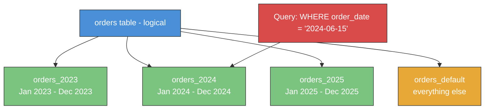
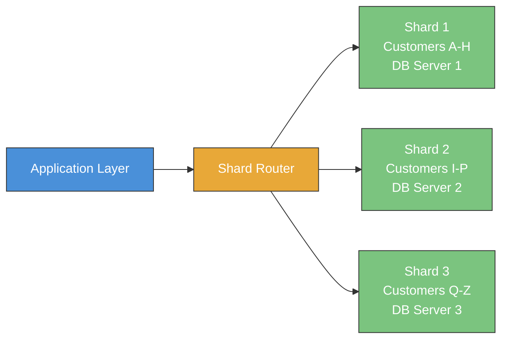

# Advanced SQL

> [!info] Purpose
> This note covers advanced SQL topics that go beyond daily CRUD operations — materialized views, partitioning, sharding, temporal tables, JSON querying, recursive relationships, set operations, upserts, and pivoting. These are the tools that separate a competent SQL user from a strong SQL engineer. Each section builds on foundations from earlier notes.

> [!tip] Prerequisites
> Make sure you're comfortable with [[04 - Joins]], [[06 - GROUP BY and Aggregation]], [[09 - Window Functions]], [[10 - Common Table Expressions]], [[12 - Query Optimization]], and [[13 - Transactions and Concurrency]] before diving in.

---

## Sample Tables

All examples use the shared schema:

```sql
-- employees (id, name, department_id, salary, hire_date, manager_id, is_active)
-- departments (id, name, location)
-- orders (id, customer_id, order_date, status, total_amount)
-- order_items (id, order_id, product_id, quantity, unit_price)
-- products (id, name, category, price, stock_quantity)
-- customers (id, name, email, city, created_at)
-- shipments (id, order_id, carrier, tracking_number, shipped_date, delivered_date, status)
```

---

## 1. Materialized Views

### What They Are vs Regular Views

A **regular view** is a saved query — every time you `SELECT` from it, the database re-executes the underlying query.

A **materialized view** is a saved query **plus its results stored on disk**. The database runs the query once, stores the output as a physical table, and subsequent reads hit the stored data directly.

| Feature | Regular View | Materialized View |
|---|---|---|
| Storage | No data stored — just a query alias | Data physically stored on disk |
| Read speed | As slow as the underlying query | Fast — reads from stored snapshot |
| Freshness | Always current | Can be stale (must be refreshed) |
| Write overhead | None | Refresh cost (re-runs the query) |
| Indexing | Cannot be indexed independently | Can be indexed like a table |
| Use case | Simplifying queries, access control | Expensive aggregations, dashboards |

> [!tip] Mental Model
> A regular view is like a saved bookmark — it takes you to the page every time. A materialized view is like printing the page — fast to read, but the printout can become outdated.

### Creating and Refreshing Materialized Views

```sql
-- PostgreSQL syntax
CREATE MATERIALIZED VIEW mv_monthly_revenue AS
SELECT
    d.location                          AS region,
    DATE_TRUNC('month', o.order_date)   AS month,
    COUNT(DISTINCT o.id)                AS order_count,
    SUM(o.total_amount)                 AS total_revenue,
    AVG(o.total_amount)                 AS avg_order_value
FROM orders o
JOIN customers c ON c.id = o.customer_id
JOIN departments d ON d.location = c.city
WHERE o.status = 'delivered'
GROUP BY d.location, DATE_TRUNC('month', o.order_date);

-- Create an index on the materialized view
CREATE INDEX idx_mv_monthly_rev_region ON mv_monthly_revenue (region);
CREATE INDEX idx_mv_monthly_rev_month ON mv_monthly_revenue (month);
```

### Refresh Strategies

```sql
-- Manual refresh (full rebuild — blocks reads during refresh)
REFRESH MATERIALIZED VIEW mv_monthly_revenue;

-- Concurrent refresh (allows reads during refresh — requires a UNIQUE index)
CREATE UNIQUE INDEX idx_mv_monthly_rev_unique
    ON mv_monthly_revenue (region, month);

REFRESH MATERIALIZED VIEW CONCURRENTLY mv_monthly_revenue;
```

| Strategy | Pros | Cons |
|---|---|---|
| Manual `REFRESH` | Simple, full consistency after refresh | Blocks reads, expensive on large data |
| `REFRESH CONCURRENTLY` | No read downtime | Requires unique index, slightly slower |
| Scheduled (cron/pg_cron) | Automatic, predictable | Data staleness between refreshes |
| On-demand (app-triggered) | Fresh when needed | Adds latency to the triggering request |

> [!warning] Stale Data
> Materialized views are **eventually consistent**. If a new order arrives at 10:01 AM and the view was last refreshed at 10:00 AM, the view won't include that order. Design your system to tolerate this staleness or refresh more frequently.

### Use Cases

- **Reporting dashboards** — Pre-compute daily/weekly/monthly aggregations
- **Expensive joins** — Cache the result of multi-table joins that rarely change
- **Search-optimized views** — Denormalize data for full-text search
- **Analytics** — Pre-aggregate metrics for fast slice-and-dice queries

### Trade-Offs

```
Query Speed ◄────────────────────────────► Data Freshness
   (fast)        Materialized View            (always current)
                      ▲                            ▲
                      │                            │
              stored snapshot                  regular view
              needs refresh                    always re-queries
```

---

## 2. Table Partitioning

### What Partitioning Is and Why

Partitioning splits a single logical table into multiple physical pieces (**partitions**), each holding a subset of the data. The database engine routes queries to the relevant partition(s) automatically.

> [!tip] Mental Model
> Think of a filing cabinet. Instead of one giant drawer with all invoices, you have 12 drawers — one per month. When someone asks for "March invoices," you open only the March drawer.

### Partition Types

| Type | How It Splits | Best For |
|---|---|---|
| **Range** | By value ranges (dates, IDs) | Time-series data, chronological records |
| **List** | By explicit value lists | Categories, regions, statuses |
| **Hash** | By hash of a column value | Even distribution when no natural range |

### Range Partitioning Example

```sql
-- PostgreSQL: partition orders by year
CREATE TABLE orders (
    id            SERIAL,
    customer_id   INT NOT NULL,
    order_date    DATE NOT NULL,
    status        VARCHAR(20),
    total_amount  DECIMAL(12, 2)
) PARTITION BY RANGE (order_date);

-- Create partitions for each year
CREATE TABLE orders_2023 PARTITION OF orders
    FOR VALUES FROM ('2023-01-01') TO ('2024-01-01');

CREATE TABLE orders_2024 PARTITION OF orders
    FOR VALUES FROM ('2024-01-01') TO ('2025-01-01');

CREATE TABLE orders_2025 PARTITION OF orders
    FOR VALUES FROM ('2025-01-01') TO ('2026-01-01');

-- Default partition for anything that doesn't match
CREATE TABLE orders_default PARTITION OF orders DEFAULT;
```

### List Partitioning Example

```sql
CREATE TABLE shipments (
    id              SERIAL,
    order_id        INT NOT NULL,
    carrier         VARCHAR(50) NOT NULL,
    tracking_number VARCHAR(100),
    shipped_date    DATE,
    delivered_date  DATE,
    status          VARCHAR(20) NOT NULL
) PARTITION BY LIST (status);

CREATE TABLE shipments_pending   PARTITION OF shipments FOR VALUES IN ('pending', 'processing');
CREATE TABLE shipments_in_transit PARTITION OF shipments FOR VALUES IN ('in_transit', 'out_for_delivery');
CREATE TABLE shipments_completed PARTITION OF shipments FOR VALUES IN ('delivered', 'returned');
CREATE TABLE shipments_cancelled PARTITION OF shipments FOR VALUES IN ('cancelled');
```

### Partition Pruning

**Partition pruning** is the optimizer's ability to skip irrelevant partitions entirely.

```sql
-- This query only scans orders_2024 — all other partitions are pruned
SELECT * FROM orders WHERE order_date BETWEEN '2024-06-01' AND '2024-06-30';

-- Verify with EXPLAIN
EXPLAIN SELECT * FROM orders WHERE order_date = '2024-03-15';
-- Output will show: Scan on orders_2024 (other partitions not mentioned)
```

> [!danger] Partition Pruning Fails When...
> - The `WHERE` clause doesn't reference the partition key
> - You apply a function to the partition key: `WHERE EXTRACT(YEAR FROM order_date) = 2024` — the optimizer can't prune
> - You use `OR` conditions spanning multiple unrelated columns

### Partitioning vs Indexing

| Aspect | Indexing | Partitioning |
|---|---|---|
| Purpose | Speed up lookups on specific columns | Reduce the volume of data scanned |
| Granularity | Row-level pointers | Chunk-level data separation |
| Maintenance | Auto-maintained on INSERT/UPDATE | Partitions may need manual creation |
| Best for | Selective queries (few rows) | Bulk scans, time-range queries |
| Combined | ✅ Use both — they're complementary, not alternatives |

### When Partitioning Helps and When It Doesn't

✅ **Helps when:**
- Table has millions/billions of rows
- Queries naturally filter on the partition key (dates, regions)
- You need to drop old data quickly (`DROP TABLE orders_2020` vs `DELETE FROM orders WHERE year = 2020`)
- Maintenance operations (VACUUM, REINDEX) need to work on smaller chunks

❌ **Doesn't help when:**
- Table is small (< 1M rows typically)
- Queries don't filter on the partition key
- You need cross-partition transactions with strong consistency
- Partition key has very low cardinality (2-3 values)

### Partition-Wise Joins

When two tables are partitioned on the same key, the database can join matching partitions independently — a **partition-wise join**.

```sql
-- If both orders and shipments are partitioned by order_date range,
-- the join can happen partition-by-partition instead of globally
SELECT o.id, s.carrier, s.status
FROM orders o
JOIN shipments s ON s.order_id = o.id
WHERE o.order_date BETWEEN '2024-01-01' AND '2024-12-31';
-- Only the 2024 partitions of both tables participate
```

### Mermaid Diagram: Partitioned Table



---

## 3. Sharding Concepts

### Horizontal Partitioning Across Databases

**Sharding** is partitioning taken to the next level — instead of splitting a table within one database, you split it across **multiple database servers**.

Each shard is a fully independent database holding a subset of the data.



### Shard Key Selection

The **shard key** determines which shard a row lives in. This is one of the most critical architectural decisions.

| Shard Key | Pros | Cons |
|---|---|---|
| `customer_id` | All data for one customer on one shard | Hotspot if one customer is huge |
| `order_date` | Time-range queries are fast | Recent shard gets all the writes (hot shard) |
| `region` | Geographic locality | Uneven distribution |
| `hash(customer_id)` | Even distribution | Range queries require scatter-gather |

> [!danger] Bad Shard Key = Pain Forever
> Choosing the wrong shard key is extremely difficult to fix later. It often requires migrating all data to a new sharding scheme. Invest time in this decision.

**Good shard key properties:**
- High cardinality (many distinct values)
- Even distribution of data
- Frequently used in `WHERE` clauses
- Minimizes cross-shard queries

### Cross-Shard Queries

When a query needs data from multiple shards, the application must:
1. Send the query to all relevant shards
2. Collect results
3. Merge/aggregate them locally

This is called **scatter-gather** and is much slower than single-shard queries.

```sql
-- Single-shard (fast): query includes the shard key
SELECT * FROM orders WHERE customer_id = 42;

-- Cross-shard (slow): query doesn't include the shard key
SELECT COUNT(*) FROM orders WHERE order_date > '2024-01-01';
-- Must query ALL shards and sum the counts
```

### Consistent Hashing

To distribute data evenly and handle shard additions/removals gracefully, many systems use **consistent hashing**:

```
shard_number = hash(shard_key) % number_of_shards
```

When adding a new shard, consistent hashing minimizes the number of rows that need to be re-assigned (only ~1/N of the data moves).

### Trade-Offs: Scalability vs Complexity

| Aspect | Single Database | Sharded |
|---|---|---|
| Scalability | Vertical only (bigger hardware) | Horizontal (add more servers) |
| Complexity | Simple | Very complex |
| Joins | Full support | Cross-shard joins are painful |
| Transactions | ACID guaranteed | Distributed transactions (2PC) are slow |
| Schema changes | One `ALTER TABLE` | Must apply to all shards |
| Operational burden | One database to manage | N databases to manage |

### When to Shard (and When NOT To)

> [!warning] Shard as Late as Possible
> Sharding introduces enormous operational complexity. Exhaust these options first:
> 1. **Optimize queries** — see [[12 - Query Optimization]]
> 2. **Add indexes**
> 3. **Partition tables** within a single database
> 4. **Read replicas** for read-heavy workloads
> 5. **Caching layer** (Redis, Memcached)
> 6. **Vertical scaling** (bigger server)
> 7. **Only then** consider sharding

---

## 4. Temporal Tables (System-Versioned)

### Tracking Data Changes Over Time

**Temporal tables** automatically track the full history of every row — when it was created, modified, and deleted. The database maintains a **history table** behind the scenes.

### Valid-Time vs Transaction-Time

| Concept | What It Tracks | Example |
|---|---|---|
| **Transaction-time** (system time) | When the database recorded the change | Row was updated at 2024-03-15 14:30:00 |
| **Valid-time** (application time) | When the fact was true in the real world | Employee's salary was $80K from Jan 1 to Jun 30 |
| **Bi-temporal** | Both simultaneously | Full audit trail + real-world timeline |

### SQL:2011 System-Versioned Tables

```sql
-- SQL Server / MariaDB syntax
CREATE TABLE employees (
    id           INT PRIMARY KEY,
    name         VARCHAR(100),
    department_id INT,
    salary       DECIMAL(10, 2),
    hire_date    DATE,
    manager_id   INT,
    is_active    BIT,
    -- System-versioning columns
    valid_from   DATETIME2 GENERATED ALWAYS AS ROW START,
    valid_to     DATETIME2 GENERATED ALWAYS AS ROW END,
    PERIOD FOR SYSTEM_TIME (valid_from, valid_to)
) WITH (SYSTEM_VERSIONING = ON (HISTORY_TABLE = dbo.employees_history));
```

### Historical Queries with FOR SYSTEM_TIME

```sql
-- What was the employee's data at a specific point in time?
SELECT * FROM employees
FOR SYSTEM_TIME AS OF '2024-01-15 10:00:00'
WHERE id = 42;

-- All versions of a row between two timestamps
SELECT * FROM employees
FOR SYSTEM_TIME BETWEEN '2024-01-01' AND '2024-06-30'
WHERE id = 42
ORDER BY valid_from;

-- All versions that were valid at any point during a range
SELECT * FROM employees
FOR SYSTEM_TIME FROM '2024-01-01' TO '2024-12-31'
WHERE id = 42;
```

### Use Cases

- **Audit trail** — Who changed what, and when?
- **Point-in-time recovery** — What did the data look like before the bug?
- **Compliance** — Regulatory requirements to retain historical data (SOX, GDPR)
- **Debugging** — "This order had the wrong status yesterday — what happened?"
- **Slowly Changing Dimensions** — Data warehousing pattern for tracking attribute changes

### Bi-Temporal Tables

Bi-temporal tables track both system time and valid time, giving you a complete picture:

```sql
-- "What did we BELIEVE the employee's salary was on March 1st,
--  as recorded in the system on April 15th?"
SELECT * FROM employees
FOR SYSTEM_TIME AS OF '2024-04-15'  -- what the DB knew on this date
WHERE id = 42
  AND valid_from <= '2024-03-01'
  AND valid_to > '2024-03-01';       -- valid in the real world on this date
```

---

## 5. JSON Querying

### JSON Data Type in PostgreSQL / MySQL

Modern databases support JSON as a first-class data type, letting you store semi-structured data alongside relational columns.

```sql
-- PostgreSQL
CREATE TABLE shipments (
    id              SERIAL PRIMARY KEY,
    order_id        INT NOT NULL,
    carrier         VARCHAR(50),
    tracking_number VARCHAR(100),
    shipped_date    DATE,
    delivered_date  DATE,
    status          VARCHAR(20),
    metadata        JSONB  -- Binary JSON for PostgreSQL (faster than JSON)
);

-- Insert with JSON metadata
INSERT INTO shipments (order_id, carrier, tracking_number, status, metadata)
VALUES (
    101, 'FedEx', 'FX123456789', 'in_transit',
    '{
        "weight_kg": 12.5,
        "dimensions": {"length": 40, "width": 30, "height": 20},
        "customs": {"declared_value": 250.00, "hs_code": "8471.30"},
        "handling_instructions": ["fragile", "keep_upright"],
        "checkpoints": [
            {"location": "Sydney", "timestamp": "2024-03-15T08:00:00Z", "status": "picked_up"},
            {"location": "Singapore", "timestamp": "2024-03-16T14:00:00Z", "status": "in_transit"}
        ]
    }'
);
```

### JSON Operators (PostgreSQL)

| Operator | Description | Returns | Example |
|---|---|---|---|
| `->` | Get JSON element by key/index | JSON | `metadata -> 'weight_kg'` → `12.5` (as JSON) |
| `->>` | Get JSON element as text | TEXT | `metadata ->> 'carrier'` → `FedEx` (as text) |
| `#>` | Get nested element by path | JSON | `metadata #> '{dimensions,length}'` → `40` |
| `#>>` | Get nested element as text | TEXT | `metadata #>> '{customs,hs_code}'` → `8471.30` |
| `@>` | Contains (left contains right) | BOOL | `metadata @> '{"weight_kg": 12.5}'` |
| `?` | Key exists | BOOL | `metadata ? 'customs'` |
| `?&` | All keys exist | BOOL | `metadata ?& array['weight_kg', 'customs']` |

### Querying Nested JSON

```sql
-- Get shipments heavier than 10 kg
SELECT id, carrier, (metadata ->> 'weight_kg')::DECIMAL AS weight
FROM shipments
WHERE (metadata ->> 'weight_kg')::DECIMAL > 10;

-- Get shipment dimensions
SELECT
    id,
    metadata #>> '{dimensions,length}' AS length_cm,
    metadata #>> '{dimensions,width}'  AS width_cm,
    metadata #>> '{dimensions,height}' AS height_cm
FROM shipments;

-- Find shipments with specific handling instructions
SELECT id, carrier
FROM shipments
WHERE metadata -> 'handling_instructions' ? 'fragile';

-- Unnest JSON array and query checkpoints
SELECT
    s.id,
    s.carrier,
    cp ->> 'location'  AS checkpoint_location,
    cp ->> 'status'    AS checkpoint_status,
    cp ->> 'timestamp' AS checkpoint_time
FROM shipments s,
     jsonb_array_elements(s.metadata -> 'checkpoints') AS cp
WHERE cp ->> 'status' = 'in_transit';
```

### Indexing JSON (GIN Indexes)

```sql
-- GIN index on entire JSONB column — supports @>, ?, ?&, ?| operators
CREATE INDEX idx_shipments_metadata ON shipments USING GIN (metadata);

-- GIN index on a specific JSON path
CREATE INDEX idx_shipments_weight ON shipments
    USING GIN ((metadata -> 'handling_instructions'));

-- B-tree index on a specific extracted value
CREATE INDEX idx_shipments_weight_val ON shipments
    (((metadata ->> 'weight_kg')::DECIMAL));
```

### When to Use JSON vs Relational Columns

| Use JSON When... | Use Relational Columns When... |
|---|---|
| Schema varies per row | Schema is consistent across rows |
| Data is from external APIs | Data is core business logic |
| You rarely filter/join on the data | You frequently filter/join/aggregate |
| Nesting is natural (metadata, config) | Data is flat and well-structured |
| Schema evolves frequently | Schema is stable |

> [!warning] JSON Anti-Pattern
> Don't use JSON as a way to avoid proper schema design. If you're constantly querying inside JSON, those fields should probably be relational columns. JSON is for truly semi-structured, variable data.

---

## 6. Recursive Relationships

### Trees and Graphs in SQL

Many real-world structures are hierarchical — org charts, product categories, route networks, bill of materials. SQL provides several ways to model these.

### Adjacency List Model (Most Common)

Each row points to its parent via a `parent_id` / `manager_id` column.

```sql
-- Organization hierarchy using adjacency list
SELECT * FROM employees;
-- id | name       | manager_id
-- 1  | CEO Alice  | NULL
-- 2  | VP Bob     | 1
-- 3  | VP Carol   | 1
-- 4  | Mgr Dave   | 2
-- 5  | Eng Eve    | 4
-- 6  | Eng Frank  | 4
```

Query the full tree with a **recursive CTE** (see [[10 - Common Table Expressions]]):

```sql
WITH RECURSIVE org_tree AS (
    -- Anchor: start from the CEO (no manager)
    SELECT id, name, manager_id, 0 AS depth, name::TEXT AS path
    FROM employees
    WHERE manager_id IS NULL

    UNION ALL

    -- Recursive: find direct reports
    SELECT e.id, e.name, e.manager_id, t.depth + 1,
           t.path || ' → ' || e.name
    FROM employees e
    JOIN org_tree t ON e.manager_id = t.id
)
SELECT depth, path FROM org_tree ORDER BY path;
```

### Comparison of Tree Models

| Model | INSERT | DELETE | Subtree Query | Move Subtree | Depth Query | Integrity |
|---|---|---|---|---|---|---|
| **Adjacency List** | Easy | Easy | Recursive CTE | Easy (update parent_id) | Recursive CTE | FK constraint |
| **Nested Set** | Hard (renumber) | Hard (renumber) | Fast (single query) | Very hard | Fast (single query) | Fragile |
| **Materialized Path** | Easy | Moderate | LIKE query | Moderate (update paths) | Count separators | No FK |
| **Closure Table** | Moderate (insert ancestors) | Moderate | Fast (single join) | Moderate | Stored in table | FK constraints |

### Materialized Path Model

Store the full path from root to each node:

```sql
ALTER TABLE employees ADD COLUMN path VARCHAR(500);

-- path values:
-- /1/          (CEO Alice)
-- /1/2/        (VP Bob)
-- /1/2/4/      (Mgr Dave)
-- /1/2/4/5/    (Eng Eve)

-- Find all descendants of Bob (id=2)
SELECT * FROM employees WHERE path LIKE '/1/2/%';

-- Find depth
SELECT name, (LENGTH(path) - LENGTH(REPLACE(path, '/', ''))) - 1 AS depth
FROM employees;
```

### Closure Table

A separate table storing **all** ancestor-descendant relationships:

```sql
CREATE TABLE employee_closure (
    ancestor_id   INT REFERENCES employees(id),
    descendant_id INT REFERENCES employees(id),
    depth         INT,
    PRIMARY KEY (ancestor_id, descendant_id)
);

-- For the org chart above, the closure table contains:
-- ancestor | descendant | depth
-- 1        | 1          | 0   (self)
-- 1        | 2          | 1
-- 1        | 4          | 2
-- 1        | 5          | 3
-- 2        | 2          | 0   (self)
-- 2        | 4          | 1
-- 2        | 5          | 2
-- ...

-- Find all reports under VP Bob (id=2)
SELECT e.* FROM employees e
JOIN employee_closure ec ON ec.descendant_id = e.id
WHERE ec.ancestor_id = 2 AND ec.depth > 0;
```

### Use Cases

- **Organizational hierarchy** — Who reports to whom?
- **Product categories** — Electronics → Phones → Smartphones → Android
- **Route networks** — Logistics: Hub → Regional Depot → Local Depot → Delivery Point
- **Bill of materials** — Assembly → Sub-assemblies → Components
- **Comment threads** — Reddit-style nested comments

---

## 7. Event Sourcing Query Patterns

### Event Stores in SQL

Instead of storing current state, **event sourcing** stores every state change as an immutable event.

```sql
CREATE TABLE order_events (
    event_id    SERIAL PRIMARY KEY,
    order_id    INT NOT NULL,
    event_type  VARCHAR(50) NOT NULL,
    event_data  JSONB NOT NULL,
    created_by  VARCHAR(100),
    created_at  TIMESTAMP DEFAULT NOW()
);

-- Sample events for order #101
INSERT INTO order_events (order_id, event_type, event_data, created_by) VALUES
(101, 'order_created',   '{"customer_id": 42, "items": [{"product_id": 1, "qty": 2}]}', 'system'),
(101, 'payment_received','{"amount": 250.00, "method": "credit_card"}', 'payment_service'),
(101, 'item_shipped',    '{"carrier": "FedEx", "tracking": "FX123"}', 'warehouse'),
(101, 'item_delivered',  '{"signed_by": "John Doe"}', 'delivery_service');
```

### Rebuilding Current State from Events

```sql
-- Rebuild the current status of an order
SELECT
    order_id,
    event_type,
    event_data,
    created_at,
    -- The latest event determines current status
    FIRST_VALUE(event_type) OVER (
        PARTITION BY order_id ORDER BY created_at DESC
    ) AS current_status
FROM order_events
WHERE order_id = 101;

-- Simpler: just get the latest event
SELECT event_type AS current_status, event_data, created_at
FROM order_events
WHERE order_id = 101
ORDER BY created_at DESC
LIMIT 1;
```

### Aggregating Event Streams

```sql
-- Timeline of all state changes for an order
SELECT
    order_id,
    event_type,
    created_at,
    created_at - LAG(created_at) OVER (
        PARTITION BY order_id ORDER BY created_at
    ) AS time_since_previous_event
FROM order_events
WHERE order_id = 101
ORDER BY created_at;
```

### Snapshotting for Performance

As event streams grow, rebuilding state from the first event becomes expensive. **Snapshots** store periodic checkpoints.

```sql
CREATE TABLE order_snapshots (
    order_id       INT PRIMARY KEY,
    current_state  JSONB NOT NULL,
    last_event_id  INT NOT NULL,
    snapshot_at    TIMESTAMP DEFAULT NOW()
);

-- Rebuild state: start from snapshot, apply only newer events
SELECT oe.* FROM order_events oe
JOIN order_snapshots os ON os.order_id = oe.order_id
WHERE oe.order_id = 101
  AND oe.event_id > os.last_event_id
ORDER BY oe.created_at;
```

> [!tip] Link
> For transaction guarantees when writing events, see [[13 - Transactions and Concurrency]].

---

## 8. SET Operations

### UNION vs UNION ALL

```sql
-- UNION: combines results and removes duplicates (slower — requires sort/hash)
SELECT city FROM customers
UNION
SELECT location FROM departments;

-- UNION ALL: combines results and keeps duplicates (faster — no dedup)
SELECT city FROM customers
UNION ALL
SELECT location FROM departments;
```

> [!tip] Always prefer `UNION ALL` unless you specifically need deduplication. The dedup step in `UNION` can be expensive on large result sets.

### INTERSECT

Returns rows that appear in **both** queries:

```sql
-- Cities that have both customers AND department offices
SELECT city FROM customers
INTERSECT
SELECT location FROM departments;
```

### EXCEPT / MINUS

Returns rows from the first query that are **not** in the second:

```sql
-- Cities with customers but NO department office
SELECT city FROM customers
EXCEPT
SELECT location FROM departments;
```

### Column Compatibility Requirements

All set operations require:
1. **Same number of columns** in each SELECT
2. **Compatible data types** in corresponding positions
3. Column names come from the **first** SELECT

```sql
-- ✅ Valid: same column count and compatible types
SELECT id, name FROM customers
UNION ALL
SELECT id, name FROM employees;

-- ❌ Invalid: different column counts
SELECT id, name, email FROM customers
UNION ALL
SELECT id, name FROM employees;  -- ERROR: column count mismatch
```

### Performance Considerations

| Operation | Dedup? | Sort/Hash? | Relative Speed |
|---|---|---|---|
| `UNION ALL` | No | No | Fastest |
| `UNION` | Yes | Yes | Slower |
| `INTERSECT` | Yes | Yes | Slower |
| `EXCEPT` | Yes | Yes | Slower |

### Use Cases

- **Combining result sets**: Active + archived orders
- **Finding common records**: Customers who bought from multiple categories
- **Finding differences**: Products in catalog but never ordered

---

## 9. MERGE / UPSERT

### The Problem

You need to insert a row if it doesn't exist, or update it if it does. Without upsert, you'd need:

```sql
-- ❌ Race condition: another session could INSERT between these two statements
IF NOT EXISTS (SELECT 1 FROM products WHERE id = 100)
    INSERT INTO products (id, name, price) VALUES (100, 'Widget', 19.99);
ELSE
    UPDATE products SET price = 19.99 WHERE id = 100;
```

### PostgreSQL: INSERT ON CONFLICT

```sql
-- Upsert: insert or update on conflict
INSERT INTO products (id, name, category, price, stock_quantity)
VALUES (100, 'Widget', 'Parts', 19.99, 50)
ON CONFLICT (id) DO UPDATE SET
    price = EXCLUDED.price,
    stock_quantity = products.stock_quantity + EXCLUDED.stock_quantity;

-- Insert or ignore (do nothing if exists)
INSERT INTO products (id, name, category, price, stock_quantity)
VALUES (100, 'Widget', 'Parts', 19.99, 50)
ON CONFLICT (id) DO NOTHING;
```

### MySQL: INSERT ON DUPLICATE KEY UPDATE

```sql
INSERT INTO products (id, name, category, price, stock_quantity)
VALUES (100, 'Widget', 'Parts', 19.99, 50)
ON DUPLICATE KEY UPDATE
    price = VALUES(price),
    stock_quantity = stock_quantity + VALUES(stock_quantity);
```

### SQL Server / Oracle: MERGE

```sql
MERGE INTO products AS target
USING (VALUES (100, 'Widget', 'Parts', 19.99, 50))
    AS source (id, name, category, price, stock_quantity)
ON target.id = source.id
WHEN MATCHED THEN
    UPDATE SET
        target.price = source.price,
        target.stock_quantity = target.stock_quantity + source.stock_quantity
WHEN NOT MATCHED THEN
    INSERT (id, name, category, price, stock_quantity)
    VALUES (source.id, source.name, source.category, source.price, source.stock_quantity);
```

### Use Cases

- **Data synchronization** — Syncing inventory from a warehouse feed
- **Idempotent operations** — Re-processing a message should produce the same result
- **Dimension loading** — Data warehouse ETL: update existing, insert new
- **Counter updates** — Increment page views, stock quantities

---

## 10. Pivot / Unpivot

### Transforming Rows to Columns

**Pivoting** turns row values into column headers — essential for cross-tab reports.

### CASE-Based Pivoting (Works Everywhere)

```sql
-- Pivot: monthly revenue by carrier
SELECT
    carrier,
    SUM(CASE WHEN EXTRACT(MONTH FROM shipped_date) = 1 THEN 1 ELSE 0 END) AS jan,
    SUM(CASE WHEN EXTRACT(MONTH FROM shipped_date) = 2 THEN 1 ELSE 0 END) AS feb,
    SUM(CASE WHEN EXTRACT(MONTH FROM shipped_date) = 3 THEN 1 ELSE 0 END) AS mar,
    SUM(CASE WHEN EXTRACT(MONTH FROM shipped_date) = 4 THEN 1 ELSE 0 END) AS apr,
    SUM(CASE WHEN EXTRACT(MONTH FROM shipped_date) = 5 THEN 1 ELSE 0 END) AS may,
    SUM(CASE WHEN EXTRACT(MONTH FROM shipped_date) = 6 THEN 1 ELSE 0 END) AS jun
FROM shipments
WHERE EXTRACT(YEAR FROM shipped_date) = 2024
GROUP BY carrier;
```

| carrier | jan | feb | mar | apr | may | jun |
|---|---|---|---|---|---|---|
| FedEx | 45 | 52 | 48 | 61 | 55 | 63 |
| DHL | 30 | 28 | 35 | 42 | 38 | 40 |
| UPS | 38 | 41 | 44 | 50 | 47 | 52 |

### CROSSTAB in PostgreSQL

```sql
-- Requires tablefunc extension
CREATE EXTENSION IF NOT EXISTS tablefunc;

SELECT * FROM crosstab(
    'SELECT carrier, EXTRACT(MONTH FROM shipped_date)::INT, COUNT(*)
     FROM shipments
     WHERE EXTRACT(YEAR FROM shipped_date) = 2024
     GROUP BY carrier, EXTRACT(MONTH FROM shipped_date)
     ORDER BY carrier, 2',
    'SELECT generate_series(1, 12)'
) AS ct(carrier TEXT, jan BIGINT, feb BIGINT, mar BIGINT, apr BIGINT,
        may BIGINT, jun BIGINT, jul BIGINT, aug BIGINT,
        sep BIGINT, oct BIGINT, nov BIGINT, dec BIGINT);
```

### Unpivot: Columns to Rows

```sql
-- Turn columnar data back into rows using UNION ALL
SELECT carrier, 'jan' AS month, jan AS shipment_count FROM carrier_monthly
UNION ALL
SELECT carrier, 'feb', feb FROM carrier_monthly
UNION ALL
SELECT carrier, 'mar', mar FROM carrier_monthly;

-- PostgreSQL: LATERAL + VALUES for cleaner unpivot
SELECT cm.carrier, v.month, v.shipment_count
FROM carrier_monthly cm,
LATERAL (VALUES
    ('jan', cm.jan),
    ('feb', cm.feb),
    ('mar', cm.mar)
) AS v(month, shipment_count);
```

### Dynamic Pivoting Considerations

> [!warning] Dynamic Pivoting
> Standard SQL doesn't support dynamic column names. You'd need dynamic SQL (building the query as a string and executing it). This is common in reporting tools but **avoid it in application code** — it's a SQL injection risk and hard to maintain. Use the application layer to transform rows into columns instead.

---

## How Beginners Think vs How Strong SQL Engineers Think

| Aspect | Beginner | Strong SQL Engineer |
|---|---|---|
| Materialized views | "I'll cache the query results in my application" | "I'll let the database cache expensive aggregations and refresh them on a schedule" |
| Partitioning | "My query is slow — I need a bigger server" | "My query scans 5 years of data but only needs this month — partition by date" |
| Sharding | "We should shard now to prepare for scale" | "We have 10M rows — indexing and partitioning will handle this for years" |
| JSON columns | "I'll store everything as JSON for flexibility" | "I'll use JSON for truly variable metadata and relational columns for everything I query on" |
| Tree queries | "I'll load all rows and build the tree in Java" | "A recursive CTE builds the tree in one round-trip" |
| UNION vs UNION ALL | Uses `UNION` everywhere | Uses `UNION ALL` by default, `UNION` only when dedup is needed |
| Upserts | SELECT to check, then INSERT or UPDATE | `ON CONFLICT` — atomic, no race condition |

---

## Common Mistakes

> [!danger] Mistake 1: Materialized View Without Refresh Strategy
> Creating a materialized view and forgetting to refresh it. The dashboard shows stale data for weeks.

> [!danger] Mistake 2: Partitioning on the Wrong Column
> Partitioning `orders` by `status` (3 values) instead of `order_date`. No partition pruning benefit.

> [!danger] Mistake 3: Premature Sharding
> Sharding a database with 5M rows. A single PostgreSQL instance can handle hundreds of millions of rows.

> [!danger] Mistake 4: Storing Queryable Data in JSON
> Putting `customer_id` inside a JSON column and then filtering on it. This prevents index usage and is orders of magnitude slower than a relational column.

> [!danger] Mistake 5: Recursive CTE Without a Termination Condition
> Missing the base case or having circular references in hierarchical data — infinite loop.

> [!danger] Mistake 6: Using UNION When UNION ALL Suffices
> Paying the deduplication cost for no reason. Always ask: "Do I actually need to remove duplicates?"

> [!danger] Mistake 7: Race Conditions in Manual Upserts
> Using `IF NOT EXISTS ... INSERT ELSE UPDATE` instead of `ON CONFLICT`. Two sessions can both see "not exists" simultaneously.

> [!danger] Mistake 8: Not Indexing JSON Columns
> Querying JSONB with `@>` or `?` without a GIN index — forces a full table scan.

---

## Practice Exercises

> [!question] Exercise 1: Materialized View for Dashboard
> Create a materialized view that computes daily shipment counts by carrier and status for the last 90 days. Include a unique index for concurrent refresh.

> [!question] Exercise 2: Range Partitioning
> Partition the `orders` table by `order_date` into quarterly partitions for 2024. Write a query that benefits from partition pruning and verify with `EXPLAIN`.

> [!question] Exercise 3: JSON Metadata Query
> Given shipments with a `metadata` JSONB column containing `{"weight_kg": ..., "customs": {"declared_value": ...}}`, write a query to find all shipments with customs declared value > $500 and weight > 20 kg.

> [!question] Exercise 4: Recursive Org Chart
> Using the `employees` table with `manager_id`, write a recursive CTE that produces the full org chart with depth level and a path like `CEO → VP → Manager → Engineer`.

> [!question] Exercise 5: Closure Table Implementation
> Design a closure table for product categories. Write queries to: (a) find all subcategories of "Electronics", (b) find the depth of each category, (c) move "Smartphones" from under "Phones" to directly under "Electronics".

> [!question] Exercise 6: Event Sourcing Timeline
> Given `order_events`, write a query that shows the full timeline of each order, including the time elapsed between each event and a running status.

> [!question] Exercise 7: MERGE for Inventory Sync
> Write a MERGE/upsert statement that synchronizes product stock from a warehouse feed: insert new products, update stock quantities for existing ones, and flag products not in the feed as discontinued.

> [!question] Exercise 8: Pivot Report
> Create a pivot query showing total revenue by product category (rows) and quarter (columns) for 2024. Handle quarters with no orders gracefully (show 0, not NULL).

> [!question] Exercise 9: Set Operations for Data Audit
> Using set operations, find: (a) customers who have placed orders but never received a shipment, (b) products that appear in `order_items` but don't exist in `products` (orphaned references).

> [!question] Exercise 10: Shard Key Analysis
> Given a multi-tenant SaaS application with tables `tenants`, `users`, `documents`, and `audit_logs`, analyze which column would make the best shard key. Consider query patterns, data distribution, and cross-shard query frequency. Write your analysis as comments in SQL.

---

## Interview Questions

> [!question] Q1: When would you use a materialized view vs a regular view vs a cache in Redis?
> **Answer:** Regular view for simple query aliasing with always-current data. Materialized view for expensive aggregations that tolerate staleness and are queried frequently. Redis for sub-millisecond reads, session data, and when you need TTL-based expiry. Materialized views are best when the data is too large for Redis and the query is too expensive to run on every request.

> [!question] Q2: Explain partition pruning. How can it fail?
> **Answer:** Partition pruning is the optimizer's ability to skip irrelevant partitions based on the WHERE clause. It fails when: (1) the WHERE clause doesn't reference the partition key, (2) a function is applied to the partition key (`WHERE YEAR(order_date) = 2024`), (3) type mismatch between the filter and partition key, (4) OR conditions that span non-partition columns.

> [!question] Q3: You have a 500M row orders table. Queries filtering by date are slow. Walk through your approach.
> **Answer:** First, check if there's an index on `order_date` — add one if missing. If the index exists but queries still scan too much data, partition by date range (monthly or quarterly). Verify partition pruning with EXPLAIN. Consider a materialized view for aggregation-heavy queries. Sharding is a last resort.

> [!question] Q4: What are the dangers of storing queryable data in JSON columns?
> **Answer:** No type checking, no referential integrity (no FKs), limited index support (GIN index is less efficient than B-tree), poor query plan estimation by the optimizer, verbose query syntax, and inability to use standard constraints (NOT NULL, UNIQUE, CHECK).

> [!question] Q5: Compare adjacency list vs closure table for hierarchical data.
> **Answer:** Adjacency list is simple (just a `parent_id` column) and works well with recursive CTEs, but subtree queries require recursion. Closure table stores all ancestor-descendant pairs, making subtree queries a simple join, but inserts require inserting multiple closure rows and the table grows as O(n × depth). Choose adjacency list for simple hierarchies with infrequent subtree queries; closure table for deep hierarchies with frequent subtree/ancestor lookups.

> [!question] Q6: When should you shard a database? What do you try first?
> **Answer:** Shard as a last resort. First: optimize queries (indexes, query rewriting), partition tables, add read replicas, add caching. Shard only when a single server can't handle the write throughput or data volume. Pick a shard key with high cardinality, even distribution, and alignment with query patterns.

> [!question] Q7: Explain the difference between UNION and UNION ALL. When would UNION be harmful?
> **Answer:** UNION removes duplicates (requires sorting/hashing), UNION ALL keeps all rows. UNION is harmful when combining large result sets where duplicates are impossible or acceptable — the dedup overhead is wasted. Example: combining `orders_2023` and `orders_2024` partitions — IDs are unique across partitions, so UNION's dedup is pure waste.

> [!question] Q8: What is an upsert? Why is SELECT-then-INSERT/UPDATE not equivalent?
> **Answer:** Upsert is an atomic INSERT-or-UPDATE operation. SELECT-then-INSERT/UPDATE has a race condition: two concurrent sessions can both SELECT "not found" and both INSERT, causing a duplicate key error or double-inserts. Upsert (`ON CONFLICT`, `MERGE`) is atomic — the database handles the check-and-act as one operation with proper locking.

> [!question] Q9: How do temporal tables help with debugging production issues?
> **Answer:** Temporal tables maintain a full history of every row change with timestamps. When a bug causes incorrect data, you can query `FOR SYSTEM_TIME AS OF <timestamp>` to see exactly what the data looked like before the bug, identify when the change happened, and what the previous value was — without needing application-level logging.

> [!question] Q10: Design a partitioning strategy for a logistics company's shipment tracking table with 2 billion rows, 5 years of data, and queries that filter by shipped_date and carrier.
> **Answer:** Primary partition by `shipped_date` using range partitioning (monthly partitions = 60 partitions). Within each partition, create indexes on `carrier` and `status`. This gives partition pruning on date-range queries and index efficiency for carrier lookups within a partition. Old partitions can be detached and archived. Consider sub-partitioning by `carrier` if carrier-specific queries are very frequent, but only if the number of carriers is stable.

---

> [!tip] What's Next?
> Continue to [[15 - SQL for Backend Engineers]] to see how these advanced SQL concepts integrate with Java, Spring Boot, Hibernate, and real-world backend systems.
