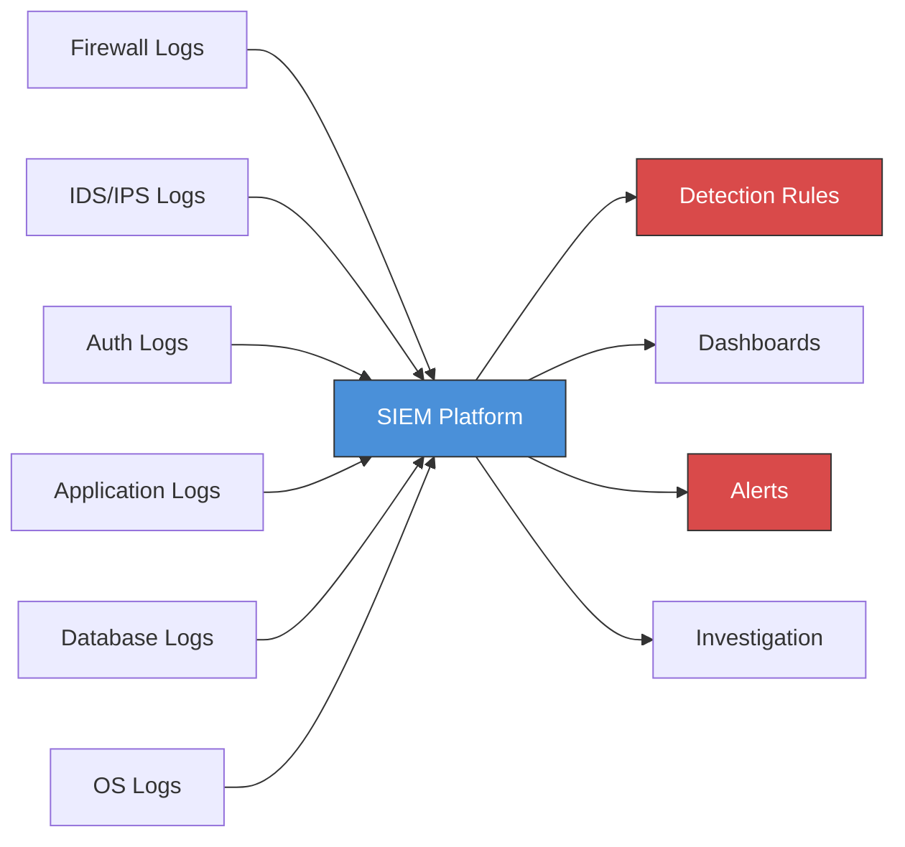
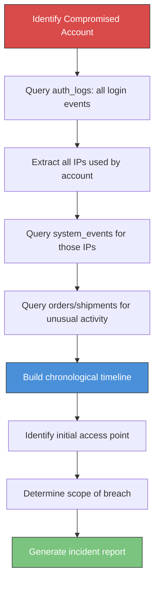

# SQL for Cybersecurity and Analytics

> [!info] Purpose
> This note explores how SQL powers security operations (log analysis, threat detection, SIEM queries) and analytics (cohort analysis, funnels, time-series). Security engineers and data analysts alike rely on the same SQL foundations — aggregation, window functions, temporal queries — applied to different domains. If you understand these patterns, you can query any observability or analytics system.

> [!tip] Prerequisites
> Strong command of [[06 - GROUP BY and Aggregation]], [[09 - Window Functions]], [[12 - Query Optimization]], and [[14 - Advanced SQL]] is essential. Many patterns here combine multiple concepts.

---

## Sample Tables

In addition to the shared schema, this note uses security-specific tables:

```sql
-- Shared tables
-- employees (id, name, department_id, salary, hire_date, manager_id, is_active)
-- departments (id, name, location)
-- orders (id, customer_id, order_date, status, total_amount)
-- order_items (id, order_id, product_id, quantity, unit_price)
-- products (id, name, category, price, stock_quantity)
-- customers (id, name, email, city, created_at)
-- shipments (id, order_id, carrier, tracking_number, shipped_date, delivered_date, status)

-- Security / log tables
CREATE TABLE auth_logs (
    id          SERIAL PRIMARY KEY,
    user_id     INT,
    username    VARCHAR(100),
    event_type  VARCHAR(50),    -- login_success, login_failed, logout, password_change, mfa_challenge
    ip_address  INET,
    user_agent  TEXT,
    country     VARCHAR(100),
    city        VARCHAR(100),
    timestamp   TIMESTAMP NOT NULL DEFAULT NOW(),
    details     JSONB
);

CREATE TABLE system_events (
    id           SERIAL PRIMARY KEY,
    source       VARCHAR(100),   -- firewall, ids, application, database, os
    severity     VARCHAR(20),    -- info, warning, error, critical
    event_type   VARCHAR(100),
    message      TEXT,
    ip_source    INET,
    ip_dest      INET,
    port         INT,
    protocol     VARCHAR(20),
    bytes_sent   BIGINT,
    bytes_received BIGINT,
    timestamp    TIMESTAMP NOT NULL DEFAULT NOW(),
    metadata     JSONB
);

CREATE TABLE user_sessions (
    id           SERIAL PRIMARY KEY,
    user_id      INT NOT NULL,
    session_id   VARCHAR(100) UNIQUE,
    started_at   TIMESTAMP NOT NULL,
    ended_at     TIMESTAMP,
    pages_viewed INT DEFAULT 0,
    ip_address   INET,
    user_agent   TEXT
);

CREATE TABLE page_views (
    id           SERIAL PRIMARY KEY,
    session_id   VARCHAR(100),
    user_id      INT,
    page_url     VARCHAR(500),
    referrer     VARCHAR(500),
    timestamp    TIMESTAMP NOT NULL DEFAULT NOW(),
    duration_ms  INT
);
```

---

## 1. Log Analysis Queries

### Common Log Table Schema Patterns

Well-structured log tables share common columns:

| Column | Purpose | Type |
|---|---|---|
| `id` | Unique event identifier | SERIAL / BIGSERIAL |
| `timestamp` | When the event occurred | TIMESTAMP (indexed!) |
| `source` | System that generated the event | VARCHAR |
| `severity` | Severity level (info/warn/error/critical) | VARCHAR or ENUM |
| `event_type` | What happened | VARCHAR |
| `message` | Human-readable description | TEXT |
| `ip_address` | Source or destination IP | INET |
| `user_id` / `username` | Associated user | INT / VARCHAR |
| `metadata` | Additional context (flexible) | JSONB |

> [!tip] Always Index `timestamp`
> Every log query filters by time. An index on `timestamp` is non-negotiable. Consider partitioning by date for tables with billions of rows. See [[14 - Advanced SQL]] — Table Partitioning.

### Filtering by Severity, Source, and Timestamp

```sql
-- Recent critical events from the firewall
SELECT timestamp, event_type, message, ip_source, ip_dest
FROM system_events
WHERE severity = 'critical'
  AND source = 'firewall'
  AND timestamp >= NOW() - INTERVAL '1 hour'
ORDER BY timestamp DESC;

-- Error spike detection: count errors per minute
SELECT
    DATE_TRUNC('minute', timestamp) AS minute,
    COUNT(*) AS error_count
FROM system_events
WHERE severity IN ('error', 'critical')
  AND timestamp >= NOW() - INTERVAL '24 hours'
GROUP BY DATE_TRUNC('minute', timestamp)
HAVING COUNT(*) > 100  -- alert threshold
ORDER BY minute DESC;
```

### Pattern Detection in Logs

```sql
-- Find repeated patterns: same event type from same source
SELECT
    source,
    event_type,
    COUNT(*) AS occurrences,
    MIN(timestamp) AS first_seen,
    MAX(timestamp) AS last_seen,
    MAX(timestamp) - MIN(timestamp) AS duration
FROM system_events
WHERE timestamp >= NOW() - INTERVAL '1 hour'
GROUP BY source, event_type
HAVING COUNT(*) > 50
ORDER BY occurrences DESC;
```

### Time-Bucketing with DATE_TRUNC

```sql
-- Hourly event distribution (understand traffic patterns)
SELECT
    DATE_TRUNC('hour', timestamp) AS hour,
    severity,
    COUNT(*) AS event_count
FROM system_events
WHERE timestamp >= NOW() - INTERVAL '7 days'
GROUP BY DATE_TRUNC('hour', timestamp), severity
ORDER BY hour, severity;
```

### Finding Failed Login Attempts

```sql
-- Failed logins in the last 24 hours, grouped by username
SELECT
    username,
    COUNT(*) AS failed_attempts,
    COUNT(DISTINCT ip_address) AS distinct_ips,
    ARRAY_AGG(DISTINCT country) AS countries,
    MIN(timestamp) AS first_attempt,
    MAX(timestamp) AS last_attempt
FROM auth_logs
WHERE event_type = 'login_failed'
  AND timestamp >= NOW() - INTERVAL '24 hours'
GROUP BY username
HAVING COUNT(*) >= 5  -- 5+ failures is suspicious
ORDER BY failed_attempts DESC;
```

---

## 2. Threat Correlation

### Correlating Events from Multiple Sources

Real threats often span multiple log sources. Correlation joins events from different systems by time proximity and shared identifiers (IP, user).

```sql
-- Correlate: failed login followed by successful login from a DIFFERENT IP
-- (possible credential stuffing with a successful breach)
WITH failed AS (
    SELECT username, ip_address AS failed_ip, timestamp AS failed_at
    FROM auth_logs
    WHERE event_type = 'login_failed'
      AND timestamp >= NOW() - INTERVAL '1 hour'
),
succeeded AS (
    SELECT username, ip_address AS success_ip, timestamp AS success_at
    FROM auth_logs
    WHERE event_type = 'login_success'
      AND timestamp >= NOW() - INTERVAL '1 hour'
)
SELECT
    f.username,
    f.failed_ip,
    s.success_ip,
    f.failed_at,
    s.success_at,
    s.success_at - f.failed_at AS time_gap
FROM failed f
JOIN succeeded s
    ON f.username = s.username
    AND s.success_at > f.failed_at
    AND s.success_at - f.failed_at < INTERVAL '30 minutes'  -- temporal proximity
    AND f.failed_ip != s.success_ip                          -- different IPs
ORDER BY s.success_at DESC;
```

### Temporal Joins (Events Within Time Windows)

```sql
-- Correlate: firewall block followed by IDS alert within 5 minutes
SELECT
    fw.timestamp AS firewall_time,
    fw.ip_source AS attacker_ip,
    ids.timestamp AS ids_time,
    ids.event_type AS ids_alert,
    ids.message AS ids_detail
FROM system_events fw
JOIN system_events ids
    ON fw.ip_source = ids.ip_source
    AND ids.source = 'ids'
    AND ids.timestamp BETWEEN fw.timestamp AND fw.timestamp + INTERVAL '5 minutes'
WHERE fw.source = 'firewall'
  AND fw.event_type = 'connection_blocked'
  AND fw.timestamp >= NOW() - INTERVAL '24 hours';
```

### IP Address Analysis

```sql
-- Top source IPs generating security events
SELECT
    ip_source,
    COUNT(*) AS total_events,
    COUNT(DISTINCT event_type) AS event_types,
    COUNT(*) FILTER (WHERE severity = 'critical') AS critical_count,
    MIN(timestamp) AS first_seen,
    MAX(timestamp) AS last_seen
FROM system_events
WHERE timestamp >= NOW() - INTERVAL '24 hours'
  AND severity IN ('warning', 'error', 'critical')
GROUP BY ip_source
HAVING COUNT(*) > 100
ORDER BY total_events DESC;

-- IPs that appear in both firewall blocks AND auth failures (cross-source correlation)
SELECT
    fw.ip_source,
    COUNT(DISTINCT fw.id) AS firewall_blocks,
    COUNT(DISTINCT al.id) AS auth_failures
FROM system_events fw
JOIN auth_logs al ON fw.ip_source = al.ip_address
WHERE fw.source = 'firewall'
  AND fw.event_type = 'connection_blocked'
  AND al.event_type = 'login_failed'
  AND fw.timestamp >= NOW() - INTERVAL '24 hours'
  AND al.timestamp >= NOW() - INTERVAL '24 hours'
GROUP BY fw.ip_source
ORDER BY firewall_blocks + auth_failures DESC;
```

### User Behavior Analysis

```sql
-- Users logging in from multiple countries within a short timeframe
-- (impossible travel detection)
WITH user_logins AS (
    SELECT
        username,
        country,
        timestamp,
        LAG(country) OVER (PARTITION BY username ORDER BY timestamp) AS prev_country,
        LAG(timestamp) OVER (PARTITION BY username ORDER BY timestamp) AS prev_time
    FROM auth_logs
    WHERE event_type = 'login_success'
      AND timestamp >= NOW() - INTERVAL '24 hours'
)
SELECT
    username,
    prev_country AS from_country,
    country AS to_country,
    prev_time AS first_login,
    timestamp AS second_login,
    timestamp - prev_time AS time_between_logins
FROM user_logins
WHERE country != prev_country
  AND prev_country IS NOT NULL
  AND timestamp - prev_time < INTERVAL '2 hours'  -- impossible to travel that fast
ORDER BY time_between_logins;
```

> [!warning] Impossible Travel Detection
> This is a common detection rule in SIEM systems. A user logging in from Sydney and then from London 30 minutes later is physically impossible — the account is likely compromised. Be aware of VPN/proxy usage as a source of false positives.

---

## 3. SIEM Query Patterns

### What SIEM Systems Do

**SIEM** (Security Information and Event Management) systems collect, normalize, correlate, and analyze security logs from across an organization. They answer: "Is something bad happening right now?"



### SQL-Like Query Languages in SIEMs

| SIEM Platform | Query Language | SQL Equivalent |
|---|---|---|
| Splunk | SPL (Search Processing Language) | `index=auth action=failure \| stats count by src_ip` |
| Microsoft Sentinel | KQL (Kusto Query Language) | `SecurityEvent \| where EventID == 4625 \| summarize count() by SourceIP` |
| Elastic SIEM | EQL, ES\|QL | `SELECT src_ip, COUNT(*) FROM logs WHERE event_type='failure' GROUP BY src_ip` |
| Google Chronicle | YARA-L, UDM Search | Rules-based detection |

> [!tip] If You Know SQL, You Can Learn Any SIEM Language
> All SIEM query languages are fundamentally doing the same thing — filter, aggregate, correlate, alert. The syntax differs, but the logic is identical to SQL GROUP BY, WHERE, JOIN, and window functions.

### Common Detection Patterns Translated to SQL

#### Brute Force Detection

```sql
-- Alert: more than 10 failed logins from a single IP in 10 minutes
SELECT
    ip_address,
    COUNT(*) AS attempts,
    COUNT(DISTINCT username) AS targeted_users,
    MIN(timestamp) AS window_start,
    MAX(timestamp) AS window_end
FROM auth_logs
WHERE event_type = 'login_failed'
  AND timestamp >= NOW() - INTERVAL '10 minutes'
GROUP BY ip_address
HAVING COUNT(*) > 10
ORDER BY attempts DESC;
```

#### Data Exfiltration (Unusual Data Volumes)

```sql
-- Alert: unusually large outbound data transfer
WITH hourly_baseline AS (
    -- Baseline: average bytes sent per source IP per hour (last 30 days)
    SELECT
        ip_source,
        AVG(total_bytes) AS avg_hourly_bytes,
        STDDEV(total_bytes) AS stddev_bytes
    FROM (
        SELECT
            ip_source,
            DATE_TRUNC('hour', timestamp) AS hour,
            SUM(bytes_sent) AS total_bytes
        FROM system_events
        WHERE timestamp >= NOW() - INTERVAL '30 days'
          AND source = 'firewall'
        GROUP BY ip_source, DATE_TRUNC('hour', timestamp)
    ) hourly
    GROUP BY ip_source
),
current_hour AS (
    SELECT
        ip_source,
        SUM(bytes_sent) AS current_bytes
    FROM system_events
    WHERE timestamp >= DATE_TRUNC('hour', NOW())
      AND source = 'firewall'
    GROUP BY ip_source
)
SELECT
    c.ip_source,
    c.current_bytes,
    b.avg_hourly_bytes,
    ROUND((c.current_bytes - b.avg_hourly_bytes) / NULLIF(b.stddev_bytes, 0), 2) AS z_score
FROM current_hour c
JOIN hourly_baseline b ON c.ip_source = b.ip_source
WHERE c.current_bytes > b.avg_hourly_bytes + (3 * b.stddev_bytes)  -- 3 sigma = anomaly
ORDER BY z_score DESC;
```

#### Privilege Escalation

```sql
-- Alert: user granted admin privileges
SELECT
    al.timestamp,
    al.username,
    al.event_type,
    al.details ->> 'granted_role' AS new_role,
    al.details ->> 'granted_by' AS granted_by,
    al.ip_address
FROM auth_logs al
WHERE al.event_type = 'role_change'
  AND al.details ->> 'granted_role' IN ('admin', 'superadmin', 'dba')
  AND al.timestamp >= NOW() - INTERVAL '24 hours'
ORDER BY al.timestamp DESC;

-- Detect self-escalation (suspicious: user grants themselves privileges)
SELECT *
FROM auth_logs
WHERE event_type = 'role_change'
  AND username = details ->> 'granted_by'  -- same person
  AND timestamp >= NOW() - INTERVAL '7 days';
```

#### Lateral Movement Indicators

```sql
-- Detect: single user authenticating to many distinct internal hosts in a short period
SELECT
    username,
    COUNT(DISTINCT ip_dest) AS hosts_accessed,
    ARRAY_AGG(DISTINCT ip_dest ORDER BY ip_dest) AS host_list,
    MIN(timestamp) AS first_access,
    MAX(timestamp) AS last_access
FROM system_events
WHERE event_type IN ('ssh_login', 'rdp_login', 'smb_access')
  AND timestamp >= NOW() - INTERVAL '1 hour'
GROUP BY username
HAVING COUNT(DISTINCT ip_dest) > 5  -- accessing more than 5 hosts in an hour is unusual
ORDER BY hosts_accessed DESC;
```

---

## 4. Detection Engineering Concepts

### Sigma Rules and Their SQL Equivalents

**Sigma** is a generic detection rule format that can be compiled into various SIEM query languages. Every Sigma rule translates naturally to SQL.

```yaml
# Sigma rule example
title: Multiple Failed Logins Followed by Success
status: experimental
logsource:
    product: auth
detection:
    failed:
        event_type: login_failed
    success:
        event_type: login_success
    condition: failed | count(username) > 5 AND success
    timeframe: 15m
```

**SQL equivalent:**

```sql
-- Sigma rule translated to SQL
WITH suspects AS (
    SELECT username
    FROM auth_logs
    WHERE event_type = 'login_failed'
      AND timestamp >= NOW() - INTERVAL '15 minutes'
    GROUP BY username
    HAVING COUNT(*) > 5
)
SELECT al.*
FROM auth_logs al
JOIN suspects s ON al.username = s.username
WHERE al.event_type = 'login_success'
  AND al.timestamp >= NOW() - INTERVAL '15 minutes';
```

### Time-Windowed Aggregation for Detection

Most detection rules work by counting events within a time window:

```sql
-- Generic pattern: event count exceeds threshold in a sliding window
SELECT
    username,
    COUNT(*) AS event_count,
    DATE_TRUNC('minute', timestamp) AS window
FROM auth_logs
WHERE event_type = :event_type
  AND timestamp >= NOW() - INTERVAL :window_size
GROUP BY username, DATE_TRUNC('minute', timestamp)
HAVING COUNT(*) > :threshold;
```

### Baseline vs Anomaly Approach

| Approach | How It Works | Pros | Cons |
|---|---|---|---|
| **Threshold** | Alert when count > N | Simple, predictable | Many false positives; static |
| **Baseline** | Alert when current > historical average + N × stddev | Adapts to normal behavior | Requires historical data; computation |
| **Peer comparison** | Alert when user's activity differs from peers | Context-aware | Complex to implement |

```sql
-- Baseline anomaly: user's login count today vs their 30-day average
WITH daily_logins AS (
    SELECT
        username,
        DATE(timestamp) AS day,
        COUNT(*) AS login_count
    FROM auth_logs
    WHERE event_type = 'login_success'
      AND timestamp >= NOW() - INTERVAL '30 days'
    GROUP BY username, DATE(timestamp)
),
baselines AS (
    SELECT
        username,
        AVG(login_count) AS avg_daily,
        STDDEV(login_count) AS stddev_daily
    FROM daily_logins
    WHERE day < CURRENT_DATE  -- exclude today from the baseline
    GROUP BY username
),
today AS (
    SELECT
        username,
        COUNT(*) AS today_count
    FROM auth_logs
    WHERE event_type = 'login_success'
      AND DATE(timestamp) = CURRENT_DATE
    GROUP BY username
)
SELECT
    t.username,
    t.today_count,
    ROUND(b.avg_daily, 1) AS avg_daily,
    ROUND((t.today_count - b.avg_daily) / NULLIF(b.stddev_daily, 0), 2) AS z_score
FROM today t
JOIN baselines b ON t.username = b.username
WHERE t.today_count > b.avg_daily + (2 * COALESCE(b.stddev_daily, 0))
ORDER BY z_score DESC;
```

### Detection-as-Code Using SQL

```sql
-- Store detection rules as SQL in a table — version-controlled, testable
CREATE TABLE detection_rules (
    id           SERIAL PRIMARY KEY,
    name         VARCHAR(200) NOT NULL,
    description  TEXT,
    severity     VARCHAR(20),
    query        TEXT NOT NULL,           -- The detection SQL
    threshold    INT DEFAULT 1,
    window_minutes INT DEFAULT 60,
    enabled      BOOLEAN DEFAULT TRUE,
    created_at   TIMESTAMP DEFAULT NOW(),
    updated_at   TIMESTAMP DEFAULT NOW()
);

INSERT INTO detection_rules (name, description, severity, query, threshold, window_minutes) VALUES
('Brute Force - Single IP',
 'More than N failed logins from a single IP within the window',
 'high',
 'SELECT ip_address, COUNT(*) AS attempts FROM auth_logs WHERE event_type = ''login_failed'' AND timestamp >= NOW() - INTERVAL ''$WINDOW minutes'' GROUP BY ip_address HAVING COUNT(*) > $THRESHOLD',
 10, 10);
```

### Logistics System Threat Detection

```sql
-- Detect suspicious order pattern: many high-value orders from a new customer
-- (possible fraud or compromised account)
SELECT
    c.id AS customer_id,
    c.name,
    c.created_at AS account_created,
    COUNT(o.id) AS order_count,
    SUM(o.total_amount) AS total_spent,
    AVG(o.total_amount) AS avg_order_value,
    NOW() - c.created_at AS account_age
FROM customers c
JOIN orders o ON o.customer_id = c.id
WHERE c.created_at >= NOW() - INTERVAL '7 days'  -- new account
  AND o.order_date >= NOW() - INTERVAL '7 days'
GROUP BY c.id, c.name, c.created_at
HAVING SUM(o.total_amount) > 5000                 -- high total
   AND COUNT(o.id) > 10                            -- many orders
ORDER BY total_spent DESC;

-- Detect shipment diversion: shipment destination changed after creation
SELECT
    s.id AS shipment_id,
    s.order_id,
    s.status,
    s.tracking_number,
    s.metadata ->> 'original_destination' AS original_dest,
    s.metadata ->> 'current_destination' AS current_dest,
    s.metadata ->> 'changed_by' AS changed_by,
    s.metadata ->> 'change_timestamp' AS change_time
FROM shipments s
WHERE s.metadata ->> 'original_destination' != s.metadata ->> 'current_destination'
  AND s.shipped_date >= NOW() - INTERVAL '30 days'
ORDER BY s.shipped_date DESC;
```

---

## 5. Aggregation-Heavy Analytics

### Complex Multi-Dimensional Aggregation

```sql
-- Revenue analysis by category and quarter with subtotals
SELECT
    COALESCE(p.category, 'ALL CATEGORIES') AS category,
    COALESCE(CONCAT('Q', EXTRACT(QUARTER FROM o.order_date)::TEXT), 'ALL QUARTERS') AS quarter,
    COUNT(DISTINCT o.id) AS orders,
    SUM(oi.quantity * oi.unit_price) AS revenue,
    AVG(oi.quantity * oi.unit_price) AS avg_item_value
FROM orders o
JOIN order_items oi ON oi.order_id = o.id
JOIN products p ON p.id = oi.product_id
WHERE EXTRACT(YEAR FROM o.order_date) = 2024
GROUP BY ROLLUP(p.category, CONCAT('Q', EXTRACT(QUARTER FROM o.order_date)::TEXT))
ORDER BY category NULLS LAST, quarter NULLS LAST;
```

### GROUPING SETS, CUBE, ROLLUP

| Operator | What It Produces | Example |
|---|---|---|
| `GROUP BY ROLLUP(A, B)` | (A, B), (A), () | Category + Quarter subtotals and grand total |
| `GROUP BY CUBE(A, B)` | (A, B), (A), (B), () | All possible subtotal combinations |
| `GROUP BY GROUPING SETS((A, B), (A), ())` | Custom subtotal combinations | Only the subtotals you specify |

```sql
-- CUBE: all subtotal combinations of carrier and status
SELECT
    COALESCE(carrier, 'ALL') AS carrier,
    COALESCE(status, 'ALL') AS status,
    COUNT(*) AS shipment_count,
    AVG(delivered_date - shipped_date) AS avg_delivery_days
FROM shipments
WHERE shipped_date >= '2024-01-01'
GROUP BY CUBE(carrier, status)
ORDER BY carrier NULLS LAST, status NULLS LAST;
```

```sql
-- GROUPING SETS: only specific subtotals
SELECT
    COALESCE(carrier, 'ALL') AS carrier,
    COALESCE(status, 'ALL') AS status,
    COUNT(*) AS cnt
FROM shipments
GROUP BY GROUPING SETS (
    (carrier, status),   -- detail level
    (carrier),           -- carrier subtotal
    ()                   -- grand total
);
```

### Pivoting for Dashboards

```sql
-- Dashboard query: shipment status matrix by carrier
SELECT
    carrier,
    COUNT(*) FILTER (WHERE status = 'pending')     AS pending,
    COUNT(*) FILTER (WHERE status = 'in_transit')   AS in_transit,
    COUNT(*) FILTER (WHERE status = 'delivered')    AS delivered,
    COUNT(*) FILTER (WHERE status = 'returned')     AS returned,
    COUNT(*)                                        AS total
FROM shipments
WHERE shipped_date >= NOW() - INTERVAL '30 days'
GROUP BY carrier
ORDER BY total DESC;
```

### Materialized Views for Performance

```sql
-- Pre-compute daily analytics (refresh nightly)
CREATE MATERIALIZED VIEW mv_daily_analytics AS
SELECT
    DATE(o.order_date)              AS day,
    p.category,
    c.city                          AS customer_city,
    COUNT(DISTINCT o.id)            AS orders,
    COUNT(DISTINCT o.customer_id)   AS unique_customers,
    SUM(o.total_amount)             AS revenue,
    AVG(o.total_amount)             AS avg_order_value
FROM orders o
JOIN customers c ON c.id = o.customer_id
JOIN order_items oi ON oi.order_id = o.id
JOIN products p ON p.id = oi.product_id
WHERE o.status = 'delivered'
GROUP BY DATE(o.order_date), p.category, c.city;

CREATE UNIQUE INDEX idx_mv_daily_analytics
    ON mv_daily_analytics (day, category, customer_city);

-- Dashboard queries now hit the materialized view — sub-millisecond
SELECT category, SUM(revenue) FROM mv_daily_analytics
WHERE day >= CURRENT_DATE - 30
GROUP BY category ORDER BY SUM(revenue) DESC;
```

> [!tip] Link
> See [[14 - Advanced SQL]] — Materialized Views for refresh strategies and trade-offs.

---

## 6. Time-Series Querying

### Time Bucketing

```sql
-- Events per minute (last hour)
SELECT
    DATE_TRUNC('minute', timestamp) AS minute,
    COUNT(*) AS events
FROM system_events
WHERE timestamp >= NOW() - INTERVAL '1 hour'
GROUP BY DATE_TRUNC('minute', timestamp)
ORDER BY minute;

-- Events per hour (last week)
SELECT
    DATE_TRUNC('hour', timestamp) AS hour,
    source,
    COUNT(*) AS events
FROM system_events
WHERE timestamp >= NOW() - INTERVAL '7 days'
GROUP BY DATE_TRUNC('hour', timestamp), source
ORDER BY hour;
```

### Gap Filling

Time series often have gaps (no events in a bucket). Fill them with `generate_series`:

```sql
-- Generate all hours in the last 24 hours, fill gaps with 0
WITH hours AS (
    SELECT generate_series(
        DATE_TRUNC('hour', NOW() - INTERVAL '24 hours'),
        DATE_TRUNC('hour', NOW()),
        INTERVAL '1 hour'
    ) AS hour
),
counts AS (
    SELECT
        DATE_TRUNC('hour', timestamp) AS hour,
        COUNT(*) AS event_count
    FROM system_events
    WHERE timestamp >= NOW() - INTERVAL '24 hours'
    GROUP BY DATE_TRUNC('hour', timestamp)
)
SELECT
    h.hour,
    COALESCE(c.event_count, 0) AS event_count
FROM hours h
LEFT JOIN counts c ON c.hour = h.hour
ORDER BY h.hour;
```

### Rate Calculations

```sql
-- Events per second (EPS) over the last hour
SELECT
    DATE_TRUNC('minute', timestamp) AS minute,
    COUNT(*) / 60.0 AS events_per_second
FROM system_events
WHERE timestamp >= NOW() - INTERVAL '1 hour'
GROUP BY DATE_TRUNC('minute', timestamp)
ORDER BY minute;
```

### Moving Averages for Anomaly Detection

```sql
-- 5-minute moving average of error rate
WITH minute_counts AS (
    SELECT
        DATE_TRUNC('minute', timestamp) AS minute,
        COUNT(*) AS error_count
    FROM system_events
    WHERE severity IN ('error', 'critical')
      AND timestamp >= NOW() - INTERVAL '2 hours'
    GROUP BY DATE_TRUNC('minute', timestamp)
)
SELECT
    minute,
    error_count,
    AVG(error_count) OVER (
        ORDER BY minute ROWS BETWEEN 4 PRECEDING AND CURRENT ROW
    ) AS moving_avg_5min,
    -- Flag anomalies where current count > 3x the moving average
    CASE
        WHEN error_count > 3 * AVG(error_count) OVER (
            ORDER BY minute ROWS BETWEEN 4 PRECEDING AND CURRENT ROW
        ) THEN '🔴 ANOMALY'
        ELSE '🟢 Normal'
    END AS status
FROM minute_counts
ORDER BY minute DESC;
```

### LAG/LEAD for Period Comparisons

```sql
-- Compare this week's order volume to last week
WITH weekly AS (
    SELECT
        DATE_TRUNC('week', order_date) AS week,
        COUNT(*) AS orders,
        SUM(total_amount) AS revenue
    FROM orders
    WHERE order_date >= NOW() - INTERVAL '8 weeks'
    GROUP BY DATE_TRUNC('week', order_date)
)
SELECT
    week,
    orders,
    revenue,
    LAG(orders) OVER (ORDER BY week) AS prev_week_orders,
    LAG(revenue) OVER (ORDER BY week) AS prev_week_revenue,
    ROUND(100.0 * (orders - LAG(orders) OVER (ORDER BY week))
        / NULLIF(LAG(orders) OVER (ORDER BY week), 0), 1) AS order_growth_pct,
    ROUND(100.0 * (revenue - LAG(revenue) OVER (ORDER BY week))
        / NULLIF(LAG(revenue) OVER (ORDER BY week), 0), 1) AS revenue_growth_pct
FROM weekly
ORDER BY week DESC;
```

> [!tip] Link
> For a deep dive into window functions (LAG, LEAD, moving averages, running totals), see [[09 - Window Functions]].

---

## 7. Real-World Analytics Examples

### User Session Analysis

```sql
-- Session duration distribution
SELECT
    CASE
        WHEN EXTRACT(EPOCH FROM (ended_at - started_at)) < 60 THEN '< 1 min (bounce)'
        WHEN EXTRACT(EPOCH FROM (ended_at - started_at)) < 300 THEN '1-5 min'
        WHEN EXTRACT(EPOCH FROM (ended_at - started_at)) < 900 THEN '5-15 min'
        WHEN EXTRACT(EPOCH FROM (ended_at - started_at)) < 1800 THEN '15-30 min'
        ELSE '30+ min'
    END AS duration_bucket,
    COUNT(*) AS session_count,
    ROUND(100.0 * COUNT(*) / SUM(COUNT(*)) OVER (), 1) AS percentage
FROM user_sessions
WHERE ended_at IS NOT NULL
  AND started_at >= NOW() - INTERVAL '30 days'
GROUP BY 1
ORDER BY MIN(EXTRACT(EPOCH FROM (ended_at - started_at)));
```

### Funnel Analysis

```sql
-- E-commerce funnel: visit → view product → add to cart → checkout → delivered
WITH funnel AS (
    SELECT
        COUNT(DISTINCT pv.user_id) FILTER (WHERE pv.page_url LIKE '/products/%')  AS viewed_product,
        COUNT(DISTINCT pv.user_id) FILTER (WHERE pv.page_url = '/cart')           AS added_to_cart,
        COUNT(DISTINCT pv.user_id) FILTER (WHERE pv.page_url = '/checkout')       AS checked_out,
        COUNT(DISTINCT o.customer_id)                                              AS placed_order,
        COUNT(DISTINCT s.order_id) FILTER (WHERE s.status = 'delivered')           AS delivered
    FROM page_views pv
    LEFT JOIN orders o ON o.customer_id = pv.user_id
        AND o.order_date >= pv.timestamp::DATE
    LEFT JOIN shipments s ON s.order_id = o.id
    WHERE pv.timestamp >= NOW() - INTERVAL '30 days'
)
SELECT
    viewed_product,
    added_to_cart,
    ROUND(100.0 * added_to_cart / NULLIF(viewed_product, 0), 1) AS view_to_cart_pct,
    checked_out,
    ROUND(100.0 * checked_out / NULLIF(added_to_cart, 0), 1) AS cart_to_checkout_pct,
    placed_order,
    ROUND(100.0 * placed_order / NULLIF(checked_out, 0), 1) AS checkout_to_order_pct,
    delivered,
    ROUND(100.0 * delivered / NULLIF(placed_order, 0), 1) AS delivery_success_pct
FROM funnel;
```

### Cohort Analysis

```sql
-- Monthly cohort retention: how many customers from each signup month are still ordering?
WITH cohorts AS (
    SELECT
        id AS customer_id,
        DATE_TRUNC('month', created_at) AS cohort_month
    FROM customers
),
orders_monthly AS (
    SELECT
        customer_id,
        DATE_TRUNC('month', order_date) AS order_month
    FROM orders
    GROUP BY customer_id, DATE_TRUNC('month', order_date)
)
SELECT
    c.cohort_month,
    EXTRACT(MONTH FROM AGE(om.order_month, c.cohort_month)) AS months_since_signup,
    COUNT(DISTINCT c.customer_id) AS active_customers,
    ROUND(100.0 * COUNT(DISTINCT c.customer_id) /
        NULLIF(FIRST_VALUE(COUNT(DISTINCT c.customer_id)) OVER (
            PARTITION BY c.cohort_month ORDER BY om.order_month
        ), 0), 1) AS retention_pct
FROM cohorts c
JOIN orders_monthly om ON c.customer_id = om.customer_id
    AND om.order_month >= c.cohort_month
GROUP BY c.cohort_month, om.order_month
ORDER BY c.cohort_month, months_since_signup;
```

### Retention Queries

```sql
-- Week-over-week retention: did users who were active last week come back this week?
WITH last_week_users AS (
    SELECT DISTINCT user_id
    FROM page_views
    WHERE timestamp >= DATE_TRUNC('week', NOW()) - INTERVAL '1 week'
      AND timestamp < DATE_TRUNC('week', NOW())
),
this_week_users AS (
    SELECT DISTINCT user_id
    FROM page_views
    WHERE timestamp >= DATE_TRUNC('week', NOW())
)
SELECT
    (SELECT COUNT(*) FROM last_week_users) AS last_week_active,
    (SELECT COUNT(*) FROM this_week_users) AS this_week_active,
    COUNT(*) AS retained,
    ROUND(100.0 * COUNT(*) / NULLIF((SELECT COUNT(*) FROM last_week_users), 0), 1) AS retention_pct
FROM last_week_users lw
JOIN this_week_users tw ON lw.user_id = tw.user_id;
```

### A/B Test Analysis

```sql
-- Compare conversion rates between test groups
WITH experiment AS (
    SELECT
        us.user_id,
        us.metadata ->> 'ab_group' AS ab_group,  -- 'control' or 'variant'
        CASE WHEN o.id IS NOT NULL THEN 1 ELSE 0 END AS converted
    FROM user_sessions us
    LEFT JOIN orders o ON o.customer_id = us.user_id
        AND o.order_date >= us.started_at::DATE
    WHERE us.started_at >= NOW() - INTERVAL '14 days'
      AND (us.metadata ->> 'experiment') = 'checkout_redesign'
)
SELECT
    ab_group,
    COUNT(*) AS users,
    SUM(converted) AS conversions,
    ROUND(100.0 * SUM(converted) / COUNT(*), 2) AS conversion_rate
FROM experiment
GROUP BY ab_group;

-- Statistical significance: compare rates
-- (In practice, compute z-score or use a stats library)
```

---

## 8. Security-Specific SQL Patterns

### Audit Trail Querying

```sql
-- Full audit trail for a specific order (what happened and when?)
SELECT
    al.timestamp,
    al.action,
    al.changed_by,
    al.old_values ->> 'status' AS old_status,
    al.new_values ->> 'status' AS new_status,
    al.old_values ->> 'total_amount' AS old_amount,
    al.new_values ->> 'total_amount' AS new_amount
FROM audit_log al
WHERE al.table_name = 'orders'
  AND al.record_id = 42
ORDER BY al.timestamp;
```

### Permission Analysis

```sql
-- Who has access to what? (PostgreSQL)
SELECT
    grantee,
    table_schema,
    table_name,
    privilege_type,
    is_grantable
FROM information_schema.table_privileges
WHERE table_schema = 'public'
ORDER BY grantee, table_name, privilege_type;

-- Find users with excessive privileges
SELECT
    grantee,
    COUNT(DISTINCT table_name) AS tables_accessible,
    ARRAY_AGG(DISTINCT privilege_type) AS privileges
FROM information_schema.table_privileges
WHERE table_schema = 'public'
GROUP BY grantee
HAVING COUNT(DISTINCT privilege_type) >= 4  -- users with 4+ privilege types
ORDER BY tables_accessible DESC;
```

### Compliance Reporting

```sql
-- GDPR: find all data for a specific customer (data subject access request)
SELECT 'customers' AS source, to_jsonb(c.*) AS data
FROM customers c WHERE c.email = 'user@example.com'
UNION ALL
SELECT 'orders', to_jsonb(o.*)
FROM orders o JOIN customers c ON c.id = o.customer_id WHERE c.email = 'user@example.com'
UNION ALL
SELECT 'shipments', to_jsonb(s.*)
FROM shipments s JOIN orders o ON o.id = s.order_id
JOIN customers c ON c.id = o.customer_id WHERE c.email = 'user@example.com'
UNION ALL
SELECT 'auth_logs', to_jsonb(al.*)
FROM auth_logs al WHERE al.username = 'user@example.com';
```

### Data Breach Investigation Queries

```sql
-- Forensic timeline: all activity by a compromised account in the last 48 hours
SELECT
    'auth' AS source,
    timestamp,
    event_type AS action,
    ip_address::TEXT AS detail
FROM auth_logs
WHERE username = 'compromised_user'
  AND timestamp >= NOW() - INTERVAL '48 hours'
UNION ALL
SELECT
    'order' AS source,
    order_date AS timestamp,
    'placed_order' AS action,
    CONCAT('order_id=', id, ' amount=', total_amount) AS detail
FROM orders
WHERE customer_id = (SELECT id FROM customers WHERE email = 'compromised_user@example.com')
  AND order_date >= NOW() - INTERVAL '48 hours'
UNION ALL
SELECT
    'system' AS source,
    timestamp,
    event_type AS action,
    message AS detail
FROM system_events
WHERE ip_source IN (
    SELECT DISTINCT ip_address FROM auth_logs
    WHERE username = 'compromised_user'
      AND timestamp >= NOW() - INTERVAL '48 hours'
)
  AND timestamp >= NOW() - INTERVAL '48 hours'
ORDER BY timestamp;
```

### Forensic Timeline Reconstruction



---

## How Beginners Think vs How Strong SQL Engineers Think

| Aspect | Beginner | Strong SQL Engineer |
|---|---|---|
| Log querying | Reads logs line by line in a file viewer | Aggregates events with GROUP BY and time-bucketing |
| Anomaly detection | Sets fixed thresholds ("alert if > 100") | Computes statistical baselines and z-scores |
| Correlation | Looks at one log source at a time | JOINs events across sources by IP, user, and time |
| Time series | Ignores gaps in data | Uses `generate_series` to fill gaps |
| Detection rules | Writes ad-hoc queries when an incident happens | Maintains a library of detection rules as code |
| Analytics | Runs SELECT COUNT(*) in a loop | Uses GROUPING SETS, window functions, and CTEs |
| Funnel analysis | Runs 5 separate queries and compares in Excel | Single query with FILTER clauses and percentage calculations |
| Cohort analysis | Doesn't know the concept | Standard pattern: group by signup month, track monthly activity |

---

## Common Mistakes

> [!danger] Mistake 1: Not Indexing Timestamp Columns
> Every security/log query filters by time. Without an index on `timestamp`, every query is a full table scan. On a table with 100M+ rows, this means minutes instead of milliseconds.

> [!danger] Mistake 2: Using Fixed Thresholds for All Detection
> "Alert if failed logins > 10" generates noise for accounts that normally have 8 failed logins/day (service accounts, shared terminals). Use baseline-relative thresholds.

> [!danger] Mistake 3: Querying Without Time Bounds
> `SELECT * FROM system_events WHERE severity = 'critical'` — without a time filter, this scans the entire table. Always include `AND timestamp >= NOW() - INTERVAL '...'`.

> [!danger] Mistake 4: Ignoring False Positives in Detection Rules
> A detection rule that fires 500 times/day gets ignored. Design rules with precision: combine multiple signals (failed login + unusual IP + unusual time) to reduce noise.

> [!danger] Mistake 5: Not Using COALESCE/NULLIF in Calculations
> Division by zero in percentage calculations (`COUNT(*) / total * 100`) crashes the query or returns NULL. Always use `NULLIF(denominator, 0)`.

> [!danger] Mistake 6: Forgetting Time Zones in Log Analysis
> Logs from different systems may use different time zones. Always normalize to UTC or be explicit about time zone handling.

> [!danger] Mistake 7: Aggregating Before Filtering
> Computing statistics on the full dataset then filtering is wasteful. Filter first (WHERE), then aggregate (GROUP BY).

> [!danger] Mistake 8: Not Using Window Functions for Sequential Analysis
> Using self-joins or correlated subqueries to compare consecutive events when LAG/LEAD would be simpler and faster. See [[09 - Window Functions]].

---

## Practice Exercises

> [!question] Exercise 1: Brute Force Detection
> Write a query to detect brute force attacks: more than 20 failed login attempts from a single IP address within a 15-minute window, grouped by the targeted username and attacking IP.

> [!question] Exercise 2: Impossible Travel
> Write a query to detect "impossible travel" — a user logging in from two different countries within 1 hour. Include the time gap and both countries in the output.

> [!question] Exercise 3: Data Exfiltration Detection
> Write a query that compares the current hour's outbound data volume per IP against a 30-day hourly baseline. Flag any IP where the current volume exceeds 3 standard deviations above the average.

> [!question] Exercise 4: Time-Bucketed Error Rate
> Create a query showing the error rate (errors per minute) for the last 6 hours, with gaps filled (show 0 for minutes with no errors). Include a 10-minute moving average column.

> [!question] Exercise 5: Cohort Retention
> Write a cohort retention query for customers: for each monthly signup cohort, show the percentage of customers who placed at least one order in each subsequent month (months 0 through 6).

> [!question] Exercise 6: Funnel Analysis
> Build a funnel query showing: users who visited the homepage → viewed a product → added to cart → completed checkout. Show absolute counts and conversion rates between each step.

> [!question] Exercise 7: Forensic Timeline
> Given a compromised username, reconstruct a full timeline across `auth_logs`, `system_events`, and `orders` tables. Show all events chronologically with source, action, and details.

> [!question] Exercise 8: Permission Audit
> Write a query to find all database users who have DELETE privileges on any table. Also find users who have more privileges than the average user.

> [!question] Exercise 9: Weekly Carrier Performance
> Using window functions, compare each carrier's delivery success rate this week vs last week. Show the week-over-week change in percentage points.

> [!question] Exercise 10: Detection Rule: After-Hours Access
> Write a detection query for the logistics system: find any user who accessed the system (login_success) between 11 PM and 5 AM on weekdays, or any time on weekends, excluding a whitelist of on-call usernames.

---

## Interview Questions

> [!question] Q1: How would you detect a brute force attack using SQL?
> **Answer:** Aggregate failed login attempts by IP (or username) within a sliding time window (e.g., 15 minutes). Alert when the count exceeds a threshold (e.g., 20). To reduce false positives, also check the number of distinct targeted usernames — a single username with many failures might be a forgotten password, but many usernames suggests credential stuffing.

> [!question] Q2: What is the difference between threshold-based and baseline-based anomaly detection?
> **Answer:** Threshold: fixed value ("alert if > 100 events/min"). Simple but generates false positives for naturally high-traffic systems and misses anomalies in low-traffic systems. Baseline: computes the historical normal (mean + stddev) and alerts when current activity deviates significantly (z-score > 3). Adapts to each source's normal behavior.

> [!question] Q3: How would you build a retention analysis query?
> **Answer:** 1) Define cohorts by signup month. 2) Track each cohort's activity in subsequent months. 3) For each (cohort, month_offset), count distinct active users. 4) Divide by the cohort's initial size to get retention %. Use window functions (FIRST_VALUE) to track the initial cohort size without a self-join.

> [!question] Q4: Explain GROUPING SETS, ROLLUP, and CUBE with examples.
> **Answer:** All three produce multiple levels of aggregation in a single query. ROLLUP(A, B) produces (A,B), (A), () — hierarchical subtotals. CUBE(A, B) produces (A,B), (A), (B), () — all combinations. GROUPING SETS lets you specify exactly which combinations you want. Use GROUPING() function to distinguish NULL values from subtotal rows.

> [!question] Q5: How do you handle time-series gaps in SQL?
> **Answer:** Use `generate_series()` to create a complete time grid (every minute/hour/day), then LEFT JOIN your actual data onto it. COALESCE the counts to 0 for time buckets with no events. This ensures dashboards and charts show continuous data without misleading gaps.

> [!question] Q6: What is impossible travel detection? How would you implement it?
> **Answer:** Impossible travel means a user authenticating from two geographically distant locations within a time window that makes physical travel impossible (e.g., New York and London in 30 minutes). Implement with LAG() to compare consecutive login locations per user, filtered by time gap. Caveats: VPNs, proxies, and cloud services can cause false positives.

> [!question] Q7: How would you correlate events across different log sources?
> **Answer:** Join on common identifiers: IP address, username, timestamp proximity. Use temporal joins (events within a time window using BETWEEN). CTEs make multi-step correlation readable. Example: failed auth events correlated with firewall blocks from the same IP within 5 minutes.

> [!question] Q8: What is a materialized view and when would you use one in an analytics context?
> **Answer:** A materialized view stores pre-computed query results on disk. Use for: expensive dashboard aggregations that don't need real-time freshness, reporting views over large datasets, denormalized search tables. Trade-off: faster reads but potentially stale data. Refresh on a schedule (e.g., every 15 minutes for dashboards, nightly for reports). See [[14 - Advanced SQL]].

> [!question] Q9: How would you investigate a potential data breach using SQL?
> **Answer:** 1) Identify the compromised account/IP. 2) Query auth_logs for all activity by that account (login times, IPs, locations). 3) Extract all IPs used and query system_events for network activity. 4) Check orders/data tables for unauthorized access or changes. 5) Build a chronological timeline using UNION ALL across all sources. 6) Use LAG() to find the initial access point.

> [!question] Q10: Design a SQL-based detection rule for a logistics system that identifies fraudulent order patterns.
> **Answer:** Combine multiple signals: (1) new customer account (created < 7 days ago), (2) multiple high-value orders in rapid succession, (3) different shipping addresses, (4) order value significantly above the category average. Use CTEs to compute each signal, then JOIN to find customers matching multiple criteria. Weight the signals and compute a risk score. This reduces false positives compared to single-signal detection.

---

> [!tip] Series Complete
> This concludes the SQL deep-dive series. For a refresher, revisit [[04 - Joins]], [[06 - GROUP BY and Aggregation]], [[09 - Window Functions]], [[12 - Query Optimization]], [[14 - Advanced SQL]], or [[15 - SQL for Backend Engineers]].
