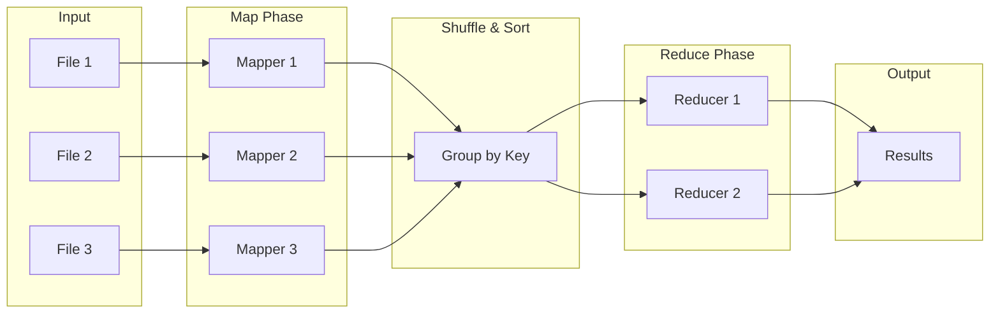
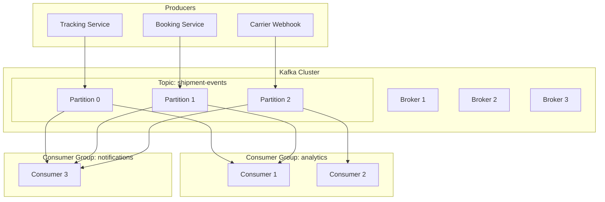
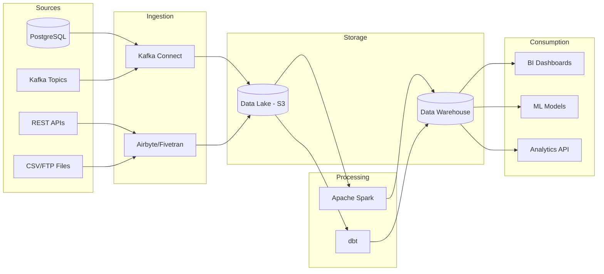
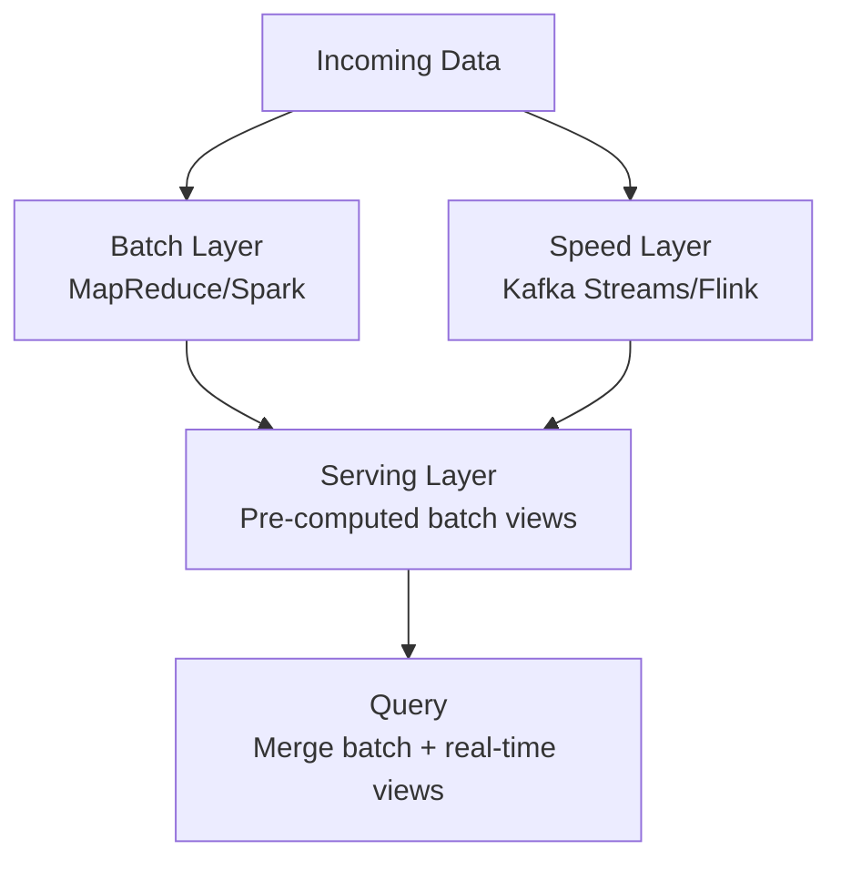

# Big Data Processing

> *"Big data is not about the data. It's about the decisions you make with it."* — The core truth that separates useful data systems from expensive storage bills.

---

## Phase 1: What is Big Data?

### The 3 V's (and Beyond)

Big data is data that exceeds the processing capacity of **conventional database systems**. It's defined by three primary characteristics — and several extended ones:

| V | Meaning | Example |
|---|---|---|
| **Volume** | Massive amounts of data | 10TB of shipment tracking events per day |
| **Velocity** | Data arrives at high speed | 50,000 GPS pings per second from fleet vehicles |
| **Variety** | Different formats and sources | JSON events, CSV uploads, XML EDI messages, images of POD |
| **Veracity** | Data quality and trustworthiness | Duplicate carrier updates, incorrect timestamps |
| **Value** | Extracting business insight | Predicting delivery delays, optimizing routes |

### When Traditional Databases Aren't Enough

```
Traditional Database (PostgreSQL/MySQL):
  ✅ 10 million rows         → handles fine
  ✅ 100 queries/second      → handles fine
  ✅ Single-server processing → handles fine

  ❌ 10 billion rows          → won't fit / too slow
  ❌ 100,000 events/second    → write throughput bottleneck
  ❌ Complex analytics on TB   → query takes hours
  ❌ Multiple data formats     → schema rigidity

Big Data Solution:
  ✅ Distribute data across 100+ machines
  ✅ Process in parallel (map-reduce, streaming)
  ✅ Handle any data format (schema-on-read)
  ✅ Scale horizontally as data grows
```

### Mental Model: Water Glass vs River

> [!tip] Mental Model
> A traditional database is like a **water glass** — it holds a fixed amount, you pour in and pour out, and it works perfectly for a household.
> 
> Big data processing is like managing a **river** — the water never stops flowing, you can't hold it all at once, and you need dams, channels, and reservoirs to handle it. You process it as it flows, not after you've collected it all.

### The Two Processing Paradigms

| Aspect | Batch Processing | Stream Processing |
|---|---|---|
| **Data** | Bounded (finite dataset) | Unbounded (infinite stream) |
| **Latency** | Minutes to hours | Milliseconds to seconds |
| **Throughput** | Very high (processes all at once) | Moderate (processes as it arrives) |
| **Use case** | Historical analysis, reports, ETL | Real-time alerts, live dashboards |
| **Analogy** | Washing clothes in a batch | Washing dishes as they come |

---

## Phase 2: Batch Processing

### MapReduce — The Foundation

MapReduce is a programming model for processing large datasets in parallel across a distributed cluster. It breaks work into two phases: **Map** (transform) and **Reduce** (aggregate).

```
Input Data (distributed across nodes):
  [File 1: "shipment arrived Chennai"]
  [File 2: "shipment departed Mumbai"]
  [File 3: "shipment arrived Chennai"]

MAP Phase (parallel on each node):
  Node 1: "shipment arrived Chennai" 
           → ("shipment", 1), ("arrived", 1), ("Chennai", 1)
  Node 2: "shipment departed Mumbai" 
           → ("shipment", 1), ("departed", 1), ("Mumbai", 1)
  Node 3: "shipment arrived Chennai" 
           → ("shipment", 1), ("arrived", 1), ("Chennai", 1)

SHUFFLE/SORT Phase (group by key):
  "arrived"  → [1, 1]
  "Chennai"  → [1, 1]
  "departed" → [1]
  "Mumbai"   → [1]
  "shipment" → [1, 1, 1]

REDUCE Phase (aggregate):
  "arrived"  → 2
  "Chennai"  → 2
  "departed" → 1
  "Mumbai"   → 1
  "shipment" → 3
```



#### Logistics Example: Shipment Volume Analysis

```java
// MAP: For each tracking event, emit (carrier, 1)
public class ShipmentMapper extends Mapper<LongWritable, Text, Text, IntWritable> {
    @Override
    protected void map(LongWritable key, Text value, Context context) {
        TrackingEvent event = parseEvent(value.toString());
        // Emit carrier name as key, count as value
        context.write(new Text(event.getCarrierCode()), new IntWritable(1));
    }
}

// REDUCE: Sum all counts per carrier
public class ShipmentReducer extends Reducer<Text, IntWritable, Text, IntWritable> {
    @Override
    protected void reduce(Text key, Iterable<IntWritable> values, Context context) {
        int totalShipments = 0;
        for (IntWritable val : values) {
            totalShipments += val.get();
        }
        context.write(key, new IntWritable(totalShipments));
    }
}

// Output: MAERSK → 45,231 | CMA_CGM → 32,108 | MSC → 28,445
```

#### Limitations of MapReduce

| Limitation | Explanation |
|---|---|
| **High latency** | Writes intermediate results to disk between stages |
| **Complex chaining** | Multi-step jobs need manual orchestration of multiple MapReduce jobs |
| **Not for iterative algorithms** | ML algorithms that iterate over data are very slow (re-read from disk each pass) |
| **No real-time** | Batch-only — can't process events as they arrive |
| **Verbose API** | Simple operations require lots of boilerplate code |

---

### Apache Hadoop

Hadoop is the ecosystem built around MapReduce. It has three core components:

#### HDFS — Hadoop Distributed File System

```
HDFS Architecture:
  NameNode (Master):
    → Stores file metadata (which blocks are where)
    → Single point of coordination
    
  DataNodes (Workers):
    → Store actual data blocks (default 128MB each)
    → Replicate blocks (default 3 copies)

File: shipment_events_2024.csv (512MB)
  → Block 1 (128MB) → DataNode 1, DataNode 3, DataNode 5
  → Block 2 (128MB) → DataNode 2, DataNode 4, DataNode 6
  → Block 3 (128MB) → DataNode 1, DataNode 4, DataNode 5
  → Block 4 (128MB) → DataNode 3, DataNode 5, DataNode 6
```

> [!warning] HDFS Limitations
> - Not suitable for small files (NameNode memory overhead per file)
> - High latency for random reads (optimized for sequential access)
> - Single NameNode is a single point of failure (HDFS HA with standby NameNode mitigates this)

#### YARN — Yet Another Resource Negotiator

YARN manages cluster resources (CPU, memory) and schedules jobs:

```
YARN Architecture:
  ResourceManager (Master):
    → Allocates resources across all applications
    → Schedules containers on NodeManagers
    
  NodeManager (per node):
    → Manages containers on that node
    → Reports resource usage to ResourceManager
    
  ApplicationMaster (per job):
    → Negotiates resources for a specific job
    → Monitors task execution
```

#### When Hadoop Makes Sense (and When It Doesn't)

| Use Hadoop When | Don't Use Hadoop When |
|---|---|
| Processing petabytes of historical data | Data fits in a single server |
| Log analysis, data warehousing | You need sub-second latency |
| Cheap storage is priority (commodity hardware) | Iterative ML algorithms |
| Batch ETL jobs | Interactive queries |

---

### Apache Spark

Spark solves Hadoop MapReduce's biggest problem: **disk I/O**. It keeps data **in memory** between processing steps, making it 10-100x faster for iterative workloads.

```
MapReduce vs Spark — Processing Pipeline:

MapReduce:
  Step 1 → Write to Disk → Read from Disk → Step 2 → Write to Disk → Read from Disk → Step 3
  (Slow: every step reads/writes to HDFS)

Spark:
  Step 1 → Keep in Memory → Step 2 → Keep in Memory → Step 3
  (Fast: data stays in RAM between steps, spills to disk only when necessary)
```

#### Core Abstractions

| Abstraction | Description | API Style |
|---|---|---|
| **RDD** (Resilient Distributed Dataset) | Low-level distributed collection with transformations | Functional (map, filter, reduce) |
| **DataFrame** | Distributed table with named columns (like SQL table) | SQL-like, optimized by Catalyst |
| **Dataset** | Type-safe DataFrame (Java/Scala only) | Combines RDD type-safety + DataFrame optimization |

#### Spark SQL — Querying Structured Data

```java
// Using Spark SQL in a Java Spring Boot batch job
SparkSession spark = SparkSession.builder()
    .appName("ShipmentAnalytics")
    .master("yarn")
    .getOrCreate();

// Read shipment data from Parquet files
Dataset<Row> shipments = spark.read().parquet("hdfs:///data/shipments/");

// Register as SQL table
shipments.createOrReplaceTempView("shipments");

// Run SQL analytics
Dataset<Row> carrierPerformance = spark.sql(
    "SELECT carrier_code, " +
    "  COUNT(*) as total_shipments, " +
    "  AVG(delivery_days) as avg_delivery_time, " +
    "  SUM(CASE WHEN status = 'DELAYED' THEN 1 ELSE 0 END) as delayed_count " +
    "FROM shipments " +
    "WHERE created_date >= '2024-01-01' " +
    "GROUP BY carrier_code " +
    "ORDER BY total_shipments DESC"
);

carrierPerformance.show();
// +------------+----------------+------------------+-------------+
// |carrier_code|total_shipments |avg_delivery_time |delayed_count|
// +------------+----------------+------------------+-------------+
// |MAERSK      |45231           |12.3              |2105         |
// |CMA_CGM     |32108           |14.1              |3421         |
// +------------+----------------+------------------+-------------+
```

#### Spark Streaming (Micro-Batching)

Spark Streaming processes data in small time windows (micro-batches), not true event-at-a-time:

```
Incoming Events: ─────────────────────────────────────→ time
                 |  Batch 1  |  Batch 2  |  Batch 3  |
                 |  (2 sec)  |  (2 sec)  |  (2 sec)  |
                 
Each micro-batch is processed as a small Spark job.
Latency = batch interval (e.g., 2 seconds) + processing time
```

> [!tip] When to Use Spark
> - Interactive data exploration and SQL queries over large datasets
> - ETL pipelines that transform data between systems
> - Machine learning model training (MLlib)
> - Near-real-time streaming with acceptable seconds-level latency
> - Any workload where Hadoop MapReduce is too slow

#### Comparison: MapReduce vs Spark

| Feature | MapReduce | Apache Spark |
|---|---|---|
| **Speed** | Slow (disk-based) | 10-100x faster (in-memory) |
| **Ease of use** | Verbose Java API | Rich API (Java, Scala, Python, SQL) |
| **Processing** | Batch only | Batch + streaming (micro-batch) |
| **Iterative algorithms** | Very poor (re-reads disk each pass) | Excellent (keeps data in memory) |
| **SQL support** | Hive (separate component) | Spark SQL (built-in) |
| **ML support** | Mahout (separate component) | MLlib (built-in) |
| **Resource management** | YARN | YARN, Kubernetes, standalone |
| **Fault tolerance** | Replication + re-execution | RDD lineage + re-computation |
| **Cost** | Lower (uses disk) | Higher (needs more RAM) |
| **Maturity** | Very mature, battle-tested | Mature, widely adopted |

---

## Phase 3: Stream Processing

### Core Concepts

#### Events, Streams, and Time

```
Event: A single immutable fact that something happened at a specific time.
  {
    "eventType": "SHIPMENT_STATUS_CHANGED",
    "shipmentId": "SHP-001",
    "newStatus": "IN_TRANSIT",
    "timestamp": "2024-01-15T14:30:00Z",
    "location": "Chennai Port"
  }

Stream: An unbounded, continuously growing sequence of events.
  [..., event_998, event_999, event_1000, event_1001, ...]
  (No beginning or end — events keep arriving)
```

#### Time Windows

Windows group events for aggregation. Three main types:

```mermaid
gantt
    title Window Types for Stream Processing
    dateFormat X
    axisFormat %s
    
    section Tumbling Windows
    Window 1 (0-5s)  :0, 5
    Window 2 (5-10s) :5, 10
    Window 3 (10-15s):10, 15

    section Sliding Windows (5s window, 2s slide)
    Window A (0-5s)  :0, 5
    Window B (2-7s)  :2, 7
    Window C (4-9s)  :4, 9
    
    section Session Windows (3s gap)
    Session 1     :0, 4
    Gap           :4, 7
    Session 2     :7, 12
```



| Window Type | How It Works | Use Case |
|---|---|---|
| **Tumbling** | Fixed-size, non-overlapping windows | Count shipments per 5-minute window |
| **Sliding** | Fixed-size, overlapping windows (slides by interval) | Moving average of delivery times |
| **Session** | Variable-size, grouped by activity with gap timeout | User activity sessions |

#### Event Time vs Processing Time

```
Event Time:     When the event actually happened (embedded in the event)
Processing Time: When the system processes the event

Example — GPS update from a truck:
  Event occurred:    14:30:00 (truck in rural area, poor connectivity)
  Event received:    14:35:00 (5 min network delay)
  Event processed:   14:35:02 (system processing)

  Event Time = 14:30:00
  Processing Time = 14:35:02

If you window by processing time → this event is in the 14:35 window
If you window by event time → this event is in the 14:30 window (correct!)
```

> [!warning] Always Prefer Event Time
> Processing time is unreliable because network delays, consumer lag, and reprocessing all shift when events are processed. Event time reflects **when things actually happened** in the real world.

#### Watermarks and Late Data

Watermarks tell the system: *"I believe all events up to time T have arrived."*

```
Watermark at T=14:32:00 means:
  → System believes all events with event_time ≤ 14:32:00 have arrived
  → It's safe to close the 14:30-14:35 window... mostly
  
Late event arrives: event_time = 14:31:00, arrives at processing_time = 14:40:00
  → This event is LATE (arrived after watermark passed its timestamp)
  
Strategies for late data:
  1. Drop it (simplest, lose data)
  2. Update the result (recompute the window)
  3. Side output (send to a "late events" stream for separate handling)
```

---

### Apache Kafka

Kafka is the backbone of most modern data architectures. It's a **distributed event streaming platform** that acts as a durable, scalable message bus. See also [[Message Queues]] and [[Event-Driven Architecture]].

#### Architecture



#### Key Concepts

| Concept | Description |
|---|---|
| **Broker** | A Kafka server; cluster has multiple brokers for fault tolerance |
| **Topic** | Named category of events (e.g., `shipment-events`, `carrier-updates`) |
| **Partition** | Ordered, immutable log within a topic; unit of parallelism |
| **Offset** | Unique sequential ID for each message within a partition |
| **Consumer Group** | Set of consumers that share the work of reading a topic |
| **Replication** | Each partition is replicated across brokers (leader + followers) |

#### Kafka Connect — Data Integration

```
Kafka Connect Sources (bring data INTO Kafka):
  → JDBC Source (PostgreSQL, MySQL → Kafka)
  → File Source (CSV files → Kafka)
  → CDC Source (Debezium — database change capture → Kafka)

Kafka Connect Sinks (send data OUT of Kafka):
  → Elasticsearch Sink (Kafka → Elasticsearch for search)
  → S3 Sink (Kafka → S3 for data lake)
  → JDBC Sink (Kafka → target database)
```

#### Kafka Streams — Stream Processing Library

```java
// Kafka Streams: Count shipments by carrier in real-time
StreamsBuilder builder = new StreamsBuilder();

KStream<String, ShipmentEvent> events = builder.stream("shipment-events");

KTable<String, Long> shipmentsPerCarrier = events
    .filter((key, event) -> event.getStatus().equals("DELIVERED"))
    .groupBy((key, event) -> event.getCarrierCode())
    .count(Materialized.as("carrier-shipment-counts"));

// Output to a topic for downstream consumers
shipmentsPerCarrier.toStream().to("carrier-stats");
```

#### Log Compaction

```
Normal retention: Delete messages older than 7 days
Log compaction:   Keep only the LATEST value for each key

Topic: carrier-config (compacted)
  Offset 1: key=MAERSK  value={rate: 100}
  Offset 2: key=CMA_CGM value={rate: 120}
  Offset 3: key=MAERSK  value={rate: 110}  ← supersedes offset 1
  
After compaction:
  Offset 2: key=CMA_CGM value={rate: 120}
  Offset 3: key=MAERSK  value={rate: 110}
  
Use case: Configuration, reference data, state snapshots
```

#### Exactly-Once Semantics

```
At-most-once:  Message may be lost, never duplicated
  → Producer sends, doesn't wait for ack → message might not arrive

At-least-once: Message is never lost, may be duplicated
  → Producer retries on failure → same message might be processed twice

Exactly-once:  Message is processed exactly one time
  → Kafka transactions + idempotent producers
  → Consumer commits offset atomically with processing result
```

> [!example] Exactly-Once in Logistics
> When processing an EDI 214 (shipment status) message, you need exactly-once semantics. Duplicated processing could send customers two "Your shipment has arrived" notifications, or double-count a delivery in analytics. Kafka's transactional API combined with idempotent consumers ensures each status update is applied exactly once.

---

### Apache Flink

Flink is a **true stream processing** engine — it processes events one at a time, not in micro-batches like Spark Streaming. This gives it lower latency and more accurate event-time processing.

#### Flink vs Kafka Streams

| Feature | Kafka Streams | Apache Flink |
|---|---|---|
| **Deployment** | Library (runs in your app) | Cluster (separate infrastructure) |
| **Processing model** | Event-at-a-time | Event-at-a-time |
| **State management** | RocksDB (local) | RocksDB with checkpoints |
| **Exactly-once** | Yes (Kafka-only) | Yes (cross-system) |
| **Event time** | Basic support | Advanced (watermarks, late data) |
| **Complexity** | Simple to deploy | Complex (needs cluster) |
| **Best for** | Kafka-to-Kafka processing | Complex event processing, multi-source |

#### Flink Checkpointing

```
Checkpointing: Flink periodically saves a consistent snapshot of all
operator states to durable storage (S3, HDFS).

Normal Processing:
  Event 1 → Event 2 → Event 3 → [Checkpoint 1] → Event 4 → Event 5 → [Checkpoint 2]

Failure at Event 5:
  → Restore from Checkpoint 1
  → Replay events 4, 5 from Kafka
  → State is exactly as if no failure occurred

Savepoints: Manual checkpoints for planned operations
  → Upgrade Flink version → take savepoint → deploy new version → resume from savepoint
```

> [!tip] When to Choose Flink Over Kafka Streams
> - You need complex event processing across multiple data sources (not just Kafka)
> - You need advanced event-time processing with sophisticated watermark strategies
> - Your state is very large (Flink's incremental checkpointing handles TB-scale state)
> - You need exactly-once semantics across Kafka AND external systems (databases, filesystems)

---

## Phase 4: Data Pipelines and ETL

### Extract, Transform, Load (ETL)

```
Traditional ETL:
  EXTRACT        →    TRANSFORM       →    LOAD
  (Source systems)    (Clean, enrich,     (Target system:
                       reshape data)       data warehouse)
  
  PostgreSQL    →    Filter nulls      →    Snowflake
  CSV files     →    Join datasets     →    BigQuery  
  REST APIs     →    Aggregate         →    Redshift
  Kafka topics  →    Convert formats   →    Data Lake
```

### ELT vs ETL (Modern Approach)

| Aspect | ETL | ELT |
|---|---|---|
| **Transform where?** | In a separate processing layer | In the target system |
| **Why?** | Target system was expensive (limited compute) | Modern warehouses have abundant compute |
| **Flexibility** | Transformations locked at ingestion time | Transform anytime with SQL |
| **Raw data available?** | No (transformed before loading) | Yes (raw data preserved) |
| **Example** | Spark job transforms, loads to warehouse | Load raw to BigQuery, transform with dbt |

> [!tip] Modern Preference
> Most modern data teams prefer **ELT** because cloud warehouses (BigQuery, Snowflake, Databricks) have massive compute power. Load raw data first, then transform with SQL — it's simpler, more flexible, and keeps raw data available for reprocessing.

### Data Pipeline Architecture



### Pipeline Orchestration

| Tool | Type | Strengths |
|---|---|---|
| **Apache Airflow** | DAG-based workflow orchestrator | Most popular; Python DAGs; rich UI; huge ecosystem |
| **Prefect** | Modern workflow orchestrator | Better developer experience; cloud-native |
| **Dagster** | Data-aware orchestrator | Software-defined assets; built-in data lineage |
| **dbt** | SQL transformation framework | SQL-first; version-controlled transforms; testing built-in |

### Idempotent Pipelines

> [!warning] Critical: Make Pipelines Idempotent
> A pipeline is **idempotent** if running it multiple times with the same input produces the same result. This is essential because pipelines WILL be re-run — due to failures, backfills, or bug fixes.

```
❌ Non-idempotent:
  INSERT INTO daily_stats (date, count) VALUES ('2024-01-15', 1500)
  → Run again: now there are TWO rows for 2024-01-15!

✅ Idempotent:
  DELETE FROM daily_stats WHERE date = '2024-01-15';
  INSERT INTO daily_stats (date, count) VALUES ('2024-01-15', 1500);
  → Run again: same result. Old row deleted, new row inserted.

✅ Also idempotent (UPSERT):
  INSERT INTO daily_stats (date, count) VALUES ('2024-01-15', 1500)
  ON CONFLICT (date) DO UPDATE SET count = 1500;
```

### Dead Letter Queues (DLQ)

```
Pipeline processing:
  Event → Validate → Transform → Load
                ↓ (invalid)
           Dead Letter Queue
           (store failed events for investigation)

DLQ contains:
  - The original event (unchanged)
  - Error details (why it failed)
  - Timestamp
  - Retry count

Logistics example:
  EDI 214 message with invalid SCAC code → DLQ
  → Operations team reviews and fixes
  → Reprocess from DLQ
```

---

## Phase 5: Architecture Patterns

### Lambda Architecture

Lambda Architecture combines batch and stream processing to provide both accuracy (batch) and low latency (speed).



```
Batch Layer:
  → Processes ALL historical data periodically (e.g., nightly)
  → Produces accurate, complete views
  → High latency (hours)

Speed Layer:
  → Processes only recent data in real-time
  → Produces approximate, up-to-date views
  → Low latency (seconds)

Serving Layer:
  → Merges batch views + speed views
  → Queries get the best of both: accuracy + freshness
```

| Pros | Cons |
|---|---|
| Accuracy from batch + freshness from stream | Two codebases doing the same logic (batch + stream) |
| Fault tolerant (batch recomputes everything) | Complex to maintain and debug |
| Handles late data well (batch picks it up) | Merging batch + speed views is non-trivial |

> [!example] Lambda in Logistics
> **Batch layer:** Nightly Spark job computes carrier performance metrics (on-time %, average transit time) from all historical data.
> **Speed layer:** Kafka Streams updates today's metrics in real-time as new deliveries are recorded.
> **Serving layer:** Dashboard shows accurate historical metrics merged with live today's-numbers.

### Kappa Architecture

Kappa simplifies Lambda by **eliminating the batch layer entirely**. Everything is a stream.

```
Kappa Architecture:
  All Data → Stream Processing (Kafka + Flink/Kafka Streams) → Serving Layer → Queries

Reprocessing:
  Need to recompute? Replay the Kafka topic from the beginning.
  → Same streaming code handles both real-time AND historical reprocessing.
```

| Pros | Cons |
|---|---|
| Single codebase (stream only) | Reprocessing large history is slow |
| Simpler to maintain | Requires long-retention event log (Kafka) |
| No batch/speed merge complexity | May not match batch accuracy for complex aggregations |

> [!question] Lambda or Kappa?
> **Use Lambda when:** You need guaranteed accuracy for complex analytics, your batch and stream logic differ significantly, or you have massive historical data that's expensive to replay.
> **Use Kappa when:** Your stream processing logic can handle both real-time and historical data, you want operational simplicity, and Kafka retention covers your replay needs.

---

## Phase 6: Data Storage for Big Data

### Data Lake vs Data Warehouse vs Data Lakehouse

| Feature | Data Lake | Data Warehouse | Data Lakehouse |
|---|---|---|---|
| **Data format** | Raw (any format) | Structured (schema-on-write) | Both raw and structured |
| **Schema** | Schema-on-read | Schema-on-write | Schema-on-read + schema enforcement |
| **Storage cost** | Very low (object storage) | Higher (proprietary format) | Low (object storage) |
| **Query performance** | Variable (depends on format) | Very high (optimized) | High (with indexing) |
| **Users** | Data engineers, data scientists | Business analysts, BI tools | Everyone |
| **Example tech** | S3 + Spark | Snowflake, BigQuery, Redshift | Delta Lake, Apache Iceberg, Apache Hudi |
| **ACID transactions** | No | Yes | Yes |

See also [[Databases]] for foundational database concepts.

### OLTP vs OLAP

| Aspect | OLTP | OLAP |
|---|---|---|
| **Purpose** | Run the business (transactions) | Analyze the business (analytics) |
| **Queries** | Simple, short (get shipment by ID) | Complex, long (aggregate 1 year of shipments) |
| **Data model** | Normalized (3NF) | Denormalized (star/snowflake schema) |
| **Latency** | Milliseconds | Seconds to minutes |
| **Concurrency** | Thousands of users | Dozens of analysts |
| **Example** | PostgreSQL, MySQL | BigQuery, Redshift, ClickHouse |

### Columnar Storage

```
Row-oriented storage (PostgreSQL, MySQL):
  Row 1: [id=1, carrier="MAERSK", weight=5000, origin="Chennai"]
  Row 2: [id=2, carrier="CMA_CGM", weight=3000, origin="Mumbai"]
  Row 3: [id=3, carrier="MAERSK", weight=7000, origin="Chennai"]
  
  Query: SELECT AVG(weight) FROM shipments WHERE carrier = 'MAERSK'
  → Must read ALL columns of ALL rows to find matching carrier and weight

Columnar storage (Parquet, ORC):
  Column "id":      [1, 2, 3, ...]
  Column "carrier": ["MAERSK", "CMA_CGM", "MAERSK", ...]
  Column "weight":  [5000, 3000, 7000, ...]
  Column "origin":  ["Chennai", "Mumbai", "Chennai", ...]
  
  Query: SELECT AVG(weight) FROM shipments WHERE carrier = 'MAERSK'
  → Only reads "carrier" and "weight" columns — MUCH faster for analytics
  → Also compresses better (similar values in same column)
```

### Star Schema vs Snowflake Schema

```
Star Schema:
  Central FACT table (shipment_facts) surrounded by DIMENSION tables

           ┌───────────┐
           │  dim_time  │
           └─────┬─────┘
  ┌──────────┐   │   ┌──────────────┐
  │dim_carrier├───┼───┤dim_origin_port│
  └──────────┘   │   └──────────────┘
           ┌─────┴─────┐
           │shipment_   │
           │   facts    │
           └─────┬─────┘
  ┌──────────┐   │   ┌──────────────┐
  │dim_service├───┼───┤dim_dest_port │
  └──────────┘   │   └──────────────┘
           ┌─────┴─────┐
           │dim_customer│
           └───────────┘

Snowflake Schema:
  Same as star, but dimensions are further normalized
  dim_carrier → dim_carrier_type → dim_country
  (More joins, less redundancy, more complex queries)
```

See also [[Sharding and Replication]] for data distribution strategies.

---

## Phase 7: Partitioning and Parallelism

### How Data is Distributed for Processing

The key to big data processing speed is **parallelism** — splitting data across multiple machines so they can process simultaneously.

```
Sequential Processing (single machine):
  Process 1TB of shipment data → 10 hours
  
Parallel Processing (100 machines):
  Each machine processes 10GB → 6 minutes
  (Plus overhead for coordination, shuffling)
```

### Partition Strategies

| Strategy | How It Works | Pros | Cons |
|---|---|---|---|
| **Key-based** (Hash) | `partition = hash(key) % numPartitions` | Even distribution, same key → same partition | Can't range scan |
| **Range-based** | Partition by value ranges (dates, IDs) | Efficient range queries | Hot spots if ranges are uneven |
| **Round-robin** | Cycle through partitions sequentially | Perfect distribution | No key-based lookup possible |

#### Logistics Example: Partitioning Shipment Events

```
Key-based: partition by shipmentId
  → All events for SHP-001 go to same partition → ordering preserved per shipment
  → Great for: tracking event processing (order matters per shipment)

Range-based: partition by date
  → January events → Partition 0, February → Partition 1, etc.
  → Great for: time-range queries (all events in March)
  → Risk: December has 3x traffic (holiday season) → hot partition

Round-robin: no key, just distribute evenly
  → Great for: independent event processing (no ordering needed)
  → Bad for: any processing that needs events from same entity together
```

### Handling Data Skew

> [!warning] Data Skew is the Silent Killer
> If one partition has 10x more data than others, one machine does 10x more work while others sit idle. The entire job runs at the speed of the slowest partition.

```
Skew example: partition by carrier_code
  MAERSK:  45,000 shipments (one overloaded partition)
  CMA_CGM: 32,000 shipments
  MSC:     28,000 shipments
  50 small carriers: 500 each

Solutions:
  1. Salted keys: append random suffix to hot keys
     "MAERSK" → "MAERSK_0", "MAERSK_1", ... "MAERSK_9"
     → Spreads one hot key across 10 partitions
     → Need extra step to aggregate the 10 sub-partitions
     
  2. Adaptive partitioning: dynamically split hot partitions
  
  3. Broadcast join: if joining a small table with a skewed large table,
     replicate the small table to all partitions (avoid shuffle)
```

See also [[Sharding and Replication]] for database-level partitioning strategies.

---

## Phase 8: Backpressure and Flow Control

### What Happens When Producers Outpace Consumers

```
Producer rate:  10,000 events/sec
Consumer rate:   2,000 events/sec

Without backpressure:
  → Buffer fills up → Out of memory → System crash
  → OR: Events are dropped → Data loss

With backpressure:
  → System signals producer to slow down
  → OR: Events are buffered durably (Kafka)
  → OR: Consumer scales up to match producer rate
```

### Backpressure Strategies

| Strategy | How It Works | Trade-off |
|---|---|---|
| **Drop** | Discard excess events | Data loss, but system stays stable |
| **Buffer** | Queue events for later processing | Latency increases, needs durable storage |
| **Slow producer** | Signal producer to reduce rate | Upstream impact, may not be possible |
| **Scale consumer** | Add more consumer instances | Cost increase, scaling lag |
| **Sample** | Process only a subset of events | Approximate results, good for monitoring |

> [!example] Backpressure in Logistics
> During peak holiday season, tracking event volume spikes 5x. Kafka acts as a durable buffer — consumers process at their own pace. If the lag grows too large, auto-scaling kicks in to add more consumer instances. Critical events (delivery confirmations) get priority via a separate high-priority topic.

See also [[Rate Limiting and Throttling]] for upstream flow control patterns.

---

## Phase 9: Real-World Logistics Use Cases

### Use Case 1: Real-Time Shipment Tracking Event Processing

```
Flow:
  Carrier Webhook (GPS/milestone updates)
    → API Gateway
    → Kafka topic: "raw-tracking-events"
    → Flink (event deduplication, enrichment with shipment context)
    → Kafka topic: "enriched-tracking-events"
    → Multiple consumers:
        ├── Tracking DB updater (PostgreSQL)
        ├── Customer notification service
        ├── Analytics pipeline (to data warehouse)
        └── Partner webhook dispatcher

Volume: 50,000 events/second during peak
Latency requirement: < 5 seconds end-to-end
```

### Use Case 2: Supply Chain Analytics Pipeline

```
Nightly Batch Pipeline (Airflow-orchestrated):
  Step 1: Extract shipment data from PostgreSQL (Kafka Connect CDC)
  Step 2: Extract carrier data from partner APIs (Airbyte)
  Step 3: Land raw data in S3 data lake (Parquet format)
  Step 4: Spark job: clean, deduplicate, enrich
  Step 5: Load into Snowflake (data warehouse)
  Step 6: dbt models: create business-ready tables
  Step 7: Refresh Grafana dashboards

SLA: Complete by 6 AM every day
Data volume: ~2TB raw data per day
```

### Use Case 3: Route Optimization Data Processing

```
Input:
  - Historical shipment data (1 year, 500M records)
  - Port congestion data (real-time feeds)
  - Weather data (API)
  - Carrier rate cards (updated weekly)

Processing (Spark):
  → Join all datasets on origin-destination pairs
  → Calculate optimal routes based on cost, time, reliability
  → Generate route recommendation table

Output:
  → Route recommendations served via Redis cache
  → Updated daily via batch + real-time adjustments
```

### Use Case 4: EDI Message Processing at Scale

```
EDI Pipeline:
  FTP/SFTP pickup → Raw EDI files (990, 214, 210 transactions)
    → Parse EDI segments (ISA, GS, ST, etc.)
    → Validate structure and business rules
    → Transform to internal domain events
    → Publish to Kafka topics per transaction type
    → Downstream services process each type

Volume: 500,000 EDI transactions/day
Challenge: ISA segments must be exactly 106 characters
Error handling: Invalid EDI → Dead Letter Queue → manual review
```

### Use Case 5: Carrier Performance Analytics

```
Real-time (Kafka Streams):
  → Track on-time delivery rate per carrier (rolling 30-day window)
  → Alert operations when carrier drops below SLA threshold
  
Batch (Spark SQL):
  → Monthly carrier scorecard: on-time %, damage rate, claim rate
  → Comparison against contract SLAs
  → Feed into automated carrier selection algorithm
```

---

## Phase 10: Common Mistakes

### Mistake 1: Over-Engineering

> [!warning] Not Everything Needs "Big Data"
> If your data fits in PostgreSQL with proper indexing — you don't need Kafka, Spark, and a data lake. Start simple, scale when you actually hit bottlenecks.

```
Signs you DON'T need big data infrastructure:
  → Data volume < 100GB (just use PostgreSQL)
  → < 1,000 events/second (a single server handles this)
  → Reports can run overnight (simple cron + SQL)
  → Team size < 5 (operational overhead outweighs benefits)
```

### Mistake 2: Ignoring Data Quality

```
"Garbage in, garbage out" — no amount of processing fixes bad data.

Common quality issues in logistics:
  → Duplicate carrier status updates (same event sent twice)
  → Missing timestamps (when did this actually happen?)
  → Inconsistent carrier codes (MAERSK vs MAERSK LINE vs MSKU)
  → Timezone confusion (local time vs UTC)
```

### Mistake 3: Not Planning for Schema Evolution

```
Version 1: { "shipmentId": "SHP-001", "status": "DELIVERED" }
Version 2: { "shipmentId": "SHP-001", "status": "DELIVERED", "location": "Chennai" }

If consumers expect V1 and get V2 → should be fine (ignore new fields)
If consumers expect V2 and get V1 → crash! "location" field missing!

Solution:
  → Always make additive changes (new fields with defaults)
  → Use a Schema Registry (Confluent, AWS Glue)
  → Test backward and forward compatibility
```

### Mistake 4: Premature Optimization

```
"Let's partition by carrier AND date AND origin AND destination AND..."
→ Over-partitioning creates millions of tiny files → poor performance

Start simple:
  → Partition by date (most common query pattern)
  → Add partitions only when queries prove it's needed
```

### Mistake 5: Ignoring Exactly-Once Semantics

```
❌ "We'll just process duplicates and clean up later"
  → "Later" never comes
  → Duplicate invoices sent to customers
  → Double-counted KPIs

✅ Design for exactly-once from the start:
  → Idempotent consumers (process same event twice → same result)
  → Kafka transactional API for critical paths
  → Deduplication tables for external system writes
```

---

## Phase 11: Interview Questions

### Conceptual Questions

> [!question] 1. What are the differences between batch processing and stream processing? When would you choose one over the other?
> **Key points:** Batch = bounded data, high throughput, high latency; Stream = unbounded data, low latency, real-time. Batch for historical analysis, reports, ML training. Stream for real-time alerts, dashboards, event-driven systems. Many systems use both (Lambda/Kappa).

> [!question] 2. Explain the Lambda Architecture. What problem does it solve, and what are its drawbacks?
> **Key points:** Combines batch (accuracy) + speed (freshness) layers. Solves the problem of getting both accurate historical analytics AND real-time updates. Drawback: maintaining two codebases that do the same logic. Kappa Architecture simplifies this.

> [!question] 3. What is exactly-once semantics in stream processing? Why is it hard to achieve?
> **Key points:** Each event is processed exactly one time — no duplicates, no losses. Hard because of: network failures, consumer crashes, rebalancing. Solutions: idempotent producers, transactional consumers, Kafka exactly-once, Flink checkpointing.

> [!question] 4. How would you handle data skew in a distributed processing system?
> **Key points:** Skew = uneven data distribution across partitions → one slow partition blocks the job. Solutions: salted keys, adaptive partitioning, broadcast joins, pre-aggregation, sampling to identify hot keys.

### Design Questions

> [!question] 5. Design a real-time analytics pipeline for a logistics company processing 100K tracking events per second.
> **Key points:** Kafka for ingestion (partitioned by shipment ID), Flink for stream processing (dedup, enrich, aggregate), Redis for real-time dashboards, S3 + Spark for batch analytics, data warehouse for historical queries.

> [!question] 6. How would you design a data pipeline that processes EDI messages from 500 different carriers with different formats?
> **Key points:** Kafka ingestion, parser registry (one parser per EDI format), validation layer, transformation to canonical model, dead letter queue for failures, monitoring for each carrier's success rate.

> [!question] 7. You need to migrate a batch processing system to stream processing. What's your approach?
> **Key points:** Run both in parallel first (Lambda). Verify stream results match batch. Gradually shift consumers to stream. Keep batch as fallback. Ensure exactly-once semantics. Handle late data with watermarks.

> [!question] 8. Design a system to detect anomalies in carrier delivery performance in real-time.
> **Key points:** Stream events through Kafka, compute rolling statistics per carrier (Flink), define baseline from historical data, alert when metrics deviate beyond thresholds, consider seasonal patterns.

### Scenario Questions

> [!question] 9. Your Kafka consumer lag is growing and you're falling behind. What do you do?
> **Key points:** Check consumer throughput (is it CPU, I/O, or external service bound?). Add more consumer instances (must be ≤ partitions). Increase partition count for future. Check for data skew. Consider batch processing for the backlog, stream for new data.

> [!question] 10. A nightly Spark job that took 2 hours now takes 8 hours after data volume tripled. How do you optimize it?
> **Key points:** Check for data skew (repartition). Increase cluster size. Optimize joins (broadcast small tables). Use columnar format (Parquet). Partition input data by date. Cache intermediate results. Consider incremental processing instead of full recompute.

> [!question] 11. Your data pipeline processed corrupted data and the warehouse has incorrect numbers for the past week. How do you recover?
> **Key points:** Stop the pipeline. Identify the corruption source and scope. Replay the pipeline from clean source data (this is why event sourcing and immutable logs matter). Validate results before publishing. Add validation checks to prevent recurrence. Communicate with stakeholders.

> [!question] 12. How do you handle schema changes in a system with multiple producers and consumers?
> **Key points:** Schema Registry for compatibility checks. Backward-compatible changes only (add fields with defaults). Consumer tolerance (ignore unknown fields). Versioned topics as last resort. Contract testing between teams.

---

## Phase 12: Practice Exercises

### Exercise 1: Word Count MapReduce

Design a MapReduce job (pseudocode or Java) that counts the frequency of each `carrier_code` across 1TB of shipment tracking events stored in HDFS. Include the Mapper, Reducer, and explain how shuffling works.

### Exercise 2: Kafka Topic Design

A logistics platform has these event types: shipment created, status updated, carrier assigned, invoice generated, customer notified. Design the Kafka topic structure. Consider: how many topics? What partition key for each? What retention policy?

### Exercise 3: Window Aggregation

Using Kafka Streams or Flink (pseudocode), implement a 5-minute tumbling window that calculates the average delivery time per carrier from a stream of delivery events. Handle late events arriving up to 10 minutes after the window closes.

### Exercise 4: Lambda vs Kappa Decision

You're building an analytics system for a freight company that needs: (1) daily carrier scorecards with 100% accuracy, (2) real-time alerts when a carrier's on-time rate drops below 80%. Would you use Lambda or Kappa? Justify your choice and draw the architecture.

### Exercise 5: Data Pipeline Design

Design an end-to-end data pipeline for a logistics company that receives: (1) 500K EDI messages/day via FTP, (2) 5M tracking events/day via webhooks, (3) manual Excel uploads from operations team. The pipeline should feed a data warehouse for BI dashboards. Include: ingestion, validation, transformation, storage, and orchestration.

### Exercise 6: Handling Data Skew

You have a Spark job that joins a 2TB shipment events table with a 50MB carrier details table. The join key is `carrier_code`, and MAERSK accounts for 40% of all shipments. The job takes 3 hours due to skew. Design a solution to reduce it to under 30 minutes.

### Exercise 7: Backpressure Design

Your real-time tracking system normally processes 10K events/sec but during peak (Black Friday), volume spikes to 100K events/sec. Design a backpressure strategy that: (1) doesn't lose any events, (2) keeps critical events under 5-sec latency, (3) allows non-critical events to lag up to 5 minutes.

### Exercise 8: Schema Evolution Plan

Your Kafka topic `shipment-events` has 20 consumers across 5 teams. You need to: (1) add a mandatory `weight_kg` field, (2) rename `dest` to `destination`, (3) remove the deprecated `legacy_code` field. Design a migration plan that doesn't break any consumer.

---

## Key Takeaways

1. **Big data = volume, velocity, variety** — when traditional databases can't handle the load, you need distributed processing
2. **Batch for accuracy, stream for freshness** — most real systems need both
3. **Spark > MapReduce** for almost everything — in-memory processing is 10-100x faster
4. **Kafka is the backbone** — durable, scalable event log that connects everything
5. **Event time > processing time** — always use event time for accurate windowing
6. **Make pipelines idempotent** — they WILL be re-run, so design for it
7. **Lambda = batch + stream; Kappa = stream only** — choose based on complexity vs accuracy needs
8. **Columnar storage (Parquet)** for analytics — reads only the columns you need
9. **Data skew kills performance** — identify hot keys and use salted keys or broadcast joins
10. **Don't over-engineer** — start with PostgreSQL, add big data tooling only when you actually need it

---

**See also:** [[Message Queues]] (Kafka fundamentals), [[Event-Driven Architecture]] (event patterns), [[Databases]] (storage foundations), [[Sharding and Replication]] (partitioning strategies), [[Rate Limiting and Throttling]] (backpressure), [[Caching]] (serving layer performance)
