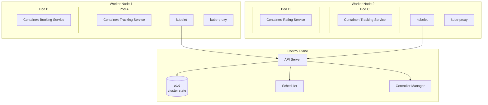
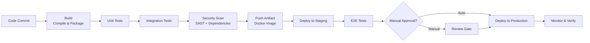
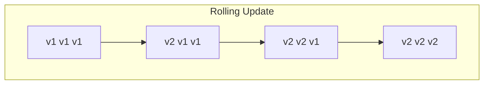
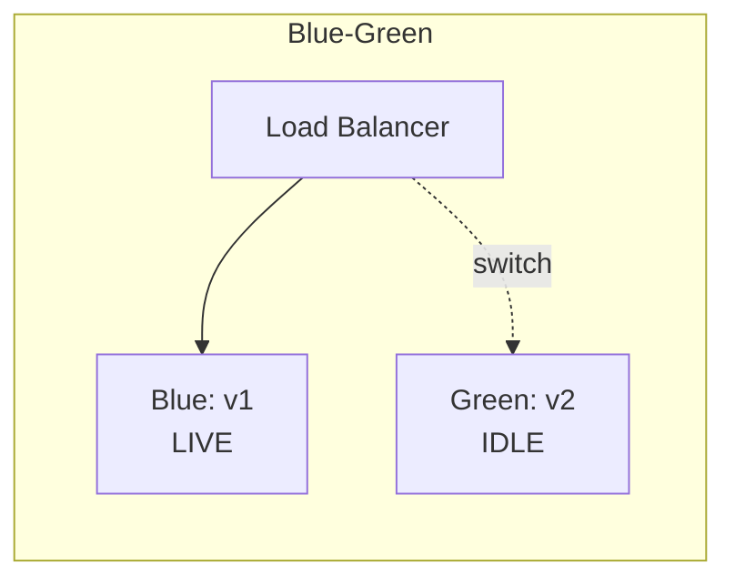
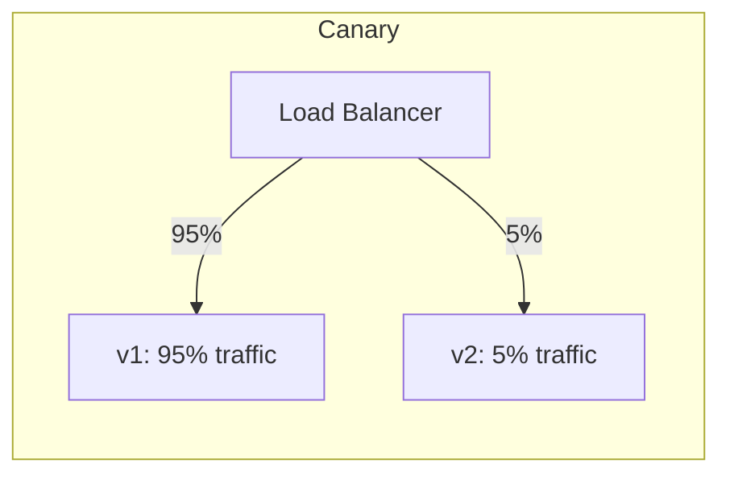
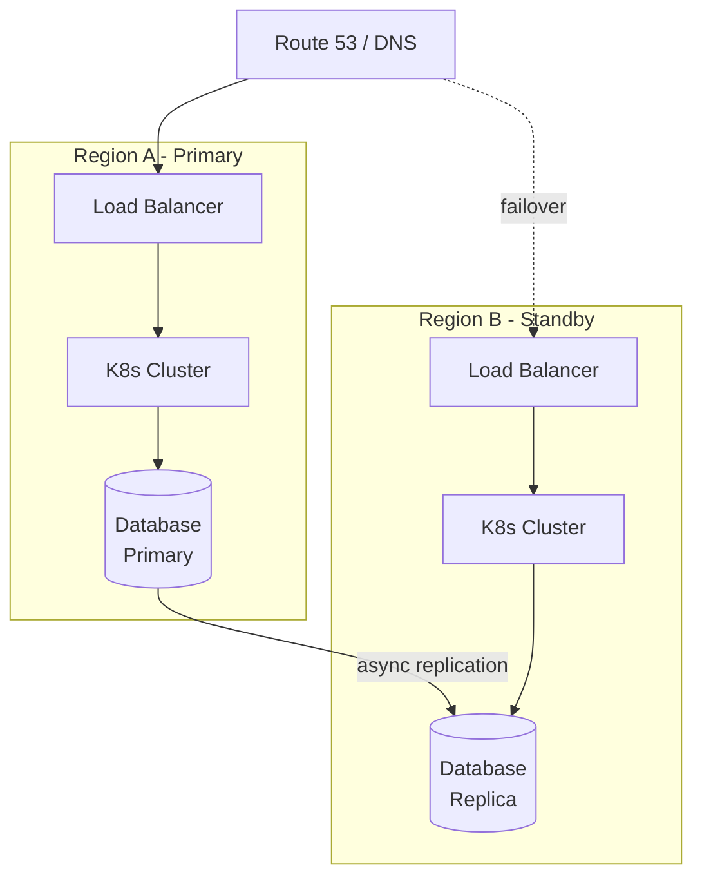
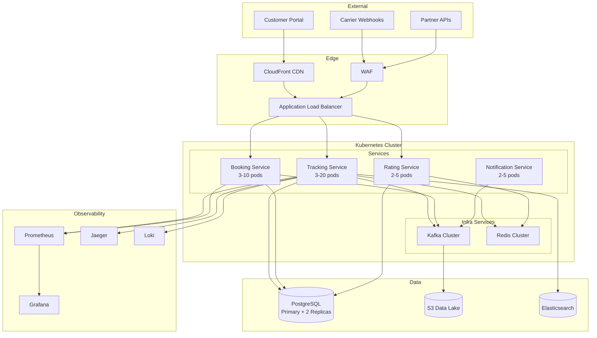

# Production Infrastructure

> *"It works on my machine."* — The most dangerous phrase in software engineering. Production infrastructure is everything that bridges the gap between your laptop and 10 million users.

---

## Phase 1: What is Production Infrastructure?

### The Gap Between Dev and Prod

Production infrastructure is **everything that keeps your services running reliably** for real users — servers, networks, deployment pipelines, monitoring, alerting, security, and disaster recovery.

```
Developer's laptop:
  ✅ 1 user (you)
  ✅ Perfect network (localhost)
  ✅ Fresh database (clean state)
  ✅ Restart anytime (no SLA)

Production:
  ❌ 10,000 concurrent users
  ❌ Unreliable network (timeouts, packet loss)
  ❌ 500GB database with 5 years of data
  ❌ 99.9% uptime SLA (8.76 hours downtime/year MAX)
```

### Mental Model: Building Infrastructure

> [!tip] Mental Model
> Production infrastructure is like the **plumbing, electrical, and HVAC** of a building. When everything works, nobody notices. When something breaks, everything stops.
> 
> - **Containers** = prefabricated rooms (standardized, portable)
> - **Kubernetes** = the building management system (allocates space, maintains temperature)
> - **CI/CD** = the supply chain for construction materials (automated delivery of new components)
> - **Monitoring** = security cameras and sensors (know what's happening everywhere)
> - **Disaster recovery** = fire exits and backup generators (survive the worst)

### The Production Readiness Checklist

Before any service goes to production, verify:

| Category | Questions |
|---|---|
| **Deployment** | Can we deploy without downtime? Can we roll back in < 5 min? |
| **Observability** | Do we have logs, metrics, and traces? Can we debug issues in production? |
| **Reliability** | What happens if a pod crashes? A node dies? A region goes down? |
| **Security** | Are secrets managed properly? Is the network segmented? |
| **Scalability** | Can we handle 10x traffic? Is auto-scaling configured? |
| **Documentation** | Are runbooks written? Does the on-call team know this service? |

---

## Phase 2: Containerization

### Docker — Packaging Your Application

A container is a **lightweight, standalone, executable package** that includes everything needed to run a piece of software: code, runtime, libraries, and system tools.

#### Containers vs Virtual Machines

```
Virtual Machine:
  ┌─────────────────────────────┐
  │         Guest OS (Ubuntu)   │  ← Full operating system (~GB)
  │  ┌────────┐  ┌────────┐    │
  │  │ App A  │  │ App B  │    │
  │  │+ Libs  │  │+ Libs  │    │
  │  └────────┘  └────────┘    │
  └─────────────────────────────┘
  ┌─────────────────────────────┐
  │         Hypervisor          │
  └─────────────────────────────┘
  ┌─────────────────────────────┐
  │         Host OS             │
  └─────────────────────────────┘

Container:
  ┌────────┐  ┌────────┐
  │ App A  │  │ App B  │        ← Shares host OS kernel (~MB)
  │+ Libs  │  │+ Libs  │
  └────────┘  └────────┘
  ┌─────────────────────────────┐
  │    Container Runtime        │
  └─────────────────────────────┘
  ┌─────────────────────────────┐
  │         Host OS             │
  └─────────────────────────────┘
```

| Aspect | Virtual Machine | Container |
|---|---|---|
| **Size** | GBs (full OS) | MBs (app + dependencies) |
| **Startup** | Minutes | Seconds |
| **Isolation** | Full (separate OS) | Process-level (shared kernel) |
| **Overhead** | High (runs full OS) | Minimal |
| **Portability** | Moderate | Excellent |
| **Use case** | Multi-tenant, legacy apps | Microservices, CI/CD |

#### Dockerfile Best Practices

```dockerfile
# ❌ BAD: Large, insecure, slow builds
FROM ubuntu:latest
RUN apt-get update && apt-get install -y openjdk-17-jdk maven
COPY . /app
WORKDIR /app
RUN mvn package
CMD ["java", "-jar", "target/app.jar"]

# ✅ GOOD: Multi-stage, minimal, secure
# Stage 1: Build
FROM maven:3.9-eclipse-temurin-17 AS build
WORKDIR /app
COPY pom.xml .
RUN mvn dependency:go-offline          # Cache dependencies
COPY src ./src
RUN mvn package -DskipTests

# Stage 2: Run (minimal image)
FROM eclipse-temurin:17-jre-alpine
RUN addgroup -S appgroup && adduser -S appuser -G appgroup
WORKDIR /app
COPY --from=build /app/target/app.jar ./app.jar
USER appuser
EXPOSE 8080
HEALTHCHECK --interval=30s --timeout=5s CMD wget -qO- http://localhost:8080/actuator/health || exit 1
ENTRYPOINT ["java", "-XX:+UseContainerSupport", "-XX:MaxRAMPercentage=75.0", "-jar", "app.jar"]
```

> [!tip] Docker Best Practices Summary
> 1. **Multi-stage builds** — separate build and runtime images
> 2. **Minimal base images** — use `-alpine` or `-slim` variants
> 3. **Non-root user** — never run as root in production
> 4. **Health checks** — container orchestrator needs to know if your app is healthy
> 5. **Layer caching** — copy `pom.xml` before source code so dependencies are cached
> 6. **`-XX:+UseContainerSupport`** — Java must respect container memory limits

#### Image Security

```
Security scanning pipeline:
  Build image → Scan with Trivy/Snyk → Block if critical CVEs → Push to registry

Common vulnerabilities:
  → Outdated base OS packages
  → Known CVEs in Java/Spring dependencies
  → Leaked secrets in image layers (NEVER put secrets in Dockerfile)
  → Running as root user
```

---

### Kubernetes (K8s) — Orchestrating Containers

Kubernetes is the **industry-standard container orchestration platform**. It automates deployment, scaling, and management of containerized applications.

#### K8s Architecture



#### Key Kubernetes Resources

| Resource | Purpose | Example |
|---|---|---|
| **Pod** | Smallest deployable unit (one or more containers) | Single instance of Tracking Service |
| **Deployment** | Manages pod replicas, rolling updates | 3 replicas of Tracking Service |
| **Service** | Stable network endpoint for pods | `tracking-service:8080` |
| **ConfigMap** | External configuration (non-secret) | Database URL, feature flags |
| **Secret** | Sensitive configuration (encrypted) | DB password, API keys |
| **Ingress** | External HTTP(S) routing | `api.logistics.com/tracking/*` |
| **Namespace** | Logical cluster partitioning | `dev`, `staging`, `prod` |
| **HPA** | Auto-scale pods based on metrics | Scale to 10 pods when CPU > 70% |

#### Health Checks: The Three Probes

```yaml
# Kubernetes deployment with all three probes
apiVersion: apps/v1
kind: Deployment
metadata:
  name: tracking-service
  namespace: prod
spec:
  replicas: 3
  selector:
    matchLabels:
      app: tracking-service
  template:
    metadata:
      labels:
        app: tracking-service
    spec:
      containers:
        - name: tracking-service
          image: registry.company.com/tracking-service:v2.3.1
          ports:
            - containerPort: 8080
          resources:
            requests:
              cpu: "250m"
              memory: "512Mi"
            limits:
              cpu: "1000m"
              memory: "1Gi"
          
          # Startup probe: is the app ready to accept liveness checks?
          startupProbe:
            httpGet:
              path: /actuator/health
              port: 8080
            initialDelaySeconds: 30
            periodSeconds: 5
            failureThreshold: 12        # 30 + (12 × 5) = 90 sec max startup
          
          # Liveness probe: is the app still alive? (restart if not)
          livenessProbe:
            httpGet:
              path: /actuator/health/liveness
              port: 8080
            periodSeconds: 10
            failureThreshold: 3
          
          # Readiness probe: can the app handle traffic? (remove from LB if not)
          readinessProbe:
            httpGet:
              path: /actuator/health/readiness
              port: 8080
            periodSeconds: 5
            failureThreshold: 2
```

| Probe | Purpose | On Failure |
|---|---|---|
| **Startup** | Has the app finished initializing? | Don't run liveness/readiness yet |
| **Liveness** | Is the app still functioning? | Kill and restart the pod |
| **Readiness** | Can the app handle requests? | Remove from service (no traffic) |

> [!warning] Common Probe Mistakes
> - **No startup probe for slow-starting apps** — liveness probe kills the pod before it finishes starting!
> - **Liveness probe checks external dependencies** — if the database is down, Kubernetes restarts your pod. But restarting won't fix the database. Use readiness instead.
> - **Probes too aggressive** — 1-second intervals overload the app under stress.

#### Horizontal Pod Autoscaler (HPA)

```yaml
apiVersion: autoscaling/v2
kind: HorizontalPodAutoscaler
metadata:
  name: tracking-service-hpa
spec:
  scaleTargetRef:
    apiVersion: apps/v1
    kind: Deployment
    name: tracking-service
  minReplicas: 3
  maxReplicas: 20
  metrics:
    - type: Resource
      resource:
        name: cpu
        target:
          type: Utilization
          averageUtilization: 70
    - type: Resource
      resource:
        name: memory
        target:
          type: Utilization
          averageUtilization: 80
```

#### Service Mesh Overview

```
Without Service Mesh:
  Service A → direct HTTP → Service B
  (No encryption, no retry, no observability between services)

With Service Mesh (Istio/Linkerd):
  Service A → Sidecar Proxy → mTLS encrypted → Sidecar Proxy → Service B
  
Sidecar proxy handles:
  ✅ Mutual TLS (encryption between services)
  ✅ Load balancing and retries
  ✅ Circuit breaking
  ✅ Distributed tracing
  ✅ Traffic shaping (canary deployments)
  ✅ Rate limiting
```

| Service Mesh | Strengths | Complexity |
|---|---|---|
| **Istio** | Feature-rich, widely adopted, Envoy-based | High (heavy resource overhead) |
| **Linkerd** | Lightweight, Rust-based proxy, simpler | Medium |
| **Consul Connect** | Integrated with HashiCorp tools | Medium |

---

## Phase 3: CI/CD Pipelines

### What CI/CD Is and Why It Matters

**CI (Continuous Integration):** Developers merge code frequently; each merge triggers automated builds and tests.
**CD (Continuous Delivery):** Every change that passes tests is automatically deployable to production.
**CD (Continuous Deployment):** Every change that passes tests is automatically deployed to production (no manual approval).

```
Without CI/CD:
  Developer writes code → "It works on my machine" → Manual deploy on Friday
  → Production breaks → Weekend firefighting → Monday postmortem

With CI/CD:
  Developer pushes code → Automated build → Automated tests → Automated deploy
  → Issues caught in minutes → Fix is deployed in minutes → Everyone goes home on time
```

### CI/CD Pipeline Stages



### CI/CD Tool Comparison

| Feature | GitHub Actions | GitLab CI | Jenkins |
|---|---|---|---|
| **Hosting** | Cloud (GitHub-hosted runners) | Cloud or self-hosted | Self-hosted |
| **Config** | YAML (`.github/workflows/`) | YAML (`.gitlab-ci.yml`) | Groovy (`Jenkinsfile`) |
| **Marketplace** | 15,000+ actions | Templates library | 1,800+ plugins |
| **Ease of setup** | Very easy | Easy | Complex |
| **Scalability** | Auto (GitHub runners) | Auto (GitLab runners) | Manual (manage Jenkins agents) |
| **Cost** | Free for public repos; paid for private | Free tier; paid for more compute | Free (but you pay for servers) |
| **Best for** | GitHub-native projects | GitLab-native projects | Complex enterprise pipelines |

### GitHub Actions Example for Spring Boot

```yaml
# .github/workflows/ci-cd.yml
name: CI/CD Pipeline

on:
  push:
    branches: [main]
  pull_request:
    branches: [main]

jobs:
  build-and-test:
    runs-on: ubuntu-latest
    steps:
      - uses: actions/checkout@v4
      
      - name: Set up JDK 17
        uses: actions/setup-java@v4
        with:
          java-version: '17'
          distribution: 'temurin'
          cache: maven
      
      - name: Build and Test
        run: mvn verify --no-transfer-progress
      
      - name: Security Scan
        uses: aquasecurity/trivy-action@master
        with:
          scan-type: 'fs'
          severity: 'CRITICAL,HIGH'
  
  deploy:
    needs: build-and-test
    if: github.ref == 'refs/heads/main'
    runs-on: ubuntu-latest
    steps:
      - name: Deploy to K8s
        run: |
          kubectl set image deployment/tracking-service \
            tracking-service=registry.company.com/tracking-service:${{ github.sha }}
```

### Pipeline Security

> [!warning] Supply Chain Attacks
> Your CI/CD pipeline is a high-value target. If an attacker compromises your pipeline, they can inject malicious code into production.

```
Attack vectors:
  → Compromised third-party actions/plugins
  → Leaked secrets in build logs
  → Unsigned artifacts (someone swaps your Docker image)
  → Dependency confusion (malicious package with same name as internal package)

Mitigations:
  → Pin action versions by SHA, not tag
  → Use secret scanning in CI
  → Sign Docker images (cosign/Sigstore)
  → Use private registries for internal packages
  → Least-privilege service accounts for deployment
```

---

## Phase 4: Infrastructure as Code (IaC)

### What is IaC?

Infrastructure as Code treats infrastructure (servers, networks, databases) as **version-controlled code** instead of manually configured resources.

> [!tip] Mental Model
> IaC is like having **version-controlled blueprints** for a building. Instead of verbally telling the construction crew what to build (error-prone), you give them precise blueprints that can be reviewed, versioned, and replicated exactly.

```
Manual infrastructure:
  → Click through AWS console → create VPC → create subnet → create EC2
  → "Wait, what settings did we use in production? Nobody remembers."

Infrastructure as Code:
  → Write Terraform config → Review in PR → Apply → Exact same infra every time
  → "Check git history — here's exactly what we changed and when."
```

### IaC Tool Comparison

| Feature | Terraform | CloudFormation | Pulumi |
|---|---|---|---|
| **Language** | HCL (HashiCorp Config Language) | YAML/JSON | Python, TypeScript, Go, Java |
| **Cloud support** | Multi-cloud (AWS, GCP, Azure, +) | AWS only | Multi-cloud |
| **State management** | Remote state (S3, Terraform Cloud) | Managed by AWS | Pulumi Cloud or self-hosted |
| **Maturity** | Very mature, huge community | Mature (AWS-native) | Growing, modern |
| **Learning curve** | Medium (new language: HCL) | Medium (verbose YAML) | Low (use existing language) |
| **Drift detection** | `terraform plan` | Drift detection | `pulumi preview` |
| **Best for** | Multi-cloud, large teams | AWS-only shops | Teams that prefer real languages |

### Terraform Example: K8s Cluster + Database

```hcl
# main.tf — Production infrastructure for tracking service
provider "aws" {
  region = "ap-south-1"   # Mumbai (closest to Chennai logistics ops)
}

module "vpc" {
  source  = "terraform-aws-modules/vpc/aws"
  version = "5.0.0"
  
  name    = "logistics-prod-vpc"
  cidr    = "10.0.0.0/16"
  
  azs             = ["ap-south-1a", "ap-south-1b", "ap-south-1c"]
  private_subnets = ["10.0.1.0/24", "10.0.2.0/24", "10.0.3.0/24"]
  public_subnets  = ["10.0.101.0/24", "10.0.102.0/24", "10.0.103.0/24"]
  
  enable_nat_gateway = true
  single_nat_gateway = false   # One per AZ for HA
}

module "eks" {
  source          = "terraform-aws-modules/eks/aws"
  cluster_name    = "logistics-prod"
  cluster_version = "1.28"
  vpc_id          = module.vpc.vpc_id
  subnet_ids      = module.vpc.private_subnets
  
  eks_managed_node_groups = {
    general = {
      instance_types = ["m5.xlarge"]
      min_size       = 3
      max_size       = 20
      desired_size   = 5
    }
  }
}

module "rds" {
  source  = "terraform-aws-modules/rds/aws"
  identifier = "logistics-prod-db"
  engine     = "postgres"
  engine_version = "15.4"
  instance_class = "db.r6g.xlarge"
  
  allocated_storage     = 500
  max_allocated_storage = 2000
  
  multi_az               = true
  db_subnet_group_name   = module.vpc.database_subnet_group_name
  vpc_security_group_ids = [module.vpc.default_security_group_id]
  
  backup_retention_period = 30
  deletion_protection     = true
}
```

### State Management

> [!warning] Never Store Terraform State Locally in Production
> Terraform state contains the current state of all your infrastructure. If lost, Terraform doesn't know what exists — you'd have to import everything manually.

```
State management best practices:
  → Store state in S3 with DynamoDB locking (prevents concurrent modifications)
  → Enable state encryption at rest
  → Never commit state files to git (contains secrets)
  → Use workspaces or separate state files per environment
```

---

## Phase 5: Deployment Strategies

### Strategy Overview







### Deployment Strategy Comparison

| Strategy | How It Works | Rollback Speed | Risk | Zero Downtime | Resource Cost |
|---|---|---|---|---|---|
| **Rolling Update** | Replace pods one at a time | Slow (re-roll) | Medium | ✅ | Low (same resources) |
| **Blue-Green** | Run two full environments, switch traffic | Instant (switch back) | Low | ✅ | High (2x resources) |
| **Canary** | Route small % of traffic to new version | Fast (route 0% to canary) | Very low | ✅ | Medium (+1 instance) |
| **A/B Testing** | Route by user segment, not random | Fast | Low | ✅ | Medium |
| **Recreate** | Kill all old, start all new | Deploy old version | High | ❌ | Low |

> [!example] Deployment in Logistics Context
> For a **shipment tracking service** used by 500 customers:
> - **Rolling update** for minor bug fixes (low risk)
> - **Canary** for new features — route 5% of traffic to v2, monitor error rates and latency for 30 min, then gradually increase
> - **Blue-green** for major version upgrades — full v2 environment validated before switching
> - **Never recreate** — any downtime means customers can't track shipments

### Rollback Procedures

```
Automated Rollback Triggers:
  1. Error rate > 1% (compared to baseline) → auto rollback
  2. P99 latency > 500ms (compared to baseline) → auto rollback
  3. Health check failures > 3 consecutive → auto rollback

Manual Rollback:
  kubectl rollout undo deployment/tracking-service
  → Kubernetes rolls back to previous ReplicaSet
  → Takes effect in seconds (pods are replaced)
```

### Feature Flags

```java
// Feature flag with Spring Boot + LaunchDarkly (or Togglz/Unleash)
@RestController
public class TrackingController {

    @Autowired
    private FeatureFlagService featureFlags;

    @GetMapping("/shipments/{id}/tracking")
    public TrackingResponse getTracking(@PathVariable String id) {
        
        if (featureFlags.isEnabled("enhanced-tracking-v2")) {
            // New code path — only for flagged users/percentages
            return trackingServiceV2.getEnhancedTracking(id);
        }
        
        // Old code path — safe default
        return trackingServiceV1.getTracking(id);
    }
}
```

> [!tip] Feature Flags vs Deployment Strategies
> Feature flags decouple **deployment** from **release**. You can deploy code to production without enabling it for users, then gradually enable it — without any infrastructure changes. Combine with canary deployment for maximum safety.

---

## Phase 6: Observability — The Three Pillars

### Overview

```
The Three Pillars of Observability:
  ┌─────────┐  ┌──────────┐  ┌──────────┐
  │  LOGS   │  │ METRICS  │  │ TRACES   │
  │ (What   │  │ (How     │  │ (Where   │
  │ happened)│  │  much?)  │  │  did it  │
  │         │  │          │  │  go?)    │
  └─────────┘  └──────────┘  └──────────┘

All three together give you FULL visibility into production systems.
One alone is not enough.
```

See also [[Microservices Patterns]] for distributed system observability patterns.

### Pillar 1: Logs

```
Unstructured log (BAD):
  "Shipment SHP-001 was delivered to Chennai by MAERSK at 2024-01-15 14:30"
  → Hard to parse, search, and aggregate programmatically

Structured log (GOOD):
  {
    "timestamp": "2024-01-15T14:30:00Z",
    "level": "INFO",
    "service": "tracking-service",
    "traceId": "abc-123-def",
    "event": "SHIPMENT_DELIVERED",
    "shipmentId": "SHP-001",
    "carrier": "MAERSK",
    "destination": "Chennai"
  }
  → Searchable, filterable, aggregatable
```

```java
// Structured logging with SLF4J + Logback (Spring Boot)
import org.slf4j.Logger;
import org.slf4j.LoggerFactory;
import net.logstash.logback.argument.StructuredArguments;

@Service
public class TrackingService {
    private static final Logger log = LoggerFactory.getLogger(TrackingService.class);
    
    public void updateStatus(String shipmentId, String newStatus) {
        log.info("Shipment status updated",
            StructuredArguments.kv("shipmentId", shipmentId),
            StructuredArguments.kv("newStatus", newStatus),
            StructuredArguments.kv("carrier", getCarrier(shipmentId))
        );
    }
}
```

#### Log Aggregation Stack

| Stack | Components | Best For |
|---|---|---|
| **ELK** | Elasticsearch + Logstash + Kibana | Self-hosted, powerful search |
| **EFK** | Elasticsearch + Fluentd + Kibana | K8s-native (Fluentd as DaemonSet) |
| **Loki + Grafana** | Loki (log storage) + Grafana (visualization) | Cost-effective, label-based |
| **CloudWatch** | AWS-native logging | AWS-only deployments |
| **Datadog** | SaaS logging + APM | All-in-one observability |

### Pillar 2: Metrics

```
Types of metrics:
  Counter:   Total count (always goes up) → total_requests, total_errors
  Gauge:     Current value (goes up and down) → active_connections, queue_depth
  Histogram: Distribution of values → request_duration, payload_size
```

```java
// Custom metrics with Micrometer (Spring Boot)
@Component
public class ShipmentMetrics {
    
    private final Counter shipmentsProcessed;
    private final Timer processingTime;
    private final AtomicInteger activeShipments;
    
    public ShipmentMetrics(MeterRegistry registry) {
        this.shipmentsProcessed = Counter.builder("shipments.processed.total")
            .description("Total shipments processed")
            .tag("service", "tracking")
            .register(registry);
        
        this.processingTime = Timer.builder("shipments.processing.duration")
            .description("Time to process a shipment event")
            .publishPercentiles(0.5, 0.95, 0.99)
            .register(registry);
        
        this.activeShipments = registry.gauge("shipments.active", new AtomicInteger(0));
    }
    
    public void recordShipmentProcessed(Duration duration) {
        shipmentsProcessed.increment();
        processingTime.record(duration);
    }
}
```

#### Key Metrics to Monitor

| Category | Metric | Alert Threshold |
|---|---|---|
| **RED (Request)** | Request rate (req/sec) | Sudden drop > 50% |
| **RED (Error)** | Error rate (% of 5xx) | > 1% |
| **RED (Duration)** | P99 latency (ms) | > 500ms |
| **USE (Utilization)** | CPU utilization (%) | > 80% |
| **USE (Saturation)** | Memory usage (%) | > 85% |
| **USE (Errors)** | OOM kills, disk errors | > 0 |
| **Business** | Shipments processed/min | Drop > 30% |
| **Business** | Tracking events/sec | Drop > 50% |

### Pillar 3: Distributed Traces

```
User request: GET /shipments/SHP-001/tracking

Trace ID: abc-123-def
  ├── Span 1: API Gateway (2ms)
  │   └── Span 2: Tracking Service (15ms)
  │       ├── Span 3: Redis cache lookup (1ms) — CACHE MISS
  │       ├── Span 4: PostgreSQL query (8ms)
  │       └── Span 5: Carrier API call (45ms) — SLOW!
  │
  Total: 71ms (Carrier API is the bottleneck)
```

```java
// OpenTelemetry auto-instrumentation with Spring Boot
// application.yml
management:
  tracing:
    sampling:
      probability: 0.1   # Sample 10% of traces in production
  otlp:
    tracing:
      endpoint: http://otel-collector:4318/v1/traces
```

| Tracing Tool | Type | Best For |
|---|---|---|
| **Jaeger** | Open-source, self-hosted | K8s-native, cost-conscious |
| **Zipkin** | Open-source, self-hosted | Simpler setup, Spring Cloud native |
| **OpenTelemetry** | Vendor-neutral standard | Future-proof, multi-backend |
| **Datadog APM** | SaaS | All-in-one with metrics/logs |
| **AWS X-Ray** | AWS-native | AWS-only deployments |

---

## Phase 7: Alerting

### Alert Design Principles

```
Good alert:
  ✅ Actionable — receiving this alert means someone needs to DO something
  ✅ Relevant — alerts on symptoms (user impact), not causes
  ✅ Urgent — requires attention within minutes/hours, not days
  ✅ Clear — includes what's wrong, where, and what to check

Bad alert:
  ❌ "CPU is at 72%" — So what? Is it affecting users?
  ❌ "Disk usage at 60%" — Not urgent, use a ticket instead
  ❌ "Service restarted" — K8s restarts pods regularly, this is normal
  ❌ "500 errors detected" — How many? Out of how many total? Is it 1 out of 1M?
```

### Severity Levels

| Severity | Response Time | Example | Action |
|---|---|---|---|
| **P1 (Critical)** | 15 min | All tracking APIs returning 500 | Page on-call, war room |
| **P2 (High)** | 1 hour | Error rate > 5% for a single service | Page on-call |
| **P3 (Medium)** | 4 hours | Increased latency, no user impact yet | Notify team channel |
| **P4 (Low)** | Next business day | Disk usage trending high | Create ticket |

### SLIs, SLOs, SLAs

```
SLI (Service Level Indicator):
  Measurable metric → "99.2% of API requests completed in < 200ms"

SLO (Service Level Objective):
  Target for the SLI → "99.5% of API requests SHOULD complete in < 200ms"

SLA (Service Level Agreement):
  Business contract → "We GUARANTEE 99.9% availability — or you get a refund"

Relationship:
  SLI ← measures → SLO ← commitment → SLA
  (What you measure) (What you aim for) (What you promise)
```

### Error Budgets

```
SLO: 99.9% availability (per 30-day window)
Error budget: 0.1% = 43.2 minutes of downtime allowed per month

Month so far: 15 minutes of downtime used
Remaining budget: 28.2 minutes

Budget > 0: Ship features, take risks, move fast
Budget ≈ 0: Freeze deployments, focus on reliability
Budget < 0: Stop all feature work, SRE and dev work together on reliability
```

> [!example] Error Budget in Logistics
> The shipment tracking API has a 99.9% SLO. This month, a bad deployment caused 20 minutes of downtime. With only 23 minutes of error budget remaining, the team decides to postpone the next feature release and invest in better canary deployment automation.

---

## Phase 8: Reliability Engineering

### SRE Principles

| Principle | Meaning |
|---|---|
| **Embrace risk** | 100% reliability is wrong target — it's too expensive and too slow |
| **Error budgets** | Quantify acceptable unreliability → balance speed vs stability |
| **Toil reduction** | Automate repetitive operational work |
| **Monitoring** | SLIs/SLOs, not just server metrics |
| **Simplicity** | Simple systems fail less often |

### Chaos Engineering

```
Chaos Engineering: Deliberately inject failures to find weaknesses BEFORE they cause outages.

Principles:
  1. Start with a hypothesis ("If we kill 1 pod, traffic shifts to healthy pods")
  2. Define steady state (normal request rate, error rate, latency)
  3. Inject failure (kill pod, add network latency, fill disk)
  4. Observe: did the system maintain steady state?
  5. Fix weaknesses found

Tools:
  → Chaos Monkey (Netflix) — randomly kills instances
  → Litmus (K8s-native) — pod/node/network chaos experiments
  → Gremlin (SaaS) — enterprise chaos engineering
```

### Post-Incident Reviews (Blameless Postmortems)

```
Template:
  1. Summary: What happened? (1-2 sentences)
  2. Impact: Who was affected and for how long?
  3. Timeline: Minute-by-minute reconstruction
  4. Root cause: Why did it happen? (5 whys)
  5. What went well: What prevented it from being worse?
  6. What went wrong: What can we improve?
  7. Action items: Specific, assigned, with deadlines

Key principle: BLAMELESS
  ❌ "John deployed the bad code"
  ✅ "The deployment pipeline didn't catch the regression"
  → Focus on SYSTEMS, not people
```

---

## Phase 9: Disaster Recovery

### RPO and RTO

```
RPO (Recovery Point Objective):
  How much data can you afford to LOSE?
  RPO = 1 hour → you need at least hourly backups
  
RTO (Recovery Time Objective):
  How long can you afford to be DOWN?
  RTO = 4 hours → you need to restore service within 4 hours of disaster

Example for logistics platform:
  Shipment data:   RPO = 0 (cannot lose any shipment records)  → synchronous replication
  Analytics data:  RPO = 24 hours (can regenerate from source) → daily backups
  Tracking API:    RTO = 15 minutes (customers need real-time) → multi-region failover
  Admin dashboard: RTO = 4 hours (internal tool, less critical) → single-region restore
```

See also [[CAP Theorem]] for understanding consistency vs availability tradeoffs in distributed systems.

### Backup Strategies

| Strategy | RPO | Cost | Complexity |
|---|---|---|---|
| **Periodic snapshots** | Hours | Low | Low |
| **Continuous backup (WAL)** | Seconds | Medium | Medium |
| **Synchronous replication** | Zero | High | High |
| **Cross-region replication** | Seconds | High | High |

### Multi-Region Deployment



> [!warning] Test Your Disaster Recovery
> A disaster recovery plan that hasn't been tested is just a wish. Run DR drills at least quarterly:
> 1. **Backup restore test** — Can you actually restore from backups?
> 2. **Failover test** — Does the standby region actually work?
> 3. **Game day** — Simulate a full region outage and time the recovery

---

## Phase 10: Security in Infrastructure

### Network Security

```
VPC Architecture:
  ┌─────────────────────────────────────────────┐
  │  VPC (10.0.0.0/16)                          │
  │  ┌───────────────────────────────────────┐   │
  │  │  Public Subnet (10.0.1.0/24)         │   │
  │  │  ┌──────┐  ┌──────┐                  │   │
  │  │  │ ALB  │  │ NAT  │                  │   │
  │  │  └──────┘  └──────┘                  │   │
  │  └───────────────────────────────────────┘   │
  │  ┌───────────────────────────────────────┐   │
  │  │  Private Subnet (10.0.2.0/24)        │   │
  │  │  ┌──────┐  ┌──────┐  ┌──────┐       │   │
  │  │  │ K8s  │  │ K8s  │  │ K8s  │       │   │
  │  │  │Node 1│  │Node 2│  │Node 3│       │   │
  │  │  └──────┘  └──────┘  └──────┘       │   │
  │  └───────────────────────────────────────┘   │
  │  ┌───────────────────────────────────────┐   │
  │  │  Database Subnet (10.0.3.0/24)       │   │
  │  │  ┌──────────┐  ┌──────────┐          │   │
  │  │  │ RDS      │  │ Redis    │          │   │
  │  │  │ Primary  │  │ Cluster  │          │   │
  │  │  └──────────┘  └──────────┘          │   │
  │  └───────────────────────────────────────┘   │
  └─────────────────────────────────────────────┘
  
Rules:
  Internet → ALB only (port 443)
  ALB → K8s nodes (port 8080)
  K8s nodes → Database subnet (port 5432, 6379)
  Database subnet → NO internet access
```

### Secrets Management

```
❌ BAD: Secrets in code or environment variables
  application.yml:
    spring.datasource.password: MySecretPassword123!

✅ GOOD: External secrets management
  → AWS Secrets Manager / HashiCorp Vault
  → Kubernetes External Secrets Operator
  → Secrets rotated automatically
  → Audit trail of secret access
```

See also [[Authentication and Authorization]] for application-level security patterns.

---

## Phase 11: Scaling Patterns

### Scaling Overview

```
Vertical Scaling (Scale UP):
  Server: 4 CPU, 16GB RAM → 16 CPU, 64GB RAM
  ✅ Simple (no code changes)
  ❌ Has a ceiling (largest machine available)
  ❌ Single point of failure
  
Horizontal Scaling (Scale OUT):
  1 server → 10 servers behind a load balancer
  ✅ No ceiling (add more machines)
  ✅ Fault tolerant (one dies, others handle traffic)
  ❌ Requires stateless design
  ❌ More complex (load balancing, data distribution)
```

### Auto-Scaling Strategies

| Strategy | Trigger | Pros | Cons |
|---|---|---|---|
| **Reactive** | Scale when CPU > 70% | Simple to set up | Lag between spike and scale |
| **Predictive** | Scale based on historical patterns | Ready before the spike | Needs good historical data |
| **Scheduled** | Scale at known peak times | Guaranteed capacity | Inflexible to unexpected traffic |
| **Custom metric** | Scale based on business metric (queue depth, active users) | Business-aligned | More complex to implement |

> [!example] Scaling in Logistics
> A freight booking platform sees 3x traffic on Monday mornings (weekly planning). Scheduled auto-scaling adds pods at 7 AM Monday. Reactive scaling handles unexpected spikes from flash sales or carrier disruptions. The Kafka consumer group scales based on consumer lag (custom metric).

### Database Scaling

```
Read Replicas:
  Primary DB → Write operations
  Replica 1  → Read operations (dashboards, reports)
  Replica 2  → Read operations (API reads)
  
Connection Pooling (PgBouncer/HikariCP):
  100 app instances × 10 connections each = 1,000 DB connections (too many!)
  100 app instances → PgBouncer (pool of 50 connections) → Database
  
Caching Layer:
  App → Redis (90% of reads) → PostgreSQL (10% of reads — cache misses only)
```

See also [[Load Balancers]], [[CDN]], [[Caching]], and [[Sharding and Replication]].

---

## Phase 12: Real-World Logistics Platform Example

### Full Production Architecture



### How Each Component Supports the Business

| Component | Business Purpose | Why It Matters |
|---|---|---|
| **CDN (CloudFront)** | Serve static assets for customer portal globally | Fast page loads → happy customers |
| **WAF** | Block malicious requests, DDoS protection | Security → customer trust |
| **K8s + HPA** | Auto-scale services based on demand | Handle peak traffic without manual intervention |
| **Kafka** | Decouple services, buffer tracking events | Resilient event processing, see [[Message Queues]] |
| **Redis** | Cache carrier data, rate cards | Sub-millisecond lookups, see [[Caching]] |
| **PostgreSQL + Replicas** | Persist shipment data, read scaling | Data durability + read performance |
| **Elasticsearch** | Full-text search for tracking events | "Find all shipments stuck in customs" |
| **Prometheus + Grafana** | Monitor system health, business KPIs | Know before customers complain |
| **Jaeger** | Trace requests across services | Debug slow or failed requests |
| **Loki** | Aggregate logs from all services | Centralized troubleshooting |

---

## Phase 13: Common Mistakes

### Mistake 1: No Health Checks

```
❌ No probes configured:
  → Pod crashes → K8s doesn't know → traffic still sent to dead pod → user sees errors

✅ All three probes configured:
  → Pod crashes → liveness fails → K8s restarts pod → readiness fails → no traffic until healthy
```

### Mistake 2: Hardcoded Configuration

```
❌ Hardcoded in code:
  String dbUrl = "jdbc:postgresql://prod-db:5432/logistics";
  
✅ Externalized via ConfigMap/Secrets:
  spring.datasource.url=${DB_URL}
  → Change config without redeploying code
  → Different values per environment (dev/staging/prod)
```

### Mistake 3: No Rollback Plan

> [!warning] Always Have a Rollback Strategy
> Every deployment should have a pre-planned rollback path. "We'll figure it out if something goes wrong" is not a plan.

### Mistake 4: Ignoring Resource Limits

```
❌ No resource limits:
  → One pod consumes all node memory → node OOM → ALL pods on that node die

✅ With resource limits:
  resources:
    requests:
      cpu: "250m"      # Guaranteed minimum
      memory: "512Mi"
    limits:
      cpu: "1000m"     # Maximum allowed
      memory: "1Gi"    # OOM-killed if exceeded
```

### Mistake 5: Alert Fatigue

```
❌ Alerting on everything:
  → 200 alerts/day → team ignores all alerts → real outage goes unnoticed

✅ Alert on user impact:
  → 5 alerts/week → each one is actionable → team responds immediately
  → Use SLO-based alerting: alert when error budget burn rate is too high
```

### Mistake 6: Not Testing Disaster Recovery

```
❌ "We have backups" (never tested)
  → Disaster strikes → backups are corrupt / incomplete / can't be restored

✅ Quarterly DR drills:
  → Restore from backup → verify data integrity → measure RTO
  → Failover to standby region → verify all services work → failback
```

---

## Phase 14: Interview Questions

### Conceptual Questions

> [!question] 1. Explain the difference between containers and virtual machines. When would you use each?
> **Key points:** Containers share host OS kernel (lightweight, fast startup). VMs run full OS (stronger isolation). Use containers for microservices, CI/CD. Use VMs for legacy apps, multi-tenant security isolation.

> [!question] 2. What are the three Kubernetes probes and when would you use each?
> **Key points:** Startup (slow-starting apps — prevent premature liveness kills). Liveness (detect deadlocks/crashes — restart the pod). Readiness (temporary unavailability — remove from load balancer, don't restart).

> [!question] 3. Explain SLI, SLO, and SLA with an example.
> **Key points:** SLI = measurement (99.2% of requests < 200ms). SLO = internal target (99.5%). SLA = external contract with consequences (99.9% or refund). Error budget = gap between SLO and 100%.

> [!question] 4. What is Infrastructure as Code and why is it important?
> **Key points:** Treat infrastructure as version-controlled code. Reproducible, auditable, reviewable, testable. Prevents configuration drift. Enables disaster recovery (re-create entire infrastructure from code).

### Design Questions

> [!question] 5. Design a CI/CD pipeline for a microservices-based logistics platform.
> **Key points:** Mono-repo or multi-repo? Per-service pipelines. Build → unit test → integration test → security scan → Docker build → push to registry → deploy to staging → E2E test → canary deploy to prod → monitor.

> [!question] 6. How would you implement zero-downtime deployments for a stateful service?
> **Key points:** Blue-green with database migrations (backward compatible). Rolling updates with readiness probes. Canary with traffic splitting. Database migrations must be forward-compatible (expand-contract pattern).

> [!question] 7. Design the monitoring and alerting strategy for a production logistics system.
> **Key points:** RED metrics (request rate, error rate, duration) for every service. USE metrics (utilization, saturation, errors) for infrastructure. Business metrics (shipments/hour, tracking latency). SLO-based alerting with error budgets.

> [!question] 8. Your production database is running out of disk space. Walk through your incident response.
> **Key points:** Assess urgency (how fast is it growing? when will it hit 100%?). Immediate mitigation (expand volume, clean up old data, pause non-critical batch jobs). Root cause (unexpected data growth? missing archival? log table bloat?). Long-term fix (auto-scaling storage, data lifecycle policies, archival jobs).

### Scenario Questions

> [!question] 9. A deployment to production caused a 50% increase in error rates. What do you do?
> **Key points:** Immediate rollback (kubectl rollout undo). Verify rollback fixed the issue. Investigate: what changed? (diff the deployment). Check: was it caught in staging? Why not? Fix the gap.

> [!question] 10. Your Kubernetes cluster is running out of resources. How do you handle it?
> **Key points:** Check resource requests vs actual usage (right-sizing). Identify pods without resource limits. Enable cluster autoscaler. Consider spot/preemptible instances for non-critical workloads. Review HPA configurations.

> [!question] 11. How would you handle a secret rotation for a database password used by 15 microservices?
> **Key points:** Use external secrets manager (Vault/AWS Secrets Manager). Rotate secret in Vault → Kubernetes External Secrets syncs → pods pick up new secret (via sidecar or restart). Zero-downtime: DB should accept both old and new password during transition window.

> [!question] 12. A third-party carrier API you depend on has a 5-second response time. How does this affect your infrastructure?
> **Key points:** Thread pool exhaustion → cascading failure. Solutions: circuit breaker, async processing (accept request → queue → process async), timeout + retry with backoff, bulkhead pattern (isolate slow dependency). See [[Microservices Patterns]].

---

## Phase 15: Practice Exercises

### Exercise 1: Dockerize a Spring Boot Service

Write a production-ready Dockerfile for a Spring Boot microservice. Include: multi-stage build, non-root user, health check, JVM container support flags. Explain each line.

### Exercise 2: Kubernetes Deployment

Write a complete Kubernetes deployment for a tracking service: Deployment (3 replicas, resource limits, all three probes), Service (ClusterIP), HPA (scale on CPU), ConfigMap for non-secret config, and a Secret for database credentials.

### Exercise 3: CI/CD Pipeline Design

Design a GitHub Actions workflow for a microservices repo. Include: matrix build for 5 services, parallel test execution, security scanning, conditional deployment (only `main` branch), and Slack notification on failure.

### Exercise 4: Incident Response Simulation

Scenario: At 3 AM, PagerDuty alerts that the tracking API error rate jumped to 15%. Walk through your incident response step by step: triage, communication, investigation, mitigation, and post-incident review.

### Exercise 5: IaC Design

Using Terraform (pseudocode is fine), define the infrastructure for a logistics platform: VPC with public/private/database subnets, EKS cluster, RDS PostgreSQL (multi-AZ), ElastiCache Redis, and an S3 bucket for backups. Include proper security group rules.

### Exercise 6: Observability Stack Setup

Design the observability setup for a 10-service logistics platform. Define: what metrics each service exposes, what log format and aggregation to use, how distributed tracing is configured, and what alerts are set up with specific thresholds and severity levels.

### Exercise 7: Disaster Recovery Plan

Create a DR plan for the logistics platform. Define RPO and RTO for each data store. Design backup, replication, and failover strategies. Plan a quarterly DR drill — what steps would you execute and what success criteria would you measure?

### Exercise 8: Deployment Strategy Decision

Your team is deploying a major rewrite of the rating engine. The new version changes the calculation logic, so both correctness and performance matter. Which deployment strategy would you use? Design the rollout plan with specific metrics to watch, rollback triggers, and timeline.

---

## Key Takeaways

1. **Containers > VMs** for microservices — lighter, faster, more portable
2. **Kubernetes is the standard** — learn it well: pods, deployments, services, probes, HPA
3. **CI/CD automates the boring stuff** — build, test, scan, deploy without human error
4. **Infrastructure as Code is non-negotiable** — if it's not in git, it doesn't exist
5. **Canary > blue-green > rolling** for critical services — risk mitigation matters
6. **Three pillars of observability:** logs (what happened), metrics (how much), traces (where)
7. **Alert on user impact, not system metrics** — SLO-based alerting prevents alert fatigue
8. **Error budgets balance speed and reliability** — quantify the risk you're willing to take
9. **Test your disaster recovery** — an untested plan is not a plan
10. **Security is infrastructure** — network isolation, secrets management, image scanning from day one

---

**See also:** [[Load Balancers]] (traffic distribution), [[CDN]] (edge caching), [[Caching]] (performance layers), [[Authentication and Authorization]] (security), [[CAP Theorem]] (distributed system tradeoffs), [[Microservices Patterns]] (service architecture), [[Event-Driven Architecture]] (decoupling services)
