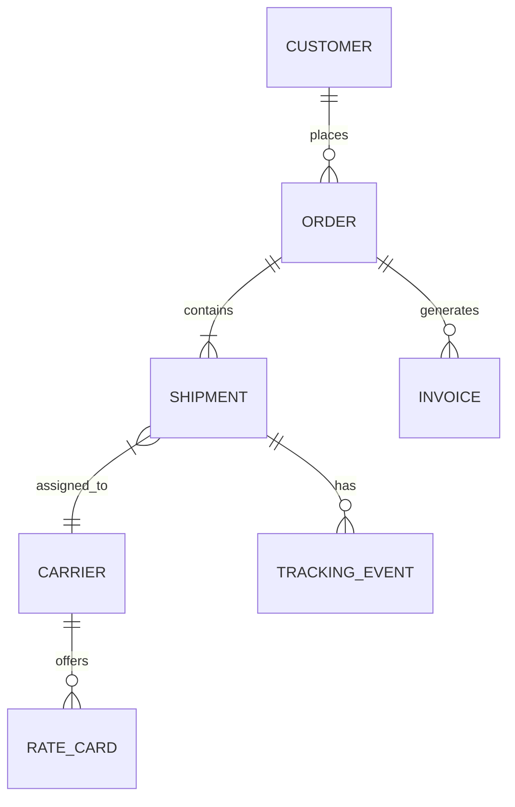

# The API Design Process

> *"A well-designed API is like a well-written contract — both parties know exactly what to expect, and neither is surprised."* — The difference between APIs that last 10 years and APIs that need rewriting every 6 months.

---

## Phase 1: Overview — API Design is a Process

### API Design is Not Just Picking Endpoints

Most developers think API design means choosing URLs and HTTP methods. In reality, it's a **multi-step process** that starts with understanding the domain and ends with governance and documentation.

```
Common approach (bad):
  "We need a shipment API"
  → POST /createShipment
  → GET /getShipment?id=123
  → PUT /updateShipmentStatus
  → Done! (and regretted for years)

Design process approach (good):
  1. Understand the domain (what is a shipment? what are its states?)
  2. Identify resources (shipments, tracking-events, carriers)
  3. Define operations (CRUD + actions + async workflows)
  4. Design request/response models (consistent, versioned)
  5. Design error responses (standard format, helpful messages)
  6. Choose versioning strategy (URI, header, content negotiation)
  7. Design pagination (cursor-based for large datasets)
  8. Add auth and security (OAuth2, rate limiting)
  9. Document everything (OpenAPI spec, examples)
  10. Review and govern (consistency, breaking changes)
```

### The Cost of Bad API Design

> [!warning] APIs are Contracts
> Once an API is published and has consumers, **changing it is extremely expensive**. Every breaking change requires coordinating with all consumers, versioning, and migration — multiplied by the number of consumers.
> 
> A poorly designed internal API with 10 consumers costs 10x to fix.  
> A poorly designed public API with 1,000 consumers may be practically unfixable.

### API-First Development

```
Traditional approach:
  Build the service → Design the API → Hope consumers like it
  (API is an afterthought, shaped by implementation details)

API-first approach:
  Design the API → Review with consumers → Build the service
  (API is a first-class design artifact, shaped by consumer needs)

Benefits of API-first:
  ✅ Consumers can develop against the API spec before the service exists
  ✅ Frontend and backend can work in parallel (contract is defined upfront)
  ✅ API review catches design issues before code is written
  ✅ OpenAPI spec becomes the single source of truth
```

See also [[What APIs are and their role in the system architecture]] for foundational API concepts, and [[The 3 most common API styles]] for comparing [[REST]], [[GraphQL]], and [[gRPC]].

---

## Phase 2: Step 1 — Understand the Domain

### Identify Entities and Relationships

Before writing a single endpoint, **map out the domain**. What are the core entities? How do they relate?



#### Logistics Domain Example

```
Core Entities:
  Customer     — the party requesting freight services
  Order        — a request to move goods (may contain multiple shipments)
  Shipment     — a physical movement of goods from A to B
  Carrier      — the company transporting the goods (MAERSK, CMA CGM)
  TrackingEvent— a milestone in the shipment lifecycle (picked up, in transit, delivered)
  RateCard     — pricing offered by a carrier for a route
  Invoice      — billing document for completed services

Relationships:
  One Order → many Shipments (multi-leg journey)
  One Shipment → one Carrier (assigned)
  One Shipment → many TrackingEvents (lifecycle)
  One Carrier → many RateCards (different routes)
```

### Domain-Driven Design Influence

> [!tip] Ubiquitous Language
> Use the **same terminology** in your API that the business uses. If the business says "shipment," your API says `/shipments`, not `/packages` or `/deliveries`. If the business says "booking," don't call it an "order" in the API.
>
> This principle comes from Domain-Driven Design (DDD). The API becomes a **shared language** between developers and domain experts.

```
❌ Technical naming:        /api/freight-movement-records
✅ Domain naming:           /api/shipments

❌ Technical naming:        /api/carrier-assignment-events
✅ Domain naming:           /api/tracking-events

❌ Technical naming:        /api/price-calculation-results
✅ Domain naming:           /api/quotes
```

---

## Phase 3: Step 2 — Identify Resources

### REST Resource Identification

In REST, everything is a **resource** identified by a URL. Resources are **nouns**, not verbs.

```
❌ Verbs (RPC-style):
  POST /createShipment
  GET  /getShipmentById
  POST /updateShipmentStatus
  POST /deleteShipment
  POST /calculateRate

✅ Nouns (REST-style):
  POST   /shipments              → Create a shipment
  GET    /shipments/{id}         → Get a shipment
  PATCH  /shipments/{id}         → Update a shipment
  DELETE /shipments/{id}         → Delete a shipment
  POST   /quotes                 → Calculate a rate (create a quote resource)
```

### Resource Hierarchy and Nesting

```
Top-level resources:
  /shipments
  /carriers
  /customers
  /orders

Sub-resources (belong to a parent):
  /shipments/{id}/tracking-events      → Events for a specific shipment
  /carriers/{id}/rate-cards            → Rate cards for a specific carrier
  /orders/{id}/invoices                → Invoices for a specific order

When to nest vs top-level:
  ✅ Nest when the child ONLY makes sense in the parent's context
     /shipments/SHP-001/tracking-events → tracking events always belong to a shipment
  
  ❌ Don't nest when the child exists independently
     /carriers/MAERSK/shipments → shipments exist independently of carriers
     Better: /shipments?carrier=MAERSK (filter, not nesting)
```

> [!warning] Nesting Anti-Pattern
> Don't go more than 2 levels deep. Deeply nested URLs are hard to use and maintain:
> ```
> ❌ /customers/{custId}/orders/{orderId}/shipments/{shipId}/tracking-events/{eventId}
> ✅ /tracking-events/{eventId}  (if you have the ID, go directly)
> ✅ /shipments/{shipId}/tracking-events  (one level of nesting is fine)
> ```

### Collection vs Individual Resources

```
Collection: /shipments
  GET    /shipments          → List all shipments (with pagination)
  POST   /shipments          → Create a new shipment

Individual: /shipments/{id}
  GET    /shipments/{id}     → Get one shipment
  PUT    /shipments/{id}     → Full update (replace)
  PATCH  /shipments/{id}     → Partial update (modify fields)
  DELETE /shipments/{id}     → Delete one shipment
```

---

## Phase 4: Step 3 — Define Operations

### Standard CRUD Operations

| Operation | HTTP Method | URL | Request Body | Response |
|---|---|---|---|---|
| **Create** | POST | `/shipments` | Full shipment data | 201 Created + Location header |
| **Read (one)** | GET | `/shipments/{id}` | None | 200 OK + shipment data |
| **Read (list)** | GET | `/shipments` | None (query params for filters) | 200 OK + paginated list |
| **Full update** | PUT | `/shipments/{id}` | Complete shipment data | 200 OK + updated shipment |
| **Partial update** | PATCH | `/shipments/{id}` | Only changed fields | 200 OK + updated shipment |
| **Delete** | DELETE | `/shipments/{id}` | None | 204 No Content |

### Non-CRUD Operations (Actions)

Not everything fits neatly into CRUD. For **actions** (verbs), there are several patterns:

```
Approach 1: Sub-resource (preferred for state transitions)
  POST /shipments/{id}/cancellation       → Cancel a shipment
  POST /shipments/{id}/dispatch           → Dispatch a shipment

Approach 2: State field update via PATCH
  PATCH /shipments/{id}
  Body: { "status": "CANCELLED" }

Approach 3: Controller resource (for complex operations)
  POST /rate-calculations                 → Calculate rates (not saving, just computing)
  Body: { "origin": "Chennai", "dest": "Rotterdam", "weight": 5000 }
```

### Batch Operations

```java
// Batch status update for multiple shipments
// POST /shipments/batch-update
{
  "operations": [
    { "shipmentId": "SHP-001", "status": "IN_TRANSIT" },
    { "shipmentId": "SHP-002", "status": "DELIVERED" },
    { "shipmentId": "SHP-003", "status": "IN_TRANSIT" }
  ]
}

// Response: 207 Multi-Status (partial success possible!)
{
  "results": [
    { "shipmentId": "SHP-001", "status": "SUCCESS", "httpStatus": 200 },
    { "shipmentId": "SHP-002", "status": "SUCCESS", "httpStatus": 200 },
    { "shipmentId": "SHP-003", "status": "FAILED",  "httpStatus": 404, 
      "error": "Shipment not found" }
  ]
}
```

### Async Operations (Long-Running)

```
Synchronous (fast operations):
  POST /shipments → 201 Created (shipment created immediately)

Asynchronous (long-running operations):
  POST /bulk-imports → 202 Accepted (processing started, not complete)
  Response:
  {
    "operationId": "op-456",
    "status": "PROCESSING",
    "statusUrl": "/operations/op-456"
  }
  
  Client polls: GET /operations/op-456
  {
    "operationId": "op-456",
    "status": "COMPLETED",
    "result": { "imported": 5000, "failed": 12 },
    "resultUrl": "/bulk-imports/op-456/results"
  }
```

---

## Phase 5: Step 4 — Design Request/Response Models

### Request Body Design

```java
// POST /shipments — Create shipment request
{
  "origin": {
    "portCode": "INMAA",           // UN/LOCODE for Chennai
    "address": "123 Port Road, Chennai"
  },
  "destination": {
    "portCode": "NLRTM",           // UN/LOCODE for Rotterdam
    "address": "456 Harbor St, Rotterdam"
  },
  "cargo": {
    "description": "Electronics",
    "weightKg": 5000,
    "volumeCbm": 12.5,
    "containerType": "20GP"
  },
  "requestedPickupDate": "2024-02-01",
  "serviceType": "FCL",           // Full Container Load
  "customerReference": "CUST-REF-789"
}
```

### Response Envelope Pattern

```java
// Consistent response structure across ALL endpoints
// Single resource:
{
  "data": {
    "id": "SHP-001",
    "origin": { "portCode": "INMAA" },
    "destination": { "portCode": "NLRTM" },
    "status": "BOOKED",
    "createdAt": "2024-01-15T10:30:00Z",
    "updatedAt": "2024-01-15T10:30:00Z"
  },
  "links": {
    "self": "/shipments/SHP-001",
    "tracking": "/shipments/SHP-001/tracking-events",
    "carrier": "/carriers/MAERSK"
  }
}

// Collection:
{
  "data": [ ... ],
  "pagination": {
    "cursor": "eyJpZCI6MTAwfQ==",
    "hasMore": true,
    "totalCount": 1523
  },
  "links": {
    "self": "/shipments?cursor=abc",
    "next": "/shipments?cursor=eyJpZCI6MTAwfQ=="
  }
}
```

### Field Naming and Formatting Rules

| Rule | Convention | Example |
|---|---|---|
| **Case** | camelCase (JSON standard) | `shipmentId`, `carrierCode` |
| **Dates** | ISO 8601 with timezone | `"2024-01-15T10:30:00Z"` |
| **Monetary amounts** | Integer (smallest unit) or string | `"amount": 15099` (= $150.99) |
| **Enums** | UPPER_SNAKE_CASE strings | `"status": "IN_TRANSIT"` |
| **Boolean** | Prefixed with `is`/`has`/`can` | `"isActive": true`, `"hasTracking": true` |
| **IDs** | String (not integer) | `"id": "SHP-001"` |
| **Null handling** | Omit null fields, or explicit null | Don't use `""` for missing values |

> [!warning] Never Use Floating Point for Money
> ```
> ❌ "amount": 150.99   → Floating point: 150.99 might be stored as 150.98999999...
> ✅ "amountCents": 15099  → Integer: exact, no precision loss
> ✅ "amount": "150.99"    → String: exact representation
> ✅ { "amount": 15099, "currency": "USD", "exponent": 2 }  → Most explicit
> ```

---

## Phase 6: Step 5 — Error Response Design

### Standard Error Response Format

```java
// Consistent error format across ALL endpoints
{
  "error": {
    "code": "SHIPMENT_NOT_FOUND",
    "message": "Shipment with ID 'SHP-999' was not found",
    "details": [
      {
        "field": "shipmentId",
        "reason": "No shipment exists with the provided ID"
      }
    ],
    "traceId": "abc-123-def-456",
    "timestamp": "2024-01-15T10:30:00Z",
    "documentation": "https://api.logistics.com/docs/errors#SHIPMENT_NOT_FOUND"
  }
}
```

### Validation Error Response

```java
// 400 Bad Request with detailed validation errors
{
  "error": {
    "code": "VALIDATION_ERROR",
    "message": "Request validation failed",
    "details": [
      {
        "field": "origin.portCode",
        "reason": "Port code 'INVALID' is not a valid UN/LOCODE",
        "rejectedValue": "INVALID"
      },
      {
        "field": "cargo.weightKg",
        "reason": "Weight must be a positive number",
        "rejectedValue": -500
      }
    ],
    "traceId": "abc-123-def-456",
    "timestamp": "2024-01-15T10:30:00Z"
  }
}
```

### Spring Boot Global Error Handler

```java
@RestControllerAdvice
public class GlobalExceptionHandler {

    @ExceptionHandler(ShipmentNotFoundException.class)
    public ResponseEntity<ErrorResponse> handleNotFound(ShipmentNotFoundException ex) {
        ErrorResponse error = ErrorResponse.builder()
            .code("SHIPMENT_NOT_FOUND")
            .message(ex.getMessage())
            .traceId(MDC.get("traceId"))
            .timestamp(Instant.now())
            .build();
        return ResponseEntity.status(HttpStatus.NOT_FOUND).body(error);
    }

    @ExceptionHandler(MethodArgumentNotValidException.class)
    public ResponseEntity<ErrorResponse> handleValidation(MethodArgumentNotValidException ex) {
        List<ErrorDetail> details = ex.getBindingResult().getFieldErrors().stream()
            .map(fe -> new ErrorDetail(fe.getField(), fe.getDefaultMessage(), fe.getRejectedValue()))
            .toList();
        
        ErrorResponse error = ErrorResponse.builder()
            .code("VALIDATION_ERROR")
            .message("Request validation failed")
            .details(details)
            .traceId(MDC.get("traceId"))
            .timestamp(Instant.now())
            .build();
        return ResponseEntity.badRequest().body(error);
    }
}
```

### HTTP Status Code Guide

| Status Code | When to Use | Example |
|---|---|---|
| **200 OK** | Successful read or update | GET /shipments/{id} returns the shipment |
| **201 Created** | Resource successfully created | POST /shipments creates a new shipment |
| **202 Accepted** | Async operation started | POST /bulk-imports accepted for processing |
| **204 No Content** | Successful delete (no body) | DELETE /shipments/{id} |
| **400 Bad Request** | Client sent invalid data | Missing required field, invalid format |
| **401 Unauthorized** | No authentication provided | Missing or expired JWT |
| **403 Forbidden** | Authenticated but not authorized | User can't access this resource |
| **404 Not Found** | Resource doesn't exist | Shipment ID not found |
| **409 Conflict** | State conflict | Trying to cancel an already-delivered shipment |
| **422 Unprocessable** | Valid format, but business rule violation | Weight exceeds carrier limit |
| **429 Too Many Requests** | Rate limit exceeded | Include Retry-After header |
| **500 Internal Server Error** | Unexpected server failure | Bug, database down |
| **502 Bad Gateway** | Upstream service failure | Carrier API is down |
| **503 Service Unavailable** | Service temporarily down | Maintenance window |

### Problem Details (RFC 7807 / RFC 9457)

```java
// RFC 7807 standard error format (industry standard)
{
  "type": "https://api.logistics.com/errors/shipment-not-found",
  "title": "Shipment Not Found",
  "status": 404,
  "detail": "Shipment with ID 'SHP-999' was not found in the system",
  "instance": "/shipments/SHP-999",
  "traceId": "abc-123-def-456"
}

// Spring Boot 3 has built-in support via ProblemDetail class
```

See also [[4 Key design principles that make great APIs]] for error handling best practices.

---

## Phase 7: Step 6 — Versioning Strategy

### Versioning Approaches

| Approach | Example | Pros | Cons |
|---|---|---|---|
| **URI versioning** | `/v1/shipments` | Clear, visible, easy to route | Duplicates URLs, harder to sunset |
| **Header versioning** | `Accept-Version: v2` | Clean URLs | Hidden, harder to test in browser |
| **Content negotiation** | `Accept: application/vnd.logistics.v2+json` | Most "correct" per HTTP spec | Complex, rarely used |
| **Query parameter** | `/shipments?version=2` | Simple to add | Feels like a hack |

> [!tip] Recommendation for Most Teams
> **Use URI versioning (`/v1/shipments`)**. It's the most widely understood, easiest to implement, and simplest to route in load balancers and API gateways. Reserve header versioning for minor, backward-compatible variations.

### Breaking vs Non-Breaking Changes

```
Non-breaking (safe to make without new version):
  ✅ Adding a new optional field to response
  ✅ Adding a new endpoint
  ✅ Adding a new optional query parameter
  ✅ Adding a new enum value (if consumers handle unknowns)
  ✅ Making a required field optional

Breaking (requires new version):
  ❌ Removing a field from response
  ❌ Renaming a field
  ❌ Changing a field's type (string → integer)
  ❌ Making an optional field required
  ❌ Changing URL structure
  ❌ Removing an endpoint
  ❌ Changing the meaning of an existing status code
```

### Deprecation Strategy

```
Lifecycle:
  v1 (Current) → v2 (Released) → v1 (Deprecated) → v1 (Sunset)

Deprecation headers in response:
  Deprecation: true
  Sunset: Sat, 01 Jun 2025 00:00:00 GMT
  Link: <https://api.logistics.com/v2/shipments>; rel="successor-version"

Timeline:
  Day 0:     Release v2, announce v1 deprecation
  Day 0-90:  v1 and v2 both fully supported
  Day 90:    v1 returns deprecation headers
  Day 180:   v1 returns 410 Gone
```

---

## Phase 8: Step 7 — Pagination Design

### Pagination Approaches

#### Offset-Based

```
GET /shipments?page=3&size=20
  → Skip 40, return 20

Pros: Simple, supports "jump to page 5"
Cons: Slow for large offsets (DB still scans skipped rows)
Cons: Inconsistent if data changes between pages (duplicates/gaps)
```

#### Cursor-Based (Recommended)

```
GET /shipments?cursor=eyJpZCI6MTAwfQ==&size=20
  → Return 20 shipments after the cursor position

Cursor = opaque token encoding the position (e.g., base64 of last ID)

Pros: Consistent (no duplicates/gaps when data changes)
Pros: Efficient for large datasets (uses index, no offset scanning)
Cons: Can't "jump to page 5" (sequential only)
```

#### Keyset-Based

```
GET /shipments?after_id=SHP-100&size=20
  → WHERE id > 'SHP-100' ORDER BY id LIMIT 20

Similar to cursor-based but with explicit, non-opaque parameters
```

### Comparison

| Feature | Offset | Cursor | Keyset |
|---|---|---|---|
| **Performance** | Poor for large offsets | Excellent | Excellent |
| **Consistency** | Inconsistent (data changes) | Consistent | Consistent |
| **Random access** | ✅ (page=5) | ❌ | ❌ |
| **Simplicity** | Simple | Moderate | Simple |
| **Best for** | Small datasets, admin UIs | Large datasets, APIs | Large datasets |

### Paginated Response Format

```java
{
  "data": [
    { "id": "SHP-101", "status": "IN_TRANSIT" },
    { "id": "SHP-102", "status": "DELIVERED" },
    { "id": "SHP-103", "status": "BOOKED" }
  ],
  "pagination": {
    "cursor": "eyJpZCI6IlNIUC0xMDMifQ==",
    "hasMore": true,
    "pageSize": 20,
    "totalCount": 1523
  },
  "links": {
    "self": "/shipments?cursor=eyJpZCI6IlNIUC0xMDAifQ==&size=20",
    "next": "/shipments?cursor=eyJpZCI6IlNIUC0xMDMifQ==&size=20"
  }
}
```

See also [[Foundations of System Design]] for pagination in the context of scalable systems.

---

## Phase 9: Step 8 — Authentication and Security

### Authentication Methods

| Method | How It Works | Best For |
|---|---|---|
| **API Key** | Static key in header (`X-API-Key: abc123`) | Server-to-server, simple internal APIs |
| **OAuth 2.0 + JWT** | Token-based auth with scopes | User-facing APIs, third-party access |
| **mTLS** | Mutual certificate authentication | Service-to-service in zero-trust networks |

### JWT in Spring Boot

```java
// JWT token claims for a logistics API
{
  "sub": "user-123",
  "email": "ops@logistics.com",
  "roles": ["TRACKING_READ", "TRACKING_WRITE", "ADMIN"],
  "tenantId": "TENANT-456",
  "iat": 1705312200,
  "exp": 1705315800
}

// Spring Security configuration
@Configuration
@EnableWebSecurity
public class SecurityConfig {
    
    @Bean
    public SecurityFilterChain filterChain(HttpSecurity http) throws Exception {
        http
            .authorizeHttpRequests(auth -> auth
                .requestMatchers(HttpMethod.GET, "/shipments/**").hasAuthority("TRACKING_READ")
                .requestMatchers(HttpMethod.POST, "/shipments/**").hasAuthority("TRACKING_WRITE")
                .requestMatchers("/admin/**").hasAuthority("ADMIN")
                .anyRequest().authenticated()
            )
            .oauth2ResourceServer(oauth2 -> oauth2.jwt(Customizer.withDefaults()));
        return http.build();
    }
}
```

### Rate Limiting Headers

```
Response headers for rate-limited endpoints:
  X-RateLimit-Limit: 1000          → Max requests per window
  X-RateLimit-Remaining: 847       → Remaining requests in current window
  X-RateLimit-Reset: 1705315800    → Unix timestamp when window resets
  Retry-After: 30                  → Seconds to wait (when 429 is returned)
```

### Input Validation

```java
// Validate all inputs — never trust client data
@PostMapping("/shipments")
public ResponseEntity<Shipment> createShipment(
        @Valid @RequestBody CreateShipmentRequest request) {
    // @Valid triggers Jakarta Bean Validation
    return ResponseEntity.status(HttpStatus.CREATED)
        .body(shipmentService.create(request));
}

public class CreateShipmentRequest {
    @NotBlank(message = "Origin port code is required")
    @Pattern(regexp = "^[A-Z]{5}$", message = "Must be a valid 5-letter UN/LOCODE")
    private String originPortCode;
    
    @NotNull(message = "Weight is required")
    @Positive(message = "Weight must be positive")
    @Max(value = 50000, message = "Weight cannot exceed 50,000 kg")
    private BigDecimal weightKg;
    
    @NotNull @Future(message = "Pickup date must be in the future")
    private LocalDate requestedPickupDate;
}
```

See also [[Authentication and Authorization]] for in-depth security patterns and [[Rate Limiting and Throttling]] for rate limiting strategies.

---

## Phase 10: Step 9 — Documentation

### OpenAPI Specification

```yaml
# openapi.yaml (snippet for shipment tracking API)
openapi: 3.0.3
info:
  title: Shipment Tracking API
  version: 1.0.0
  description: API for managing and tracking freight shipments
  contact:
    name: Platform Engineering Team
    email: platform@logistics.com

paths:
  /v1/shipments:
    get:
      summary: List shipments
      operationId: listShipments
      tags: [Shipments]
      parameters:
        - name: status
          in: query
          schema:
            type: string
            enum: [BOOKED, IN_TRANSIT, DELIVERED, CANCELLED]
        - name: cursor
          in: query
          schema:
            type: string
        - name: size
          in: query
          schema:
            type: integer
            default: 20
            maximum: 100
      responses:
        '200':
          description: Paginated list of shipments
          content:
            application/json:
              schema:
                $ref: '#/components/schemas/ShipmentListResponse'
    post:
      summary: Create a new shipment
      operationId: createShipment
      tags: [Shipments]
      requestBody:
        required: true
        content:
          application/json:
            schema:
              $ref: '#/components/schemas/CreateShipmentRequest'
            example:
              originPortCode: "INMAA"
              destinationPortCode: "NLRTM"
              weightKg: 5000
              serviceType: "FCL"
      responses:
        '201':
          description: Shipment created
          headers:
            Location:
              schema:
                type: string
              example: /v1/shipments/SHP-001
          content:
            application/json:
              schema:
                $ref: '#/components/schemas/Shipment'
        '400':
          description: Validation error
          content:
            application/json:
              schema:
                $ref: '#/components/schemas/ErrorResponse'
```

### Documentation Best Practices

> [!tip] Documentation is Part of the API
> If a feature isn't documented, it doesn't exist (for consumers). Treat documentation as a first-class deliverable, not an afterthought.

```
Documentation checklist:
  ✅ Every endpoint has a summary and description
  ✅ Request/response examples for every operation
  ✅ Error response examples for every error code
  ✅ Authentication requirements clearly stated
  ✅ Rate limits documented
  ✅ Pagination explained with examples
  ✅ Changelog maintained for every version
  ✅ SDK/client library examples in popular languages
```

### Generating Docs from Code (Spring Boot)

```java
// Add springdoc-openapi dependency
// pom.xml
<dependency>
    <groupId>org.springdoc</groupId>
    <artifactId>springdoc-openapi-starter-webmvc-ui</artifactId>
    <version>2.3.0</version>
</dependency>

// Swagger UI available at: http://localhost:8080/swagger-ui.html
// OpenAPI spec at: http://localhost:8080/v3/api-docs

// Annotate your controller for richer docs
@Operation(summary = "Get shipment by ID", 
           description = "Returns a single shipment with all details including current status")
@ApiResponses({
    @ApiResponse(responseCode = "200", description = "Shipment found"),
    @ApiResponse(responseCode = "404", description = "Shipment not found")
})
@GetMapping("/shipments/{id}")
public Shipment getShipment(@PathVariable @Parameter(description = "Shipment ID (e.g., SHP-001)") String id) {
    return shipmentService.findById(id);
}
```

---

## Phase 11: Step 10 — API Review and Governance

### API Review Checklist

```
Before any API goes to production, review:

Naming:
  □ Resources are plural nouns? (/shipments, not /shipment)
  □ Consistent naming convention? (camelCase throughout)
  □ Domain language used? (not implementation leaking)

Operations:
  □ Standard HTTP methods for CRUD?
  □ Appropriate status codes?
  □ Idempotent operations where needed? (PUT, DELETE)

Request/Response:
  □ Consistent envelope format?
  □ Pagination for list endpoints?
  □ Proper error response format?
  □ No internal IDs or implementation details exposed?

Security:
  □ Authentication required on all non-public endpoints?
  □ Authorization checked per resource?
  □ Input validation on all fields?
  □ Rate limiting configured?

Documentation:
  □ OpenAPI spec complete and accurate?
  □ Examples provided for all operations?
  □ Changelog updated?
```

### API Linting Tools

| Tool | What It Does |
|---|---|
| **Spectral** | Lint OpenAPI specs against custom rules |
| **Optic** | Detect breaking changes between API versions |
| **Redocly CLI** | Validate and bundle OpenAPI specs |
| **Zally (Zalando)** | Enterprise API linting with business rules |

```yaml
# .spectral.yml — Custom API lint rules
extends: spectral:oas
rules:
  operation-operationId:
    severity: error
    description: Every operation must have an operationId
  
  path-must-be-plural:
    severity: warn
    given: "$.paths[*]~"
    then:
      function: pattern
      functionOptions:
        match: "^/v[0-9]+/[a-z].*s(/.*)?$"

  # Custom: all responses must include traceId
  response-must-have-traceId:
    severity: error
    given: "$.components.schemas.ErrorResponse.properties"
    then:
      field: traceId
      function: truthy
```

### Breaking Change Detection

```
CI pipeline check:
  1. Fetch current production API spec
  2. Compare with new API spec
  3. Report any breaking changes
  4. Block merge if breaking changes exist without version bump

Example output:
  ❌ BREAKING: Field 'shipmentId' removed from ShipmentResponse
  ❌ BREAKING: Field 'status' type changed from string to integer
  ✅ NON-BREAKING: New field 'estimatedArrival' added to ShipmentResponse
  ✅ NON-BREAKING: New endpoint POST /v1/shipments/{id}/hold added
```

---

## Phase 12: Real-World API Design Example

### Design an API for a Shipment Tracking System

Let's walk through the entire process for a real logistics use case.

#### Step 1: Domain Understanding

```
Domain: Shipment tracking for a freight forwarder
Users: 
  - Customers (track their shipments)
  - Operations team (manage shipments)
  - Carrier integrations (receive status updates)

Core entities: Shipment, TrackingEvent, Carrier
Key workflows:
  - Customer creates a booking → becomes a shipment
  - Carrier sends status updates → tracking events
  - Customer views tracking timeline
```

#### Step 2-3: Resources and Operations

```
Resources:
  /v1/shipments                     → Shipment management
  /v1/shipments/{id}/tracking       → Tracking timeline
  /v1/carriers                      → Carrier information
  /v1/webhooks                      → Webhook configuration

Operations:
  POST   /v1/shipments              → Create shipment
  GET    /v1/shipments              → List shipments (paginated)
  GET    /v1/shipments/{id}         → Get shipment details
  PATCH  /v1/shipments/{id}         → Update shipment
  POST   /v1/shipments/{id}/cancel  → Cancel shipment
  
  GET    /v1/shipments/{id}/tracking → Get tracking timeline
  POST   /v1/shipments/{id}/tracking → Add tracking event (carrier integration)
  
  GET    /v1/carriers               → List carriers
  GET    /v1/carriers/{id}          → Get carrier details
```

#### Step 4-6: Full OpenAPI Snippet

```yaml
# Complete endpoint example
paths:
  /v1/shipments/{id}/tracking:
    get:
      summary: Get tracking timeline for a shipment
      operationId: getTrackingTimeline
      tags: [Tracking]
      parameters:
        - name: id
          in: path
          required: true
          schema:
            type: string
          example: "SHP-001"
      responses:
        '200':
          description: Tracking timeline
          content:
            application/json:
              example:
                data:
                  shipmentId: "SHP-001"
                  currentStatus: "IN_TRANSIT"
                  events:
                    - eventId: "EVT-003"
                      status: "IN_TRANSIT"
                      location: "Singapore Port"
                      timestamp: "2024-01-18T08:00:00Z"
                      description: "Vessel departed Singapore"
                    - eventId: "EVT-002"
                      status: "IN_TRANSIT"
                      location: "Chennai Port"
                      timestamp: "2024-01-16T14:30:00Z"
                      description: "Loaded onto vessel MV ATLAS"
                    - eventId: "EVT-001"
                      status: "PICKED_UP"
                      location: "Chennai Warehouse"
                      timestamp: "2024-01-15T10:00:00Z"
                      description: "Cargo picked up from warehouse"
                links:
                  self: "/v1/shipments/SHP-001/tracking"
                  shipment: "/v1/shipments/SHP-001"
        '404':
          description: Shipment not found
          content:
            application/json:
              example:
                error:
                  code: "SHIPMENT_NOT_FOUND"
                  message: "Shipment 'SHP-001' not found"
                  traceId: "abc-123"
                  timestamp: "2024-01-15T10:30:00Z"
```

---

## Phase 13: Common Mistakes

### Mistake 1: Inconsistent Naming

```
❌ Mixed conventions across endpoints:
  /shipments/{shipmentId}/trackingEvents    (camelCase path segment)
  /shipments/{shipment_id}/tracking-events  (snake_case parameter)
  /Carriers/{ID}/RateCards                  (PascalCase, uppercase ID)

✅ Pick one convention and enforce it:
  /shipments/{id}/tracking-events           (kebab-case paths, simple IDs)
```

### Mistake 2: Exposing Internal Models

```
❌ Returning database entity directly:
  {
    "id": 12345,
    "created_at": "2024-01-15 10:30:00",   // DB format leaked
    "carrier_fk": 67,                       // Foreign key exposed
    "internal_status_code": 3,              // Internal enum int leaked
    "_hibernate_version": 5                 // ORM leak!
  }

✅ Using a dedicated DTO:
  {
    "id": "SHP-001",
    "createdAt": "2024-01-15T10:30:00Z",
    "carrier": { "id": "MAERSK", "name": "Maersk Line" },
    "status": "IN_TRANSIT"
  }
```

### Mistake 3: Not Versioning from Day One

> [!warning] Version from the Start
> Adding versioning after consumers depend on your unversioned API is painful. Start with `/v1/` from day one — even if you think you'll never need v2. You will.

### Mistake 4: Overly Nested Resources

```
❌ Too deep:
  GET /customers/123/orders/456/shipments/789/events/012/comments/345
  → 5 levels deep, requires 5 IDs, impossible to use

✅ Flatter:
  GET /events/012/comments/345
  → If you have the ID, go directly
  GET /shipments/789/events
  → One level of nesting for listing sub-resources
```

### Mistake 5: Not Handling Partial Failures in Batch

```
❌ All-or-nothing for batch operations:
  POST /shipments/batch → 200 OK (all succeeded) or 500 Error (all failed)
  → What if 98 out of 100 succeeded? Client retries ALL 100?

✅ Per-item status with 207 Multi-Status:
  → Each item has its own success/failure status
  → Client only retries the 2 that failed
```

### Mistake 6: Ignoring Backwards Compatibility

```
❌ Removing a field that consumers use:
  v1 response: { "id": "SHP-001", "eta": "2024-02-01" }
  v1 response (after "cleanup"): { "id": "SHP-001" }
  → All consumers that display ETA break silently

✅ Expand-contract pattern:
  Step 1: Add new field alongside old: { "eta": "...", "estimatedArrival": "..." }
  Step 2: Migrate consumers to new field
  Step 3: Remove old field (in a new major version)
```

---

## Phase 14: Interview Questions

> [!question] 1. How would you design an API for a new feature from scratch? Walk through your process.
> **Key points:** Understand the domain → identify resources → define operations → design models → error handling → versioning → pagination → auth → documentation → review. API-first: design before implementation. Consumer-driven: talk to consumers before designing.

> [!question] 2. What's the difference between PUT and PATCH? When would you use each?
> **Key points:** PUT replaces the entire resource (idempotent, requires full body). PATCH updates specific fields (not necessarily idempotent, partial body). Use PUT for simple resources where full replacement is natural. Use PATCH for complex resources where clients typically change one or two fields.

> [!question] 3. How do you handle breaking changes in a public API?
> **Key points:** Avoid breaking changes (additive only). If unavoidable: version the API (URI versioning), support both versions during migration, set sunset dates with headers, communicate early and often, provide migration guides.

> [!question] 4. Explain cursor-based pagination. Why is it preferred over offset-based?
> **Key points:** Cursor encodes position (not page number). Consistent results even when data changes. Efficient for large datasets (uses index scan, not offset). Trade-off: can't jump to page N.

> [!question] 5. How do you handle long-running operations in a REST API?
> **Key points:** Return 202 Accepted with an operation ID. Client polls a status endpoint (`/operations/{id}`). Consider webhooks for server-push notification. Include estimated completion time. Return the final result when complete.

> [!question] 6. What are the key principles of good error response design?
> **Key points:** Consistent format across all endpoints. Machine-readable error code. Human-readable message. Validation details per field. Trace ID for debugging. Documentation links. Appropriate HTTP status codes.

> [!question] 7. How do you decide between REST, GraphQL, and gRPC for a new service?
> **Key points:** REST for public APIs, CRUD-heavy, wide consumer base. GraphQL for flexible queries, multiple clients with different data needs. gRPC for internal service-to-service, high performance, streaming. See [[The 3 most common API styles]] and [[How Application protocols influence the API design decisions]].

> [!question] 8. You're asked to design an API for a multi-tenant logistics platform. What special considerations apply?
> **Key points:** Tenant isolation (every request scoped to tenant). Tenant in JWT claims, not in URL. Rate limits per tenant. Data isolation (row-level or schema-level). Tenant-specific configuration (webhooks, feature flags). Audit logging per tenant.

> [!question] 9. How do you ensure API consistency across 10 teams building 50 microservices?
> **Key points:** API style guide (naming, error format, pagination format). API linting in CI (Spectral). API review process before production. Shared libraries for common patterns (error handling, pagination). OpenAPI spec as contract.

---

## Phase 15: Practice Exercises

### Exercise 1: Resource Design

Given a freight management system with: customers, orders, shipments, carriers, tracking events, invoices, and documents. Design the complete resource hierarchy. Decide which are top-level vs sub-resources. Define the URL patterns and HTTP methods for each.

### Exercise 2: Error Handling Strategy

Design a comprehensive error handling strategy for a shipment booking API. Include: error response format, all possible error codes, HTTP status codes for each scenario, and a Spring Boot `@RestControllerAdvice` implementation.

### Exercise 3: Pagination Implementation

Implement cursor-based pagination for a `GET /shipments` endpoint in Spring Boot. Include: the controller, service, repository query (using Spring Data JPA), response DTO with pagination metadata, and cursor encoding/decoding logic.

### Exercise 4: API Versioning Migration

You have a `/v1/shipments` API with 15 consumers. You need to make a breaking change: splitting the `address` string field into structured fields (`street`, `city`, `country`, `postalCode`). Design the migration plan: how you'd introduce v2, support both versions, communicate with consumers, and sunset v1.

### Exercise 5: Complete API Design

Design a complete API for a carrier rate quoting system. A user provides origin, destination, cargo details, and the system returns quotes from multiple carriers. Include: resource design, request/response models, error handling, pagination (for historical quotes), authentication, rate limiting, and a partial OpenAPI spec.

### Exercise 6: API Review

Review this API design and identify all issues:
```
POST /getShipment           → get a shipment
GET  /shipments/delete/123  → delete a shipment
PUT  /shipments/123         → body: { "status": 3 }
GET  /shipments             → returns 5000 results, no pagination
POST /shipments             → returns 200 on success
```
For each issue, explain what's wrong and what the correct design should be.

---

## Key Takeaways

1. **API design is a process, not a one-step task** — follow the 10 steps for consistent, maintainable APIs
2. **Understand the domain first** — use ubiquitous language; your API should reflect the business, not the database
3. **Resources are nouns, operations are HTTP methods** — REST is about resources, not RPC calls
4. **Consistency trumps perfection** — pick conventions and enforce them across all APIs
5. **Error responses are part of the API contract** — standardize the format, include trace IDs
6. **Version from day one** — URI versioning (`/v1/`) is simplest and most widely understood
7. **Cursor-based pagination for large datasets** — offset-based breaks down at scale
8. **Never expose internal models directly** — DTOs protect consumers from implementation changes
9. **Document like your consumers can't read your mind** — because they can't
10. **API review is as important as code review** — bad APIs are expensive to fix after release

---

**See also:** [[API Design]] (overview), [[REST]] (REST principles), [[GraphQL]] (flexible queries), [[gRPC]] (high-performance RPC), [[What APIs are and their role in the system architecture]] (fundamentals), [[The 3 most common API styles]] (style comparison), [[4 Key design principles that make great APIs]] (design principles), [[How Application protocols influence the API design decisions]] (protocol impact), [[Authentication and Authorization]] (security), [[Rate Limiting and Throttling]] (traffic management)
